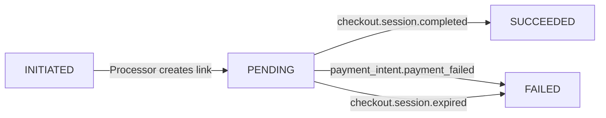

# Payment Link Flow – PRD

**Document version:** v1.0  
**Last updated:** 2025-08-03  
**Author:** FlexPrice Engineering

---

## 1. Purpose
Detail the complete life-cycle of a *Payment Link* in FlexPrice – from creation request to settlement – highlighting integration touch-points with Stripe, internal services involved, webhook handling, status transitions and edge-case behaviour.

## 2. Scope
* Payment method `PAYMENT_LINK` only (other methods: CARD, CREDITS, etc. out-of-scope).  
* Provider: Stripe Checkout Sessions v2024-08-01.  
* Tenancy, environments, and multi-gateway abstraction included.

## 3. Actors & Services
| Actor / Service | Responsibility |
|-----------------|----------------|
| Tenant API client | Initiates payment via `POST /payments` |
| `PaymentService` | Validates request, persists Payment row |
| `PaymentProcessor` | Generates payment link via gateway service |
| `PaymentGatewayService` | Selects preferred gateway (Stripe) |
| `StripeService` | Creates `CheckoutSession` via Stripe SDK |
| Stripe Webhook | Sends session & payment-intent events |
| `WebhookHandler` | Verifies signature & delegates to `StripeService` |
| `StripeService` | Updates Payment status, reconciles Invoice |
| `InvoiceService` | Updates Invoice amounts/status |

## 4. End-to-End Sequence
```
 Client          PaymentService       Processor         StripeSvc        Stripe
   | POST /payments (method=PAYMENT_LINK)                                  |
   |---------------->|                                                    |
   | 201 Payment (status=INITIATED)                                        |
   |                   |                                                  |
   |                   | Async ProcessPayment()                            |
   |                   |------------>| create checkout session            |
   |                   |              |---------------------------------->|
   |                   |              | <------ session_id / url ---------|
   |                   |<-------------|                                   |
   |                   | update Payment: status=PENDING, gateway fields   |
   |                   |                                                  |
   |  Client polls GET /payments/:id  (optional)                           |
   |                                                                      |
   | <----------  Stripe redirects customer to session URL -------------> |
   |                                                                      |
   |                (Webhook checkout.session.completed)                  |
   |<--------------------------- WebhookHandler --------------------------|
   |                   | verify+parse |                                   |
   |                   |------------>| update payment status etc.         |
   |                   |                                                  |
   |           Invoice reconciled, webhooks fired to tenant               |
```

## 5. Status State-Machine


* `INITIATED` – record created, no session yet.
* `PENDING` – session created, awaiting customer action / webhook.
* `SUCCEEDED` – Stripe reports payment success; invoice reconciled.
* `FAILED` – Session expired, async failure, or amount mismatch.

## 6. Implementation Details
### 6.1 Creation
1. **Validation**: Invoice not voided/paid; amount ≤ remaining; currency match.
2. **Customer**: Ensure `stripe_customer_id` exists or create via `CreateCustomerInStripe`.
3. **CheckoutSession Params**:
   * `mode=payment`
   * `line_items[0].price_data.unit_amount` in **minor units**.
   * `metadata` includes `invoice_id`, `customer_id`, `environment_id`.
4. **Defaults**: If caller omits `success_url`/`cancel_url`, backend injects fallback GIF / link (to replace with tenant-provided page later).

### 6.2 Webhook Handling
| Stripe Event | Handler | Payment Transition | Notes |
|--------------|---------|--------------------|-------|
| `checkout.session.completed` | `handleCheckoutSessionCompleted` | PENDING → SUCCEEDED | Retrieves Payment by `session_id` |
| `checkout.session.async_payment_succeeded` | `handleCheckoutSessionAsyncPaymentSucceeded` | PENDING → SUCCEEDED | Async methods (e.g., ACH) |
| `checkout.session.async_payment_failed` | `…Failed` | PENDING → FAILED |
| `checkout.session.expired` | `handleCheckoutSessionExpired` | PENDING → FAILED |
| `payment_intent.payment_failed` | `handlePaymentIntentPaymentFailed` | PROCESSING/PENDING → FAILED | Fallback safety |
| `payment_intent.succeeded` | `handlePaymentIntentSucceeded` | PROCESSING → SUCCEEDED | Edge when session.completed missed |

### 6.3 Reconciliation Logic
* After mark **SUCCEEDED**, `StripeService.ReconcilePaymentWithInvoice` updates invoice amounts, sets `PaidAt` if fully paid, moves invoice status accordingly.
* Partial payments keep invoice `PaymentStatus=PENDING` until fully settled.

## 7. Edge Cases & Mitigations
| # | Scenario | Handling |
|---|----------|----------|
| 1 | Duplicate webhooks | Idempotent update based on existing status |
| 2 | Webhook arrives before DB commit | Stripe handler retries fetch with back-off (todo) |
| 3 | Session expired but later paid | `payment_intent.succeeded` handler reconciles late success |
| 4 | Amount mismatch (tampered line_items) | Validate against invoice amount; flag as FAILED & alert |
| 5 | Currency mismatch | Same as #4 |
| 6 | Stripe API outage on creation | Processor leaves Payment in INITIATED, exposes error; retry allowed |
| 7 | Tenant with multiple gateways | Processor selects preferred gateway but can be overridden by request field |

## 8. Monitoring & Dashboards
* Gauge: number of payments in PENDING > 24h.
* Counters: sessions created, payments succeeded, failed.
* Alert: Webhook failure rate > 5% over 10 min.

## 9. Security & Compliance
* Stripe secret key and webhook secret encrypted at rest.
* HMAC verification of signatures.
* PCI scope limited: all card data handled by Stripe checkout.

## 10. Future Extensions
* Support *Finix* payment-links; gateway factory ready.
* Custom success/cancel URLs per tenant.
* Multi-currency invoice support.

---
END
