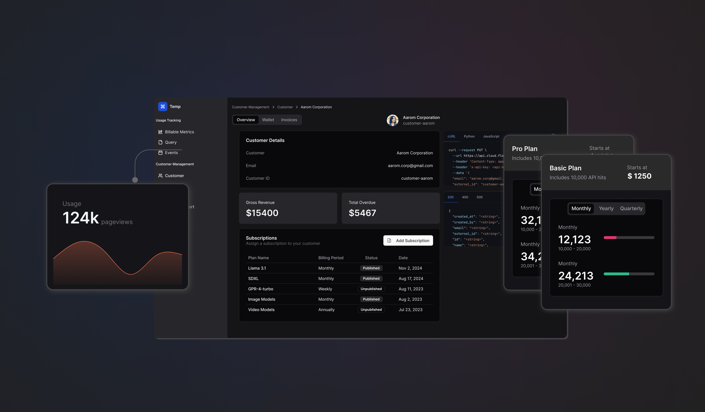

<p align="center">
  
</p>
<h3 align="center">
<b>
⚡️ Usage based metering & billing for developers ⚡️
</b>
</h3 >
<p align="center">
Build usage-based, credit-based, or hybrid pricing models with full control. Flexprice handles metering, pricing, and invoicing so you can focus on building, not billing.
</p>

<h5 align="center">

[Documentation](https://docs.flexprice.io) • [Demo](https://www.loom.com/share/60d8308781254fe0bc5be341501f9fd5) • [Website](https://flexprice.io/) • [LinkedIn](https://www.linkedin.com/company/flexpriceio)


[](https://pkg.go.dev/github.com/flexprice/go-sdk) [](https://pypi.org/project/flexprice) [](https://www.npmjs.com/package/@flexprice/sdk) 

</h5>

---

## Open architecture
The Flexprice core (metering, credits, pricing, billing) has an open and composable design. 

<p align="center">
  
</p>

Your application, whether it's running backend APIs, AI agents, or custom workflows, can send usage data to Flexprice. You can directly stream data from data warehouses or analytics pipelines as well.

At the core, Flexprice processes this data in real time. We handle everything that usually ends up as custom logic built by developers. Our platform calculates pricing based on the customer’s plan, applies any prepaid or promotional credits, enforces feature limits, and generates accurate invoices automatically. Whether you're using seat-based subscriptions, usage-based pricing, or prepaid credit bundles, you can set up and iterate on your pricing model without writing billing infrastructure from scratch.

After billing is computed, our platform connects to your existing tools for payments, CPQ, CRM, and accounting, ensuring billing information flows into the systems your business already uses. It can sync invoices to your payment processor, update customer data in your CRM, and push revenue numbers to your accounting tools.

With this architecture, you get full control over how billing works inside your product, while saving your team from the complexity of maintaining it all.

## Why billing is a developer problem?

##### TL;DR
*When existing billing tools don’t flex to your product’s needs, developers shoulder the burden eating up valuable development time and causing ongoing maintenance headaches.*

<p align="center">
  
</p>

Modern app developers often find themselves wrestling with billing systems. Here are some of the biggest pain points that turn billing into a “developer problem”:

- **Rigid billing tools (lack of flexibility):** Traditional billing services handle simple subscriptions or payments, but anything beyond that – usage metering, credit systems, feature gating, custom invoice logic – usually isn’t supported out of the box. Developers end up writing countless workarounds or custom code to accommodate these needs. In other words, if your pricing model doesn’t fit the tool, you’re stuck bending your product or building logic from scratch.

- **Complex usage metering at scale:** Implementing accurate usage tracking is hard. It involves capturing high-volume events, aggregating them in real time, handling edge cases (prorations, time zones, etc.), and ensuring it all works reliably at scale. Few teams anticipate how many moving parts this requires until they’re deep in the weeds of building it.

- **Vendor lock-in and black boxes:** Relying on third-party billing platforms can mean surrendering flexibility. Many SaaS billing providers are closed systems or charge a percentage fee on revenue, which frustrates engineers who want full control over their pricing logic and data. Changing providers later can be a massive undertaking, so teams feel “stuck” with a less-than-ideal solution.

- **Delayed monetization & opportunity cost:** Every week spent building or patching a billing system is a week not spent on core product features. If it takes months to implement a new pricing model or usage-based feature, that’s delayed revenue and lost agility for the business. What might be scoped as a “quick two-month project” can quickly spiral into a multi-year maintenance headache, tying up engineering resources and slowing time-to-market for new offerings.

## How Flexprice solves this

Flexprice’s approach is to abstract away the hard parts of billing while preserving maximum flexibility and transparency for developers. It addresses the above pain points in several key ways:

- **Developer-first design:** Flexprice is built API-first with easy integrations. You can instrument your app by simply sending usage events via SDKs, and Flexprice handles the aggregation, metering, and billing logic in real time. This means minimal code to write on your end and no need to reinvent metering or invoice calculations.

* **Open-source and self-hostable:** Flexprice is open-source, so you can run it on your own infrastructure for full transparency and control. There’s no black-box dependency or surprise fees and you’re free from vendor lock-in. You can inspect the code, extend functionality, and trust that your billing logic is fully in your hands.
    
    
- **Composable with your stack:** Rather than replacing your existing billing or payment provider, Flexprice augments it. You can build it from scratch or build on top of your existing billing providers like Stripe or Chargebee to manage usage data, pricing rules, credits, and entitlements. You can easily integrate with your existing payment gateways, CRM, CPQ, etc. This layered approach preserves your current workflows and customer touchpoints.
    
    
* **Flexible pricing models out-of-the-box:** Whether you need pure usage-based billing, tiered plans, seat-based subscriptions, prepaid credits, free tiers with overage, or any hybrid model, Flexprice’s data model and rules engine can support it. Flexprice is designed to accommodate changing pricing strategies in minutues that would normally require schema updates and migration scripts.

- **Transparency and visibility:** Because Flexprice meters every event and ties it to billing, you (and your customers) get clear visibility into usage and charges. It can provide real-time usage summaries and cost reports, helping both engineering and finance teams ensure everything lines up correctly. Customers get detailed invoices that show exactly what they’re paying for, reducing billing disputes or confusion.

By handling the heavy lifting from real-time usage tracking to invoice generation, Flexprice lets your team focus on building your actual product, not the billing system around it

## **Features**

Flexprice provides a rich set of features to power usage-based and hybrid billing models. Key features include:

<p align="center">
  
</p>

*  [**Usage Metering:**](https://docs.flexprice.io/api-reference/events/get-raw-events) Define custom usage events (API calls, compute time, database queries, etc.) at a granular level and track them in real time. Flexprice’s metering system can handle millions of events and aggregates usage data reliably, even at peak load. This ensures your billing is always up-to-date with actual customer usage.
- [**Credit Grants (Prepaid & Promotional Credits):**](https://docs.flexprice.io/docs/Wallet/Creating%20a%20wallet) Support credit-based workflows with full control. You can grant prepaid credits or promotional credits to customers, set up automatic top-ups at thresholds, and expire unused credits as needed. Flexprice’s credit system is built-in, so you don’t need extra custom logic to handle one-time credits or wallets.
* [**Pricing Plans:**](https://docs.flexprice.io/docs/Product%20catalogue/Plans/Overview) Design and iterate on pricing models with total flexibility – whether seat-based subscriptions, pure pay-as-you-go, volume-tiered pricing, or hybrids. You can launch new plans or modify existing ones (e.g. special pricing for a particular customer) without additional engineering effort. Flexprice lets you override plan settings per customer and manage plan versioning over time, making it easy to evolve pricing as your product and market strategy change.
- [**Feature Management:**](https://docs.flexprice.io/docs/Product%20catalogue/Features/Overview) Manage feature entitlements and usage limits per plan or per customer. Flexprice lets you define feature toggles (on/off), metered feature limits, or configuration values tied to plans. You can enforce usage limits in your application by checking with Flexprice (for example, limit API calls per month or enable/disable certain features based on plan) without building complex entitlement logic yourself. This ensures that your product’s feature access is always in sync with what the customer has paid for.
* [**Subscriptions & Invoicing:**](https://docs.flexprice.io/docs/Invoices/Overview) Flexprice generates clear, accurate invoices based on real-time usage data, subscriptions, and credits. It automates billing cycles – handling proration, overages, and credit application – and produces invoice line items that give customers full visibility into their charges. Finance teams can easily reconcile billing because every charge is linked to tracked usage or a defined price. You can also integrate this with your payment processor to automate charging customers once an invoice is finalized.

Each of these features is accessible via Flexprice’s APIs and dashboard, allowing you to mix and match to build the exact billing experience you need.


### 🚀 Setting up Flexprice from source for development and contributions

To run Flexprice for local development or running from source, you will need

1. [Golang](https://go.dev/)
2. [Docker](https://www.docker.com/) and [Docker Compose](https://docs.docker.com/compose/)
3. Any of the below supported platform environments:
    1. [Linux based environment](https://en.wikipedia.org/wiki/Comparison_of_Linux_distributions)
    2. [OSX (Darwin) based environment](https://en.wikipedia.org/wiki/MacOS)
    3. WSL under Windows

#### Quick Setup with Docker Compose

The easiest way to get started is using our Docker Compose setup:

```bash
# Clone the repository
git clone https://github.com/flexprice/flexprice
cd flexprice

# Set up the complete development environment
make dev-setup
```

This will:
1. Start all required infrastructure (PostgreSQL, Kafka, ClickHouse, Temporal)
2. Build the FlexPrice application image
3. Run database migrations and initialize Kafka
4. Start all FlexPrice services (API, Consumer, Worker)

Once complete, you can access:
- FlexPrice API: http://localhost:8080
- Temporal UI: http://localhost:8088
- Kafka UI: http://localhost:8084 (with profile 'dev')
- ClickHouse UI: http://localhost:8123

#### Useful Commands

```bash
# Restart only the FlexPrice services
make restart-flexprice

# Stop all services
make down

# Clean everything and start fresh
make clean-start

# Build the FlexPrice image separately
make build-image

# Start only the FlexPrice services
make start-flexprice
```

#### Running Without Docker

If you prefer to run the application directly:

```bash
# Start the required infrastructure
docker compose up -d postgres kafka clickhouse temporal temporal-ui

# Run the application locally
go run cmd/server/main.go
```


## 👨🏻‍💻 Let's Build Together! 👩🏻‍💻

Whether you're a newbie coder or a wizard 🧙‍♀️, your perspective is golden. Take a peek at our:

📜 [Contribution Guidelines](CONTRIBUTING.md)

🏗️ [Local Development Setup](SETUP.md)

❤️ [Code of Conduct](CODE_OF_CONDUCT.md)

## Contributors

<a href="https://github.com/flexprice/flexprice/graphs/contributors">
  
</a>

## Repo Activity


<!-- LICENSE -->

## License

Flexprice is a commercial open source company, which means some parts of this open source repository require a commercial license. The concept is called "Open Core" where the core technology (99%) is fully open source, licensed under [AGPLv3](https://opensource.org/license/agpl-v3) and the last 1% is covered under a commercial license (["/ee" Enterprise Edition"]).

> [!TIP]
> We work closely with the community and always invite feedback about what should be open and what is fine to be commercial. This list is not set and stone and we have moved things from commercial to open in the past. Please open a [discussion](https://github.com/flexprice/flexprice/discussions) if you feel like something is wrong.