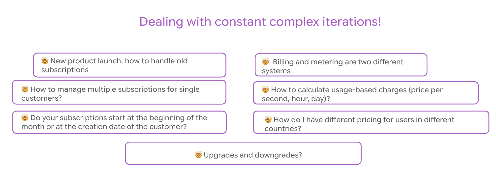

<p align="center">
  
</p>
<h3 align="center">
<b>
⚡️ Usage metering and billing for AI companies ⚡️
</b>
</h3 >
<p align="center">
🌟 Built with developers in mind, so you don’t have to create
billing and metering from scratch. 🌟
</p>

---

<h4 align="center">

[](https://www.linkedin.com/company/flexpriceio)

</h4>

[Flexprice](https://flexprice.io) is a **developer first** answer to building and launching any pricing model and collecting usage data in real-time.

We have one goal - our friends should never have to write a billing system from scratch again.

## The struggle is real since AI is here


In-house Billing Systems are a nightmare for Engineers. With rising use of AI workloads internally and building new AI features, it has become necessary to build metering and billing systems to track usage and costs.

Frequency of changes in pricing models is also increasing. These changes make it hard to manage existing subscriptions and require a lot of manual effort in terms of migrations and testing.


## The Solution: Flexprice

Usage metering, subscription management and infra cost into one stack




Developers don't need to spend **months** building internal metering and rating systems. 

Flexprice offers APIs, SDKs, self serve UI widgest, internal dashboards and more to help you get started in minutes. With Flexprice, you can:

- **Evolve your pricing with flexibility**: We support Usage-based pricing, Minimum commitments, Volume discounts, Prepaid Credits, Upgrades and downgrades, etc.

- **Real-time overview AI Infrastructure Costs**: Optimize revenue operations and measure LLM Token Usage, GPU Time, Compute Hours, API Call Frequency and Duration, etc

- **Custom Invoice and Billing logic**: Raise invoices, manage billing cycles, apply discounts, taxes, grace period, payment terms, etc


### 🚀 Setting up Flexprice from source for development and contributions

To run Flexprice for local development or running from source, you will need

1. [Golang](https://go.dev/)
2. Any of the below supported platform environments:
    1. [Linux based environment](https://en.wikipedia.org/wiki/Comparison_of_Linux_distributions)
    2. [OSX (Darwin) based environment](https://en.wikipedia.org/wiki/MacOS)
    3. WSL under Windows

```bash
git clone https://github.com/flexprice/flexprice
cd flexprice
go run cmd/server/main.go
```

### Code Architecture

See [CONTRIBUTING.md](CONTRIBUTING.md) for more details on the code architecture and design principles.


## 👨🏻‍💻 Let's Build Together! 👩🏻‍💻

Whether you're a newbie coder or a wizard 🧙‍♀️, your perspective is golden. Take a peek at our:

📜 [Contribution Guidelines](CONTRIBUTING.md)

❤️ [Code of Conduct](CODE_OF_CONDUCT.md)


## ✨ Resources!

📖 [API Docs](https://documenter.getpostman.com/view/35977379/2sAY4xBNAS)
