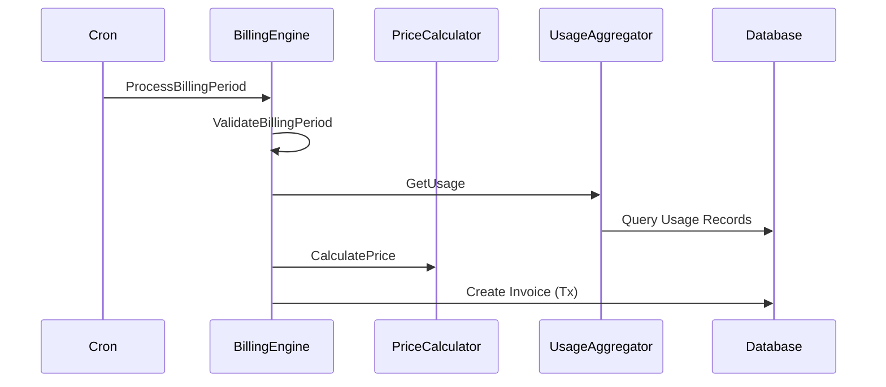
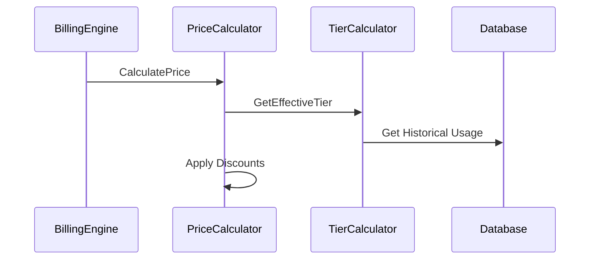

# Billing Engine Technical Design

## Overview
This document outlines the technical design for FlexPrice's billing engine, focusing on accurate and reliable invoice generation across complex pricing models.

## Core Components

### 1. BillingEngine Interface
```go
type BillingEngine interface {
    // ProcessBillingPeriod handles a single billing period transition
    ProcessBillingPeriod(ctx context.Context, sub *subscription.Subscription, start, end time.Time) error
    
    // CalculateCharges computes all charges for a period
    CalculateCharges(ctx context.Context, sub *subscription.Subscription, start, end time.Time) (*BillingResult, error)
    
    // ValidateBillingPeriod ensures period integrity
    ValidateBillingPeriod(ctx context.Context, sub *subscription.Subscription, start, end time.Time) error
}

type BillingResult struct {
    FixedCharges    []Charge
    UsageCharges    []Charge
    TotalAmount     decimal.Decimal
    Currency        string
    BillingPeriod   BillingPeriod
    Metadata        map[string]interface{}
}
```

### 2. Price Calculation
```go
type PriceCalculator interface {
    // CalculatePrice computes the price based on model and usage
    CalculatePrice(ctx context.Context, price *Price, quantity decimal.Decimal) (*PriceResult, error)
    
    // ValidatePrice ensures price configuration is valid
    ValidatePrice(ctx context.Context, price *Price) error
}

type PriceResult struct {
    Amount          decimal.Decimal
    EffectiveTier   *PriceTier
    Breakdown       []PriceComponent
    Metadata        map[string]interface{}
}
```

### 3. Usage Aggregation
```go
type UsageAggregator interface {
    // GetUsage retrieves aggregated usage for a period
    GetUsage(ctx context.Context, req *UsageRequest) (*UsageResult, error)
    
    // ValidateUsage ensures usage data integrity
    ValidateUsage(ctx context.Context, usage *UsageResult) error
}

type UsageRequest struct {
    SubscriptionID  string
    MeterID         string
    StartTime       time.Time
    EndTime         time.Time
    Granularity     string
}
```

## Key Workflows

### 1. Invoice Generation


### 2. Price Calculation


## Error Handling

### 1. Retry Mechanism
```go
type RetryConfig struct {
    MaxAttempts     int
    InitialDelay    time.Duration
    MaxDelay        time.Duration
    BackoffFactor   float64
}

type RetryableOperation interface {
    Execute(ctx context.Context) error
    Validate() error
    Cleanup() error
}
```

### 2. Consistency Checks
```go
type ConsistencyChecker interface {
    // ValidateInvoiceCoverage ensures no billing gaps
    ValidateInvoiceCoverage(ctx context.Context, sub *subscription.Subscription, start, end time.Time) error
    
    // ValidateUsageIntegrity ensures usage data completeness
    ValidateUsageIntegrity(ctx context.Context, sub *subscription.Subscription, start, end time.Time) error
}
```

## Data Model Updates

### 1. Invoice Tracking
```sql
ALTER TABLE invoices
ADD COLUMN billing_sequence INTEGER,
ADD COLUMN parent_invoice_id VARCHAR(50),
ADD COLUMN correction_reason VARCHAR(255),
ADD COLUMN original_amount DECIMAL(20,8),
ADD COLUMN adjustment_amount DECIMAL(20,8);

CREATE INDEX idx_invoice_sequence ON invoices (subscription_id, billing_sequence);
```

### 2. Usage Tracking
```sql
CREATE TABLE usage_checkpoints (
    id VARCHAR(50) PRIMARY KEY,
    subscription_id VARCHAR(50) NOT NULL,
    meter_id VARCHAR(50) NOT NULL,
    checkpoint_time TIMESTAMP NOT NULL,
    usage_amount DECIMAL(20,8) NOT NULL,
    created_at TIMESTAMP NOT NULL,
    UNIQUE (subscription_id, meter_id, checkpoint_time)
);
```

## Monitoring & Observability

### 1. Key Metrics
- Invoice generation success rate
- Usage aggregation latency
- Price calculation performance
- Error rates by category

### 2. Alerts
- Failed invoice generation
- Usage data gaps
- Pricing anomalies
- System performance degradation

## Implementation Strategy

### Phase 1: Core Infrastructure
1. Implement new interfaces
2. Add database schema updates
3. Update existing services

### Phase 2: Enhanced Features
1. Add retry mechanism
2. Implement consistency checks
3. Enhance monitoring

### Phase 3: Advanced Capabilities
1. Add reconciliation tools
2. Implement audit system
3. Add admin controls

## Future Considerations
- Multi-region support
- Real-time billing
- Custom billing rules
- Advanced proration
