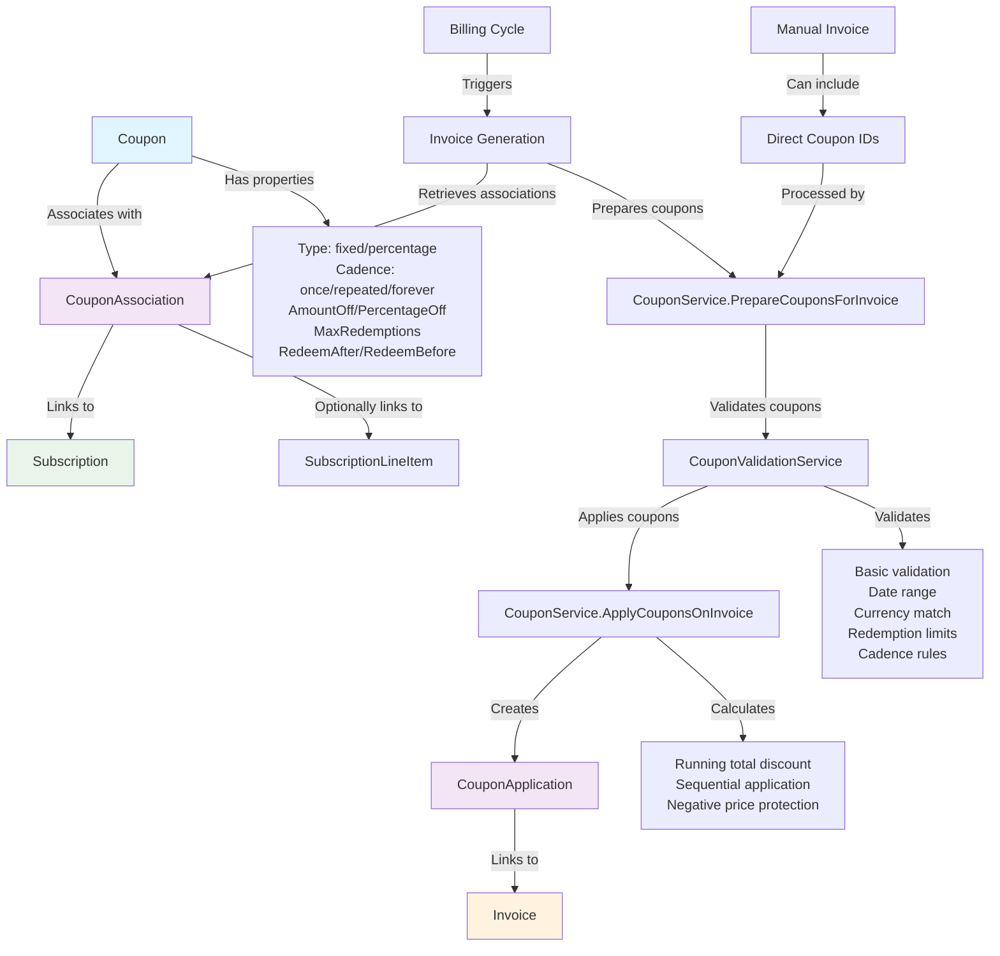

# Comprehensive Analysis: Coupon Implementation on Subscriptions and Invoices

Based on my analysis of the codebase, here's a complete overview of how coupons are implemented and integrated with subscriptions and invoices in the FlexPrice system.

## Architecture Overview

The coupon system is built around three core entities that work together:

1. **Coupon** - The discount configuration
2. **CouponAssociation** - Links coupons to subscriptions 
3. **CouponApplication** - Records when coupons are applied to invoices

## Core Models

### 1. Coupon Model (`internal/domain/coupon/model.go`)

**Key Properties:**
- **Type**: `fixed` (dollar amount) or `percentage` (percentage discount)
- **Cadence**: `once` (first invoice only), `repeated` (limited periods), `forever` (all invoices)
- **AmountOff**: Fixed dollar discount amount
- **PercentageOff**: Percentage discount (0-100)
- **Currency**: Specific currency for the coupon
- **RedeemAfter/RedeemBefore**: Date validity range
- **MaxRedemptions**: Global usage limit
- **DurationInPeriods**: For repeated cadence, how many billing periods

**Key Methods:**
```go
func (c *Coupon) CalculateDiscount(originalPrice decimal.Decimal) decimal.Decimal
func (c *Coupon) ApplyDiscount(originalPrice decimal.Decimal) decimal.Decimal
func (c *Coupon) IsValid() bool
```

### 2. CouponAssociation Model (`internal/domain/coupon_association/model.go`)

**Purpose**: Links coupons to subscriptions (and optionally to specific subscription line items)

**Key Properties:**
- **CouponID**: Reference to the coupon
- **SubscriptionID**: Required - which subscription this applies to
- **SubscriptionLineItemID**: Optional - for line-item level discounts
- **Metadata**: Additional association metadata

### 3. CouponApplication Model (`internal/domain/coupon_application/model.go`)

**Purpose**: Records actual application of a coupon to an invoice

**Key Properties:**
- **CouponID**: Which coupon was applied
- **CouponAssociationID**: Link back to the association (if from subscription)
- **InvoiceID**: Which invoice this was applied to
- **InvoiceLineItemID**: Optional - for line-item level application
- **OriginalPrice/FinalPrice/DiscountedAmount**: Financial impact
- **CouponSnapshot**: Immutable copy of coupon details at application time

## Integration Flows

### 1. Subscription-to-Invoice Flow

**Step 1: Coupon Association** (`ApplyCouponToSubscription`)
```go
// 1. Validate coupon eligibility for subscription
validationService.ValidateCouponForSubscription(ctx, couponID, subscriptionID)

// 2. Create association record
association := &CouponAssociation{
    CouponID:       couponID,
    SubscriptionID: subscriptionID,
}

// 3. Increment coupon redemption count
s.CouponRepo.IncrementRedemptions(ctx, couponID)
```

**Step 2: Invoice Generation** (`applyCouponsToInvoice`)
```go
// 1. Prepare coupons for invoice
couponsWithAssociations := couponService.PrepareCouponsForInvoice(ctx, invoiceRequest)

// 2. Apply coupons to invoice
couponResult := couponService.ApplyCouponsOnInvoice(ctx, invoice, couponsWithAssociations)

// 3. Update invoice totals
invoice.TotalDiscount = couponResult.TotalDiscountAmount
invoice.Total = originalTotal.Sub(couponResult.TotalDiscountAmount)
```

### 2. Direct Invoice Coupon Application

For standalone invoices, coupons can be applied directly without subscription associations:

```go
// Direct coupon IDs in CreateInvoiceRequest
req := dto.CreateInvoiceRequest{
    CustomerID: "customer_123",
    Coupons:    []string{"coupon_123", "coupon_456"}, // Direct application
}
```

## Coupon Validation System

The validation system (`internal/service/coupon_validation.go`) implements comprehensive checks:

### 1. Basic Validation
- Coupon exists and is published
- Within valid date range (`RedeemAfter`/`RedeemBefore`)
- Under redemption limits (`TotalRedemptions` < `MaxRedemptions`)

### 2. Business Rules Validation
- Currency compatibility
- Subscription status validation (not cancelled)

### 3. Cadence-Specific Validation

**Once Cadence**: Ensures coupon is only applied to the first invoice
```go
existingApplicationCount := s.CouponApplicationRepo.CountBySubscriptionAndCoupon(ctx, subscriptionID, couponID)
if existingApplicationCount > 0 {
    return CouponValidationError{Code: OnceCadenceViolation}
}
```

**Repeated Cadence**: Ensures coupon doesn't exceed `DurationInPeriods`
```go
if existingApplicationCount >= *coupon.DurationInPeriods {
    return CouponValidationError{Code: RepeatedCadenceLimitReached}
}
```

**Forever Cadence**: Always valid (no additional restrictions)

## Discount Calculation Logic

### Sequential Application
Coupons are applied sequentially, with each subsequent coupon calculated on the running total:

```go
runningTotal := invoice.Total
for _, couponWithAssociation := range validCoupons {
    discount := coupon.CalculateDiscount(runningTotal)
    finalPrice := coupon.ApplyDiscount(runningTotal)
    
    // Protect against negative totals
    if finalPrice.LessThan(decimal.Zero) {
        continue // Skip this coupon
    }
    
    runningTotal = finalPrice // Next coupon applies to reduced amount
}
```

### Discount Types

**Fixed Amount**:
```go
func (c *Coupon) CalculateDiscount(originalPrice decimal.Decimal) decimal.Decimal {
    if c.Type == types.CouponTypeFixed {
        return *c.AmountOff
    }
}
```

**Percentage**:
```go
func (c *Coupon) CalculateDiscount(originalPrice decimal.Decimal) decimal.Decimal {
    if c.Type == types.CouponTypePercentage {
        return originalPrice.Mul(*c.PercentageOff).Div(decimal.NewFromInt(100))
    }
}
```

## Database Schema

### Coupon Table
```sql
-- Key fields from ent/schema/coupon.go
id varchar(50) PRIMARY KEY
name varchar(255) NOT NULL
type varchar(20) DEFAULT 'fixed' -- fixed|percentage
cadence varchar(20) DEFAULT 'once' -- once|repeated|forever
amount_off numeric(20,8) DEFAULT 0
percentage_off numeric(7,4) DEFAULT 0
max_redemptions int
total_redemptions int DEFAULT 0
redeem_after timestamp
redeem_before timestamp
duration_in_periods int -- for repeated cadence
currency varchar(10)
```

### CouponAssociation Table
```sql
-- Key fields from ent/schema/coupon_association.go
id varchar(50) PRIMARY KEY
coupon_id varchar(50) NOT NULL REFERENCES coupons(id)
subscription_id varchar(50) NOT NULL REFERENCES subscriptions(id)
subscription_line_item_id varchar(50) REFERENCES subscription_line_items(id)
```

### CouponApplication Table
```sql
-- Key fields from ent/schema/coupon_application.go
id varchar(50) PRIMARY KEY
coupon_id varchar(50) NOT NULL REFERENCES coupons(id)
coupon_association_id varchar(50) REFERENCES coupon_associations(id)
invoice_id varchar(50) NOT NULL REFERENCES invoices(id)
invoice_line_item_id varchar(50) REFERENCES invoice_line_items(id)
subscription_id varchar(50) REFERENCES subscriptions(id)
original_price numeric(20,8)
final_price numeric(20,8)
discounted_amount numeric(20,8)
discount_type varchar(20)
coupon_snapshot jsonb -- Immutable coupon state
```

## Key Integration Points

### 1. Invoice Service Integration
- **Location**: `internal/service/invoice.go:1350-1409`
- **Method**: `applyCouponsToInvoice`
- **Triggers**: During invoice creation for subscription invoices or direct coupon application

### 2. Billing Service Integration
- Coupons are applied after line items are calculated but before invoice finalization
- Integration happens through the invoice creation flow

### 3. Subscription Service Integration
- Coupons associate with subscriptions via `CouponAssociation`
- Associations persist across billing cycles based on cadence rules

## Performance Optimizations

### 1. Batch Operations
```go
// Batch fetch coupons to minimize database calls
couponsWithAssociations := s.batchFetchCouponsWithAssociations(ctx, associations)

// Batch create applications
appliedCoupons := s.batchCreateCouponApplications(txCtx, applicationRequests)
```

### 2. Optimized Validation Queries
```go
// Instead of fetching all applications, use count queries
existingApplicationCount := s.CouponApplicationRepo.CountBySubscriptionAndCoupon(ctx, subscriptionID, couponID)
```

### 3. Transaction Management
All coupon applications use database transactions to ensure consistency:
```go
err := s.DB.WithTx(ctx, func(txCtx context.Context) error {
    // All coupon operations happen within transaction
})
```

## Error Handling & Recovery

### 1. Graceful Degradation
- If some coupons fail validation, others can still be applied
- Invoice generation continues even if coupon application fails

### 2. Comprehensive Validation Errors
```go
type CouponValidationError struct {
    Code    types.CouponValidationErrorCode
    Message string
    Details map[string]interface{}
}
```

### 3. Coupon Snapshot Protection
- Coupon state is captured at application time in `CouponSnapshot`
- Prevents issues when coupon definitions change after application

## Summary

The coupon implementation is a sophisticated system that:

1. **Supports flexible discount types** (fixed/percentage) and cadences (once/repeated/forever)
2. **Integrates seamlessly** with subscription billing cycles and manual invoices
3. **Provides comprehensive validation** including cadence-specific rules
4. **Ensures data consistency** through transactions and immutable snapshots
5. **Optimizes performance** through batch operations and smart queries
6. **Handles edge cases** gracefully with robust error handling

The system is designed to handle complex business scenarios while maintaining data integrity and providing a smooth user experience for both subscription-based and one-off discount applications.