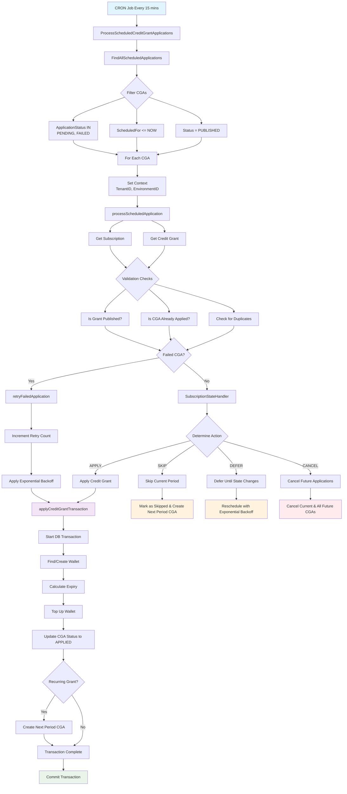

# Credit Grant Logic Flow Documentation

## Overview

This document explains how the optimized credit grant service handles different scenarios, from one-time grants to complex recurring patterns with various billing periods.

## Key Principles

1. **Independent Periods**: Credit grants operate independently of subscription billing cycles
2. **Grant Creation Anchor**: All credit grant periods are calculated from the grant's creation date
3. **Idempotency Protection**: Each application period has a unique idempotency key
4. **Transaction Safety**: All credit applications happen within database transactions
5. **Robust Retry Logic**: Failed applications use exponential backoff retry mechanism

## Use Cases

### 1. One-Time Credit Grant

**Scenario**: Customer gets a $50 welcome credit when they subscribe

```json
{
  "grant_id": "cg_12345",
  "cadence": "one_time",
  "credits": 50.0,
  "currency": "USD",
  "created_at": "2024-01-15T10:00:00Z"
}
```

**Flow**:

- Credit is applied immediately when subscription starts
- No future CGA records are created
- Application is marked as `applied` after successful wallet credit

**Timeline**:

```
2024-01-15: Subscription starts → Credit applied immediately → Done
```

### 2. Recurring Credit Grant - Monthly Alignment

**Scenario**: Monthly subscription with monthly $20 credit grant

```json
{
  "grant_id": "cg_12346",
  "cadence": "recurring",
  "period": "monthly",
  "period_count": 1,
  "credits": 20.00,
  "currency": "USD",
  "created_at": "2024-01-15T10:00:00Z"
}

{
  "subscription_id": "sub_12345",
  "billing_period": "monthly",
  "billing_period_count": 1,
  "billing_anchor": "2024-01-15T10:00:00Z",
  "current_period_start": "2024-01-15T10:00:00Z",
  "current_period_end": "2024-02-15T10:00:00Z"
}
```

**Flow**:

- First application: Immediate on subscription start
- Next applications: Every month from grant creation date
- Independent of billing cycles (though they align in this case)

**Timeline**:

```
2024-01-15: Subscription starts → Credit applied → Next CGA created for 2024-02-15
2024-02-15: Scheduled application → Credit applied → Next CGA created for 2024-03-15
2024-03-15: Scheduled application → Credit applied → Next CGA created for 2024-04-15
...
```

### 3. Recurring Credit Grant - Quarterly (Different from Billing)

**Scenario**: Monthly subscription with quarterly $60 credit grant

```json
{
  "grant_id": "cg_12347",
  "cadence": "recurring",
  "period": "quarterly",
  "period_count": 1,
  "credits": 60.00,
  "currency": "USD",
  "created_at": "2024-01-15T10:00:00Z"
}

{
  "subscription_id": "sub_12345",
  "billing_period": "monthly",
  "current_period_start": "2024-01-15T10:00:00Z",
  "current_period_end": "2024-02-15T10:00:00Z"
}
```

**Flow**:

- Credit grant follows its own quarterly schedule
- Independent of monthly billing cycles
- Uses grant creation date as anchor

**Timeline**:

```
2024-01-15: Subscription starts → Credit applied → Next CGA created for 2024-04-15
2024-02-15: Monthly billing cycle (no credit grant)
2024-03-15: Monthly billing cycle (no credit grant)
2024-04-15: Scheduled application → Credit applied → Next CGA created for 2024-07-15
2024-05-15: Monthly billing cycle (no credit grant)
2024-06-15: Monthly billing cycle (no credit grant)
2024-07-15: Scheduled application → Credit applied → Next CGA created for 2024-10-15
...
```

### 4. Recurring Credit Grant - Half-Yearly

**Scenario**: Monthly subscription with half-yearly $120 credit grant

```json
{
  "grant_id": "cg_12348",
  "cadence": "recurring",
  "period": "half_yearly",
  "period_count": 1,
  "credits": 120.0,
  "currency": "USD",
  "created_at": "2024-01-15T10:00:00Z"
}
```

**Timeline**:

```
2024-01-15: Subscription starts → Credit applied → Next CGA created for 2024-07-15
2024-07-15: Scheduled application → Credit applied → Next CGA created for 2025-01-15
2025-01-15: Scheduled application → Credit applied → Next CGA created for 2025-07-15
...
```

### 5. Recurring Credit Grant - Yearly

**Scenario**: Monthly subscription with yearly $500 credit grant

```json
{
  "grant_id": "cg_12349",
  "cadence": "recurring",
  "period": "annual",
  "period_count": 1,
  "credits": 500.0,
  "currency": "USD",
  "created_at": "2024-01-15T10:00:00Z"
}
```

**Timeline**:

```
2024-01-15: Subscription starts → Credit applied → Next CGA created for 2025-01-15
2025-01-15: Scheduled application → Credit applied → Next CGA created for 2026-01-15
2026-01-15: Scheduled application → Credit applied → Next CGA created for 2027-01-15
...
```

### 6. Recurring Credit Grant - Daily with Paused Subscription

**Scenario**: Daily $5 credit grant when subscription is paused

```json
{
  "grant_id": "cg_12350",
  "cadence": "recurring",
  "period": "daily",
  "period_count": 1,
  "credits": 5.00,
  "currency": "USD",
  "created_at": "2024-01-15T10:00:00Z"
}

{
  "subscription_id": "sub_12345",
  "subscription_status": "paused",
  "paused_at": "2024-01-20T10:00:00Z"
}
```

**Flow**:

- Credits applied daily until subscription is paused
- When paused, state handler determines action
- Applications are skipped during pause period
- Resume when subscription becomes active again

**Timeline**:

```
2024-01-15: Credit applied → Next CGA for 2024-01-16
2024-01-16: Credit applied → Next CGA for 2024-01-17
...
2024-01-20: Subscription paused
2024-01-21: Scheduled application → Skipped (subscription paused) → Next CGA for 2024-01-22
2024-01-22: Scheduled application → Skipped (subscription paused) → Next CGA for 2024-01-23
...
2024-01-25: Subscription resumed
2024-01-26: Scheduled application → Credit applied → Next CGA for 2024-01-27
```

## Process Flow for Scheduled Applications

### 1. Find Scheduled Applications

```sql
SELECT * FROM credit_grant_applications
WHERE application_status IN ('pending', 'failed')
  AND scheduled_for <= NOW()
  AND retry_count < 5  -- Max retry limit
ORDER BY scheduled_for ASC
```

### 2. Process Each Application

For each CGA found:

#### 2.1 Context Setup

```go
// Set tenant and environment context
ctxWithTenant := context.WithValue(ctx, types.CtxTenantID, cga.TenantID)
ctxWithEnv := context.WithValue(ctxWithTenant, types.CtxEnvironmentID, cga.EnvironmentID)
```

#### 2.2 Fetch Dependencies

```go
// Get subscription
subscription, err := subscriptionService.GetSubscription(ctx, cga.SubscriptionID)

// Get credit grant
creditGrant, err := creditGrantService.GetCreditGrant(ctx, cga.CreditGrantID)
```

#### 2.3 Validation Checks

```go
// 1. Check if credit grant is published
if creditGrant.Status != types.StatusPublished {
    return nil // Skip unpublished grants
}

// 2. Check if already applied (safety check)
if cga.ApplicationStatus == types.ApplicationStatusApplied {
    return nil // Skip already applied
}

// 3. Check for duplicate applications
existingApp, err := CheckDuplicateApplication(ctx, grant, subscription, cga.PeriodStart, cga.PeriodEnd)
if existingApp != nil && existingApp.ApplicationStatus == types.ApplicationStatusApplied {
    return nil // Skip if duplicate exists
}
```

#### 2.4 Subscription State Evaluation

```go
stateHandler := NewSubscriptionStateHandler(subscription, grant)
action, reason := stateHandler.DetermineAction()

switch action {
case StateActionApply:
    // Proceed with credit application
case StateActionSkip:
    // Skip this period, mark as skipped, create next period CGA if recurring
case StateActionDefer:
    // Defer until subscription state changes, reschedule with backoff
case StateActionCancel:
    // Cancel current and all future applications for this grant and subscription
}
```

**State Handler Logic**:

- **Active Subscriptions**: Apply credits normally
- **Trial Subscriptions**: Apply credits (configurable per grant)
- **Paused Subscriptions**: Defer until resumed
- **Past Due/Unpaid Subscriptions**: Defer until payment resolved
- **Incomplete Subscriptions**: Defer until completion
- **Cancelled/Expired Subscriptions**: Cancel all future applications
- **Unknown Status**: Skip for safety

### 3. Apply Credits to Wallet

All operations happen within a database transaction:

```go
err := s.DB.WithTx(ctx, func(ctx context.Context) error {
    // 1. Find or create matching wallet
    wallet := findOrCreateWallet(subscription.CustomerID, subscription.Currency)

    // 2. Apply credit with proper metadata
    topupReq := &dto.TopUpWalletRequest{
        CreditsToAdd:      grant.Credits,
        TransactionReason: types.TransactionReasonSubscriptionCredit,
        ExpiryDateUTC:     calculateExpiryDate(grant, subscription),
        Priority:          grant.Priority,
        IdempotencyKey:    &cga.ID,
        Metadata: map[string]string{
            "grant_id":        grant.ID,
            "subscription_id": subscription.ID,
            "cga_id":          cga.ID,
            "reason":          "credit_grant_application",
        },
    }

    _, err := walletService.TopUpWallet(ctx, wallet.ID, topupReq)
    if err != nil {
        return err
    }

    // 3. Update CGA status
    cga.ApplicationStatus = types.ApplicationStatusApplied
    cga.AppliedAt = lo.ToPtr(time.Now().UTC())
    cga.CreditsApplied = grant.Credits

    err = s.CreditGrantApplicationRepo.Update(ctx, cga)
    if err != nil {
        return err
    }

    // 4. Create next period application if recurring
    if grant.Cadence == types.CreditGrantCadenceRecurring {
        return s.createNextPeriodApplication(ctx, grant, subscription, cga.PeriodEnd)
    }

    return nil
})
```

### 4. Action-Specific Processing Logic

#### 4.1 StateActionApply

- **Trigger**: Subscription is active or in eligible trial
- **Process**:
  - Apply credits to wallet within transaction
  - Update CGA status to `applied`
  - Create next period CGA if recurring grant
- **Terminal State**: Yes (for this period)

#### 4.2 StateActionSkip

- **Trigger**: Unknown subscription status (safety mechanism)
- **Process**:
  - Update CGA status to `skipped`
  - Log skip reason in failure_reason field
  - Create next period CGA if recurring grant
- **Terminal State**: Yes (for this period)

#### 4.3 StateActionDefer

- **Trigger**: Subscription temporarily unable to receive credits (paused, past due, unpaid, incomplete)
- **Process**:
  - Reschedule CGA with exponential backoff
  - Update scheduled_for timestamp
  - Log defer reason in failure_reason field
  - Maintain `pending` status for retry
- **Backoff Schedule**: 30min → 1hr → 2hr → 4hr → 8hr
- **Terminal State**: No (will be retried)

#### 4.4 StateActionCancel

- **Trigger**: Subscription permanently unable to receive credits (cancelled, expired)
- **Process**:
  - Update current CGA status to `cancelled`
  - Find all future pending/failed CGAs for same grant+subscription
  - Cancel all future applications
  - Log cancellation reason
- **Terminal State**: Yes (for all periods)

### 5. Error Handling and Retry Logic

#### 5.1 Application Failure

```go
if err != nil {
    cga.ApplicationStatus = types.ApplicationStatusFailed
    cga.FailureReason = lo.ToPtr(err.Error())
    cga.RetryCount++

    // Calculate next retry time with exponential backoff
    backoffMinutes := 15 * (1 << min(cga.RetryCount, 4))
    nextRetry := time.Now().UTC().Add(time.Duration(backoffMinutes) * time.Minute)

    // Update CGA with failure info
    s.CreditGrantApplicationRepo.Update(ctx, cga)

    // Send error to monitoring
    sentry.CaptureException(err)
}
```

#### 5.2 Retry Schedule

- **1st retry**: 15 minutes
- **2nd retry**: 30 minutes
- **3rd retry**: 1 hour
- **4th retry**: 2 hours
- **5th retry**: 4 hours
- **After 5 failures**: Stop retrying, manual intervention required

### 6. Next Period CGA Creation Logic

```go
func (s *creditGrantService) shouldCreateNextPeriodCGA(
    grant *creditgrant.CreditGrant,
    subscription *subscription.Subscription,
    nextPeriodStart time.Time,
) bool {
    // 1. Only for recurring grants
    if grant.Cadence != types.CreditGrantCadenceRecurring {
        return false
    }

    // 2. Check if subscription has an end date
    if subscription.CurrentPeriodEnd != nil {
        // Don't create CGA if next period starts after subscription ends
        if nextPeriodStart.After(*subscription.CurrentPeriodEnd) {
            return false
        }
    }

    // 3. Check if subscription is cancelled
    if subscription.SubscriptionStatus == types.SubscriptionStatusCancelled {
        return false
    }

    // 4. Check grant-specific end conditions
    if grant.MaxApplications != nil && grant.ApplicationCount >= *grant.MaxApplications {
        return false
    }

    if grant.ValidUntil != nil && nextPeriodStart.After(*grant.ValidUntil) {
        return false
    }

    return true
}
```

## 7. Idempotency and Duplicate Prevention

### Idempotency Key Generation

```go
func generateIdempotencyKey(grant, subscription, periodStart, periodEnd) string {
    return idempotency.GenerateKey(idempotency.ScopeCreditGrant, map[string]interface{}{
        "grant_id":        grant.ID,
        "subscription_id": subscription.ID,
        "period_start":    periodStart.UTC().Format(time.RFC3339),
        "period_end":      periodEnd.UTC().Format(time.RFC3339),
    })
}
```

### Duplicate Detection

1. **Primary Check**: Idempotency key lookup
2. **Secondary Check**: Period overlap detection
3. **Tertiary Check**: Application status verification

## 8. Monitoring and Observability

### Key Metrics

- Credit grant application success rate
- Average application processing time
- Retry rates by failure reason
- Wallet credit application volume
- Failed applications requiring manual intervention

### Logging

- Structured logging for all major operations
- Debug logs for state transitions
- Error logs with full context for failures
- Info logs for successful applications

### Alerts

- High failure rates (>5% in 1 hour)
- Applications stuck in retry loop
- Wallet service unavailability
- Database transaction failures

## 9. Edge Cases and Considerations

### 1. Clock Skew

- All timestamps use UTC
- Scheduled applications have 1-minute tolerance window

### 2. Subscription Changes

- Currency changes: Stop current grant, create new one
- Plan changes: Re-evaluate grant eligibility
- Pause/Resume: Handle gracefully with state tracking

### 3. Grant Modifications

- Status changes: Immediately affect future applications
- Credit amount changes: Apply to future periods only
- Period changes: Recalculate next application dates

### 4. System Recovery

- Failed applications are automatically retried
- Manual intervention tools for stuck applications
- Audit trail for all credit grant operations

This optimized logic ensures reliable, scalable, and maintainable credit grant processing across all scenarios while maintaining data consistency and proper error handling.


