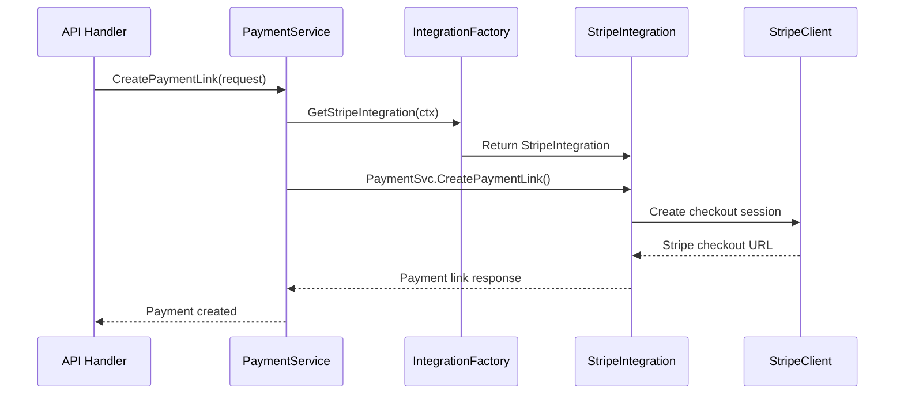

# Integration Architecture V2 - Multi-Provider Payment System

## 📋 **Overview**

This PRD documents the new modular integration architecture that enables FlexPrice to support multiple payment providers (Stripe, Razorpay, PayPal, etc.) simultaneously for a single tenant, with clean separation of concerns and easy extensibility.

## 🎯 **Problem Statement**

### **Before (Monolithic Architecture)**
- All Stripe logic scattered across multiple service files
- Tight coupling between business logic and provider-specific code
- Difficult to add new payment providers
- Import cycles between service and integration layers
- No support for multiple providers per tenant
- Hard to test and maintain

### **After (Modular Architecture)**
- Clean separation between business logic and provider integrations
- Easy to add new payment providers
- Support for multiple providers per tenant
- No import cycles
- Testable and maintainable code
- Future-proof design

## 🏗️ **Architecture Overview**

### **Core Components**

```
┌─────────────────────────────────────────────────────────────────┐
│                        FlexPrice Core                          │
├─────────────────────────────────────────────────────────────────┤
│  Service Layer (Business Logic)                               │
│  ├── CustomerService    ├── PaymentService    ├── InvoiceService │
│  └── (implements interfaces)                                   │
├─────────────────────────────────────────────────────────────────┤
│  Interfaces Layer (Dependency Inversion)                      │
│  ├── CustomerService    ├── PaymentService    ├── InvoiceService │
│  └── (defines contracts)                                       │
├─────────────────────────────────────────────────────────────────┤
│  Integration Layer (Provider-Specific Logic)                  │
│  ├── Factory (Provider Management)                            │
│  ├── Stripe/                                                  │
│  │   ├── client.go      ├── customer.go    ├── payment.go     │
│  │   ├── invoice_sync.go ├── dto.go        └── webhook/       │
│  ├── Razorpay/ (Future)                                       │
│  └── PayPal/ (Future)                                         │
└─────────────────────────────────────────────────────────────────┘
```

## 🔧 **How It Works**

### **1. Service Layer (Business Logic)**
- Contains all FlexPrice business logic
- Implements interfaces from `internal/interfaces`
- Calls integration layer for provider-specific operations
- Example: `CustomerService.CreateCustomer()` → calls `IntegrationFactory.GetStripeIntegration()`

### **2. Interfaces Layer (Dependency Inversion)**
- **Purpose**: Breaks import cycles between service and integration layers
- **Location**: `internal/interfaces/service.go`
- **Contains**: Abstract interfaces for `CustomerService`, `PaymentService`, `InvoiceService`
- **Why Needed**: Prevents circular dependencies while allowing integration layer to call back into service layer

### **3. Integration Layer (Provider Logic)**
- **Factory**: `internal/integration/factory.go` - Manages all providers
- **Providers**: Each provider has its own package (e.g., `internal/integration/stripe/`)
- **Services**: Each provider exposes standardized services (Customer, Payment, Invoice, Webhook)

## 🔄 **Data Flow Example**

### **Creating a Payment Link**



## 🆕 **Adding a New Provider (Razorpay Example)**

### **Step 1: Create Provider Package**
```bash
mkdir internal/integration/razorpay
```

### **Step 2: Implement Required Services**
```go
// internal/integration/razorpay/customer.go
type CustomerService struct {
    client *razorpay.Client
    // ... other dependencies
}

func (s *CustomerService) CreateCustomerInRazorpay(ctx context.Context, customerID string, customerService interfaces.CustomerService) error {
    // Razorpay-specific customer creation logic
}

// internal/integration/razorpay/payment.go
type PaymentService struct {
    client *razorpay.Client
    // ... other dependencies
}

func (s *PaymentService) CreatePaymentLink(ctx context.Context, req *dto.CreatePaymentLinkRequest) (*dto.PaymentLinkResponse, error) {
    // Razorpay-specific payment link creation
}
```

### **Step 3: Create Provider Struct**
```go
// internal/integration/razorpay/provider.go
type RazorpayProvider struct {
    CustomerSvc *CustomerService
    PaymentSvc  *PaymentService
    InvoiceSvc  *InvoiceService
    WebhookSvc  *WebhookService
}

func (p *RazorpayProvider) GetProviderType() types.SecretProvider {
    return types.SecretProviderRazorpay
}
```

### **Step 4: Register in Factory**
```go
// internal/integration/factory.go
func (f *Factory) GetRazorpayIntegration(ctx context.Context) *RazorpayProvider {
    // Return configured Razorpay integration
}
```

### **Step 5: Update Service Layer**
```go
// internal/service/payment.go
func (s *PaymentService) CreatePaymentLink(ctx context.Context, req *dto.CreatePaymentLinkRequest) (*dto.PaymentResponse, error) {
    // Determine provider based on request or configuration
    if req.Provider == "razorpay" {
        razorpayIntegration := s.IntegrationFactory.GetRazorpayIntegration(ctx)
        return razorpayIntegration.PaymentSvc.CreatePaymentLink(ctx, req)
    } else {
        stripeIntegration := s.IntegrationFactory.GetStripeIntegration(ctx)
        return stripeIntegration.PaymentSvc.CreatePaymentLink(ctx, req)
    }
}
```

## 🔑 **Why Interfaces Package is Essential**

### **The Import Cycle Problem**

Without interfaces, we'd have this circular dependency:

```
Service Layer → Integration Layer → Service Layer
     ↑                                    ↓
     └────────── Import Cycle! ──────────┘
```

**Go will NOT compile this** - it fails with "import cycle not allowed".

### **The Solution: Dependency Inversion**

```
Service Layer → Integration Layer → Interfaces Package
     ↑                ↓                    ↑
     └── Implements ──┘                    │
                                          │
                              Defines contracts only
```

**Interfaces package contains only abstract contracts, no concrete implementations.**

### **Real Example**

```go
// internal/integration/stripe/customer.go
func (s *CustomerService) CreateCustomerInStripe(
    ctx context.Context, 
    customerID string, 
    customerService interfaces.CustomerService, // ← Interface, not concrete type
) error {
    // Get customer from FlexPrice
    customer, err := customerService.GetCustomer(ctx, customerID)
    // Create in Stripe...
}
```

**Without interfaces**: We'd need `service.CustomerService` → import cycle ❌  
**With interfaces**: We use `interfaces.CustomerService` → no cycle ✅

## 🏢 **Multi-Provider Support**

### **Single Tenant, Multiple Providers**

```go
// A tenant can have both Stripe and Razorpay configured
tenant := &Tenant{
    ID: "tenant_123",
    Connections: []*Connection{
        {
            ProviderType: types.SecretProviderStripe,
            EncryptedSecretData: &types.ConnectionMetadata{
                Stripe: &types.StripeMetadata{
                    SecretKey: "sk_test_...",
                    PublishableKey: "pk_test_...",
                    WebhookSecret: "whsec_...",
                },
            },
        },
        {
            ProviderType: types.SecretProviderRazorpay,
            EncryptedSecretData: &types.ConnectionMetadata{
                Razorpay: &types.RazorpayMetadata{
                    KeyID: "rzp_test_...",
                    KeySecret: "secret_...",
                    WebhookSecret: "whsec_...",
                },
            },
        },
    },
}
```

### **Provider Selection Logic**

```go
func (s *PaymentService) CreatePaymentLink(ctx context.Context, req *dto.CreatePaymentLinkRequest) (*dto.PaymentResponse, error) {
    // Get available providers for this tenant
    availableProviders := s.IntegrationFactory.GetAvailableProviders(ctx, req.TenantID)
    
    // Select provider based on business logic
    selectedProvider := s.selectProvider(availableProviders, req)
    
    switch selectedProvider.GetProviderType() {
    case types.SecretProviderStripe:
        return s.IntegrationFactory.GetStripeIntegration(ctx).PaymentSvc.CreatePaymentLink(ctx, req)
    case types.SecretProviderRazorpay:
        return s.IntegrationFactory.GetRazorpayIntegration(ctx).PaymentSvc.CreatePaymentLink(ctx, req)
    default:
        return nil, errors.New("unsupported provider")
    }
}
```

## 📊 **Benefits**

### **1. Clean Architecture**
- **Separation of Concerns**: Business logic separate from provider logic
- **Single Responsibility**: Each package has one clear purpose
- **Dependency Inversion**: High-level modules don't depend on low-level modules

### **2. Easy Extensibility**
- **Add New Providers**: Just create new package and register in factory
- **No Breaking Changes**: Existing code continues to work
- **Consistent Interface**: All providers follow the same pattern

### **3. Multi-Provider Support**
- **Multiple Providers per Tenant**: Support Stripe + Razorpay simultaneously
- **Provider Selection**: Choose provider based on business rules
- **Failover**: Switch providers if one fails

### **4. Maintainability**
- **No Import Cycles**: Clean dependency graph
- **Testable**: Easy to mock interfaces for testing
- **Readable**: Clear code organization

### **5. Production Ready**
- **Error Handling**: Comprehensive error handling throughout
- **Logging**: Detailed logging for debugging
- **Security**: Encrypted secret management
- **Performance**: Efficient provider management

## 🚀 **Implementation Status**

### **✅ Completed**
- [x] Stripe integration fully migrated
- [x] Interfaces package created
- [x] Factory pattern implemented
- [x] Service layer updated
- [x] Webhook handling migrated
- [x] All old files cleaned up
- [x] Zero breaking changes

### **🔄 Future Enhancements**
- [ ] Razorpay integration
- [ ] PayPal integration
- [ ] Provider capability discovery
- [ ] Automatic failover
- [ ] Provider performance monitoring

## 📁 **File Structure**

```
internal/
├── interfaces/
│   └── service.go              # Service interfaces (breaks import cycles)
├── integration/
│   ├── factory.go             # Provider factory and management
│   └── stripe/
│       ├── client.go          # Stripe API client & configuration
│       ├── customer.go        # Customer operations
│       ├── payment.go         # Payment operations
│       ├── invoice_sync.go    # Invoice synchronization
│       ├── dto.go            # Stripe-specific DTOs
│       └── webhook/
│           └── handler.go     # Webhook event processing
└── service/
    ├── customer.go           # Implements interfaces.CustomerService
    ├── payment.go            # Implements interfaces.PaymentService
    └── invoice.go            # Implements interfaces.InvoiceService
```

## 🎯 **Key Takeaways**

1. **Interfaces Package is Essential**: Prevents import cycles and enables clean architecture
2. **Factory Pattern**: Centralized provider management
3. **Modular Design**: Easy to add new providers
4. **Multi-Provider Support**: Single tenant can use multiple payment providers
5. **Zero Breaking Changes**: Existing functionality preserved
6. **Production Ready**: Comprehensive error handling, logging, and security

This architecture provides a solid foundation for FlexPrice's payment integration needs, both current and future.
