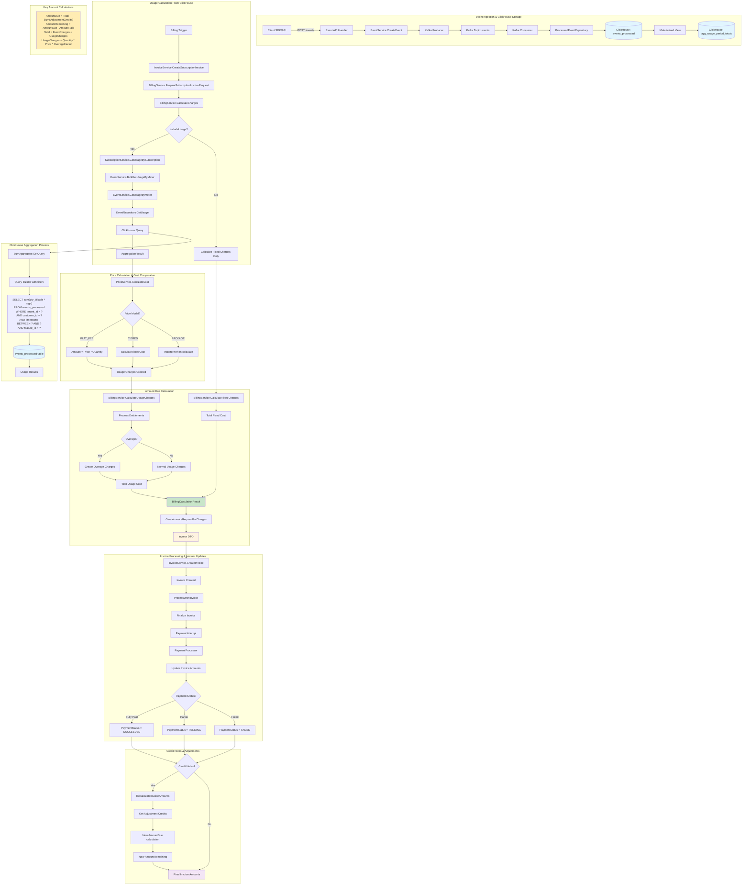

```mermaid
   graph TD
    %% Event Ingestion and Processing
    subgraph "Event Ingestion & ClickHouse Storage"
        Client[Client SDK/API] -->|POST /events| EventAPI[Event API Handler]
        EventAPI --> EventService[EventService.CreateEvent]
        EventService --> KafkaProducer[Kafka Producer]
        KafkaProducer --> EventTopic[Kafka Topic: events]

        EventTopic --> KafkaConsumer[Kafka Consumer]
        KafkaConsumer --> ProcessedEventRepo[ProcessedEventRepository]
        ProcessedEventRepo --> ClickHouseEvents[(ClickHouse: events_processed)]

        %% Materialized Views for aggregation
        ClickHouseEvents --> MaterializedView[Materialized View]
        MaterializedView --> AggTable[(ClickHouse: agg_usage_period_totals)]
    end

    %% Usage Calculation Flow
    subgraph "Usage Calculation From ClickHouse"
        BillingTrigger[Billing Trigger] --> InvoiceService[InvoiceService.CreateSubscriptionInvoice]
        InvoiceService --> BillingService[BillingService.PrepareSubscriptionInvoiceRequest]
        BillingService --> CalculateCharges[BillingService.CalculateCharges]

        CalculateCharges --> CheckIncludeUsage{includeUsage?}
        CheckIncludeUsage -->|Yes| GetUsageBySubscription[SubscriptionService.GetUsageBySubscription]
        CheckIncludeUsage -->|No| FixedChargesOnly[Calculate Fixed Charges Only]

        GetUsageBySubscription --> BulkGetUsageByMeter[EventService.BulkGetUsageByMeter]
        BulkGetUsageByMeter --> GetUsageByMeter[EventService.GetUsageByMeter]

        GetUsageByMeter --> EventRepoUsage[EventRepository.GetUsage]
        EventRepoUsage --> ClickHouseQuery[ClickHouse Query]
        ClickHouseQuery --> AggregationResult[AggregationResult]
    end

    %% ClickHouse Query Details
    subgraph "ClickHouse Aggregation Process"
        ClickHouseQuery --> SumAggregator[SumAggregator.GetQuery]
        SumAggregator --> QueryBuilder[Query Builder with filters]

        QueryBuilder --> AggQuery["SELECT sum(qty_billable * sign)<br/>FROM events_processed<br/>WHERE tenant_id = ?<br/>AND customer_id = ?<br/>AND timestamp BETWEEN ? AND ?<br/>AND feature_id = ?"]

        AggQuery --> ProcessedEvents[(events_processed table)]
        ProcessedEvents --> UsageResults[Usage Results]
    end

    %% Price Calculation
    subgraph "Price Calculation & Cost Computation"
        AggregationResult --> PriceService[PriceService.CalculateCost]
        PriceService --> PriceModel{Price Model?}

        PriceModel -->|FLAT_FEE| FlatFeeCalc[Amount = Price * Quantity]
        PriceModel -->|TIERED| TieredCalc[calculateTieredCost]
        PriceModel -->|PACKAGE| PackageCalc[Transform then calculate]

        FlatFeeCalc --> UsageCharges[Usage Charges Created]
        TieredCalc --> UsageCharges
        PackageCalc --> UsageCharges
    end

    %% Amount Due Calculation
    subgraph "Amount Due Calculation"
        UsageCharges --> CalculateUsageCharges[BillingService.CalculateUsageCharges]
        FixedChargesOnly --> CalculateFixedCharges[BillingService.CalculateFixedCharges]

        CalculateUsageCharges --> ProcessEntitlements[Process Entitlements]
        ProcessEntitlements --> ApplyOverage{Overage?}
        ApplyOverage -->|Yes| OverageCharges[Create Overage Charges]
        ApplyOverage -->|No| NormalCharges[Normal Usage Charges]

        OverageCharges --> TotalUsageCost[Total Usage Cost]
        NormalCharges --> TotalUsageCost
        CalculateFixedCharges --> TotalFixedCost[Total Fixed Cost]

        TotalUsageCost --> CalculationResult[BillingCalculationResult]
        TotalFixedCost --> CalculationResult

        CalculationResult --> CreateInvoiceRequest[CreateInvoiceRequestForCharges]
        CreateInvoiceRequest --> InvoiceDTO[Invoice DTO]
    end

    %% Invoice Processing
    subgraph "Invoice Processing & Amount Updates"
        InvoiceDTO --> CreateInvoice[InvoiceService.CreateInvoice]
        CreateInvoice --> InvoiceCreated[Invoice Created]

        InvoiceCreated --> ProcessDraftInvoice[ProcessDraftInvoice]
        ProcessDraftInvoice --> FinalizeInvoice[Finalize Invoice]

        FinalizeInvoice --> PaymentAttempt[Payment Attempt]
        PaymentAttempt --> PaymentProcessor[PaymentProcessor]
        PaymentProcessor --> UpdateAmounts[Update Invoice Amounts]

        UpdateAmounts --> PaymentStatus{Payment Status?}
        PaymentStatus -->|Fully Paid| PaymentSuccess[PaymentStatus = SUCCEEDED]
        PaymentStatus -->|Partial| PaymentPending[PaymentStatus = PENDING]
        PaymentStatus -->|Failed| PaymentFailed[PaymentStatus = FAILED]
    end

    %% Credit Notes
    subgraph "Credit Notes & Adjustments"
        PaymentSuccess --> CreditNoteAdjustment{Credit Notes?}
        PaymentPending --> CreditNoteAdjustment
        PaymentFailed --> CreditNoteAdjustment

        CreditNoteAdjustment -->|Yes| RecalculateAmounts[RecalculateInvoiceAmounts]
        RecalculateAmounts --> GetAdjustmentCredits[Get Adjustment Credits]
        GetAdjustmentCredits --> NewAmountDue[New AmountDue calculation]
        NewAmountDue --> NewAmountRemaining[New AmountRemaining]

        CreditNoteAdjustment -->|No| FinalAmounts[Final Invoice Amounts]
        NewAmountRemaining --> FinalAmounts
    end

    %% Key Formulas
    subgraph "Key Amount Calculations"
        Formulas["AmountDue = Total - Sum(AdjustmentCredits)<br/>AmountRemaining = AmountDue - AmountPaid<br/>Total = FixedCharges + UsageCharges<br/>UsageCharges = Quantity * Price * OverageFactor"]
    end

    style ClickHouseEvents fill:#e1f5fe
    style AggTable fill:#e1f5fe
    style ProcessedEvents fill:#e1f5fe
    style CalculationResult fill:#c8e6c9
    style InvoiceDTO fill:#fff3e0
    style FinalAmounts fill:#f3e5f5
    style Formulas fill:#ffecb3
```
