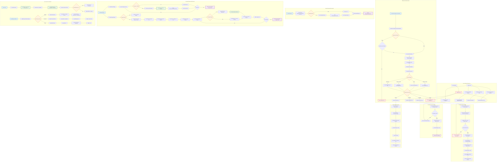

```mermaid  
graph TD
    %% Detailed Billing Service Methods and Flows
    subgraph "BillingService Method Details"
        PrepareInvoiceReq[PrepareSubscriptionInvoiceRequest] --> ValidatePeriod[validatePeriodAgainstSubscriptionEndDate]
        ValidatePeriod --> CheckEndDate{Subscription EndDate?}
        CheckEndDate -->|Exists| ValidateStartDate{PeriodStart after EndDate?}
        CheckEndDate -->|None| ProceedCalc[Proceed with Calculation]
        ValidateStartDate -->|Yes| ErrorReturn[Return Validation Error]
        ValidateStartDate -->|No| ProceedCalc
        
        ProceedCalc --> CreateZeroInvoice[Create Zero Amount Invoice as Default]
        CreateZeroInvoice --> CalcNextPeriod[Calculate Next Period Dates]
        CalcNextPeriod --> ClassifyItems[ClassifyLineItems Method]
        
        ClassifyItems --> ProcessLineItems[Process Each Line Item]
        ProcessLineItems --> CheckCadence{Invoice Cadence?}
        CheckCadence -->|Advance + Fixed| CurrentAdvance[Add to CurrentPeriodAdvance]
        CheckCadence -->|Arrear| CurrentArrear[Add to CurrentPeriodArrear]
        CheckCadence -->|Advance + Fixed| NextAdvance[Also Add to NextPeriodAdvance]
        CheckCadence -->|Usage Type| SetUsageFlag[Set HasUsageCharges = true]
        
        CurrentAdvance --> ReferenceSwitch{Switch Reference Point}
        CurrentArrear --> ReferenceSwitch
        NextAdvance --> ReferenceSwitch
        SetUsageFlag --> ReferenceSwitch
        
        ReferenceSwitch -->|PeriodStart| HandlePeriodStart[Handle Period Start Case]
        ReferenceSwitch -->|PeriodEnd| HandlePeriodEnd[Handle Period End Case]
        ReferenceSwitch -->|Preview| HandlePreview[Handle Preview Case]
        ReferenceSwitch -->|Default| InvalidRefPoint[Return Invalid Reference Point Error]
    end
    
    subgraph "PeriodStart Case Processing"
        HandlePeriodStart --> FilterAdvanceItems[FilterLineItemsToBeInvoiced for Advance Items]
        FilterAdvanceItems --> CheckAdvanceItems{Any Advance Items?}
        CheckAdvanceItems -->|None| ReturnZeroInvoice[Return Zero Amount Invoice]
        CheckAdvanceItems -->|Exists| CalcAdvanceCharges[CalculateCharges for Advance Items]
        CalcAdvanceCharges --> AdvanceResult[Set includeUsage = false]
        AdvanceResult --> CreateAdvanceInvoiceReq[Create Invoice Request]
    end
    
    subgraph "PeriodEnd Case Processing"
        HandlePeriodEnd --> FilterArrearItems[FilterLineItemsToBeInvoiced for Arrear Items]
        FilterArrearItems --> FilterNextAdvance[FilterLineItemsToBeInvoiced for Next Period Advance]
        FilterNextAdvance --> CombineItems[Combine Arrear + Next Advance Items]
        CombineItems --> CheckCombinedItems{Any Combined Items?}
        CheckCombinedItems -->|None| ThrowNoChargesError[Throw no charges to invoice Error]
        CheckCombinedItems -->|Exists| CalcArrearCharges[CalculateCharges for Arrear Items]
        CalcArrearCharges --> ArrearUsageFlag[Set includeUsage = HasUsageCharges]
        ArrearUsageFlag --> CalcNextAdvanceCharges[CalculateCharges for Next Advance Items]
        CalcNextAdvanceCharges --> NextAdvanceUsageFlag[Set includeUsage = false]
        NextAdvanceUsageFlag --> CombineResults[Combine Arrear + Advance Results]
        CombineResults --> CreateCombinedInvoiceReq[Create Combined Invoice Request]
    end
    
    subgraph "Preview Case Processing"
        HandlePreview --> CalcPreviewArrear[CalculateCharges for Current Arrear]
        CalcPreviewArrear --> PreviewArrearUsage[Set includeUsage = HasUsageCharges]
        PreviewArrearUsage --> CalcPreviewAdvance[CalculateCharges for Next Advance]
        CalcPreviewAdvance --> PreviewAdvanceUsage[Set includeUsage = false]
        PreviewAdvanceUsage --> CombinePreviewResults[Combine Results]
        CombinePreviewResults --> SetPreviewMetadata[Set metadata: is_preview = true]
        SetPreviewMetadata --> CreatePreviewInvoiceReq[Create Preview Invoice Request]
    end
    
    subgraph "CalculateCharges Method Details"
        CalcChargesMethod[CalculateCharges] --> CreateFilteredSub[Create Filtered Subscription with Specified Line Items]
        CreateFilteredSub --> CheckIncludeUsage{includeUsage Flag?}
        CheckIncludeUsage -->|true| GetUsageService[Get SubscriptionService]
        CheckIncludeUsage -->|false| SkipUsage[Set usage = nil]
        GetUsageService --> CallGetUsage[Call GetUsageBySubscription]
        CallGetUsage --> UsageResponse[Get Usage Response]
        SkipUsage --> CallCalculateAll[Call CalculateAllCharges]
        UsageResponse --> CallCalculateAll
        CallCalculateAll --> ReturnCalculationResult[Return BillingCalculationResult]
    end
    
    subgraph "CalculateAllCharges Method Details"
        CalcAllCharges[CalculateAllCharges] --> CalcFixedMethod[CalculateFixedCharges]
        CalcAllCharges --> CalcUsageMethod[CalculateUsageCharges]
        
        CalcFixedMethod --> IterateLineItems[Iterate Through Line Items]
        IterateLineItems --> CheckPriceType{PriceType == FIXED?}
        CheckPriceType -->|No| SkipItem[Skip to Next Item]
        CheckPriceType -->|Yes| GetPrice[Get Price from PriceService]
        GetPrice --> CalculateItemCost[Calculate Cost = Price * Quantity]
        CalculateItemCost --> CreateLineItemReq[Create CreateInvoiceLineItemRequest]
        CreateLineItemReq --> AddToFixedTotal[Add to Fixed Total]
        SkipItem --> CheckMoreItems{More Items?}
        AddToFixedTotal --> CheckMoreItems
        CheckMoreItems -->|Yes| IterateLineItems
        CheckMoreItems -->|No| ReturnFixedCharges[Return Fixed Charges Array + Total]
        
        CalcUsageMethod --> CheckUsageNull{Usage Data Null?}
        CheckUsageNull -->|Yes| ReturnZeroUsage[Return Zero Usage Charges]
        CheckUsageNull -->|No| GetPlanIDs[Extract Plan IDs from Usage Line Items]
        GetPlanIDs --> GetEntitlements[Get Entitlements by Plan IDs]
        GetEntitlements --> MapEntitlements[Map Entitlements by Plan + Meter ID]
        MapEntitlements --> ProcessUsageItems[Process Each Usage Line Item]
        ProcessUsageItems --> FindMatchingCharges[Find Matching Usage Charges]
        FindMatchingCharges --> ProcessCharges[Process Each Matching Charge]
        ProcessCharges --> CheckOverage{Is Overage Charge?}
        CheckOverage -->|No| ApplyEntitlement[Apply Entitlement Adjustments]
        CheckOverage -->|Yes| SkipEntitlement[Skip Entitlement, Use Full Quantity]
        ApplyEntitlement --> CalcAdjustedQuantity[Calculate Adjusted Quantity]
        CalcAdjustedQuantity --> CreateUsageLineItem[Create Usage Line Item Request]
        SkipEntitlement --> CreateUsageLineItem
        CreateUsageLineItem --> AddToUsageTotal[Add to Usage Total]
        AddToUsageTotal --> CheckMoreCharges{More Charges?}
        CheckMoreCharges -->|Yes| ProcessCharges
        CheckMoreCharges -->|No| ReturnUsageCharges[Return Usage Charges Array + Total]
    end
    
    subgraph "Invoice Amount Calculations"
        CreateInvoiceMethod[CreateInvoice] --> SetInitialAmounts[Set Initial Amounts]
        SetInitialAmounts --> CalcAmountDue[AmountDue = Sum of Line Item Amounts]
        CalcAmountDue --> SetAmountPaidZero[AmountPaid = 0 by default]
        SetAmountPaidZero --> CalcAmountRemaining[AmountRemaining = AmountDue - AmountPaid]
        CalcAmountRemaining --> DeterminePaymentStatus[Determine Payment Status]
        DeterminePaymentStatus --> CheckAmountRemaining{AmountRemaining == 0?}
        CheckAmountRemaining -->|Yes| SetPaymentSucceeded[PaymentStatus = Succeeded]
        CheckAmountRemaining -->|No| SetPaymentPending[PaymentStatus = Pending]
        
        UpdatePaymentMethod[UpdatePaymentStatus] --> ValidateTransition[validatePaymentStatusTransition]
        ValidateTransition --> SwitchPaymentStatus{Switch Payment Status}
        SwitchPaymentStatus -->|Pending| HandlePending[Handle Pending Case]
        SwitchPaymentStatus -->|Succeeded| HandleSucceeded[Handle Succeeded Case]
        SwitchPaymentStatus -->|Failed| HandleFailed[Handle Failed Case]
        
        HandlePending --> UpdateAmountPaidPartial[AmountPaid = Provided Amount]
        UpdateAmountPaidPartial --> RecalcRemaining[AmountRemaining = AmountDue - AmountPaid]
        
        HandleSucceeded --> SetAmountPaidFull[AmountPaid = AmountDue]
        SetAmountPaidFull --> SetRemainingZero[AmountRemaining = 0]
        SetRemainingZero --> SetPaidAt[PaidAt = Current Time]
        
        HandleFailed --> ResetAmountPaid[AmountPaid = 0]
        ResetAmountPaid --> ResetRemaining[AmountRemaining = AmountDue]
        ResetRemaining --> ClearPaidAt[PaidAt = null]
    end
    
    subgraph "Error Handling & Edge Cases"
        ErrorHandling[Error Handling] --> ValidationErrors[Validation Errors]
        ValidationErrors --> InvalidRefPoint
        ValidationErrors --> ErrorReturn
        ValidationErrors --> ThrowNoChargesError
        
        EdgeCases[Edge Cases] --> SubscriptionEndDate[Subscription End Date Handling]
        EdgeCases --> ZeroAmountInvoices[Zero Amount Invoice Handling]
        EdgeCases --> AlreadyInvoicedItems[Already Invoiced Items Filter]
        EdgeCases --> OverageChargeHandling[Overage Charge Special Handling]
        
        SubscriptionEndDate --> LogExtendsBeyond[Log: Period Extends Beyond End Date]
        ZeroAmountInvoices --> ReturnZeroInvoice
        AlreadyInvoicedItems --> ExcludeFromCalculation[Exclude from Calculation]
        OverageChargeHandling --> BypassEntitlements[Bypass Entitlement Limits]
    end
    
    classDef methodClass fill:#e3f2fd,stroke:#1976d2,stroke-width:2px
    classDef decisionClass fill:#fff3e0,stroke:#f57c00,stroke-width:2px
    classDef errorClass fill:#ffebee,stroke:#d32f2f,stroke-width:2px
    classDef calculationClass fill:#e8f5e8,stroke:#388e3c,stroke-width:2px
    classDef resultClass fill:#f3e5f5,stroke:#7b1fa2,stroke-width:2px
    
    class PrepareInvoiceReq,CalcChargesMethod,CalcAllCharges,CreateInvoiceMethod,UpdatePaymentMethod methodClass
    class CheckEndDate,CheckCadence,ReferenceSwitch,CheckIncludeUsage,CheckPriceType,CheckUsageNull,CheckOverage,CheckAmountRemaining,SwitchPaymentStatus decisionClass
    class ErrorReturn,InvalidRefPoint,ThrowNoChargesError,ValidationErrors errorClass
    class CalculateItemCost,CalcAdjustedQuantity,CalcAmountDue,CalcAmountRemaining calculationClass
    class ReturnCalculationResult,ReturnFixedCharges,ReturnUsageCharges,CreateAdvanceInvoiceReq resultClass
```