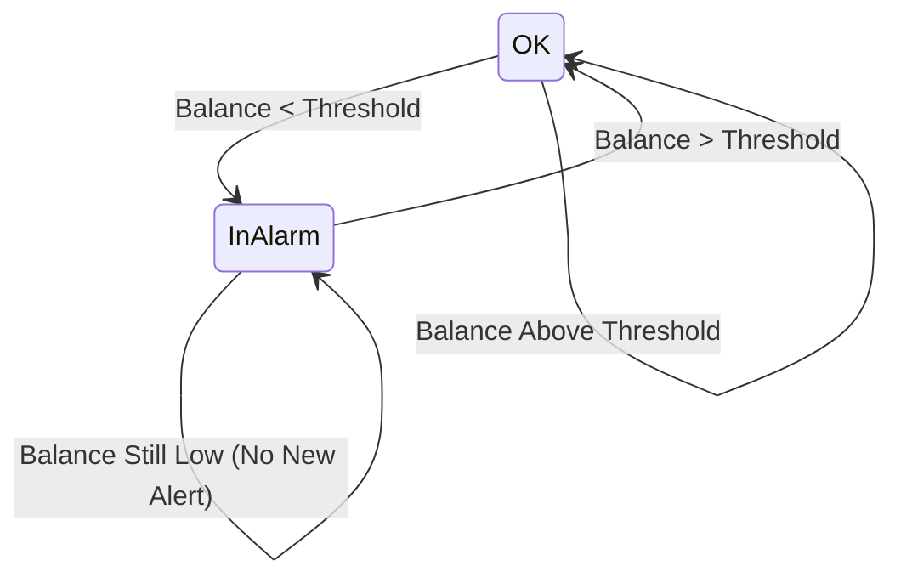
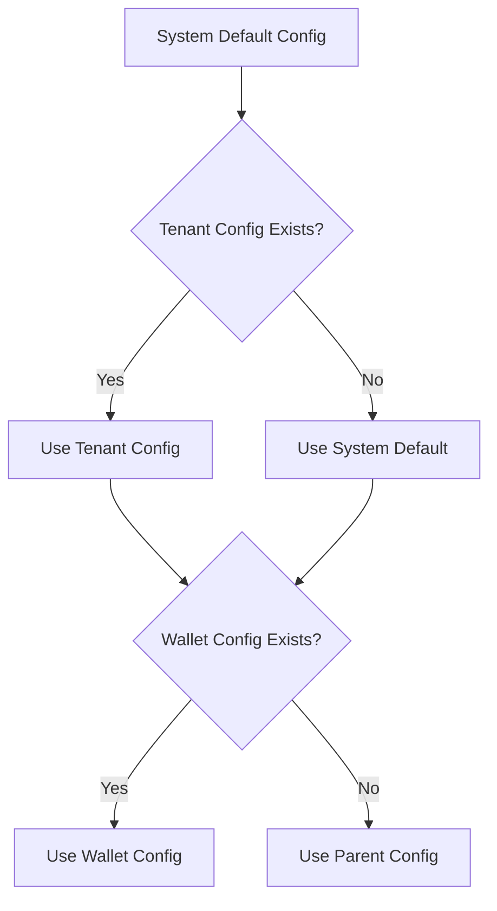
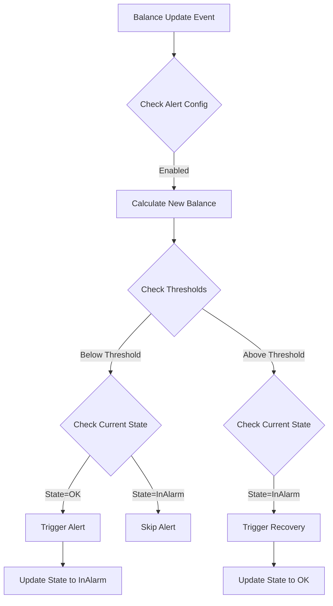

# Low Balance Threshold Alert Implementation Guide

## Overview

This guide outlines the implementation of low balance alerts for both ongoing and credit balances in FlexPrice. The system will provide real-time alerts when balances fall below configurable thresholds, with support for multi-level configuration inheritance.

## Alert Types

### Credit Balance Alerts
1. `wallet.credit_balance.depleted` - Balance reaches 0
2. `wallet.credit_balance.dropped` - Balance falls below threshold
3. `wallet.credit_balance.recovered` - Balance returns above 0

### Ongoing Balance Alerts
1. `wallet.ongoing_balance.depleted` - Balance reaches 0
2. `wallet.ongoing_balance.dropped` - Balance falls below threshold
3. `wallet.ongoing_balance.recovered` - Balance returns above 0

## Alert States

```go
type AlertState string

const (
    AlertStateOK      AlertState = "ok"
    AlertStateInAlarm AlertState = "in_alarm"
)
```

## State Transitions



<svg aria-roledescription="stateDiagram" role="graphics-document document" viewBox="0 0 472.92578125 151.5" style="max-width: 472.92578125px;" class="statediagram" xmlns="http://www.w3.org/2000/svg" width="100%" id="mermaid-svg-1753970692909-hrfhbsve5"><style>#mermaid-svg-1753970692909-hrfhbsve5{font-family:"trebuchet ms",verdana,arial,sans-serif;font-size:16px;fill:rgba(204, 204, 204, 0.87);}#mermaid-svg-1753970692909-hrfhbsve5 .error-icon{fill:#bf616a;}#mermaid-svg-1753970692909-hrfhbsve5 .error-text{fill:#bf616a;stroke:#bf616a;}#mermaid-svg-1753970692909-hrfhbsve5 .edge-thickness-normal{stroke-width:2px;}#mermaid-svg-1753970692909-hrfhbsve5 .edge-thickness-thick{stroke-width:3.5px;}#mermaid-svg-1753970692909-hrfhbsve5 .edge-pattern-solid{stroke-dasharray:0;}#mermaid-svg-1753970692909-hrfhbsve5 .edge-pattern-dashed{stroke-dasharray:3;}#mermaid-svg-1753970692909-hrfhbsve5 .edge-pattern-dotted{stroke-dasharray:2;}#mermaid-svg-1753970692909-hrfhbsve5 .marker{fill:rgba(204, 204, 204, 0.87);stroke:rgba(204, 204, 204, 0.87);}#mermaid-svg-1753970692909-hrfhbsve5 .marker.cross{stroke:rgba(204, 204, 204, 0.87);}#mermaid-svg-1753970692909-hrfhbsve5 svg{font-family:"trebuchet ms",verdana,arial,sans-serif;font-size:16px;}#mermaid-svg-1753970692909-hrfhbsve5 defs #statediagram-barbEnd{fill:rgba(204, 204, 204, 0.87);stroke:rgba(204, 204, 204, 0.87);}#mermaid-svg-1753970692909-hrfhbsve5 g.stateGroup text{fill:#2a2a2a;stroke:none;font-size:10px;}#mermaid-svg-1753970692909-hrfhbsve5 g.stateGroup text{fill:rgba(204, 204, 204, 0.87);stroke:none;font-size:10px;}#mermaid-svg-1753970692909-hrfhbsve5 g.stateGroup .state-title{font-weight:bolder;fill:#191c22;}#mermaid-svg-1753970692909-hrfhbsve5 g.stateGroup rect{fill:#1a1a1a;stroke:#2a2a2a;}#mermaid-svg-1753970692909-hrfhbsve5 g.stateGroup line{stroke:rgba(204, 204, 204, 0.87);stroke-width:1;}#mermaid-svg-1753970692909-hrfhbsve5 .transition{stroke:rgba(204, 204, 204, 0.87);stroke-width:1;fill:none;}#mermaid-svg-1753970692909-hrfhbsve5 .stateGroup .composit{fill:#1a1a1a;border-bottom:1px;}#mermaid-svg-1753970692909-hrfhbsve5 .stateGroup .alt-composit{fill:#e0e0e0;border-bottom:1px;}#mermaid-svg-1753970692909-hrfhbsve5 .state-note{stroke:#2a2a2a;fill:#1a1a1a;}#mermaid-svg-1753970692909-hrfhbsve5 .state-note text{fill:rgba(204, 204, 204, 0.87);stroke:none;font-size:10px;}#mermaid-svg-1753970692909-hrfhbsve5 .stateLabel .box{stroke:none;stroke-width:0;fill:#1a1a1a;opacity:0.5;}#mermaid-svg-1753970692909-hrfhbsve5 .edgeLabel .label rect{fill:#1a1a1a;opacity:0.5;}#mermaid-svg-1753970692909-hrfhbsve5 .edgeLabel .label text{fill:rgba(204, 204, 204, 0.87);}#mermaid-svg-1753970692909-hrfhbsve5 .label div .edgeLabel{color:rgba(204, 204, 204, 0.87);}#mermaid-svg-1753970692909-hrfhbsve5 .stateLabel text{fill:#191c22;font-size:10px;font-weight:bold;}#mermaid-svg-1753970692909-hrfhbsve5 .node circle.state-start{fill:rgba(204, 204, 204, 0.87);stroke:rgba(204, 204, 204, 0.87);}#mermaid-svg-1753970692909-hrfhbsve5 .node .fork-join{fill:rgba(204, 204, 204, 0.87);stroke:rgba(204, 204, 204, 0.87);}#mermaid-svg-1753970692909-hrfhbsve5 .node circle.state-end{fill:#2a2a2a;stroke:#1a1a1a;stroke-width:1.5;}#mermaid-svg-1753970692909-hrfhbsve5 .end-state-inner{fill:#1a1a1a;stroke-width:1.5;}#mermaid-svg-1753970692909-hrfhbsve5 .node rect{fill:#1a1a1a;stroke:#2a2a2a;stroke-width:1px;}#mermaid-svg-1753970692909-hrfhbsve5 .node polygon{fill:#1a1a1a;stroke:#2a2a2a;stroke-width:1px;}#mermaid-svg-1753970692909-hrfhbsve5 #statediagram-barbEnd{fill:rgba(204, 204, 204, 0.87);}#mermaid-svg-1753970692909-hrfhbsve5 .statediagram-cluster rect{fill:#1a1a1a;stroke:#2a2a2a;stroke-width:1px;}#mermaid-svg-1753970692909-hrfhbsve5 .cluster-label,#mermaid-svg-1753970692909-hrfhbsve5 .nodeLabel{color:#191c22;}#mermaid-svg-1753970692909-hrfhbsve5 .statediagram-cluster rect.outer{rx:5px;ry:5px;}#mermaid-svg-1753970692909-hrfhbsve5 .statediagram-state .divider{stroke:#2a2a2a;}#mermaid-svg-1753970692909-hrfhbsve5 .statediagram-state .title-state{rx:5px;ry:5px;}#mermaid-svg-1753970692909-hrfhbsve5 .statediagram-cluster.statediagram-cluster .inner{fill:#1a1a1a;}#mermaid-svg-1753970692909-hrfhbsve5 .statediagram-cluster.statediagram-cluster-alt .inner{fill:rgba(64, 64, 64, 0.47);}#mermaid-svg-1753970692909-hrfhbsve5 .statediagram-cluster .inner{rx:0;ry:0;}#mermaid-svg-1753970692909-hrfhbsve5 .statediagram-state rect.basic{rx:5px;ry:5px;}#mermaid-svg-1753970692909-hrfhbsve5 .statediagram-state rect.divider{stroke-dasharray:10,10;fill:rgba(64, 64, 64, 0.47);}#mermaid-svg-1753970692909-hrfhbsve5 .note-edge{stroke-dasharray:5;}#mermaid-svg-1753970692909-hrfhbsve5 .statediagram-note rect{fill:#1a1a1a;stroke:#2a2a2a;stroke-width:1px;rx:0;ry:0;}#mermaid-svg-1753970692909-hrfhbsve5 .statediagram-note rect{fill:#1a1a1a;stroke:#2a2a2a;stroke-width:1px;rx:0;ry:0;}#mermaid-svg-1753970692909-hrfhbsve5 .statediagram-note text{fill:rgba(204, 204, 204, 0.87);}#mermaid-svg-1753970692909-hrfhbsve5 .statediagram-note .nodeLabel{color:rgba(204, 204, 204, 0.87);}#mermaid-svg-1753970692909-hrfhbsve5 .statediagram .edgeLabel{color:red;}#mermaid-svg-1753970692909-hrfhbsve5 #dependencyStart,#mermaid-svg-1753970692909-hrfhbsve5 #dependencyEnd{fill:rgba(204, 204, 204, 0.87);stroke:rgba(204, 204, 204, 0.87);stroke-width:1;}#mermaid-svg-1753970692909-hrfhbsve5 .statediagramTitleText{text-anchor:middle;font-size:18px;fill:rgba(204, 204, 204, 0.87);}#mermaid-svg-1753970692909-hrfhbsve5 :root{--mermaid-font-family:"trebuchet ms",verdana,arial,sans-serif;}</style><g><defs><marker orient="auto" markerUnits="strokeWidth" markerHeight="14" markerWidth="20" refY="7" refX="19" id="mermaid-svg-1753970692909-hrfhbsve5_statediagram-barbEnd"><path d="M 19,7 L9,13 L14,7 L9,1 Z"/></marker></defs><g class="root"><g class="clusters"/><g class="edgePaths"><path marker-end="url(#mermaid-svg-1753970692909-hrfhbsve5_statediagram-barbEnd)" style="fill:none" class="edge-thickness-normal transition" id="edge8" d="M144.637,35.623L133.875,42.311C123.113,48.999,101.59,62.374,100.014,74.77C98.437,87.167,116.809,98.583,125.994,104.292L135.18,110"/><path marker-end="url(#mermaid-svg-1753970692909-hrfhbsve5_statediagram-barbEnd)" style="fill:none" class="edge-thickness-normal transition" id="edge9" d="M189.086,110L198.272,104.292C207.457,98.583,225.828,87.167,224.252,74.77C222.676,62.374,201.152,48.999,190.391,42.311L179.629,35.623"/><path marker-end="url(#mermaid-svg-1753970692909-hrfhbsve5_statediagram-barbEnd)" style="fill:none" class="edge-thickness-normal transition" id="edge10" d="M197.262,122.424L214.076,120.353C230.891,118.283,264.52,114.141,285.539,112.071C306.557,110,314.964,110,323.372,112.792C331.779,115.583,340.186,121.167,340.186,126.75C340.186,132.333,331.779,137.917,323.372,140.708C314.964,143.5,306.557,143.5,285.539,141.429C264.52,139.359,230.891,135.217,214.076,133.147L197.262,131.076"/><path marker-end="url(#mermaid-svg-1753970692909-hrfhbsve5_statediagram-barbEnd)" style="fill:none" class="edge-thickness-normal transition" id="edge11" d="M179.629,21.828L193.427,19.523C207.224,17.218,234.82,12.609,252.067,10.305C269.314,8,276.213,8,283.112,10.792C290.011,13.583,296.91,19.167,296.91,24.75C296.91,30.333,290.011,35.917,283.112,38.708C276.213,41.5,269.314,41.5,252.067,39.195C234.82,36.891,207.224,32.282,193.427,29.977L179.629,27.672"/></g><g class="edgeLabels"><g transform="translate(80.06640625, 75.75)" class="edgeLabel"><g transform="translate(-72.06640625, -9.25)" class="label"><rect height="18.5" width="144.1328125" ry="0" rx="0"/><foreignObject height="18.5" width="144.1328125"><div style="display: inline-block; white-space: nowrap;" xmlns="http://www.w3.org/1999/xhtml"><span class="edgeLabel">Balance &lt; Threshold</span></div></foreignObject></g></g><g transform="translate(244.19921875, 75.75)" class="edgeLabel"><g transform="translate(-72.06640625, -9.25)" class="label"><rect height="18.5" width="144.1328125" ry="0" rx="0"/><foreignObject height="18.5" width="144.1328125"><div style="display: inline-block; white-space: nowrap;" xmlns="http://www.w3.org/1999/xhtml"><span class="edgeLabel">Balance &gt; Threshold</span></div></foreignObject></g></g><g transform="translate(348.59375, 126.75)" class="edgeLabel"><g transform="translate(-116.33203125, -9.25)" class="label"><rect height="18.5" width="232.6640625" ry="0" rx="0"/><foreignObject height="18.5" width="232.6640625"><div style="display: inline-block; white-space: nowrap;" xmlns="http://www.w3.org/1999/xhtml"><span class="edgeLabel">Balance Still Low (No New Alert)</span></div></foreignObject></g></g><g transform="translate(303.80859375, 24.75)" class="edgeLabel"><g transform="translate(-89.1796875, -9.25)" class="label"><rect height="18.5" width="178.359375" ry="0" rx="0"/><foreignObject height="18.5" width="178.359375"><div style="display: inline-block; white-space: nowrap;" xmlns="http://www.w3.org/1999/xhtml"><span class="edgeLabel">Balance Above Threshold</span></div></foreignObject></g></g></g><g class="nodes"><g transform="translate(162.1328125, 24.75)" id="state-OK-11" class="node  statediagram-state undefined"><rect height="33.5" width="34.9921875" y="-16.75" x="-17.49609375" style="" class="basic label-container"/><g transform="translate(-9.99609375, -9.25)" style="" class="label"><rect/><foreignObject height="18.5" width="19.9921875"><div style="display: inline-block; white-space: nowrap;" xmlns="http://www.w3.org/1999/xhtml"><span class="nodeLabel">OK</span></div></foreignObject></g></g><g transform="translate(162.1328125, 126.75)" id="state-InAlarm-10" class="node  statediagram-state undefined"><rect height="33.5" width="70.2578125" y="-16.75" x="-35.12890625" style="" class="basic label-container"/><g transform="translate(-27.62890625, -9.25)" style="" class="label"><rect/><foreignObject height="18.5" width="55.2578125"><div style="display: inline-block; white-space: nowrap;" xmlns="http://www.w3.org/1999/xhtml"><span class="nodeLabel">InAlarm</span></div></foreignObject></g></g></g></g></g></svg>

## Configuration Model

### Alert Configuration Structure

```go
type WalletAlertConfig struct {
    Enabled bool `json:"enabled"`
    
    Threshold  struct {
        Type  string          `json:"type"` // amount, percentage
        Value decimal.Decimal `json:"value"`
    } `json:"threshold"`
    
    // Alert state tracking
    LastAlertTime time.Time `json:"last_alert_time"`
    CurrentState  AlertState `json:"current_state"`
}
```

### Configuration Inheritance



<svg aria-roledescription="flowchart-v2" role="graphics-document document" viewBox="-8 -8 362.890625 747.1484375" style="max-width: 362.890625px;" xmlns="http://www.w3.org/2000/svg" width="100%" id="mermaid-svg-1753970689852-l1ea655f9"><style>#mermaid-svg-1753970689852-l1ea655f9{font-family:"trebuchet ms",verdana,arial,sans-serif;font-size:16px;fill:rgba(204, 204, 204, 0.87);}#mermaid-svg-1753970689852-l1ea655f9 .error-icon{fill:#bf616a;}#mermaid-svg-1753970689852-l1ea655f9 .error-text{fill:#bf616a;stroke:#bf616a;}#mermaid-svg-1753970689852-l1ea655f9 .edge-thickness-normal{stroke-width:2px;}#mermaid-svg-1753970689852-l1ea655f9 .edge-thickness-thick{stroke-width:3.5px;}#mermaid-svg-1753970689852-l1ea655f9 .edge-pattern-solid{stroke-dasharray:0;}#mermaid-svg-1753970689852-l1ea655f9 .edge-pattern-dashed{stroke-dasharray:3;}#mermaid-svg-1753970689852-l1ea655f9 .edge-pattern-dotted{stroke-dasharray:2;}#mermaid-svg-1753970689852-l1ea655f9 .marker{fill:rgba(204, 204, 204, 0.87);stroke:rgba(204, 204, 204, 0.87);}#mermaid-svg-1753970689852-l1ea655f9 .marker.cross{stroke:rgba(204, 204, 204, 0.87);}#mermaid-svg-1753970689852-l1ea655f9 svg{font-family:"trebuchet ms",verdana,arial,sans-serif;font-size:16px;}#mermaid-svg-1753970689852-l1ea655f9 .label{font-family:"trebuchet ms",verdana,arial,sans-serif;color:rgba(204, 204, 204, 0.87);}#mermaid-svg-1753970689852-l1ea655f9 .cluster-label text{fill:#ffffff;}#mermaid-svg-1753970689852-l1ea655f9 .cluster-label span,#mermaid-svg-1753970689852-l1ea655f9 p{color:#ffffff;}#mermaid-svg-1753970689852-l1ea655f9 .label text,#mermaid-svg-1753970689852-l1ea655f9 span,#mermaid-svg-1753970689852-l1ea655f9 p{fill:rgba(204, 204, 204, 0.87);color:rgba(204, 204, 204, 0.87);}#mermaid-svg-1753970689852-l1ea655f9 .node rect,#mermaid-svg-1753970689852-l1ea655f9 .node circle,#mermaid-svg-1753970689852-l1ea655f9 .node ellipse,#mermaid-svg-1753970689852-l1ea655f9 .node polygon,#mermaid-svg-1753970689852-l1ea655f9 .node path{fill:#1a1a1a;stroke:#2a2a2a;stroke-width:1px;}#mermaid-svg-1753970689852-l1ea655f9 .flowchart-label text{text-anchor:middle;}#mermaid-svg-1753970689852-l1ea655f9 .node .label{text-align:center;}#mermaid-svg-1753970689852-l1ea655f9 .node.clickable{cursor:pointer;}#mermaid-svg-1753970689852-l1ea655f9 .arrowheadPath{fill:#e5e5e5;}#mermaid-svg-1753970689852-l1ea655f9 .edgePath .path{stroke:rgba(204, 204, 204, 0.87);stroke-width:2.0px;}#mermaid-svg-1753970689852-l1ea655f9 .flowchart-link{stroke:rgba(204, 204, 204, 0.87);fill:none;}#mermaid-svg-1753970689852-l1ea655f9 .edgeLabel{background-color:#1a1a1a99;text-align:center;}#mermaid-svg-1753970689852-l1ea655f9 .edgeLabel rect{opacity:0.5;background-color:#1a1a1a99;fill:#1a1a1a99;}#mermaid-svg-1753970689852-l1ea655f9 .labelBkg{background-color:rgba(26, 26, 26, 0.5);}#mermaid-svg-1753970689852-l1ea655f9 .cluster rect{fill:rgba(64, 64, 64, 0.47);stroke:#30373a;stroke-width:1px;}#mermaid-svg-1753970689852-l1ea655f9 .cluster text{fill:#ffffff;}#mermaid-svg-1753970689852-l1ea655f9 .cluster span,#mermaid-svg-1753970689852-l1ea655f9 p{color:#ffffff;}#mermaid-svg-1753970689852-l1ea655f9 div.mermaidTooltip{position:absolute;text-align:center;max-width:200px;padding:2px;font-family:"trebuchet ms",verdana,arial,sans-serif;font-size:12px;background:#88c0d0;border:1px solid #30373a;border-radius:2px;pointer-events:none;z-index:100;}#mermaid-svg-1753970689852-l1ea655f9 .flowchartTitleText{text-anchor:middle;font-size:18px;fill:rgba(204, 204, 204, 0.87);}#mermaid-svg-1753970689852-l1ea655f9 :root{--mermaid-font-family:"trebuchet ms",verdana,arial,sans-serif;}</style><g><marker orient="auto" markerHeight="12" markerWidth="12" markerUnits="userSpaceOnUse" refY="5" refX="6" viewBox="0 0 10 10" class="marker flowchart" id="mermaid-svg-1753970689852-l1ea655f9_flowchart-pointEnd"><path style="stroke-width: 1; stroke-dasharray: 1, 0;" class="arrowMarkerPath" d="M 0 0 L 10 5 L 0 10 z"/></marker><marker orient="auto" markerHeight="12" markerWidth="12" markerUnits="userSpaceOnUse" refY="5" refX="4.5" viewBox="0 0 10 10" class="marker flowchart" id="mermaid-svg-1753970689852-l1ea655f9_flowchart-pointStart"><path style="stroke-width: 1; stroke-dasharray: 1, 0;" class="arrowMarkerPath" d="M 0 5 L 10 10 L 10 0 z"/></marker><marker orient="auto" markerHeight="11" markerWidth="11" markerUnits="userSpaceOnUse" refY="5" refX="11" viewBox="0 0 10 10" class="marker flowchart" id="mermaid-svg-1753970689852-l1ea655f9_flowchart-circleEnd"><circle style="stroke-width: 1; stroke-dasharray: 1, 0;" class="arrowMarkerPath" r="5" cy="5" cx="5"/></marker><marker orient="auto" markerHeight="11" markerWidth="11" markerUnits="userSpaceOnUse" refY="5" refX="-1" viewBox="0 0 10 10" class="marker flowchart" id="mermaid-svg-1753970689852-l1ea655f9_flowchart-circleStart"><circle style="stroke-width: 1; stroke-dasharray: 1, 0;" class="arrowMarkerPath" r="5" cy="5" cx="5"/></marker><marker orient="auto" markerHeight="11" markerWidth="11" markerUnits="userSpaceOnUse" refY="5.2" refX="12" viewBox="0 0 11 11" class="marker cross flowchart" id="mermaid-svg-1753970689852-l1ea655f9_flowchart-crossEnd"><path style="stroke-width: 2; stroke-dasharray: 1, 0;" class="arrowMarkerPath" d="M 1,1 l 9,9 M 10,1 l -9,9"/></marker><marker orient="auto" markerHeight="11" markerWidth="11" markerUnits="userSpaceOnUse" refY="5.2" refX="-1" viewBox="0 0 11 11" class="marker cross flowchart" id="mermaid-svg-1753970689852-l1ea655f9_flowchart-crossStart"><path style="stroke-width: 2; stroke-dasharray: 1, 0;" class="arrowMarkerPath" d="M 1,1 l 9,9 M 10,1 l -9,9"/></marker><g class="root"><g class="clusters"/><g class="edgePaths"><path marker-end="url(#mermaid-svg-1753970689852-l1ea655f9_flowchart-pointEnd)" style="fill:none;" class="edge-thickness-normal edge-pattern-solid flowchart-link LS-A LE-B" id="L-A-B-0" d="M171.02,33.5L171.02,37.667C171.02,41.833,171.02,50.167,171.086,57.7C171.152,65.234,171.284,71.967,171.35,75.334L171.416,78.701"/><path marker-end="url(#mermaid-svg-1753970689852-l1ea655f9_flowchart-pointEnd)" style="fill:none;" class="edge-thickness-normal edge-pattern-solid flowchart-link LS-B LE-C" id="L-B-C-0" d="M129.25,239.855L119.674,252.525C110.099,265.195,90.948,290.535,81.372,308.03C71.797,325.525,71.797,335.175,71.797,340L71.797,344.825"/><path marker-end="url(#mermaid-svg-1753970689852-l1ea655f9_flowchart-pointEnd)" style="fill:none;" class="edge-thickness-normal edge-pattern-solid flowchart-link LS-B LE-D" id="L-B-D-0" d="M213.789,239.855L223.198,252.525C232.607,265.195,251.425,290.535,260.833,308.03C270.242,325.525,270.242,335.175,270.242,340L270.242,344.825"/><path marker-end="url(#mermaid-svg-1753970689852-l1ea655f9_flowchart-pointEnd)" style="fill:none;" class="edge-thickness-normal edge-pattern-solid flowchart-link LS-C LE-E" id="L-C-E-0" d="M71.797,383.625L71.797,387.792C71.797,391.958,71.797,400.292,80.579,415.305C89.36,430.318,106.924,452.011,115.705,462.857L124.487,473.703"/><path marker-end="url(#mermaid-svg-1753970689852-l1ea655f9_flowchart-pointEnd)" style="fill:none;" class="edge-thickness-normal edge-pattern-solid flowchart-link LS-D LE-E" id="L-D-E-0" d="M270.242,383.625L270.242,387.792C270.242,391.958,270.242,400.292,261.621,415.3C253,430.308,235.758,451.991,227.137,462.833L218.516,473.674"/><path marker-end="url(#mermaid-svg-1753970689852-l1ea655f9_flowchart-pointEnd)" style="fill:none;" class="edge-thickness-normal edge-pattern-solid flowchart-link LS-E LE-F" id="L-E-F-0" d="M130.389,588.518L121.181,600.998C111.973,613.478,93.557,638.438,84.349,655.743C75.141,673.048,75.141,682.698,75.141,687.523L75.141,692.348"/><path marker-end="url(#mermaid-svg-1753970689852-l1ea655f9_flowchart-pointEnd)" style="fill:none;" class="edge-thickness-normal edge-pattern-solid flowchart-link LS-E LE-G" id="L-E-G-0" d="M212.65,588.518L221.692,600.998C230.733,613.478,248.816,638.438,257.857,655.743C266.898,673.048,266.898,682.698,266.898,687.523L266.898,692.348"/></g><g class="edgeLabels"><g class="edgeLabel"><g transform="translate(0, 0)" class="label"><foreignObject height="0" width="0"><div style="display: inline-block; white-space: nowrap;" xmlns="http://www.w3.org/1999/xhtml"><span class="edgeLabel"></span></div></foreignObject></g></g><g transform="translate(71.796875, 315.875)" class="edgeLabel"><g transform="translate(-11.32421875, -9.25)" class="label"><foreignObject height="18.5" width="22.6484375"><div style="display: inline-block; white-space: nowrap;" xmlns="http://www.w3.org/1999/xhtml"><span class="edgeLabel">Yes</span></div></foreignObject></g></g><g transform="translate(270.2421875, 315.875)" class="edgeLabel"><g transform="translate(-9.3984375, -9.25)" class="label"><foreignObject height="18.5" width="18.796875"><div style="display: inline-block; white-space: nowrap;" xmlns="http://www.w3.org/1999/xhtml"><span class="edgeLabel">No</span></div></foreignObject></g></g><g class="edgeLabel"><g transform="translate(0, 0)" class="label"><foreignObject height="0" width="0"><div style="display: inline-block; white-space: nowrap;" xmlns="http://www.w3.org/1999/xhtml"><span class="edgeLabel"></span></div></foreignObject></g></g><g class="edgeLabel"><g transform="translate(0, 0)" class="label"><foreignObject height="0" width="0"><div style="display: inline-block; white-space: nowrap;" xmlns="http://www.w3.org/1999/xhtml"><span class="edgeLabel"></span></div></foreignObject></g></g><g transform="translate(75.140625, 663.3984375)" class="edgeLabel"><g transform="translate(-11.32421875, -9.25)" class="label"><foreignObject height="18.5" width="22.6484375"><div style="display: inline-block; white-space: nowrap;" xmlns="http://www.w3.org/1999/xhtml"><span class="edgeLabel">Yes</span></div></foreignObject></g></g><g transform="translate(266.8984375, 663.3984375)" class="edgeLabel"><g transform="translate(-9.3984375, -9.25)" class="label"><foreignObject height="18.5" width="18.796875"><div style="display: inline-block; white-space: nowrap;" xmlns="http://www.w3.org/1999/xhtml"><span class="edgeLabel">No</span></div></foreignObject></g></g></g><g class="nodes"><g transform="translate(171.01953125, 16.75)" id="flowchart-A-442" class="node default default flowchart-label"><rect height="33.5" width="173.125" y="-16.75" x="-86.5625" ry="0" rx="0" style="" class="basic label-container"/><g transform="translate(-79.0625, -9.25)" style="" class="label"><rect/><foreignObject height="18.5" width="158.125"><div style="display: inline-block; white-space: nowrap;" xmlns="http://www.w3.org/1999/xhtml"><span class="nodeLabel">System Default Config</span></div></foreignObject></g></g><g transform="translate(171.01953125, 182.5625)" id="flowchart-B-443" class="node default default flowchart-label"><polygon style="" transform="translate(-99.0625,99.0625)" class="label-container" points="99.0625,0 198.125,-99.0625 99.0625,-198.125 0,-99.0625"/><g transform="translate(-74.8125, -9.25)" style="" class="label"><rect/><foreignObject height="18.5" width="149.625"><div style="display: inline-block; white-space: nowrap;" xmlns="http://www.w3.org/1999/xhtml"><span class="nodeLabel">Tenant Config Exists?</span></div></foreignObject></g></g><g transform="translate(71.796875, 366.875)" id="flowchart-C-445" class="node default default flowchart-label"><rect height="33.5" width="143.59375" y="-16.75" x="-71.796875" ry="0" rx="0" style="" class="basic label-container"/><g transform="translate(-64.296875, -9.25)" style="" class="label"><rect/><foreignObject height="18.5" width="128.59375"><div style="display: inline-block; white-space: nowrap;" xmlns="http://www.w3.org/1999/xhtml"><span class="nodeLabel">Use Tenant Config</span></div></foreignObject></g></g><g transform="translate(270.2421875, 366.875)" id="flowchart-D-447" class="node default default flowchart-label"><rect height="33.5" width="153.296875" y="-16.75" x="-76.6484375" ry="0" rx="0" style="" class="basic label-container"/><g transform="translate(-69.1484375, -9.25)" style="" class="label"><rect/><foreignObject height="18.5" width="138.296875"><div style="display: inline-block; white-space: nowrap;" xmlns="http://www.w3.org/1999/xhtml"><span class="nodeLabel">Use System Default</span></div></foreignObject></g></g><g transform="translate(171.01953125, 531.38671875)" id="flowchart-E-449" class="node default default flowchart-label"><polygon style="" transform="translate(-97.76171875,97.76171875)" class="label-container" points="97.76171875,0 195.5234375,-97.76171875 97.76171875,-195.5234375 0,-97.76171875"/><g transform="translate(-73.51171875, -9.25)" style="" class="label"><rect/><foreignObject height="18.5" width="147.0234375"><div style="display: inline-block; white-space: nowrap;" xmlns="http://www.w3.org/1999/xhtml"><span class="nodeLabel">Wallet Config Exists?</span></div></foreignObject></g></g><g transform="translate(75.140625, 714.3984375)" id="flowchart-F-453" class="node default default flowchart-label"><rect height="33.5" width="141.28125" y="-16.75" x="-70.640625" ry="0" rx="0" style="" class="basic label-container"/><g transform="translate(-63.140625, -9.25)" style="" class="label"><rect/><foreignObject height="18.5" width="126.28125"><div style="display: inline-block; white-space: nowrap;" xmlns="http://www.w3.org/1999/xhtml"><span class="nodeLabel">Use Wallet Config</span></div></foreignObject></g></g><g transform="translate(266.8984375, 714.3984375)" id="flowchart-G-455" class="node default default flowchart-label"><rect height="33.5" width="142.234375" y="-16.75" x="-71.1171875" ry="0" rx="0" style="" class="basic label-container"/><g transform="translate(-63.6171875, -9.25)" style="" class="label"><rect/><foreignObject height="18.5" width="127.234375"><div style="display: inline-block; white-space: nowrap;" xmlns="http://www.w3.org/1999/xhtml"><span class="nodeLabel">Use Parent Config</span></div></foreignObject></g></g></g></g></g></svg>

## Evaluation Process

### Real-time Evaluation Flow


<svg aria-roledescription="flowchart-v2" role="graphics-document document" viewBox="-8 -8 551.669921875 1052.84375" style="max-width: 551.669921875px;" xmlns="http://www.w3.org/2000/svg" width="100%" id="mermaid-svg-1753970686095-13j6v8cr1"><style>#mermaid-svg-1753970686095-13j6v8cr1{font-family:"trebuchet ms",verdana,arial,sans-serif;font-size:16px;fill:rgba(204, 204, 204, 0.87);}#mermaid-svg-1753970686095-13j6v8cr1 .error-icon{fill:#bf616a;}#mermaid-svg-1753970686095-13j6v8cr1 .error-text{fill:#bf616a;stroke:#bf616a;}#mermaid-svg-1753970686095-13j6v8cr1 .edge-thickness-normal{stroke-width:2px;}#mermaid-svg-1753970686095-13j6v8cr1 .edge-thickness-thick{stroke-width:3.5px;}#mermaid-svg-1753970686095-13j6v8cr1 .edge-pattern-solid{stroke-dasharray:0;}#mermaid-svg-1753970686095-13j6v8cr1 .edge-pattern-dashed{stroke-dasharray:3;}#mermaid-svg-1753970686095-13j6v8cr1 .edge-pattern-dotted{stroke-dasharray:2;}#mermaid-svg-1753970686095-13j6v8cr1 .marker{fill:rgba(204, 204, 204, 0.87);stroke:rgba(204, 204, 204, 0.87);}#mermaid-svg-1753970686095-13j6v8cr1 .marker.cross{stroke:rgba(204, 204, 204, 0.87);}#mermaid-svg-1753970686095-13j6v8cr1 svg{font-family:"trebuchet ms",verdana,arial,sans-serif;font-size:16px;}#mermaid-svg-1753970686095-13j6v8cr1 .label{font-family:"trebuchet ms",verdana,arial,sans-serif;color:rgba(204, 204, 204, 0.87);}#mermaid-svg-1753970686095-13j6v8cr1 .cluster-label text{fill:#ffffff;}#mermaid-svg-1753970686095-13j6v8cr1 .cluster-label span,#mermaid-svg-1753970686095-13j6v8cr1 p{color:#ffffff;}#mermaid-svg-1753970686095-13j6v8cr1 .label text,#mermaid-svg-1753970686095-13j6v8cr1 span,#mermaid-svg-1753970686095-13j6v8cr1 p{fill:rgba(204, 204, 204, 0.87);color:rgba(204, 204, 204, 0.87);}#mermaid-svg-1753970686095-13j6v8cr1 .node rect,#mermaid-svg-1753970686095-13j6v8cr1 .node circle,#mermaid-svg-1753970686095-13j6v8cr1 .node ellipse,#mermaid-svg-1753970686095-13j6v8cr1 .node polygon,#mermaid-svg-1753970686095-13j6v8cr1 .node path{fill:#1a1a1a;stroke:#2a2a2a;stroke-width:1px;}#mermaid-svg-1753970686095-13j6v8cr1 .flowchart-label text{text-anchor:middle;}#mermaid-svg-1753970686095-13j6v8cr1 .node .label{text-align:center;}#mermaid-svg-1753970686095-13j6v8cr1 .node.clickable{cursor:pointer;}#mermaid-svg-1753970686095-13j6v8cr1 .arrowheadPath{fill:#e5e5e5;}#mermaid-svg-1753970686095-13j6v8cr1 .edgePath .path{stroke:rgba(204, 204, 204, 0.87);stroke-width:2.0px;}#mermaid-svg-1753970686095-13j6v8cr1 .flowchart-link{stroke:rgba(204, 204, 204, 0.87);fill:none;}#mermaid-svg-1753970686095-13j6v8cr1 .edgeLabel{background-color:#1a1a1a99;text-align:center;}#mermaid-svg-1753970686095-13j6v8cr1 .edgeLabel rect{opacity:0.5;background-color:#1a1a1a99;fill:#1a1a1a99;}#mermaid-svg-1753970686095-13j6v8cr1 .labelBkg{background-color:rgba(26, 26, 26, 0.5);}#mermaid-svg-1753970686095-13j6v8cr1 .cluster rect{fill:rgba(64, 64, 64, 0.47);stroke:#30373a;stroke-width:1px;}#mermaid-svg-1753970686095-13j6v8cr1 .cluster text{fill:#ffffff;}#mermaid-svg-1753970686095-13j6v8cr1 .cluster span,#mermaid-svg-1753970686095-13j6v8cr1 p{color:#ffffff;}#mermaid-svg-1753970686095-13j6v8cr1 div.mermaidTooltip{position:absolute;text-align:center;max-width:200px;padding:2px;font-family:"trebuchet ms",verdana,arial,sans-serif;font-size:12px;background:#88c0d0;border:1px solid #30373a;border-radius:2px;pointer-events:none;z-index:100;}#mermaid-svg-1753970686095-13j6v8cr1 .flowchartTitleText{text-anchor:middle;font-size:18px;fill:rgba(204, 204, 204, 0.87);}#mermaid-svg-1753970686095-13j6v8cr1 :root{--mermaid-font-family:"trebuchet ms",verdana,arial,sans-serif;}</style><g><marker orient="auto" markerHeight="12" markerWidth="12" markerUnits="userSpaceOnUse" refY="5" refX="6" viewBox="0 0 10 10" class="marker flowchart" id="mermaid-svg-1753970686095-13j6v8cr1_flowchart-pointEnd"><path style="stroke-width: 1; stroke-dasharray: 1, 0;" class="arrowMarkerPath" d="M 0 0 L 10 5 L 0 10 z"/></marker><marker orient="auto" markerHeight="12" markerWidth="12" markerUnits="userSpaceOnUse" refY="5" refX="4.5" viewBox="0 0 10 10" class="marker flowchart" id="mermaid-svg-1753970686095-13j6v8cr1_flowchart-pointStart"><path style="stroke-width: 1; stroke-dasharray: 1, 0;" class="arrowMarkerPath" d="M 0 5 L 10 10 L 10 0 z"/></marker><marker orient="auto" markerHeight="11" markerWidth="11" markerUnits="userSpaceOnUse" refY="5" refX="11" viewBox="0 0 10 10" class="marker flowchart" id="mermaid-svg-1753970686095-13j6v8cr1_flowchart-circleEnd"><circle style="stroke-width: 1; stroke-dasharray: 1, 0;" class="arrowMarkerPath" r="5" cy="5" cx="5"/></marker><marker orient="auto" markerHeight="11" markerWidth="11" markerUnits="userSpaceOnUse" refY="5" refX="-1" viewBox="0 0 10 10" class="marker flowchart" id="mermaid-svg-1753970686095-13j6v8cr1_flowchart-circleStart"><circle style="stroke-width: 1; stroke-dasharray: 1, 0;" class="arrowMarkerPath" r="5" cy="5" cx="5"/></marker><marker orient="auto" markerHeight="11" markerWidth="11" markerUnits="userSpaceOnUse" refY="5.2" refX="12" viewBox="0 0 11 11" class="marker cross flowchart" id="mermaid-svg-1753970686095-13j6v8cr1_flowchart-crossEnd"><path style="stroke-width: 2; stroke-dasharray: 1, 0;" class="arrowMarkerPath" d="M 1,1 l 9,9 M 10,1 l -9,9"/></marker><marker orient="auto" markerHeight="11" markerWidth="11" markerUnits="userSpaceOnUse" refY="5.2" refX="-1" viewBox="0 0 11 11" class="marker cross flowchart" id="mermaid-svg-1753970686095-13j6v8cr1_flowchart-crossStart"><path style="stroke-width: 2; stroke-dasharray: 1, 0;" class="arrowMarkerPath" d="M 1,1 l 9,9 M 10,1 l -9,9"/></marker><g class="root"><g class="clusters"/><g class="edgePaths"><path marker-end="url(#mermaid-svg-1753970686095-13j6v8cr1_flowchart-pointEnd)" style="fill:none;" class="edge-thickness-normal edge-pattern-solid flowchart-link LS-A LE-B" id="L-A-B-0" d="M287.879,33.5L287.879,37.667C287.879,41.833,287.879,50.167,287.945,57.7C288.011,65.234,288.143,71.967,288.209,75.334L288.275,78.701"/><path marker-end="url(#mermaid-svg-1753970686095-13j6v8cr1_flowchart-pointEnd)" style="fill:none;" class="edge-thickness-normal edge-pattern-solid flowchart-link LS-B LE-C" id="L-B-C-0" d="M288.379,265.141L288.296,270.766C288.212,276.391,288.046,287.641,287.962,298.091C287.879,308.541,287.879,318.191,287.879,323.016L287.879,327.841"/><path marker-end="url(#mermaid-svg-1753970686095-13j6v8cr1_flowchart-pointEnd)" style="fill:none;" class="edge-thickness-normal edge-pattern-solid flowchart-link LS-C LE-D" id="L-C-D-0" d="M287.879,366.641L287.879,370.807C287.879,374.974,287.879,383.307,287.945,390.841C288.011,398.374,288.143,405.108,288.209,408.475L288.275,411.842"/><path marker-end="url(#mermaid-svg-1753970686095-13j6v8cr1_flowchart-pointEnd)" style="fill:none;" class="edge-thickness-normal edge-pattern-solid flowchart-link LS-D LE-E" id="L-D-E-0" d="M244.98,546.695L231.859,559.553C218.738,572.411,192.496,598.128,179.446,615.894C166.395,633.661,166.536,643.477,166.607,648.386L166.678,653.294"/><path marker-end="url(#mermaid-svg-1753970686095-13j6v8cr1_flowchart-pointEnd)" style="fill:none;" class="edge-thickness-normal edge-pattern-solid flowchart-link LS-E LE-F" id="L-E-F-0" d="M132.514,817.603L126.165,828.935C119.816,840.267,107.119,862.93,100.77,879.087C94.422,895.244,94.422,904.894,94.422,909.719L94.422,914.544"/><path marker-end="url(#mermaid-svg-1753970686095-13j6v8cr1_flowchart-pointEnd)" style="fill:none;" class="edge-thickness-normal edge-pattern-solid flowchart-link LS-F LE-G" id="L-F-G-0" d="M94.422,953.344L94.422,957.51C94.422,961.677,94.422,970.01,94.422,977.46C94.422,984.91,94.422,991.477,94.422,994.76L94.422,998.044"/><path marker-end="url(#mermaid-svg-1753970686095-13j6v8cr1_flowchart-pointEnd)" style="fill:none;" class="edge-thickness-normal edge-pattern-solid flowchart-link LS-E LE-H" id="L-E-H-0" d="M200.994,817.603L207.176,828.935C213.358,840.267,225.722,862.93,231.904,879.087C238.086,895.244,238.086,904.894,238.086,909.719L238.086,914.544"/><path marker-end="url(#mermaid-svg-1753970686095-13j6v8cr1_flowchart-pointEnd)" style="fill:none;" class="edge-thickness-normal edge-pattern-solid flowchart-link LS-D LE-I" id="L-D-I-0" d="M336.458,542.015L353.556,555.653C370.654,569.291,404.849,596.567,422.018,615.114C439.186,633.661,439.327,643.477,439.398,648.386L439.469,653.294"/><path marker-end="url(#mermaid-svg-1753970686095-13j6v8cr1_flowchart-pointEnd)" style="fill:none;" class="edge-thickness-normal edge-pattern-solid flowchart-link LS-I LE-J" id="L-I-J-0" d="M439.545,851.844L439.462,857.469C439.378,863.094,439.212,874.344,439.128,884.794C439.045,895.244,439.045,904.894,439.045,909.719L439.045,914.544"/><path marker-end="url(#mermaid-svg-1753970686095-13j6v8cr1_flowchart-pointEnd)" style="fill:none;" class="edge-thickness-normal edge-pattern-solid flowchart-link LS-J LE-K" id="L-J-K-0" d="M439.045,953.344L439.045,957.51C439.045,961.677,439.045,970.01,439.045,977.46C439.045,984.91,439.045,991.477,439.045,994.76L439.045,998.044"/></g><g class="edgeLabels"><g class="edgeLabel"><g transform="translate(0, 0)" class="label"><foreignObject height="0" width="0"><div style="display: inline-block; white-space: nowrap;" xmlns="http://www.w3.org/1999/xhtml"><span class="edgeLabel"></span></div></foreignObject></g></g><g transform="translate(287.87890625, 298.890625)" class="edgeLabel"><g transform="translate(-28.49609375, -9.25)" class="label"><foreignObject height="18.5" width="56.9921875"><div style="display: inline-block; white-space: nowrap;" xmlns="http://www.w3.org/1999/xhtml"><span class="edgeLabel">Enabled</span></div></foreignObject></g></g><g class="edgeLabel"><g transform="translate(0, 0)" class="label"><foreignObject height="0" width="0"><div style="display: inline-block; white-space: nowrap;" xmlns="http://www.w3.org/1999/xhtml"><span class="edgeLabel"></span></div></foreignObject></g></g><g transform="translate(166.25390625, 623.84375)" class="edgeLabel"><g transform="translate(-58.96875, -9.25)" class="label"><foreignObject height="18.5" width="117.9375"><div style="display: inline-block; white-space: nowrap;" xmlns="http://www.w3.org/1999/xhtml"><span class="edgeLabel">Below Threshold</span></div></foreignObject></g></g><g transform="translate(94.421875, 885.59375)" class="edgeLabel"><g transform="translate(-32.94921875, -9.25)" class="label"><foreignObject height="18.5" width="65.8984375"><div style="display: inline-block; white-space: nowrap;" xmlns="http://www.w3.org/1999/xhtml"><span class="edgeLabel">State=OK</span></div></foreignObject></g></g><g class="edgeLabel"><g transform="translate(0, 0)" class="label"><foreignObject height="0" width="0"><div style="display: inline-block; white-space: nowrap;" xmlns="http://www.w3.org/1999/xhtml"><span class="edgeLabel"></span></div></foreignObject></g></g><g transform="translate(238.0859375, 885.59375)" class="edgeLabel"><g transform="translate(-50.58203125, -9.25)" class="label"><foreignObject height="18.5" width="101.1640625"><div style="display: inline-block; white-space: nowrap;" xmlns="http://www.w3.org/1999/xhtml"><span class="edgeLabel">State=InAlarm</span></div></foreignObject></g></g><g transform="translate(439.044921875, 623.84375)" class="edgeLabel"><g transform="translate(-59.22265625, -9.25)" class="label"><foreignObject height="18.5" width="118.4453125"><div style="display: inline-block; white-space: nowrap;" xmlns="http://www.w3.org/1999/xhtml"><span class="edgeLabel">Above Threshold</span></div></foreignObject></g></g><g transform="translate(439.044921875, 885.59375)" class="edgeLabel"><g transform="translate(-50.58203125, -9.25)" class="label"><foreignObject height="18.5" width="101.1640625"><div style="display: inline-block; white-space: nowrap;" xmlns="http://www.w3.org/1999/xhtml"><span class="edgeLabel">State=InAlarm</span></div></foreignObject></g></g><g class="edgeLabel"><g transform="translate(0, 0)" class="label"><foreignObject height="0" width="0"><div style="display: inline-block; white-space: nowrap;" xmlns="http://www.w3.org/1999/xhtml"><span class="edgeLabel"></span></div></foreignObject></g></g></g><g class="nodes"><g transform="translate(287.87890625, 16.75)" id="flowchart-A-394" class="node default default flowchart-label"><rect height="33.5" width="172.515625" y="-16.75" x="-86.2578125" ry="0" rx="0" style="" class="basic label-container"/><g transform="translate(-78.7578125, -9.25)" style="" class="label"><rect/><foreignObject height="18.5" width="157.515625"><div style="display: inline-block; white-space: nowrap;" xmlns="http://www.w3.org/1999/xhtml"><span class="nodeLabel">Balance Update Event</span></div></foreignObject></g></g><g transform="translate(287.87890625, 174.0703125)" id="flowchart-B-395" class="node default default flowchart-label"><polygon style="" transform="translate(-90.5703125,90.5703125)" class="label-container" points="90.5703125,0 181.140625,-90.5703125 90.5703125,-181.140625 0,-90.5703125"/><g transform="translate(-66.3203125, -9.25)" style="" class="label"><rect/><foreignObject height="18.5" width="132.640625"><div style="display: inline-block; white-space: nowrap;" xmlns="http://www.w3.org/1999/xhtml"><span class="nodeLabel">Check Alert Config</span></div></foreignObject></g></g><g transform="translate(287.87890625, 349.890625)" id="flowchart-C-397" class="node default default flowchart-label"><rect height="33.5" width="179.015625" y="-16.75" x="-89.5078125" ry="0" rx="0" style="" class="basic label-container"/><g transform="translate(-82.0078125, -9.25)" style="" class="label"><rect/><foreignObject height="18.5" width="164.015625"><div style="display: inline-block; white-space: nowrap;" xmlns="http://www.w3.org/1999/xhtml"><span class="nodeLabel">Calculate New Balance</span></div></foreignObject></g></g><g transform="translate(287.87890625, 503.1171875)" id="flowchart-D-399" class="node default default flowchart-label"><polygon style="" transform="translate(-86.4765625,86.4765625)" class="label-container" points="86.4765625,0 172.953125,-86.4765625 86.4765625,-172.953125 0,-86.4765625"/><g transform="translate(-62.2265625, -9.25)" style="" class="label"><rect/><foreignObject height="18.5" width="124.453125"><div style="display: inline-block; white-space: nowrap;" xmlns="http://www.w3.org/1999/xhtml"><span class="nodeLabel">Check Thresholds</span></div></foreignObject></g></g><g transform="translate(166.25390625, 754.71875)" id="flowchart-E-401" class="node default default flowchart-label"><polygon style="" transform="translate(-96.625,96.625)" class="label-container" points="96.625,0 193.25,-96.625 96.625,-193.25 0,-96.625"/><g transform="translate(-72.375, -9.25)" style="" class="label"><rect/><foreignObject height="18.5" width="144.75"><div style="display: inline-block; white-space: nowrap;" xmlns="http://www.w3.org/1999/xhtml"><span class="nodeLabel">Check Current State</span></div></foreignObject></g></g><g transform="translate(94.421875, 936.59375)" id="flowchart-F-403" class="node default default flowchart-label"><rect height="33.5" width="103.703125" y="-16.75" x="-51.8515625" ry="0" rx="0" style="" class="basic label-container"/><g transform="translate(-44.3515625, -9.25)" style="" class="label"><rect/><foreignObject height="18.5" width="88.703125"><div style="display: inline-block; white-space: nowrap;" xmlns="http://www.w3.org/1999/xhtml"><span class="nodeLabel">Trigger Alert</span></div></foreignObject></g></g><g transform="translate(94.421875, 1020.09375)" id="flowchart-G-405" class="node default default flowchart-label"><rect height="33.5" width="188.84375" y="-16.75" x="-94.421875" ry="0" rx="0" style="" class="basic label-container"/><g transform="translate(-86.921875, -9.25)" style="" class="label"><rect/><foreignObject height="18.5" width="173.84375"><div style="display: inline-block; white-space: nowrap;" xmlns="http://www.w3.org/1999/xhtml"><span class="nodeLabel">Update State to InAlarm</span></div></foreignObject></g></g><g transform="translate(238.0859375, 936.59375)" id="flowchart-H-407" class="node default default flowchart-label"><rect height="33.5" width="83.625" y="-16.75" x="-41.8125" ry="0" rx="0" style="" class="basic label-container"/><g transform="translate(-34.3125, -9.25)" style="" class="label"><rect/><foreignObject height="18.5" width="68.625"><div style="display: inline-block; white-space: nowrap;" xmlns="http://www.w3.org/1999/xhtml"><span class="nodeLabel">Skip Alert</span></div></foreignObject></g></g><g transform="translate(439.044921875, 754.71875)" id="flowchart-I-409" class="node default default flowchart-label"><polygon style="" transform="translate(-96.625,96.625)" class="label-container" points="96.625,0 193.25,-96.625 96.625,-193.25 0,-96.625"/><g transform="translate(-72.375, -9.25)" style="" class="label"><rect/><foreignObject height="18.5" width="144.75"><div style="display: inline-block; white-space: nowrap;" xmlns="http://www.w3.org/1999/xhtml"><span class="nodeLabel">Check Current State</span></div></foreignObject></g></g><g transform="translate(439.044921875, 936.59375)" id="flowchart-J-411" class="node default default flowchart-label"><rect height="33.5" width="133.7109375" y="-16.75" x="-66.85546875" ry="0" rx="0" style="" class="basic label-container"/><g transform="translate(-59.35546875, -9.25)" style="" class="label"><rect/><foreignObject height="18.5" width="118.7109375"><div style="display: inline-block; white-space: nowrap;" xmlns="http://www.w3.org/1999/xhtml"><span class="nodeLabel">Trigger Recovery</span></div></foreignObject></g></g><g transform="translate(439.044921875, 1020.09375)" id="flowchart-K-413" class="node default default flowchart-label"><rect height="33.5" width="153.578125" y="-16.75" x="-76.7890625" ry="0" rx="0" style="" class="basic label-container"/><g transform="translate(-69.2890625, -9.25)" style="" class="label"><rect/><foreignObject height="18.5" width="138.578125"><div style="display: inline-block; white-space: nowrap;" xmlns="http://www.w3.org/1999/xhtml"><span class="nodeLabel">Update State to OK</span></div></foreignObject></g></g></g></g></g></svg>


## Implementation Components

### 1. Alert Service

```go
type AlertService struct {
    walletRepo    repository.WalletRepository
    webhookPub    publisher.WebhookPublisher
    configService ConfigService
    logger        *logger.Logger
}

func (s *AlertService) CheckBalance(ctx context.Context, wallet *Wallet, balance decimal.Decimal) error {
    config := s.configService.GetEffectiveConfig(ctx, wallet.ID)
    if !config.Enabled {
        return nil
    }

    if s.shouldTriggerAlert(balance, config) {
        return s.publishAlert(ctx, wallet, balance)
    }

    return nil
}
```

### 2. Webhook Payload

```go
type AlertWebhookPayload struct {
    Type      string          `json:"type"`       // Alert type
    WalletID  string          `json:"wallet_id"`
    Balance   decimal.Decimal `json:"balance"`
    Threshold decimal.Decimal `json:"threshold"`
    State     AlertState      `json:"state"`
    Timestamp time.Time       `json:"timestamp"`
}
```

## Evaluation Triggers

1. **Real-time Balance Updates**
   - On usage event ingestion
   - On direct balance modifications
   - On credit grants/deductions

2. **Periodic Checks (Cron)**
   - Runs every hour
   - Verifies all wallet balances
   - Catches any missed real-time triggers

## Alert Delivery

1. **Webhook Delivery**
   - Immediate delivery on state change
   - Retry with exponential backoff
   - Maximum 3 retry attempts

2. **Alert History**
   - Store in wallet metadata
   - Track last alert time
   - Record threshold values

## Security and Performance

### Security Considerations
1. **Access Control**
   - Tenant-level configuration requires admin access
   - Wallet-level configuration requires wallet owner access
   - System-level configuration requires system admin access

2. **Data Protection**
   - No sensitive data in webhook payloads
   - Secure webhook endpoints (HTTPS only)
   - Validate webhook signatures

### Performance Optimizations
1. **Caching**
   - Cache configuration inheritance chain
   - Cache alert states in memory
   - Periodic cache refresh (5 minutes)

2. **Batch Processing**
   - Batch webhook deliveries (max 100ms delay)
   - Bulk state updates
   - Concurrent alert processing

## Testing Strategy

1. **Unit Tests**
   ```go
   func TestAlertService_CheckBalance(t *testing.T) {
       tests := []struct {
           name      string
           balance   decimal.Decimal
           threshold decimal.Decimal
           state     AlertState
           want      bool
       }{
           {
               name:      "below threshold",
               balance:   decimal.NewFromInt(50),
               threshold: decimal.NewFromInt(100),
               state:     AlertStateOK,
               want:      true,
           },
           // Add more test cases
       }
       // Implement test logic
   }
   ```

2. **Integration Tests**
   - Test configuration inheritance
   - Verify webhook delivery
   - Validate state transitions

## Monitoring

1. **Metrics**
   - Alert trigger count
   - Webhook delivery success rate
   - Configuration change frequency
   - Alert processing latency

2. **Logging**
   ```go
   logger.Infow("alert triggered",
       "wallet_id", wallet.ID,
       "balance_type", "ongoing",
       "current_balance", balance,
       "threshold", config.Thresholds.Amount,
   )
   ```

## Error Handling

1. **Webhook Failures**
   - Log failed deliveries
   - Implement retry mechanism
   - Alert on repeated failures

2. **Configuration Errors**
   - Validate threshold values
   - Handle missing configurations
   - Fallback to defaults

## Future Enhancements

1. Additional alert types
2. Custom notification channels
3. Advanced threshold rules
4. Alert aggregation
5. Predictive alerts

## Cron Implementation

The cron job serves as a safety net to ensure no low balance conditions are missed due to potential issues in real-time processing. It runs periodically to check all wallet balances against their configured thresholds.

### Cron Job Flow

_Cron job execution flow diagram:_

<svg aria-roledescription="flowchart-v2" role="graphics-document document" viewBox="-8 -8 421.3550109863281 875.453125" style="max-width: 421.3550109863281px;" xmlns="http://www.w3.org/2000/svg" width="100%" id="mermaid-svg-1753971114195-jfxh7jy05"><style>#mermaid-svg-1753971114195-jfxh7jy05{font-family:"trebuchet ms",verdana,arial,sans-serif;font-size:16px;fill:rgba(204, 204, 204, 0.87);}#mermaid-svg-1753971114195-jfxh7jy05 .error-icon{fill:#bf616a;}#mermaid-svg-1753971114195-jfxh7jy05 .error-text{fill:#bf616a;stroke:#bf616a;}#mermaid-svg-1753971114195-jfxh7jy05 .edge-thickness-normal{stroke-width:2px;}#mermaid-svg-1753971114195-jfxh7jy05 .edge-thickness-thick{stroke-width:3.5px;}#mermaid-svg-1753971114195-jfxh7jy05 .edge-pattern-solid{stroke-dasharray:0;}#mermaid-svg-1753971114195-jfxh7jy05 .edge-pattern-dashed{stroke-dasharray:3;}#mermaid-svg-1753971114195-jfxh7jy05 .edge-pattern-dotted{stroke-dasharray:2;}#mermaid-svg-1753971114195-jfxh7jy05 .marker{fill:rgba(204, 204, 204, 0.87);stroke:rgba(204, 204, 204, 0.87);}#mermaid-svg-1753971114195-jfxh7jy05 .marker.cross{stroke:rgba(204, 204, 204, 0.87);}#mermaid-svg-1753971114195-jfxh7jy05 svg{font-family:"trebuchet ms",verdana,arial,sans-serif;font-size:16px;}#mermaid-svg-1753971114195-jfxh7jy05 .label{font-family:"trebuchet ms",verdana,arial,sans-serif;color:rgba(204, 204, 204, 0.87);}#mermaid-svg-1753971114195-jfxh7jy05 .cluster-label text{fill:#ffffff;}#mermaid-svg-1753971114195-jfxh7jy05 .cluster-label span,#mermaid-svg-1753971114195-jfxh7jy05 p{color:#ffffff;}#mermaid-svg-1753971114195-jfxh7jy05 .label text,#mermaid-svg-1753971114195-jfxh7jy05 span,#mermaid-svg-1753971114195-jfxh7jy05 p{fill:rgba(204, 204, 204, 0.87);color:rgba(204, 204, 204, 0.87);}#mermaid-svg-1753971114195-jfxh7jy05 .node rect,#mermaid-svg-1753971114195-jfxh7jy05 .node circle,#mermaid-svg-1753971114195-jfxh7jy05 .node ellipse,#mermaid-svg-1753971114195-jfxh7jy05 .node polygon,#mermaid-svg-1753971114195-jfxh7jy05 .node path{fill:#1a1a1a;stroke:#2a2a2a;stroke-width:1px;}#mermaid-svg-1753971114195-jfxh7jy05 .flowchart-label text{text-anchor:middle;}#mermaid-svg-1753971114195-jfxh7jy05 .node .label{text-align:center;}#mermaid-svg-1753971114195-jfxh7jy05 .node.clickable{cursor:pointer;}#mermaid-svg-1753971114195-jfxh7jy05 .arrowheadPath{fill:#e5e5e5;}#mermaid-svg-1753971114195-jfxh7jy05 .edgePath .path{stroke:rgba(204, 204, 204, 0.87);stroke-width:2.0px;}#mermaid-svg-1753971114195-jfxh7jy05 .flowchart-link{stroke:rgba(204, 204, 204, 0.87);fill:none;}#mermaid-svg-1753971114195-jfxh7jy05 .edgeLabel{background-color:#1a1a1a99;text-align:center;}#mermaid-svg-1753971114195-jfxh7jy05 .edgeLabel rect{opacity:0.5;background-color:#1a1a1a99;fill:#1a1a1a99;}#mermaid-svg-1753971114195-jfxh7jy05 .labelBkg{background-color:rgba(26, 26, 26, 0.5);}#mermaid-svg-1753971114195-jfxh7jy05 .cluster rect{fill:rgba(64, 64, 64, 0.47);stroke:#30373a;stroke-width:1px;}#mermaid-svg-1753971114195-jfxh7jy05 .cluster text{fill:#ffffff;}#mermaid-svg-1753971114195-jfxh7jy05 .cluster span,#mermaid-svg-1753971114195-jfxh7jy05 p{color:#ffffff;}#mermaid-svg-1753971114195-jfxh7jy05 div.mermaidTooltip{position:absolute;text-align:center;max-width:200px;padding:2px;font-family:"trebuchet ms",verdana,arial,sans-serif;font-size:12px;background:#88c0d0;border:1px solid #30373a;border-radius:2px;pointer-events:none;z-index:100;}#mermaid-svg-1753971114195-jfxh7jy05 .flowchartTitleText{text-anchor:middle;font-size:18px;fill:rgba(204, 204, 204, 0.87);}#mermaid-svg-1753971114195-jfxh7jy05 :root{--mermaid-font-family:"trebuchet ms",verdana,arial,sans-serif;}</style><g><marker orient="auto" markerHeight="12" markerWidth="12" markerUnits="userSpaceOnUse" refY="5" refX="6" viewBox="0 0 10 10" class="marker flowchart" id="mermaid-svg-1753971114195-jfxh7jy05_flowchart-pointEnd"><path style="stroke-width: 1; stroke-dasharray: 1, 0;" class="arrowMarkerPath" d="M 0 0 L 10 5 L 0 10 z"/></marker><marker orient="auto" markerHeight="12" markerWidth="12" markerUnits="userSpaceOnUse" refY="5" refX="4.5" viewBox="0 0 10 10" class="marker flowchart" id="mermaid-svg-1753971114195-jfxh7jy05_flowchart-pointStart"><path style="stroke-width: 1; stroke-dasharray: 1, 0;" class="arrowMarkerPath" d="M 0 5 L 10 10 L 10 0 z"/></marker><marker orient="auto" markerHeight="11" markerWidth="11" markerUnits="userSpaceOnUse" refY="5" refX="11" viewBox="0 0 10 10" class="marker flowchart" id="mermaid-svg-1753971114195-jfxh7jy05_flowchart-circleEnd"><circle style="stroke-width: 1; stroke-dasharray: 1, 0;" class="arrowMarkerPath" r="5" cy="5" cx="5"/></marker><marker orient="auto" markerHeight="11" markerWidth="11" markerUnits="userSpaceOnUse" refY="5" refX="-1" viewBox="0 0 10 10" class="marker flowchart" id="mermaid-svg-1753971114195-jfxh7jy05_flowchart-circleStart"><circle style="stroke-width: 1; stroke-dasharray: 1, 0;" class="arrowMarkerPath" r="5" cy="5" cx="5"/></marker><marker orient="auto" markerHeight="11" markerWidth="11" markerUnits="userSpaceOnUse" refY="5.2" refX="12" viewBox="0 0 11 11" class="marker cross flowchart" id="mermaid-svg-1753971114195-jfxh7jy05_flowchart-crossEnd"><path style="stroke-width: 2; stroke-dasharray: 1, 0;" class="arrowMarkerPath" d="M 1,1 l 9,9 M 10,1 l -9,9"/></marker><marker orient="auto" markerHeight="11" markerWidth="11" markerUnits="userSpaceOnUse" refY="5.2" refX="-1" viewBox="0 0 11 11" class="marker cross flowchart" id="mermaid-svg-1753971114195-jfxh7jy05_flowchart-crossStart"><path style="stroke-width: 2; stroke-dasharray: 1, 0;" class="arrowMarkerPath" d="M 1,1 l 9,9 M 10,1 l -9,9"/></marker><g class="root"><g class="clusters"/><g class="edgePaths"><path marker-end="url(#mermaid-svg-1753971114195-jfxh7jy05_flowchart-pointEnd)" style="fill:none;" class="edge-thickness-normal edge-pattern-solid flowchart-link LS-A LE-B" id="L-A-B-0" d="M246.438,33.5L246.438,37.667C246.438,41.833,246.438,50.167,246.438,57.617C246.438,65.067,246.438,71.633,246.438,74.917L246.438,78.2"/><path marker-end="url(#mermaid-svg-1753971114195-jfxh7jy05_flowchart-pointEnd)" style="fill:none;" class="edge-thickness-normal edge-pattern-solid flowchart-link LS-B LE-C" id="L-B-C-0" d="M246.438,117L246.438,121.167C246.438,125.333,246.438,133.667,246.438,141.117C246.438,148.567,246.438,155.133,246.438,158.417L246.438,161.7"/><path marker-end="url(#mermaid-svg-1753971114195-jfxh7jy05_flowchart-pointEnd)" style="fill:none;" class="edge-thickness-normal edge-pattern-solid flowchart-link LS-C LE-D" id="L-C-D-0" d="M222.069,200.5L216.008,204.667C209.946,208.833,197.823,217.167,191.761,224.617C185.699,232.067,185.699,238.633,185.699,241.917L185.699,245.2"/><path marker-end="url(#mermaid-svg-1753971114195-jfxh7jy05_flowchart-pointEnd)" style="fill:none;" class="edge-thickness-normal edge-pattern-solid flowchart-link LS-D LE-E" id="L-D-E-0" d="M144.092,284L133.742,288.167C123.392,292.333,102.692,300.667,92.342,308.117C81.992,315.567,81.992,322.133,81.992,325.417L81.992,328.7"/><path marker-end="url(#mermaid-svg-1753971114195-jfxh7jy05_flowchart-pointEnd)" style="fill:none;" class="edge-thickness-normal edge-pattern-solid flowchart-link LS-D LE-F" id="L-D-F-0" d="M227.306,284L237.656,288.167C248.006,292.333,268.706,300.667,279.056,308.117C289.406,315.567,289.406,322.133,289.406,325.417L289.406,328.7"/><path marker-end="url(#mermaid-svg-1753971114195-jfxh7jy05_flowchart-pointEnd)" style="fill:none;" class="edge-thickness-normal edge-pattern-solid flowchart-link LS-E LE-G" id="L-E-G-0" d="M81.992,367.5L81.992,371.667C81.992,375.833,81.992,384.167,91.812,398.883C101.632,413.599,121.271,434.698,131.091,445.248L140.911,455.798"/><path marker-end="url(#mermaid-svg-1753971114195-jfxh7jy05_flowchart-pointEnd)" style="fill:none;" class="edge-thickness-normal edge-pattern-solid flowchart-link LS-F LE-G" id="L-F-G-0" d="M289.406,367.5L289.406,371.667C289.406,375.833,289.406,384.167,279.748,398.878C270.09,413.59,250.773,434.679,241.114,445.224L231.456,455.769"/><path marker-end="url(#mermaid-svg-1753971114195-jfxh7jy05_flowchart-pointEnd)" style="fill:none;" class="edge-thickness-normal edge-pattern-solid flowchart-link LS-G LE-H" id="L-G-H-0" d="M150.818,555.572L142.699,567.094C134.58,578.616,118.342,601.66,110.223,618.006C102.104,634.353,102.104,644.003,102.104,648.828L102.104,653.653"/><path marker-end="url(#mermaid-svg-1753971114195-jfxh7jy05_flowchart-pointEnd)" style="fill:none;" class="edge-thickness-normal edge-pattern-solid flowchart-link LS-G LE-I" id="L-G-I-0" d="M227.341,549.811L238.661,562.293C249.981,574.775,272.622,599.739,283.942,617.046C295.262,634.353,295.262,644.003,295.262,648.828L295.262,653.653"/><path marker-end="url(#mermaid-svg-1753971114195-jfxh7jy05_flowchart-pointEnd)" style="fill:none;" class="edge-thickness-normal edge-pattern-solid flowchart-link LS-H LE-J" id="L-H-J-0" d="M102.104,692.453L102.104,696.62C102.104,700.786,102.104,709.12,109.656,717.058C117.209,724.997,132.314,732.541,139.867,736.313L147.419,740.085"/><path marker-end="url(#mermaid-svg-1753971114195-jfxh7jy05_flowchart-pointEnd)" style="fill:none;" class="edge-thickness-normal edge-pattern-solid flowchart-link LS-I LE-J" id="L-I-J-0" d="M295.262,692.453L295.262,696.62C295.262,700.786,295.262,709.12,285.153,717.139C275.044,725.157,254.826,732.862,244.717,736.714L234.608,740.566"/><path marker-end="url(#mermaid-svg-1753971114195-jfxh7jy05_flowchart-pointEnd)" style="fill:none;" class="edge-thickness-normal edge-pattern-solid flowchart-link LS-J LE-K" id="L-J-K-0" d="M185.699,775.953L185.699,780.12C185.699,784.286,185.699,792.62,191.033,800.453C196.367,808.286,207.034,815.618,212.368,819.285L217.702,822.951"/><path marker-end="url(#mermaid-svg-1753971114195-jfxh7jy05_flowchart-pointEnd)" style="fill:none;" class="edge-thickness-normal edge-pattern-solid flowchart-link LS-K LE-C" id="L-K-C-0" d="M295.824,829.729L314.079,824.933C332.335,820.137,368.845,810.545,387.1,798.791C405.355,787.036,405.355,773.12,405.355,759.203C405.355,745.286,405.355,731.37,405.355,717.453C405.355,703.536,405.355,689.62,405.355,674.161C405.355,658.703,405.355,641.703,405.355,613.082C405.355,584.461,405.355,544.219,405.355,505.518C405.355,466.818,405.355,429.659,405.355,404.121C405.355,378.583,405.355,364.667,405.355,350.75C405.355,336.833,405.355,322.917,405.355,309C405.355,295.083,405.355,281.167,405.355,267.25C405.355,253.333,405.355,239.417,390.319,228.508C375.282,217.599,345.208,209.698,330.171,205.748L315.134,201.798"/></g><g class="edgeLabels"><g class="edgeLabel"><g transform="translate(0, 0)" class="label"><foreignObject height="0" width="0"><div style="display: inline-block; white-space: nowrap;" xmlns="http://www.w3.org/1999/xhtml"><span class="edgeLabel"></span></div></foreignObject></g></g><g class="edgeLabel"><g transform="translate(0, 0)" class="label"><foreignObject height="0" width="0"><div style="display: inline-block; white-space: nowrap;" xmlns="http://www.w3.org/1999/xhtml"><span class="edgeLabel"></span></div></foreignObject></g></g><g class="edgeLabel"><g transform="translate(0, 0)" class="label"><foreignObject height="0" width="0"><div style="display: inline-block; white-space: nowrap;" xmlns="http://www.w3.org/1999/xhtml"><span class="edgeLabel"></span></div></foreignObject></g></g><g class="edgeLabel"><g transform="translate(0, 0)" class="label"><foreignObject height="0" width="0"><div style="display: inline-block; white-space: nowrap;" xmlns="http://www.w3.org/1999/xhtml"><span class="edgeLabel"></span></div></foreignObject></g></g><g class="edgeLabel"><g transform="translate(0, 0)" class="label"><foreignObject height="0" width="0"><div style="display: inline-block; white-space: nowrap;" xmlns="http://www.w3.org/1999/xhtml"><span class="edgeLabel"></span></div></foreignObject></g></g><g class="edgeLabel"><g transform="translate(0, 0)" class="label"><foreignObject height="0" width="0"><div style="display: inline-block; white-space: nowrap;" xmlns="http://www.w3.org/1999/xhtml"><span class="edgeLabel"></span></div></foreignObject></g></g><g class="edgeLabel"><g transform="translate(0, 0)" class="label"><foreignObject height="0" width="0"><div style="display: inline-block; white-space: nowrap;" xmlns="http://www.w3.org/1999/xhtml"><span class="edgeLabel"></span></div></foreignObject></g></g><g transform="translate(102.103515625, 624.703125)" class="edgeLabel"><g transform="translate(-58.96875, -9.25)" class="label"><foreignObject height="18.5" width="117.9375"><div style="display: inline-block; white-space: nowrap;" xmlns="http://www.w3.org/1999/xhtml"><span class="edgeLabel">Below Threshold</span></div></foreignObject></g></g><g transform="translate(295.26171875, 624.703125)" class="edgeLabel"><g transform="translate(-59.22265625, -9.25)" class="label"><foreignObject height="18.5" width="118.4453125"><div style="display: inline-block; white-space: nowrap;" xmlns="http://www.w3.org/1999/xhtml"><span class="edgeLabel">Above Threshold</span></div></foreignObject></g></g><g class="edgeLabel"><g transform="translate(0, 0)" class="label"><foreignObject height="0" width="0"><div style="display: inline-block; white-space: nowrap;" xmlns="http://www.w3.org/1999/xhtml"><span class="edgeLabel"></span></div></foreignObject></g></g><g class="edgeLabel"><g transform="translate(0, 0)" class="label"><foreignObject height="0" width="0"><div style="display: inline-block; white-space: nowrap;" xmlns="http://www.w3.org/1999/xhtml"><span class="edgeLabel"></span></div></foreignObject></g></g><g class="edgeLabel"><g transform="translate(0, 0)" class="label"><foreignObject height="0" width="0"><div style="display: inline-block; white-space: nowrap;" xmlns="http://www.w3.org/1999/xhtml"><span class="edgeLabel"></span></div></foreignObject></g></g><g class="edgeLabel"><g transform="translate(0, 0)" class="label"><foreignObject height="0" width="0"><div style="display: inline-block; white-space: nowrap;" xmlns="http://www.w3.org/1999/xhtml"><span class="edgeLabel"></span></div></foreignObject></g></g></g><g class="nodes"><g transform="translate(246.4375, 16.75)" id="flowchart-A-616" class="node default default flowchart-label"><rect height="33.5" width="117.890625" y="-16.75" x="-58.9453125" ry="0" rx="0" style="" class="basic label-container"/><g transform="translate(-51.4453125, -9.25)" style="" class="label"><rect/><foreignObject height="18.5" width="102.890625"><div style="display: inline-block; white-space: nowrap;" xmlns="http://www.w3.org/1999/xhtml"><span class="nodeLabel">Cron Job Start</span></div></foreignObject></g></g><g transform="translate(246.4375, 100.25)" id="flowchart-B-617" class="node default default flowchart-label"><rect height="33.5" width="146.203125" y="-16.75" x="-73.1015625" ry="0" rx="0" style="" class="basic label-container"/><g transform="translate(-65.6015625, -9.25)" style="" class="label"><rect/><foreignObject height="18.5" width="131.203125"><div style="display: inline-block; white-space: nowrap;" xmlns="http://www.w3.org/1999/xhtml"><span class="nodeLabel">List Active Wallets</span></div></foreignObject></g></g><g transform="translate(246.4375, 183.75)" id="flowchart-C-619" class="node default default flowchart-label"><rect height="33.5" width="127.140625" y="-16.75" x="-63.5703125" ry="0" rx="0" style="" class="basic label-container"/><g transform="translate(-56.0703125, -9.25)" style="" class="label"><rect/><foreignObject height="18.5" width="112.140625"><div style="display: inline-block; white-space: nowrap;" xmlns="http://www.w3.org/1999/xhtml"><span class="nodeLabel">For Each Wallet</span></div></foreignObject></g></g><g transform="translate(185.69921875, 267.25)" id="flowchart-D-621" class="node default default flowchart-label"><rect height="33.5" width="161.0703125" y="-16.75" x="-80.53515625" ry="0" rx="0" style="" class="basic label-container"/><g transform="translate(-73.03515625, -9.25)" style="" class="label"><rect/><foreignObject height="18.5" width="146.0703125"><div style="display: inline-block; white-space: nowrap;" xmlns="http://www.w3.org/1999/xhtml"><span class="nodeLabel">Get Current Balance</span></div></foreignObject></g></g><g transform="translate(81.9921875, 350.75)" id="flowchart-E-623" class="node default default flowchart-label"><rect height="33.5" width="163.984375" y="-16.75" x="-81.9921875" ry="0" rx="0" style="" class="basic label-container"/><g transform="translate(-74.4921875, -9.25)" style="" class="label"><rect/><foreignObject height="18.5" width="148.984375"><div style="display: inline-block; white-space: nowrap;" xmlns="http://www.w3.org/1999/xhtml"><span class="nodeLabel">Get Ongoing Balance</span></div></foreignObject></g></g><g transform="translate(289.40625, 350.75)" id="flowchart-F-625" class="node default default flowchart-label"><rect height="33.5" width="150.84375" y="-16.75" x="-75.421875" ry="0" rx="0" style="" class="basic label-container"/><g transform="translate(-67.921875, -9.25)" style="" class="label"><rect/><foreignObject height="18.5" width="135.84375"><div style="display: inline-block; white-space: nowrap;" xmlns="http://www.w3.org/1999/xhtml"><span class="nodeLabel">Get Credit Balance</span></div></foreignObject></g></g><g transform="translate(185.69921875, 503.9765625)" id="flowchart-G-627" class="node default default flowchart-label"><polygon style="" transform="translate(-86.4765625,86.4765625)" class="label-container" points="86.4765625,0 172.953125,-86.4765625 86.4765625,-172.953125 0,-86.4765625"/><g transform="translate(-62.2265625, -9.25)" style="" class="label"><rect/><foreignObject height="18.5" width="124.453125"><div style="display: inline-block; white-space: nowrap;" xmlns="http://www.w3.org/1999/xhtml"><span class="nodeLabel">Check Thresholds</span></div></foreignObject></g></g><g transform="translate(102.103515625, 675.703125)" id="flowchart-H-631" class="node default default flowchart-label"><rect height="33.5" width="106.9609375" y="-16.75" x="-53.48046875" ry="0" rx="0" style="" class="basic label-container"/><g transform="translate(-45.98046875, -9.25)" style="" class="label"><rect/><foreignObject height="18.5" width="91.9609375"><div style="display: inline-block; white-space: nowrap;" xmlns="http://www.w3.org/1999/xhtml"><span class="nodeLabel">Process Alert</span></div></foreignObject></g></g><g transform="translate(295.26171875, 675.703125)" id="flowchart-I-633" class="node default default flowchart-label"><rect height="33.5" width="127.421875" y="-16.75" x="-63.7109375" ry="0" rx="0" style="" class="basic label-container"/><g transform="translate(-56.2109375, -9.25)" style="" class="label"><rect/><foreignObject height="18.5" width="112.421875"><div style="display: inline-block; white-space: nowrap;" xmlns="http://www.w3.org/1999/xhtml"><span class="nodeLabel">Check Recovery</span></div></foreignObject></g></g><g transform="translate(185.69921875, 759.203125)" id="flowchart-J-635" class="node default default flowchart-label"><rect height="33.5" width="109.015625" y="-16.75" x="-54.5078125" ry="0" rx="0" style="" class="basic label-container"/><g transform="translate(-47.0078125, -9.25)" style="" class="label"><rect/><foreignObject height="18.5" width="94.015625"><div style="display: inline-block; white-space: nowrap;" xmlns="http://www.w3.org/1999/xhtml"><span class="nodeLabel">Update State</span></div></foreignObject></g></g><g transform="translate(246.4375, 842.703125)" id="flowchart-K-639" class="node default default flowchart-label"><rect height="33.5" width="98.7734375" y="-16.75" x="-49.38671875" ry="0" rx="0" style="" class="basic label-container"/><g transform="translate(-41.88671875, -9.25)" style="" class="label"><rect/><foreignObject height="18.5" width="83.7734375"><div style="display: inline-block; white-space: nowrap;" xmlns="http://www.w3.org/1999/xhtml"><span class="nodeLabel">Next Wallet</span></div></foreignObject></g></g></g></g></g></svg>

### Implementation

1. **Cron Handler**
```go
type WalletCronHandler struct {
    walletService   service.WalletService
    alertService    service.AlertService
    logger         *logger.Logger
}

func (h *WalletCronHandler) CheckLowBalances(c *gin.Context) {
    ctx := c.Request.Context()
    
    // List all active wallets
    wallets, err := h.walletService.ListActiveWallets(ctx)
    if err != nil {
        h.logger.Errorw("failed to list wallets", "error", err)
        c.Error(err)
        return
    }

    // Process wallets in batches
    batchSize := 100
    for i := 0; i < len(wallets); i += batchSize {
        end := min(i+batchSize, len(wallets))
        batch := wallets[i:end]
        
        // Process batch concurrently
        var wg sync.WaitGroup
        for _, wallet := range batch {
            wg.Add(1)
            go func(w *wallet.Wallet) {
                defer wg.Done()
                h.processWallet(ctx, w)
            }(wallet)
        }
        wg.Wait()
    }

    c.Status(http.StatusOK)
}

func (h *WalletCronHandler) processWallet(ctx context.Context, w *wallet.Wallet) {
    // Get current balances
    balanceResp, err := h.walletService.GetWalletBalance(ctx, w.ID)
    if err != nil {
        h.logger.Errorw("failed to get wallet balance",
            "error", err,
            "wallet_id", w.ID)
        return
    }

    // Check ongoing balance
    if err := h.alertService.CheckOngoingBalance(ctx, w, *balanceResp.RealTimeBalance); err != nil {
        h.logger.Errorw("failed to check ongoing balance",
            "error", err,
            "wallet_id", w.ID)
    }

    // Check credit balance
    if err := h.alertService.CheckCurrentBalance(ctx, w, *balanceResp.RealTimeCreditBalance); err != nil {
        h.logger.Errorw("failed to check credit balance",
            "error", err,
            "wallet_id", w.ID)
    }
}
```

2. **Cron Configuration**
```go
type CronConfig struct {
    Enabled          bool          `json:"enabled"`
    Schedule         string        `json:"schedule"`         // e.g., "0 * * * *" for hourly
    BatchSize        int           `json:"batch_size"`      // Number of wallets to process in parallel
    ProcessingTimeout time.Duration `json:"timeout"`        // Max time for processing a batch
}
```

3. **Router Configuration**
```go
func setupCronRoutes(router *gin.Engine, handlers *Handlers) {
    cron := router.Group("/cron")
    {
        walletGroup := cron.Group("/wallets")
        {
            walletGroup.POST("/check-balances", handlers.CronWallet.CheckLowBalances)
        }
    }
}
```

### Scheduling

1. **Default Schedule**
   - Runs hourly
   - Configurable via environment variables
   - Can be triggered manually via API

2. **Batch Processing**
   - Process wallets in batches of 100
   - Concurrent processing within batches
   - Timeout of 5 minutes per batch

3. **Error Handling**
   - Individual wallet failures don't stop the process
   - Errors are logged but not propagated
   - Retries on next cron run

### Monitoring

1. **Metrics**
```go
type CronMetrics struct {
    WalletsProcessed    int
    AlertsTriggered     int
    ProcessingDuration  time.Duration
    ErrorCount         int
}
```

2. **Logging**
```go
logger.Infow("cron job completed",
    "wallets_processed", metrics.WalletsProcessed,
    "alerts_triggered", metrics.AlertsTriggered,
    "duration", metrics.ProcessingDuration,
    "errors", metrics.ErrorCount,
)
```

### Performance Considerations

1. **Batch Processing**
   - Process wallets in parallel for better performance
   - Use configurable batch size to control load
   - Implement timeouts to prevent hung processes

2. **Database Load**
   - Use read replicas for balance checks
   - Implement connection pooling
   - Add appropriate indexes

3. **Resource Management**
   - Limit concurrent goroutines
   - Monitor memory usage
   - Implement circuit breakers

### Recovery Mechanism

1. **Job Recovery**
   - Track last successful run
   - Resume from last processed wallet
   - Handle partial batch completion

2. **Error Recovery**
```go
func (h *WalletCronHandler) recoverFromError(ctx context.Context, lastProcessedID string) error {
    wallets, err := h.walletService.ListWalletsAfterID(ctx, lastProcessedID)
    if err != nil {
        return err
    }
    
    return h.processWallets(ctx, wallets)
}
```

## Approach Overview

<svg aria-roledescription="flowchart-v2" role="graphics-document document" viewBox="-8 -8 413.453125 731.7890625" style="max-width: 413.453125px;" xmlns="http://www.w3.org/2000/svg" width="100%" id="mermaid-svg-1753971632176-4ej1ftn8f"><style>#mermaid-svg-1753971632176-4ej1ftn8f{font-family:"trebuchet ms",verdana,arial,sans-serif;font-size:16px;fill:rgba(204, 204, 204, 0.87);}#mermaid-svg-1753971632176-4ej1ftn8f .error-icon{fill:#bf616a;}#mermaid-svg-1753971632176-4ej1ftn8f .error-text{fill:#bf616a;stroke:#bf616a;}#mermaid-svg-1753971632176-4ej1ftn8f .edge-thickness-normal{stroke-width:2px;}#mermaid-svg-1753971632176-4ej1ftn8f .edge-thickness-thick{stroke-width:3.5px;}#mermaid-svg-1753971632176-4ej1ftn8f .edge-pattern-solid{stroke-dasharray:0;}#mermaid-svg-1753971632176-4ej1ftn8f .edge-pattern-dashed{stroke-dasharray:3;}#mermaid-svg-1753971632176-4ej1ftn8f .edge-pattern-dotted{stroke-dasharray:2;}#mermaid-svg-1753971632176-4ej1ftn8f .marker{fill:rgba(204, 204, 204, 0.87);stroke:rgba(204, 204, 204, 0.87);}#mermaid-svg-1753971632176-4ej1ftn8f .marker.cross{stroke:rgba(204, 204, 204, 0.87);}#mermaid-svg-1753971632176-4ej1ftn8f svg{font-family:"trebuchet ms",verdana,arial,sans-serif;font-size:16px;}#mermaid-svg-1753971632176-4ej1ftn8f .label{font-family:"trebuchet ms",verdana,arial,sans-serif;color:rgba(204, 204, 204, 0.87);}#mermaid-svg-1753971632176-4ej1ftn8f .cluster-label text{fill:#ffffff;}#mermaid-svg-1753971632176-4ej1ftn8f .cluster-label span,#mermaid-svg-1753971632176-4ej1ftn8f p{color:#ffffff;}#mermaid-svg-1753971632176-4ej1ftn8f .label text,#mermaid-svg-1753971632176-4ej1ftn8f span,#mermaid-svg-1753971632176-4ej1ftn8f p{fill:rgba(204, 204, 204, 0.87);color:rgba(204, 204, 204, 0.87);}#mermaid-svg-1753971632176-4ej1ftn8f .node rect,#mermaid-svg-1753971632176-4ej1ftn8f .node circle,#mermaid-svg-1753971632176-4ej1ftn8f .node ellipse,#mermaid-svg-1753971632176-4ej1ftn8f .node polygon,#mermaid-svg-1753971632176-4ej1ftn8f .node path{fill:#1a1a1a;stroke:#2a2a2a;stroke-width:1px;}#mermaid-svg-1753971632176-4ej1ftn8f .flowchart-label text{text-anchor:middle;}#mermaid-svg-1753971632176-4ej1ftn8f .node .label{text-align:center;}#mermaid-svg-1753971632176-4ej1ftn8f .node.clickable{cursor:pointer;}#mermaid-svg-1753971632176-4ej1ftn8f .arrowheadPath{fill:#e5e5e5;}#mermaid-svg-1753971632176-4ej1ftn8f .edgePath .path{stroke:rgba(204, 204, 204, 0.87);stroke-width:2.0px;}#mermaid-svg-1753971632176-4ej1ftn8f .flowchart-link{stroke:rgba(204, 204, 204, 0.87);fill:none;}#mermaid-svg-1753971632176-4ej1ftn8f .edgeLabel{background-color:#1a1a1a99;text-align:center;}#mermaid-svg-1753971632176-4ej1ftn8f .edgeLabel rect{opacity:0.5;background-color:#1a1a1a99;fill:#1a1a1a99;}#mermaid-svg-1753971632176-4ej1ftn8f .labelBkg{background-color:rgba(26, 26, 26, 0.5);}#mermaid-svg-1753971632176-4ej1ftn8f .cluster rect{fill:rgba(64, 64, 64, 0.47);stroke:#30373a;stroke-width:1px;}#mermaid-svg-1753971632176-4ej1ftn8f .cluster text{fill:#ffffff;}#mermaid-svg-1753971632176-4ej1ftn8f .cluster span,#mermaid-svg-1753971632176-4ej1ftn8f p{color:#ffffff;}#mermaid-svg-1753971632176-4ej1ftn8f div.mermaidTooltip{position:absolute;text-align:center;max-width:200px;padding:2px;font-family:"trebuchet ms",verdana,arial,sans-serif;font-size:12px;background:#88c0d0;border:1px solid #30373a;border-radius:2px;pointer-events:none;z-index:100;}#mermaid-svg-1753971632176-4ej1ftn8f .flowchartTitleText{text-anchor:middle;font-size:18px;fill:rgba(204, 204, 204, 0.87);}#mermaid-svg-1753971632176-4ej1ftn8f :root{--mermaid-font-family:"trebuchet ms",verdana,arial,sans-serif;}</style><g><marker orient="auto" markerHeight="12" markerWidth="12" markerUnits="userSpaceOnUse" refY="5" refX="6" viewBox="0 0 10 10" class="marker flowchart" id="mermaid-svg-1753971632176-4ej1ftn8f_flowchart-pointEnd"><path style="stroke-width: 1; stroke-dasharray: 1, 0;" class="arrowMarkerPath" d="M 0 0 L 10 5 L 0 10 z"/></marker><marker orient="auto" markerHeight="12" markerWidth="12" markerUnits="userSpaceOnUse" refY="5" refX="4.5" viewBox="0 0 10 10" class="marker flowchart" id="mermaid-svg-1753971632176-4ej1ftn8f_flowchart-pointStart"><path style="stroke-width: 1; stroke-dasharray: 1, 0;" class="arrowMarkerPath" d="M 0 5 L 10 10 L 10 0 z"/></marker><marker orient="auto" markerHeight="11" markerWidth="11" markerUnits="userSpaceOnUse" refY="5" refX="11" viewBox="0 0 10 10" class="marker flowchart" id="mermaid-svg-1753971632176-4ej1ftn8f_flowchart-circleEnd"><circle style="stroke-width: 1; stroke-dasharray: 1, 0;" class="arrowMarkerPath" r="5" cy="5" cx="5"/></marker><marker orient="auto" markerHeight="11" markerWidth="11" markerUnits="userSpaceOnUse" refY="5" refX="-1" viewBox="0 0 10 10" class="marker flowchart" id="mermaid-svg-1753971632176-4ej1ftn8f_flowchart-circleStart"><circle style="stroke-width: 1; stroke-dasharray: 1, 0;" class="arrowMarkerPath" r="5" cy="5" cx="5"/></marker><marker orient="auto" markerHeight="11" markerWidth="11" markerUnits="userSpaceOnUse" refY="5.2" refX="12" viewBox="0 0 11 11" class="marker cross flowchart" id="mermaid-svg-1753971632176-4ej1ftn8f_flowchart-crossEnd"><path style="stroke-width: 2; stroke-dasharray: 1, 0;" class="arrowMarkerPath" d="M 1,1 l 9,9 M 10,1 l -9,9"/></marker><marker orient="auto" markerHeight="11" markerWidth="11" markerUnits="userSpaceOnUse" refY="5.2" refX="-1" viewBox="0 0 11 11" class="marker cross flowchart" id="mermaid-svg-1753971632176-4ej1ftn8f_flowchart-crossStart"><path style="stroke-width: 2; stroke-dasharray: 1, 0;" class="arrowMarkerPath" d="M 1,1 l 9,9 M 10,1 l -9,9"/></marker><g class="root"><g class="clusters"/><g class="edgePaths"><path marker-end="url(#mermaid-svg-1753971632176-4ej1ftn8f_flowchart-pointEnd)" style="fill:none;" class="edge-thickness-normal edge-pattern-solid flowchart-link LS-A LE-B" id="L-A-B-0" d="M220.559,33.5L220.559,37.667C220.559,41.833,220.559,50.167,220.625,57.7C220.691,65.234,220.823,71.967,220.889,75.334L220.955,78.701"/><path marker-end="url(#mermaid-svg-1753971632176-4ej1ftn8f_flowchart-pointEnd)" style="fill:none;" class="edge-thickness-normal edge-pattern-solid flowchart-link LS-B LE-C" id="L-B-C-0" d="M186.723,210.586L178.13,221.934C169.538,233.281,152.353,255.977,143.76,272.149C135.168,288.322,135.168,297.972,135.168,302.797L135.168,307.622"/><path marker-end="url(#mermaid-svg-1753971632176-4ej1ftn8f_flowchart-pointEnd)" style="fill:none;" class="edge-thickness-normal edge-pattern-solid flowchart-link LS-B LE-D" id="L-B-D-0" d="M251.412,214.568L257.851,225.252C264.29,235.936,277.169,257.304,283.608,272.813C290.047,288.322,290.047,297.972,290.047,302.797L290.047,307.622"/><path marker-end="url(#mermaid-svg-1753971632176-4ej1ftn8f_flowchart-pointEnd)" style="fill:none;" class="edge-thickness-normal edge-pattern-solid flowchart-link LS-C LE-E" id="L-C-E-0" d="M135.168,346.422L135.168,350.589C135.168,354.755,135.168,363.089,143.51,376.23C151.851,389.372,168.535,407.322,176.877,416.297L185.218,425.272"/><path marker-end="url(#mermaid-svg-1753971632176-4ej1ftn8f_flowchart-pointEnd)" style="fill:none;" class="edge-thickness-normal edge-pattern-solid flowchart-link LS-D LE-E" id="L-D-E-0" d="M290.047,346.422L290.047,350.589C290.047,354.755,290.047,363.089,283.876,375.597C277.706,388.106,265.365,404.79,259.194,413.132L253.024,421.474"/><path marker-end="url(#mermaid-svg-1753971632176-4ej1ftn8f_flowchart-pointEnd)" style="fill:none;" class="edge-thickness-normal edge-pattern-solid flowchart-link LS-E LE-F" id="L-E-F-0" d="M179.219,488.949L157.991,501.548C136.763,514.146,94.307,539.342,73.079,556.766C51.852,574.189,51.852,583.839,51.852,588.664L51.852,593.489"/><path marker-end="url(#mermaid-svg-1753971632176-4ej1ftn8f_flowchart-pointEnd)" style="fill:none;" class="edge-thickness-normal edge-pattern-solid flowchart-link LS-E LE-G" id="L-E-G-0" d="M221.059,530.789L220.975,536.414C220.892,542.039,220.725,553.289,220.642,563.739C220.559,574.189,220.559,583.839,220.559,588.664L220.559,593.489"/><path marker-end="url(#mermaid-svg-1753971632176-4ej1ftn8f_flowchart-pointEnd)" style="fill:none;" class="edge-thickness-normal edge-pattern-solid flowchart-link LS-E LE-H" id="L-E-H-0" d="M259.792,492.056L276.416,504.136C293.04,516.217,326.287,540.378,342.911,557.284C359.535,574.189,359.535,583.839,359.535,588.664L359.535,593.489"/><path marker-end="url(#mermaid-svg-1753971632176-4ej1ftn8f_flowchart-pointEnd)" style="fill:none;" class="edge-thickness-normal edge-pattern-solid flowchart-link LS-F LE-I" id="L-F-I-0" d="M51.852,632.289L51.852,636.456C51.852,640.622,51.852,648.956,59.478,656.897C67.105,664.839,82.359,672.388,89.986,676.163L97.613,679.938"/><path marker-end="url(#mermaid-svg-1753971632176-4ej1ftn8f_flowchart-pointEnd)" style="fill:none;" class="edge-thickness-normal edge-pattern-solid flowchart-link LS-G LE-I" id="L-G-I-0" d="M220.559,632.289L220.559,636.456C220.559,640.622,220.559,648.956,212.932,656.897C205.305,664.839,190.051,672.388,182.424,676.163L174.798,679.938"/></g><g class="edgeLabels"><g class="edgeLabel"><g transform="translate(0, 0)" class="label"><foreignObject height="0" width="0"><div style="display: inline-block; white-space: nowrap;" xmlns="http://www.w3.org/1999/xhtml"><span class="edgeLabel"></span></div></foreignObject></g></g><g transform="translate(135.16796875, 278.671875)" class="edgeLabel"><g transform="translate(-34.65234375, -9.25)" class="label"><foreignObject height="18.5" width="69.3046875"><div style="display: inline-block; white-space: nowrap;" xmlns="http://www.w3.org/1999/xhtml"><span class="edgeLabel">Real-time</span></div></foreignObject></g></g><g transform="translate(290.046875, 278.671875)" class="edgeLabel"><g transform="translate(-16.55859375, -9.25)" class="label"><foreignObject height="18.5" width="33.1171875"><div style="display: inline-block; white-space: nowrap;" xmlns="http://www.w3.org/1999/xhtml"><span class="edgeLabel">Cron</span></div></foreignObject></g></g><g class="edgeLabel"><g transform="translate(0, 0)" class="label"><foreignObject height="0" width="0"><div style="display: inline-block; white-space: nowrap;" xmlns="http://www.w3.org/1999/xhtml"><span class="edgeLabel"></span></div></foreignObject></g></g><g class="edgeLabel"><g transform="translate(0, 0)" class="label"><foreignObject height="0" width="0"><div style="display: inline-block; white-space: nowrap;" xmlns="http://www.w3.org/1999/xhtml"><span class="edgeLabel"></span></div></foreignObject></g></g><g transform="translate(51.8515625, 564.5390625)" class="edgeLabel"><g transform="translate(-49.91015625, -9.25)" class="label"><foreignObject height="18.5" width="99.8203125"><div style="display: inline-block; white-space: nowrap;" xmlns="http://www.w3.org/1999/xhtml"><span class="edgeLabel">OK to InAlarm</span></div></foreignObject></g></g><g transform="translate(220.55859375, 564.5390625)" class="edgeLabel"><g transform="translate(-49.91015625, -9.25)" class="label"><foreignObject height="18.5" width="99.8203125"><div style="display: inline-block; white-space: nowrap;" xmlns="http://www.w3.org/1999/xhtml"><span class="edgeLabel">InAlarm to OK</span></div></foreignObject></g></g><g transform="translate(359.53515625, 564.5390625)" class="edgeLabel"><g transform="translate(-37.91796875, -9.25)" class="label"><foreignObject height="18.5" width="75.8359375"><div style="display: inline-block; white-space: nowrap;" xmlns="http://www.w3.org/1999/xhtml"><span class="edgeLabel">No Change</span></div></foreignObject></g></g><g class="edgeLabel"><g transform="translate(0, 0)" class="label"><foreignObject height="0" width="0"><div style="display: inline-block; white-space: nowrap;" xmlns="http://www.w3.org/1999/xhtml"><span class="edgeLabel"></span></div></foreignObject></g></g><g class="edgeLabel"><g transform="translate(0, 0)" class="label"><foreignObject height="0" width="0"><div style="display: inline-block; white-space: nowrap;" xmlns="http://www.w3.org/1999/xhtml"><span class="edgeLabel"></span></div></foreignObject></g></g></g><g class="nodes"><g transform="translate(220.55859375, 16.75)" id="flowchart-A-700" class="node default default flowchart-label"><rect height="33.5" width="128.015625" y="-16.75" x="-64.0078125" ry="0" rx="0" style="fill:#1a1a1a;" class="basic label-container"/><g transform="translate(-56.5078125, -9.25)" style="" class="label"><rect/><foreignObject height="18.5" width="113.015625"><div style="display: inline-block; white-space: nowrap;" xmlns="http://www.w3.org/1999/xhtml"><span class="nodeLabel">Balance Change</span></div></foreignObject></g></g><g transform="translate(220.55859375, 163.9609375)" id="flowchart-B-701" class="node default default flowchart-label"><polygon style="fill:#2a2a2a;" transform="translate(-80.4609375,80.4609375)" class="label-container" points="80.4609375,0 160.921875,-80.4609375 80.4609375,-160.921875 0,-80.4609375"/><g transform="translate(-56.2109375, -9.25)" style="" class="label"><rect/><foreignObject height="18.5" width="112.421875"><div style="display: inline-block; white-space: nowrap;" xmlns="http://www.w3.org/1999/xhtml"><span class="nodeLabel">Evaluation Type</span></div></foreignObject></g></g><g transform="translate(135.16796875, 329.671875)" id="flowchart-C-703" class="node default default flowchart-label"><rect height="33.5" width="106.4375" y="-16.75" x="-53.21875" ry="0" rx="0" style="fill:#1a1a1a;" class="basic label-container"/><g transform="translate(-45.71875, -9.25)" style="" class="label"><rect/><foreignObject height="18.5" width="91.4375"><div style="display: inline-block; white-space: nowrap;" xmlns="http://www.w3.org/1999/xhtml"><span class="nodeLabel">Direct Check</span></div></foreignObject></g></g><g transform="translate(290.046875, 329.671875)" id="flowchart-D-705" class="node default default flowchart-label"><rect height="33.5" width="103.3203125" y="-16.75" x="-51.66015625" ry="0" rx="0" style="fill:#1a1a1a;" class="basic label-container"/><g transform="translate(-44.16015625, -9.25)" style="" class="label"><rect/><foreignObject height="18.5" width="88.3203125"><div style="display: inline-block; white-space: nowrap;" xmlns="http://www.w3.org/1999/xhtml"><span class="nodeLabel">Batch Check</span></div></foreignObject></g></g><g transform="translate(220.55859375, 463.35546875)" id="flowchart-E-707" class="node default default flowchart-label"><polygon style="fill:#2a2a2a;" transform="translate(-66.93359375,66.93359375)" class="label-container" points="66.93359375,0 133.8671875,-66.93359375 66.93359375,-133.8671875 0,-66.93359375"/><g transform="translate(-42.68359375, -9.25)" style="" class="label"><rect/><foreignObject height="18.5" width="85.3671875"><div style="display: inline-block; white-space: nowrap;" xmlns="http://www.w3.org/1999/xhtml"><span class="nodeLabel">State Check</span></div></foreignObject></g></g><g transform="translate(51.8515625, 615.5390625)" id="flowchart-F-711" class="node default default flowchart-label"><rect height="33.5" width="103.703125" y="-16.75" x="-51.8515625" ry="0" rx="0" style="fill:#1a1a1a;" class="basic label-container"/><g transform="translate(-44.3515625, -9.25)" style="" class="label"><rect/><foreignObject height="18.5" width="88.703125"><div style="display: inline-block; white-space: nowrap;" xmlns="http://www.w3.org/1999/xhtml"><span class="nodeLabel">Trigger Alert</span></div></foreignObject></g></g><g transform="translate(220.55859375, 615.5390625)" id="flowchart-G-713" class="node default default flowchart-label"><rect height="33.5" width="133.7109375" y="-16.75" x="-66.85546875" ry="0" rx="0" style="fill:#1a1a1a;" class="basic label-container"/><g transform="translate(-59.35546875, -9.25)" style="" class="label"><rect/><foreignObject height="18.5" width="118.7109375"><div style="display: inline-block; white-space: nowrap;" xmlns="http://www.w3.org/1999/xhtml"><span class="nodeLabel">Trigger Recovery</span></div></foreignObject></g></g><g transform="translate(359.53515625, 615.5390625)" id="flowchart-H-715" class="node default default flowchart-label"><rect height="33.5" width="44.2421875" y="-16.75" x="-22.12109375" ry="0" rx="0" style="fill:#1a1a1a;" class="basic label-container"/><g transform="translate(-14.62109375, -9.25)" style="" class="label"><rect/><foreignObject height="18.5" width="29.2421875"><div style="display: inline-block; white-space: nowrap;" xmlns="http://www.w3.org/1999/xhtml"><span class="nodeLabel">Skip</span></div></foreignObject></g></g><g transform="translate(136.205078125, 699.0390625)" id="flowchart-I-717" class="node default default flowchart-label"><rect height="33.5" width="142.8359375" y="-16.75" x="-71.41796875" ry="0" rx="0" style="fill:#1a1a1a;" class="basic label-container"/><g transform="translate(-63.91796875, -9.25)" style="" class="label"><rect/><foreignObject height="18.5" width="127.8359375"><div style="display: inline-block; white-space: nowrap;" xmlns="http://www.w3.org/1999/xhtml"><span class="nodeLabel">Webhook Delivery</span></div></foreignObject></g></g></g></g></g></svg>