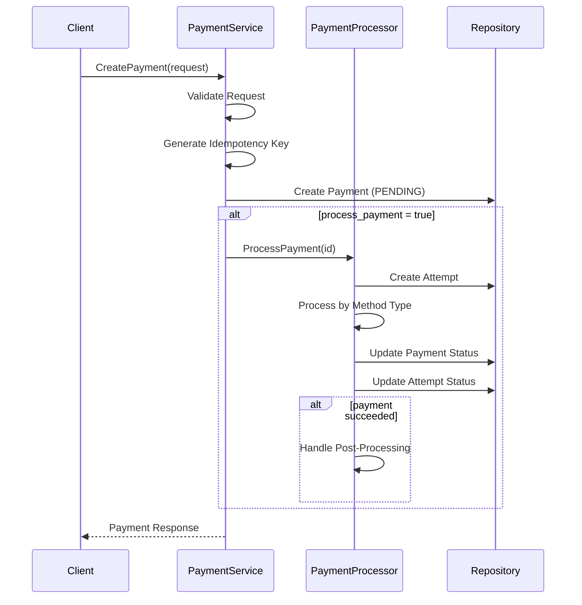
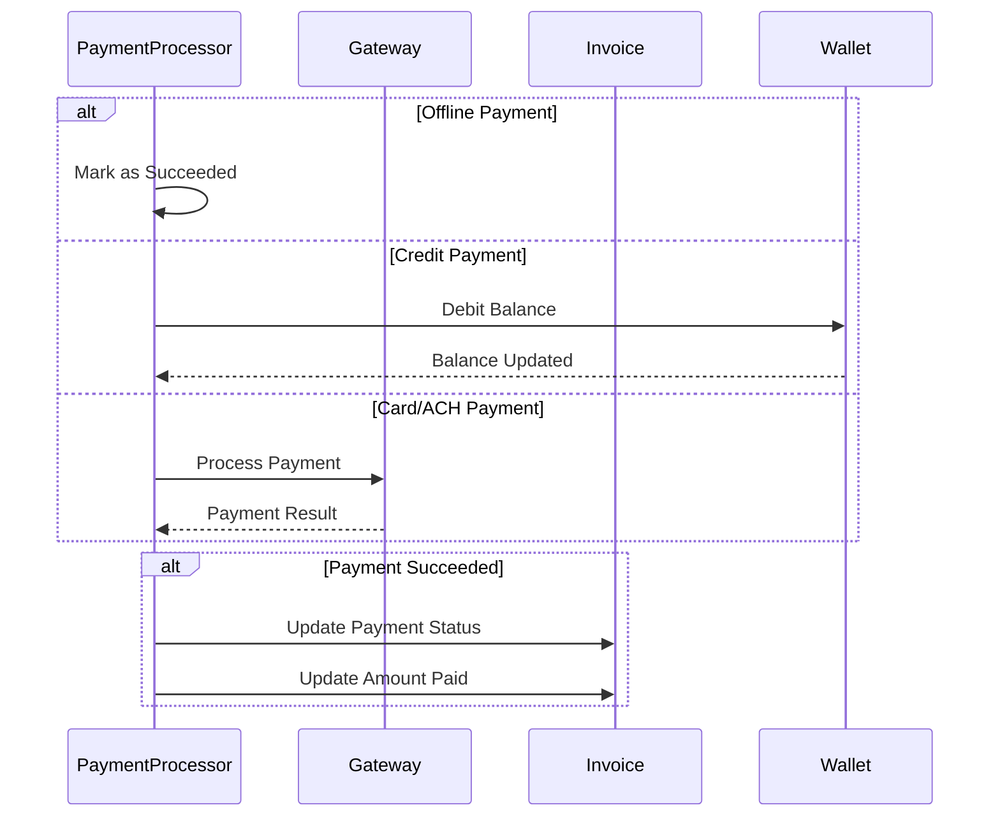
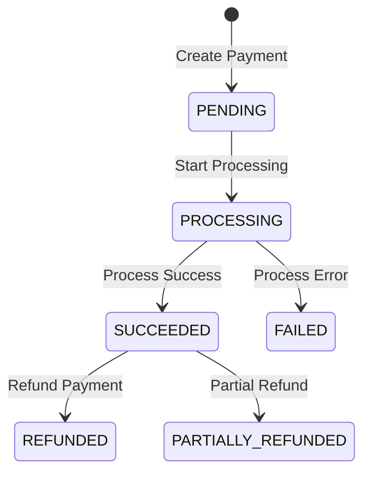

# Payment System Design

## Overview
This document outlines the design and implementation of FlexPrice's payment system, which handles various payment methods and integrates with multiple payment providers while maintaining consistency with invoicing and wallet systems.

## Goals
- Enable multiple payment methods (offline, credits, card, ACH)
- Track payment lifecycle and attempts independently
- Maintain proper reconciliation with invoices and wallet transactions
- Support idempotent payment processing
- Provide detailed payment status tracking and error handling

## Current Implementation

### Payment Methods
1. **Offline/Manual Payments**
   - Record manually processed payments
   - No payment method ID required
   - Automatic success without attempt tracking
   - Manual reconciliation with invoices

2. **Wallet Credits**
   - Use available wallet balance
   - Requires valid wallet ID as payment method ID
   - Full attempt tracking and transaction history
   - Automatic reconciliation with invoices

3. **Card Payments** (Planned)
   - Integration with payment gateways
   - Requires valid card ID as payment method ID
   - Full attempt tracking
   - Webhook handling for status updates

4. **ACH Payments** (Planned)
   - Integration with payment gateways
   - Requires valid bank account ID as payment method ID
   - Full attempt tracking
   - Webhook handling for status updates

### Payment Destinations
1. **Invoices**
   - Support for subscription and one-off invoices
   - Automatic payment status updates
   - Handling of partial payments
   - Currency matching validation

### Core Entities

#### 1. Payment
```sql
CREATE TABLE payments (
    id VARCHAR(50) PRIMARY KEY,
    tenant_id UUID NOT NULL,
    idempotency_key VARCHAR(50) UNIQUE NOT NULL,
    destination_type VARCHAR(50) NOT NULL, -- INVOICE
    destination_id VARCHAR(50) NOT NULL,
    payment_method_type VARCHAR(50) NOT NULL, -- OFFLINE, CREDITS, CARD, ACH
    payment_method_id VARCHAR(50), -- Optional for offline payments
    payment_gateway VARCHAR(50), -- STRIPE, RAZORPAY, null for non-gateway payments
    gateway_payment_id VARCHAR(255), -- External payment ID from gateway
    amount NUMERIC(20,8) NOT NULL,
    currency VARCHAR(10) NOT NULL,
    payment_status VARCHAR(50) NOT NULL, -- PENDING, PROCESSING, SUCCEEDED, FAILED, REFUNDED
    track_attempts BOOLEAN NOT NULL DEFAULT false,
    metadata JSONB,
    succeeded_at TIMESTAMP WITH TIME ZONE,
    failed_at TIMESTAMP WITH TIME ZONE,
    refunded_at TIMESTAMP WITH TIME ZONE,
    error_message TEXT,
    status VARCHAR(20) NOT NULL DEFAULT 'published',
    created_at TIMESTAMP WITH TIME ZONE NOT NULL,
    updated_at TIMESTAMP WITH TIME ZONE NOT NULL,
    created_by VARCHAR(50) NOT NULL,
    updated_by VARCHAR(50) NOT NULL
);

CREATE INDEX idx_payments_tenant_destination ON payments(tenant_id, destination_type, destination_id, payment_status, status);
CREATE INDEX idx_payments_tenant_method ON payments(tenant_id, payment_method_type, payment_method_id, payment_status, status);
CREATE INDEX idx_payments_tenant_gateway ON payments(tenant_id, payment_gateway, gateway_payment_id) WHERE payment_gateway IS NOT NULL;
```

#### 2. PaymentAttempt
```sql
CREATE TABLE payment_attempts (
    id VARCHAR(50) PRIMARY KEY,
    tenant_id UUID NOT NULL,
    payment_id VARCHAR(50) NOT NULL REFERENCES payments(id),
    attempt_number INTEGER NOT NULL,
    payment_status VARCHAR(50) NOT NULL, -- PENDING, PROCESSING, SUCCEEDED, FAILED
    gateway_attempt_id VARCHAR(255),
    error_message TEXT,
    metadata JSONB,
    status VARCHAR(20) NOT NULL DEFAULT 'published',
    created_at TIMESTAMP WITH TIME ZONE NOT NULL,
    updated_at TIMESTAMP WITH TIME ZONE NOT NULL,
    created_by VARCHAR(50) NOT NULL,
    updated_by VARCHAR(50) NOT NULL,
    UNIQUE(payment_id, attempt_number)
);

CREATE INDEX idx_payment_attempts_payment ON payment_attempts(payment_id, status);
CREATE INDEX idx_payment_attempts_gateway ON payment_attempts(gateway_attempt_id) WHERE gateway_attempt_id IS NOT NULL;
```

### Payment Processing Flow

1. **Payment Creation**


2. **Payment Method Processing**


### Payment Status Transitions


### Implementation Details

#### 1. Payment Creation
- Validates destination (e.g., invoice exists and can be paid)
- Generates unique idempotency key
- Sets appropriate tracking flags based on payment method
- Optionally triggers immediate processing

#### 2. Payment Processing
- Creates payment attempt if tracking enabled
- Updates payment status through lifecycle
- Handles method-specific processing logic
- Manages post-processing for successful payments

#### 3. Post-Processing
- Updates invoice payment status and amounts
- Handles partial payments
- Updates related records (e.g., wallet transactions)
- Maintains audit trail through attempts

### API Endpoints

1. **Create Payment**
```http
POST /v1/payments
{
    "destination_type": "INVOICE",
    "destination_id": "inv_123",
    "payment_method_type": "CARD",
    "payment_method_id": "card_123",
    "amount": "100.00",
    "currency": "USD",
    "process_payment": true
}
```

2. **Process Payment**
```http
POST /v1/payments/{id}/process
```

3. **Get Payment**
```http
GET /v1/payments/{id}
```

4. **List Payments**
```http
GET /v1/payments?destination_type=INVOICE&destination_id=inv_123
```

### Future Enhancements

1. **Phase 2: Enhanced Features**
   - Payment method validation rules
   - Advanced retry strategies
   - Payment scheduling
   - Webhook notifications

2. **Phase 3: Advanced Features**
   - Multi-currency support
   - Payment routing rules
   - Fraud detection
   - Advanced reporting