# Flexprice RBAC System

## Document Information
- **Version**: 1.0
- **Last Updated**: October 31, 2025
- **Status**: Draft
- **Owner**: Engineering Team

---

## Table of Contents
1. [Executive Summary](#executive-summary)
2. [Goals and Objectives](#goals-and-objectives)
3. [System Overview](#system-overview)
4. [Data Models](#data-models)
5. [Role Definition System](#role-definition-system)
6. [Workflows](#workflows)
7. [Permission Enforcement](#permission-enforcement)
8. [API Specifications](#api-specifications)
9. [Migration Strategy](#migration-strategy)
10. [Security Considerations](#security-considerations)
11. [Future Enhancements: Permit.io Integration](#future-enhancements-permitio-integration)
12. [Open Questions](#open-questions)

---

## Executive Summary

Flexprice's RBAC (Role-Based Access Control) system introduces fine-grained access control to manage permissions for different types of users and service accounts. This system allows organizations to:

- Create service accounts with limited, role-based permissions
- Maintain backward compatibility with existing users (full access by default)
- Enforce permissions at the API key level
- Scale to support future permission requirements through static role definitions
- Integrate with external authorization systems (Permit.io) in the future

---

## Goals and Objectives

### Primary Goals
1. **Service Account Support**: Enable creation of service accounts with limited permissions for specific operations
2. **Security Enhancement**: Reduce security risk by implementing principle of least privilege
3. **Backward Compatibility**: Ensure existing users and workflows continue to function without changes
4. **Maintainability**: Design a system that is easy to extend with new roles and permissions
5. **Performance**: Minimize overhead in permission checking for high-throughput operations

### Success Metrics
- Zero breaking changes for existing users
- < 5ms latency added for permission checks
- Ability to add new roles without code changes (configuration-based)
- 100% API coverage for permission enforcement

### Non-Goals (Phase 1)
- Dynamic role creation by end users
- Fine-grained object-level permissions
- Role hierarchy or inheritance
- UI for role management
- Audit logging for permission denials (future phase)

---

## System Overview

### Architecture Principles
1. **Static Role Definitions**: Roles are defined in JSON configuration files managed by Flexprice engineering
2. **API Key-Based Enforcement**: Permissions are checked at the API key level, not user level
3. **Fail-Open for Regular Users**: Regular users without roles retain full access
4. **Fail-Closed for Service Accounts**: Service accounts must have explicit roles
5. **Middleware-Based**: Permission checking happens in HTTP middleware layer

### Key Components
```
┌─────────────────────────────────────────────────────────────┐
│                    API Request (with API Key)               │
└───────────────────────────┬─────────────────────────────────┘
                            │
                            ▼
┌─────────────────────────────────────────────────────────────┐
│              Authentication Middleware                      │
│              (Validates API Key)                            │
└───────────────────────────┬─────────────────────────────────┘
                            │
                            ▼
┌─────────────────────────────────────────────────────────────┐
│              Permission Middleware (NEW)                    │
│              1. Fetch user & roles from secrets table       │
│              2. Load role definitions from JSON             │
│              3. Check if action allowed for entity          │
│              4. Return 403 if denied, continue if allowed   │
└───────────────────────────┬─────────────────────────────────┘
                            │
                            ▼
┌─────────────────────────────────────────────────────────────┐
│              Route Handler (Business Logic)                 │
└─────────────────────────────────────────────────────────────┘
```

---

## Data Models

### User Schema Enhancements

#### New Fields for `users` Table

```go
type User struct {
    // ... existing fields ...
    
    // Type defines the category of user account
    // Enum: "user" | "service_account"
    // Default: "user"
    Type string `json:"type" db:"type"`
    
    // Roles is a JSON array of role identifiers assigned to this user
    // Example: ["event_ingestor", "metrics_reader"]
    // Default: [] (empty array)
    Roles []string `json:"roles" db:"roles"`
}
```

#### Field Specifications

| Field | Type | Required | Default | Validation | Description |
|-------|------|----------|---------|------------|-------------|
| `type` | enum(string) | No | `"user"` | Must be "user" or "service_account" | Determines if account is human or automated |
| `roles` | array[string] | No | `[]` | Each role must exist in role definitions | List of roles assigned to user |

### Secrets Schema Enhancements

#### New Fields for `secrets` Table

```go
type Secret struct {
    // ... existing fields ...
    
    // Roles is copied from the user at API key creation time
    // This allows permission checks without joining to users table
    Roles []string `json:"roles" db:"roles"`
    
    // Optional: UserType to distinguish service account keys
    UserType string `json:"user_type" db:"user_type"`
}
```

#### Design Decision: Denormalization
**Why copy roles to secrets table?**
- **Performance**: Permission checks happen on every API request; avoiding JOIN with users table
- **Immutability**: API keys have fixed permissions at creation time (clearer security model)
- **Independence**: API key permissions don't change if user roles are modified later

**Trade-off**: 
- ✅ Faster permission checks
- ❌ Requires regenerating API keys to change permissions
- **Decision**: Accept this trade-off for better performance and clearer security semantics

---

## Role Definition System

### Role Definition File Structure

Roles are defined in a JSON file: `internal/config/rbac/roles.json`

```json
{
  "version": "1.0",
  "roles": {
    "event_ingestor": {
      "name": "Event Ingestor",
      "description": "Service account role for ingesting events into Flexprice",
      "permissions": [
        {
          "entity": "event",
          "actions": ["create", "write"]
        },
        {
          "entity": "batch_event",
          "actions": ["create"]
        }
      ]
    },
    "metrics_reader": {
      "name": "Metrics Reader",
      "description": "Read-only access to metrics and analytics",
      "permissions": [
        {
          "entity": "metrics",
          "actions": ["read", "list"]
        },
        {
          "entity": "analytics",
          "actions": ["read"]
        }
      ]
    },
    "feature_manager": {
      "name": "Feature Manager",
      "description": "Manage feature flags and configurations",
      "permissions": [
        {
          "entity": "feature",
          "actions": ["create", "read", "update", "delete", "list"]
        },
        {
          "entity": "feature_flag",
          "actions": ["create", "read", "update", "toggle"]
        }
      ]
    }
  }
}
```

### Permission Model

#### Entity Definitions
Entities represent resources in the Flexprice system:

| Entity | Description | Example Endpoints |
|--------|-------------|-------------------|
| `event` | Individual events | POST /api/v1/events |
| `batch_event` | Batch event operations | POST /api/v1/events/batch |
| `metrics` | Usage metrics | GET /api/v1/metrics |
| `analytics` | Analytics data | GET /api/v1/analytics |
| `feature` | Feature configurations | /api/v1/features/* |
| `customer` | Customer resources | /api/v1/customers/* |
| `subscription` | Subscription management | /api/v1/subscriptions/* |
| `pricing` | Pricing configurations | /api/v1/pricing/* |
| `api_key` | API key management | /api/v1/secrets/* |

#### Action Definitions
Standard CRUD actions plus custom operations:

| Action | HTTP Methods | Description |
|--------|--------------|-------------|
| `create` | POST | Create new resources |
| `read` | GET (single) | Read single resource |
| `list` | GET (collection) | List/query resources |
| `update` | PUT, PATCH | Modify existing resources |
| `delete` | DELETE | Remove resources |
| `write` | POST, PUT, PATCH | Combined create/update (for event ingestion) |
| `execute` | POST | Execute operations (e.g., calculate pricing) |
| `toggle` | POST | Toggle states (e.g., enable/disable) |

### Endpoint to Entity Mapping

Create a mapping configuration: `internal/config/rbac/endpoint_entity_mapping.json`

```json
{
  "mappings": [
    {
      "pattern": "^/api/v1/events$",
      "method": "POST",
      "entity": "event",
      "action": "write"
    },
    {
      "pattern": "^/api/v1/events/batch$",
      "method": "POST",
      "entity": "batch_event",
      "action": "create"
    },
    {
      "pattern": "^/api/v1/metrics",
      "method": "GET",
      "entity": "metrics",
      "action": "read"
    },
    {
      "pattern": "^/api/v1/features$",
      "method": "GET",
      "entity": "feature",
      "action": "list"
    },
    {
      "pattern": "^/api/v1/features$",
      "method": "POST",
      "entity": "feature",
      "action": "create"
    },
    {
      "pattern": "^/api/v1/features/[^/]+$",
      "method": "GET",
      "entity": "feature",
      "action": "read"
    },
    {
      "pattern": "^/api/v1/features/[^/]+$",
      "method": "PUT",
      "entity": "feature",
      "action": "update"
    },
    {
      "pattern": "^/api/v1/features/[^/]+$",
      "method": "DELETE",
      "entity": "feature",
      "action": "delete"
    }
  ]
}
```

### Role Loading and Caching

```go
type RBACService interface {
    // LoadRoles loads role definitions from JSON file
    LoadRoles() error
    
    // GetRole returns role definition by name
    GetRole(roleName string) (*Role, error)
    
    // CheckPermission checks if roles have permission for entity/action
    CheckPermission(roles []string, entity string, action string) bool
    
    // GetEntityAction maps HTTP request to entity and action
    GetEntityAction(method string, path string) (entity string, action string, err error)
}
```

**Caching Strategy**:
- Load roles once at application startup
- Store in memory (config rarely changes)
- Provide admin endpoint to reload: `POST /internal/rbac/reload` (internal use only)
- Use file watcher for development mode (optional)

---

## Workflows

### Workflow 1: Create User with Type and Roles

#### 1A: Creating Regular User (Default)

```
User: POST /api/v1/users
Request Body:
{
    "email": "user@example.com",
    "name": "John Doe"
    // type not specified → defaults to "user"
    // roles not specified → defaults to []
}

System:
1. Create user with type="user", roles=[]
2. Return user object

Result: User has complete access to all resources
```

#### 1B: Creating Service Account with Roles

```
Admin: POST /api/v1/users
Request Body:
{
    "email": "event-service@example.com",
    "name": "Event Ingestion Service",
    "type": "service_account",
    "roles": ["event_ingestor"]
}

System:
1. Validate type is "service_account"
2. Validate roles is non-empty (required for service accounts)
3. Validate each role exists in role definitions
4. Create user with specified type and roles
5. Return user object

Result: Service account limited to event ingestion permissions
```

#### Validation Rules

| Rule | Condition | Error Message |
|------|-----------|---------------|
| R1 | `type == "service_account" && len(roles) == 0` | "Service accounts must have at least one role assigned" |
| R2 | `role not in role_definitions` | "Invalid role: {role}. Available roles: [list]" |
| R3 | `type not in ["user", "service_account"]` | "Invalid type. Must be 'user' or 'service_account'" |

### Workflow 2: Create API Key with Permission Inheritance

#### 2A: Create API Key for Current User (No user_id param)

```
User: POST /api/v1/secrets
Request Body:
{
    "name": "Production API Key"
    // user_id not specified
}

System:
1. Extract user_id from JWT/session context
2. Fetch user object from database
3. Create API key with:
   - user_id = context.user_id
   - roles = user.roles (copy from user)
   - user_type = user.type
4. Generate and return API key

Result: API key inherits permissions from the user who created it
```

#### 2B: Create API Key for Service Account (user_id param provided)

```
Admin: POST /api/v1/secrets
Request Body:
{
    "name": "Event Ingestion Key",
    "user_id": "service_account_123"
}

System:
1. Validate user_id parameter
2. Fetch user object by user_id
3. Validate user exists and type == "service_account"
4. Create API key with:
   - user_id = request.user_id
   - roles = user.roles (copy from service account)
   - user_type = "service_account"
5. Generate and return API key

Result: API key has limited permissions based on service account roles
```

#### Authorization Rules

| Scenario | Allowed? | Notes |
|----------|----------|-------|
| Regular user creates key for themselves | ✅ | Default behavior |
| Regular user creates key for another user | ❌ | Requires admin privileges |
| Admin creates key for any user/service account | ✅ | Admin bypass |
| Service account creates key for themselves | ⚠️ | Design decision needed |

**Recommendation**: Service accounts should NOT be able to create new API keys (prevents privilege escalation).

### Workflow 3: API Request with Permission Enforcement

```
Client: GET /api/v1/features
Headers:
  Authorization: Bearer {api_key}

System Flow:

1. Authentication Middleware:
   ├─ Extract API key from Authorization header
   ├─ Query secrets table for key
   ├─ If not found → 401 Unauthorized
   └─ If found → Load secret object (includes roles)

2. Permission Middleware (NEW):
   ├─ Check if roles array is empty
   │  ├─ If empty → ALLOW (full access)
   │  └─ If not empty → Continue to permission check
   │
   ├─ Map endpoint to entity/action
   │  └─ GET /api/v1/features → entity="feature", action="list"
   │
   ├─ Check permissions
   │  ├─ For each role in user.roles:
   │  │  └─ Check if role has permission for (entity, action)
   │  ├─ If any role grants permission → ALLOW
   │  └─ If no role grants permission → 403 Forbidden
   │
   └─ Return result

3. Route Handler:
   └─ Execute business logic

Response:
- 200 OK (with data) if permission granted
- 403 Forbidden if permission denied
```

#### Permission Check Algorithm

```go
func CheckPermission(userRoles []string, entity string, action string) (bool, error) {
    // Empty roles = full access (backward compatibility)
    if len(userRoles) == 0 {
        return true, nil
    }
    
    // Load role definitions
    roleDefinitions := loadRoleDefinitions()
    
    // Check each role
    for _, roleName := range userRoles {
        role, exists := roleDefinitions[roleName]
        if !exists {
            log.Warn("Unknown role: %s", roleName)
            continue
        }
        
        // Check if role has permission
        for _, permission := range role.Permissions {
            if permission.Entity == entity {
                for _, allowedAction := range permission.Actions {
                    if allowedAction == action {
                        return true, nil // Permission granted
                    }
                }
            }
        }
    }
    
    // No role granted permission
    return false, nil
}
```

### Workflow 4: Managing Service Account Lifecycle

#### Update Service Account Roles

```
Admin: PATCH /api/v1/users/{user_id}
Request Body:
{
    "roles": ["event_ingestor", "metrics_reader"]
}

System:
1. Validate user_id exists and type == "service_account"
2. Validate all roles exist in definitions
3. Update user.roles in database
4. Return updated user object

⚠️ Important: Existing API keys are NOT updated
Users must regenerate API keys to apply new permissions
```

#### Regenerate API Key with New Permissions

```
Workflow:
1. User updates service account roles
2. User deletes old API key(s): DELETE /api/v1/secrets/{key_id}
3. User creates new API key: POST /api/v1/secrets
4. New key inherits updated roles from service account
5. User updates API key in their service/application
```

---

## Permission Enforcement

### Middleware Implementation

#### Permission Middleware Structure

```go
// PermissionMiddleware checks if the request is authorized based on RBAC
func PermissionMiddleware(rbacService *RBACService) gin.HandlerFunc {
    return func(c *gin.Context) {
        // 1. Get secret from context (set by auth middleware)
        secret, exists := c.Get("secret")
        if !exists {
            c.AbortWithStatusJSON(401, gin.H{"error": "Unauthorized"})
            return
        }
        
        secretObj := secret.(*Secret)
        
        // 2. Empty roles = full access (backward compatibility)
        if len(secretObj.Roles) == 0 {
            c.Next()
            return
        }
        
        // 3. Map request to entity/action
        entity, action, err := rbacService.GetEntityAction(
            c.Request.Method,
            c.Request.URL.Path,
        )
        if err != nil {
            // Endpoint not mapped → default deny for service accounts
            log.Warn("Unmapped endpoint: %s %s", c.Request.Method, c.Request.URL.Path)
            c.AbortWithStatusJSON(403, gin.H{
                "error": "Forbidden",
                "message": "Access to this endpoint is not permitted",
            })
            return
        }
        
        // 4. Check permission
        allowed := rbacService.CheckPermission(secretObj.Roles, entity, action)
        if !allowed {
            log.Info("Permission denied: user=%s, roles=%v, entity=%s, action=%s",
                secretObj.UserID, secretObj.Roles, entity, action)
            
            c.AbortWithStatusJSON(403, gin.H{
                "error": "Forbidden",
                "message": fmt.Sprintf("Insufficient permissions to %s %s", action, entity),
            })
            return
        }
        
        // 5. Permission granted, continue
        c.Next()
    }
}
```

#### Middleware Registration

```go
// In router setup
func SetupRouter(rbacService *RBACService) *gin.Engine {
    r := gin.Default()
    
    api := r.Group("/api/v1")
    {
        // Authentication middleware (existing)
        api.Use(AuthMiddleware())
        
        // Permission middleware (NEW)
        api.Use(PermissionMiddleware(rbacService))
        
        // Routes
        api.POST("/events", handleCreateEvent)
        api.GET("/features", handleListFeatures)
        // ... more routes
    }
    
    return r
}
```

### Error Responses

#### 403 Forbidden Response Format

```json
{
  "error": "Forbidden",
  "message": "Insufficient permissions to create feature",
  "details": {
    "required_permission": {
      "entity": "feature",
      "action": "create"
    },
    "user_roles": ["event_ingestor"]
  }
}
```

**Design Decision**: Include permission details in error response?
- ✅ **Recommended**: Include details (helps debugging for developers)
- Include `details` only in development/staging environments
- In production, provide generic "Forbidden" message to avoid information leakage

### Bypassing Permission Checks

#### Internal/Admin Endpoints

Some endpoints should bypass permission checks:
- Internal health checks: `/health`, `/metrics`
- Admin console endpoints (require different auth)
- Public endpoints (no auth required)

```go
// Exempt endpoints from permission checks
var exemptPaths = map[string]bool{
    "/health": true,
    "/metrics": true,
    "/api/internal/*": true,
}

func PermissionMiddleware(rbacService *RBACService) gin.HandlerFunc {
    return func(c *gin.Context) {
        // Check if path is exempt
        if isExemptPath(c.Request.URL.Path) {
            c.Next()
            return
        }
        
        // ... permission checking logic
    }
}
```

---

## API Specifications

### User Management APIs

#### Create User

```http
POST /api/v1/users
Content-Type: application/json
Authorization: Bearer {admin_token}

Request Body:
{
  "email": "string",
  "name": "string",
  "type": "user | service_account",  // Optional, default: "user"
  "roles": ["string"]                 // Optional, default: []
}

Response: 201 Created
{
  "id": "user_123",
  "email": "event-service@example.com",
  "name": "Event Ingestion Service",
  "type": "service_account",
  "roles": ["event_ingestor"],
  "created_at": "2025-10-31T10:00:00Z"
}

Errors:
- 400 Bad Request: Invalid type or roles
- 422 Unprocessable Entity: Service account without roles
```

#### Update User Roles

```http
PATCH /api/v1/users/{user_id}
Content-Type: application/json
Authorization: Bearer {admin_token}

Request Body:
{
  "roles": ["event_ingestor", "metrics_reader"]
}

Response: 200 OK
{
  "id": "user_123",
  "email": "event-service@example.com",
  "name": "Event Ingestion Service",
  "type": "service_account",
  "roles": ["event_ingestor", "metrics_reader"],
  "updated_at": "2025-10-31T11:00:00Z"
}

Errors:
- 404 Not Found: User not found
- 400 Bad Request: Invalid roles
```

#### Get User

```http
GET /api/v1/users/{user_id}
Authorization: Bearer {token}

Response: 200 OK
{
  "id": "user_123",
  "email": "event-service@example.com",
  "name": "Event Ingestion Service",
  "type": "service_account",
  "roles": ["event_ingestor"],
  "created_at": "2025-10-31T10:00:00Z"
}
```

#### List Available Roles

```http
GET /api/v1/rbac/roles
Authorization: Bearer {admin_token}

Response: 200 OK
{
  "roles": [
    {
      "id": "event_ingestor",
      "name": "Event Ingestor",
      "description": "Service account role for ingesting events",
      "permissions": [
        {
          "entity": "event",
          "actions": ["create", "write"]
        }
      ]
    },
    {
      "id": "metrics_reader",
      "name": "Metrics Reader",
      "description": "Read-only access to metrics",
      "permissions": [
        {
          "entity": "metrics",
          "actions": ["read", "list"]
        }
      ]
    }
  ]
}
```

### API Key Management

#### Create API Key

```http
POST /api/v1/secrets
Content-Type: application/json
Authorization: Bearer {token}

Request Body:
{
  "name": "string",
  "user_id": "string"  // Optional: if provided, creates key for that user
}

Response: 201 Created
{
  "id": "key_123",
  "name": "Production Key",
  "user_id": "user_123",
  "api_key": "fp_live_xxxxxxxxxxxxxx",  // Only returned once
  "roles": ["event_ingestor"],
  "created_at": "2025-10-31T10:00:00Z"
}

Note: api_key is only returned in creation response. Store securely.
```

#### List API Keys

```http
GET /api/v1/secrets
Authorization: Bearer {token}

Response: 200 OK
{
  "secrets": [
    {
      "id": "key_123",
      "name": "Production Key",
      "user_id": "user_123",
      "roles": ["event_ingestor"],
      "last_used": "2025-10-31T09:00:00Z",
      "created_at": "2025-10-31T08:00:00Z"
      // Note: api_key value is NOT included in list
    }
  ]
}
```

#### Delete API Key

```http
DELETE /api/v1/secrets/{key_id}
Authorization: Bearer {token}

Response: 204 No Content
```

### Internal/Admin APIs

#### Reload RBAC Configuration

```http
POST /internal/rbac/reload
Authorization: Bearer {internal_token}

Response: 200 OK
{
  "message": "RBAC configuration reloaded successfully",
  "roles_loaded": 3,
  "endpoints_mapped": 25
}
```

---

## Migration Strategy

### Phase 1: Database Schema Migrations

#### Migration 1: Add Fields to Users Table

```sql
-- Migration: 001_add_rbac_to_users.up.sql

-- Add type column
ALTER TABLE users ADD COLUMN type VARCHAR(50) DEFAULT 'user' NOT NULL;

-- Add roles column (JSON array)
ALTER TABLE users ADD COLUMN roles JSONB DEFAULT '[]'::jsonb NOT NULL;

-- Add indexes for performance
CREATE INDEX idx_users_type ON users(type);
CREATE INDEX idx_users_roles ON users USING GIN (roles);

-- Add check constraint
ALTER TABLE users ADD CONSTRAINT check_user_type 
    CHECK (type IN ('user', 'service_account'));

COMMENT ON COLUMN users.type IS 'User account type: user or service_account';
COMMENT ON COLUMN users.roles IS 'Array of role identifiers assigned to user';
```

```sql
-- Migration: 001_add_rbac_to_users.down.sql

DROP INDEX IF EXISTS idx_users_roles;
DROP INDEX IF EXISTS idx_users_type;

ALTER TABLE users DROP CONSTRAINT IF EXISTS check_user_type;
ALTER TABLE users DROP COLUMN IF EXISTS roles;
ALTER TABLE users DROP COLUMN IF EXISTS type;
```

#### Migration 2: Add Fields to Secrets Table

```sql
-- Migration: 002_add_rbac_to_secrets.up.sql

-- Add roles column (denormalized from users)
ALTER TABLE secrets ADD COLUMN roles JSONB DEFAULT '[]'::jsonb NOT NULL;

-- Add user_type column (optional, for faster lookups)
ALTER TABLE secrets ADD COLUMN user_type VARCHAR(50) DEFAULT 'user' NOT NULL;

-- Add index
CREATE INDEX idx_secrets_roles ON secrets USING GIN (roles);

COMMENT ON COLUMN secrets.roles IS 'Roles copied from user at key creation time';
COMMENT ON COLUMN secrets.user_type IS 'User type copied from user at key creation time';
```

```sql
-- Migration: 002_add_rbac_to_secrets.down.sql

DROP INDEX IF EXISTS idx_secrets_roles;
ALTER TABLE secrets DROP COLUMN IF EXISTS user_type;
ALTER TABLE secrets DROP COLUMN IF EXISTS roles;
```

### Phase 2: Backward Compatibility Data Migration

#### Backfill Existing Data

```sql
-- Backfill existing users with default values
UPDATE users 
SET type = 'user', 
    roles = '[]'::jsonb 
WHERE type IS NULL OR roles IS NULL;

-- Backfill existing secrets with empty roles
UPDATE secrets 
SET roles = '[]'::jsonb,
    user_type = 'user'
WHERE roles IS NULL;
```

**Verification Query**:
```sql
-- Check all users have valid types
SELECT COUNT(*) FROM users WHERE type NOT IN ('user', 'service_account');
-- Expected: 0

-- Check all secrets have roles field
SELECT COUNT(*) FROM secrets WHERE roles IS NULL;
-- Expected: 0
```

### Phase 3: Code Deployment

#### Deployment Steps

1. **Deploy Schema Changes**
   - Run migrations on staging
   - Verify all tables updated correctly
   - Run backfill scripts
   - Run migrations on production

2. **Deploy Application Code (Feature Flag OFF)**
   - Deploy new code with RBAC feature flag disabled
   - Update ORM models to include new fields
   - Verify no errors in logs
   - Monitor for 24 hours

3. **Enable Feature Flag Gradually**
   - Enable for internal testing (1%)
   - Enable for staging environment (100%)
   - Enable for production (10% → 50% → 100%)

4. **Monitoring**
   - Track permission check latency
   - Monitor 403 error rates
   - Alert on unexpected permission denials

### Rollback Plan

If issues are detected:

1. **Disable Feature Flag** (Immediate - 0 downtime)
   ```
   Set RBAC_ENABLED=false
   Restart services
   ```

2. **Rollback Code** (if necessary)
   ```
   Deploy previous version
   ```

3. **Rollback Database** (last resort - requires downtime)
   ```
   Run down migrations
   May require data recovery if service accounts were created
   ```

---

## Security Considerations

### Threat Model

#### Threat 1: Privilege Escalation via API Key Creation

**Scenario**: Service account creates API key for itself with broader permissions

**Mitigation**:
- Service accounts CANNOT create API keys (enforced by permission check)
- Only admins or regular users can create keys
- API keys inherit permissions from user at creation time (immutable)

#### Threat 2: Role Definition Tampering

**Scenario**: Attacker modifies role definitions JSON file

**Mitigation**:
- Role definition files stored in source control
- File permissions restricted (read-only for application process)
- Configuration reloading requires admin authentication
- Audit log for configuration changes

#### Threat 3: Permission Check Bypass

**Scenario**: Bug in middleware allows bypassing permission checks

**Mitigation**:
- Fail-closed by default (deny if error occurs)
- Comprehensive unit tests for permission logic
- Integration tests covering all endpoints
- Regular security audits of middleware code

#### Threat 4: Token Theft

**Scenario**: Service account API key is stolen

**Mitigation**:
- API keys have limited permissions (RBAC)
- Implement rate limiting per key
- Monitor for unusual activity patterns
- Ability to immediately revoke compromised keys
- Recommend key rotation policies

### Security Best Practices

#### For Developers

1. **Never skip permission checks** - All authenticated endpoints must have permission middleware
2. **Fail closed** - If permission check errors, deny access
3. **Log permission denials** - Log all 403 responses for audit
4. **Validate role definitions** - Unit tests for all role configurations
5. **Least privilege** - Create minimal roles with only required permissions

#### For Operations

1. **Rotate service account keys** - Recommended: 90 day rotation
2. **Monitor 403 errors** - Alert on spikes (potential attack or misconfiguration)
3. **Regular access reviews** - Quarterly review of service account permissions
4. **Secure role definitions** - Protect role JSON files with restrictive permissions
5. **Audit logging** - Log all permission changes and denials

### Compliance Considerations

#### Audit Requirements

For compliance (SOC2, ISO 27001, etc.), maintain:

1. **Access logs**: Who accessed what resources and when
2. **Change logs**: Who modified user roles and permissions
3. **Denial logs**: All 403 permission denials with context
4. **Key creation logs**: Track API key lifecycle

**Implementation**: Consider integrating with centralized logging (ELK, Splunk) for audit trail.

---

## Future Enhancements: Permit.io Integration

### Overview

Permit.io is a cloud-based authorization service that provides:
- Dynamic policy management UI
- Fine-grained attribute-based access control (ABAC)
- ReBAC (Relationship-Based Access Control)
- Audit logs and compliance features

### Integration Design

#### Configuration

```yaml
# config.yaml
rbac:
  provider: "static"  # Options: "static", "permit"
  
  static:
    roles_file: "internal/config/rbac/roles.json"
    
  permit:
    enabled: false
    api_key: "${PERMIT_API_KEY}"
    environment: "production"
    pdp_url: "https://cloudpdp.api.permit.io"
```

```bash
# Environment variable
export FLEXPRICE_PERMIT_INTEGRATION=true
export PERMIT_API_KEY="permit_key_xxxxx"
```

### Workflow Changes with Permit

#### Create Service Account with Permit Integration

```
Admin: POST /api/v1/users
Request Body:
{
    "email": "service@example.com",
    "name": "Service Account",
    "type": "service_account",
    "roles": ["event_ingestor"]
}

System Logic:
1. Check if Permit integration is enabled
   
   IF permit.enabled == false:
       - Use static role definitions
       - Validate roles against roles.json
       - Create user in local database
   
   IF permit.enabled == true:
       - Fetch available roles from Permit API
       - Validate roles against Permit roles
       - Create user in local database
       - Sync user to Permit (create user resource)
       - Assign roles in Permit

2. Return user object
```

#### Permission Check with Permit

```go
func (s *RBACService) CheckPermission(roles []string, entity string, action string) bool {
    if s.config.Permit.Enabled {
        // Use Permit for permission check
        return s.permitClient.Check(context.Background(), permit.CheckRequest{
            User: s.currentUser,
            Action: action,
            Resource: entity,
        })
    } else {
        // Use static role definitions
        return s.checkStaticPermissions(roles, entity, action)
    }
}
```

### Hybrid Mode (Recommended Approach)

**Fallback Strategy**: Use static roles as fallback if Permit is unavailable

```go
func (s *RBACService) CheckPermission(roles []string, entity string, action string) bool {
    if s.config.Permit.Enabled {
        // Try Permit first
        allowed, err := s.permitClient.Check(...)
        if err != nil {
            log.Error("Permit check failed, falling back to static: %v", err)
            return s.checkStaticPermissions(roles, entity, action)
        }
        return allowed
    }
    
    // Permit not enabled, use static
    return s.checkStaticPermissions(roles, entity, action)
}
```

### Migration Path to Permit

#### Phase 1: Dual Mode (Static + Permit)
- Run both systems in parallel
- Log differences between static and Permit decisions
- Analyze logs for inconsistencies
- Fix configuration mismatches

#### Phase 2: Permit Primary with Static Fallback
- Use Permit for permission checks
- Fallback to static on errors
- Monitor Permit SLA and latency

#### Phase 3: Permit Only (Optional)
- Remove static role definitions
- All role management through Permit UI
- Deprecate local role files

### Permit Integration Benefits

1. **Dynamic Policy Management**: Update permissions without code deployment
2. **UI for Role Management**: Non-technical users can manage roles
3. **Advanced Features**: Attribute-based policies, relationship-based access
4. **Compliance**: Built-in audit logs and approval workflows
5. **Multi-tenancy**: Easier to implement customer-specific permissions

### Permit Integration Risks

1. **External Dependency**: Service availability depends on Permit uptime
2. **Latency**: Additional network hop for every permission check
3. **Cost**: Permit charges per user/check (evaluate pricing)
4. **Complexity**: Another system to learn and maintain
5. **Data Residency**: User/permission data stored externally

**Recommendation**: Start with static roles, migrate to Permit only when:
- Need for dynamic role management becomes critical
- Support team needs self-service role assignment
- Require advanced features (ABAC, ReBAC)

---

## Implementation Checklist

### Database Changes
- [ ] Create migration for users table (type, roles)
- [ ] Create migration for secrets table (roles, user_type)
- [ ] Run migrations on staging
- [ ] Test backward compatibility
- [ ] Run migrations on production

### Role Definition System
- [ ] Create `internal/config/rbac/` directory
- [ ] Create `roles.json` with initial roles
- [ ] Create `endpoint_entity_mapping.json`
- [ ] Implement role loader service
- [ ] Add unit tests for role definitions

### Permission Middleware
- [ ] Implement `PermissionMiddleware` function
- [ ] Implement `GetEntityAction` mapping logic
- [ ] Implement `CheckPermission` algorithm
- [ ] Add middleware to router
- [ ] Handle exempt paths

### API Endpoints
- [ ] Update `POST /api/v1/users` to accept type and roles
- [ ] Update `PATCH /api/v1/users/{id}` to update roles
- [ ] Update `POST /api/v1/secrets` to copy roles from user
- [ ] Create `GET /api/v1/rbac/roles` endpoint
- [ ] Create `POST /internal/rbac/reload` endpoint

### Testing
- [ ] Unit tests for permission checking logic
- [ ] Unit tests for role loading
- [ ] Integration tests for each endpoint
- [ ] Test service account creation
- [ ] Test API key inheritance
- [ ] Test permission denial (403)
- [ ] Test backward compatibility (empty roles)
- [ ] Load test permission middleware

### Documentation
- [ ] API documentation (OpenAPI/Swagger)
- [ ] Developer guide for adding new roles
- [ ] Runbook for permission issues
- [ ] Security documentation
- [ ] User guide for service accounts

### Monitoring & Observability
- [ ] Add metrics: permission_check_duration_ms
- [ ] Add metrics: permission_denied_total (by entity, action)
- [ ] Add logs for permission denials
- [ ] Add alerts for unusual 403 rates
- [ ] Dashboard for RBAC metrics

### Deployment
- [ ] Feature flag for RBAC system
- [ ] Gradual rollout plan
- [ ] Rollback procedures documented
- [ ] Smoke tests for production
- [ ] Communication plan for users

---

## Open Questions

### Technical Decisions

1. **Role Hierarchy**: Should we support role inheritance (e.g., "admin" includes "metrics_reader")?
   - **Status**: Deferred to Phase 2
   - **Recommendation**: Start simple without hierarchy

2. **Wildcard Permissions**: Should we support wildcards (e.g., `entity: "*"` for admin)?
   - **Status**: Under consideration
   - **Proposal**: Add "admin" role with all permissions

3. **Per-Organization Roles**: Can roles differ per organization/tenant?
   - **Status**: Deferred to multi-tenancy implementation
   - **Current**: Global roles across all organizations

4. **API Key Expiration**: Should service account keys auto-expire?
   - **Status**: Deferred to Phase 2
   - **Recommendation**: Add expiration_date field later

### Process & Workflow

5. **Service Account Key Rotation**: What's the recommended rotation policy?
   - **Proposal**: 90 days, with warnings at 60 days
   - **Need**: Automated rotation mechanism?

6. **Permission Denial Communication**: How do we inform users about missing permissions?
   - **Current**: 403 error with message
   - **Future**: Suggest required role in error message

7. **Admin Management**: Who can create/modify service accounts?
   - **Proposal**: Organization admins + Flexprice superadmins
   - **Need**: Define admin role/permissions

### Permit Integration

8. **Permit Timing**: When should we integrate Permit?
   - **Recommendation**: After 3-6 months of static RBAC
   - **Trigger**: When manual role management becomes bottleneck

9. **Permit Features**: Which Permit features do we need?
   - **Phase 1**: Basic RBAC
   - **Phase 2**: ABAC (attribute-based)
   - **Phase 3**: ReBAC (relationship-based)

10. **Permit Cost**: What's the expected cost impact?
    - **Need**: Estimate based on user count and API call volume
    - **Action**: Get quote from Permit sales

---

## Success Criteria

### Phase 1 Launch (Static RBAC)

#### Functionality
- ✅ Service accounts can be created with roles
- ✅ API keys inherit permissions from users
- ✅ Permission middleware enforces access control
- ✅ Backward compatibility maintained (existing users unaffected)
- ✅ At least 3 roles defined and working

#### Performance
- ✅ Permission check latency < 5ms (p99)
- ✅ No increase in overall API latency > 10ms
- ✅ System handles 10,000 permission checks/second

#### Security
- ✅ No bypasses found in security audit
- ✅ Service accounts properly restricted
- ✅ All endpoints have permission checks

#### Quality
- ✅ Test coverage > 85% for RBAC code
- ✅ Zero critical bugs in first 2 weeks
- ✅ Documentation complete and accurate

### Phase 2 (Permit Integration - Optional)

- ✅ Permit integration working with fallback to static
- ✅ All roles migrated to Permit
- ✅ Permission check latency still < 10ms (p99)
- ✅ 99.9% uptime with Permit dependency

---

## Appendix

### Example Role Definitions

#### Comprehensive roles.json

```json
{
  "version": "1.0",
  "last_updated": "2025-10-31",
  "roles": {
    "event_ingestor": {
      "name": "Event Ingestor",
      "description": "Limited to ingesting events and batch events",
      "permissions": [
        {"entity": "event", "actions": ["create", "write"]},
        {"entity": "batch_event", "actions": ["create"]}
      ]
    },
    "metrics_reader": {
      "name": "Metrics Reader",
      "description": "Read-only access to metrics and analytics",
      "permissions": [
        {"entity": "metrics", "actions": ["read", "list"]},
        {"entity": "analytics", "actions": ["read"]},
        {"entity": "dashboard", "actions": ["read"]}
      ]
    },
    "feature_manager": {
      "name": "Feature Manager",
      "description": "Full access to feature flags and configurations",
      "permissions": [
        {"entity": "feature", "actions": ["create", "read", "update", "delete", "list"]},
        {"entity": "feature_flag", "actions": ["create", "read", "update", "toggle", "delete"]}
      ]
    },
    "billing_reader": {
      "name": "Billing Reader",
      "description": "Read-only access to invoices and subscriptions",
      "permissions": [
        {"entity": "invoice", "actions": ["read", "list"]},
        {"entity": "subscription", "actions": ["read", "list"]},
        {"entity": "payment", "actions": ["read", "list"]}
      ]
    },
    "pricing_admin": {
      "name": "Pricing Admin",
      "description": "Manage pricing models and calculations",
      "permissions": [
        {"entity": "pricing", "actions": ["create", "read", "update", "delete", "execute"]},
        {"entity": "pricing_model", "actions": ["create", "read", "update", "delete"]},
        {"entity": "pricing_calculation", "actions": ["execute", "read"]}
      ]
    },
    "customer_support": {
      "name": "Customer Support",
      "description": "Read customer data and limited modification",
      "permissions": [
        {"entity": "customer", "actions": ["read", "list", "update"]},
        {"entity": "subscription", "actions": ["read", "list", "update"]},
        {"entity": "invoice", "actions": ["read", "list"]},
        {"entity": "support_ticket", "actions": ["create", "read", "update", "list"]}
      ]
    },
    "api_key_manager": {
      "name": "API Key Manager",
      "description": "Manage API keys and secrets",
      "permissions": [
        {"entity": "api_key", "actions": ["create", "read", "delete", "list"]},
        {"entity": "secret", "actions": ["create", "read", "delete", "list"]}
      ]
    }
  }
}
```

### Code Examples

#### Complete Permission Middleware

```go
package middleware

import (
    "fmt"
    "net/http"
    
    "github.com/gin-gonic/gin"
    "flexprice/internal/service"
)

func PermissionMiddleware(rbacService *service.RBACService) gin.HandlerFunc {
    return func(c *gin.Context) {
        // Skip for exempt paths
        if isExemptPath(c.Request.URL.Path) {
            c.Next()
            return
        }
        
        // Get secret from context (set by auth middleware)
        secretInterface, exists := c.Get("secret")
        if !exists {
            c.AbortWithStatusJSON(http.StatusUnauthorized, gin.H{
                "error": "Unauthorized",
            })
            return
        }
        
        secret, ok := secretInterface.(*models.Secret)
        if !ok {
            c.AbortWithStatusJSON(http.StatusInternalServerError, gin.H{
                "error": "Internal server error",
            })
            return
        }
        
        // Empty roles = full access (backward compatibility)
        if len(secret.Roles) == 0 {
            c.Next()
            return
        }
        
        // Map request to entity/action
        entity, action, err := rbacService.GetEntityAction(
            c.Request.Method,
            c.Request.URL.Path,
        )
        if err != nil {
            // Unmapped endpoint - deny for service accounts
            logPermissionDenial(c, secret, "", "", "unmapped_endpoint")
            c.AbortWithStatusJSON(http.StatusForbidden, gin.H{
                "error": "Forbidden",
                "message": "Access to this endpoint is not configured",
            })
            return
        }
        
        // Check permission
        allowed, err := rbacService.CheckPermission(secret.Roles, entity, action)
        if err != nil {
            // Error checking permissions - fail closed
            logPermissionError(c, secret, entity, action, err)
            c.AbortWithStatusJSON(http.StatusForbidden, gin.H{
                "error": "Forbidden",
                "message": "Unable to verify permissions",
            })
            return
        }
        
        if !allowed {
            // Permission denied
            logPermissionDenial(c, secret, entity, action, "insufficient_permissions")
            c.AbortWithStatusJSON(http.StatusForbidden, gin.H{
                "error": "Forbidden",
                "message": fmt.Sprintf("Insufficient permissions to %s %s", action, entity),
                "details": gin.H{
                    "required_permission": gin.H{
                        "entity": entity,
                        "action": action,
                    },
                    "user_roles": secret.Roles,
                },
            })
            return
        }
        
        // Permission granted
        c.Next()
    }
}

func isExemptPath(path string) bool {
    exemptPaths := []string{
        "/health",
        "/metrics",
        "/api/internal/",
    }
    
    for _, exempt := range exemptPaths {
        if strings.HasPrefix(path, exempt) {
            return true
        }
    }
    return false
}

func logPermissionDenial(c *gin.Context, secret *models.Secret, entity, action, reason string) {
    log.WithFields(log.Fields{
        "user_id": secret.UserID,
        "roles": secret.Roles,
        "entity": entity,
        "action": action,
        "reason": reason,
        "path": c.Request.URL.Path,
        "method": c.Request.Method,
        "ip": c.ClientIP(),
    }).Warn("Permission denied")
}
```

---

## Glossary

| Term | Definition |
|------|------------|
| **RBAC** | Role-Based Access Control - permission model based on user roles |
| **Service Account** | Non-human user account used by services/applications |
| **Role** | Named collection of permissions |
| **Permission** | Ability to perform an action on an entity |
| **Entity** | Resource in the system (e.g., event, feature, customer) |
| **Action** | Operation on an entity (e.g., create, read, update, delete) |
| **API Key** | Authentication token used to access Flexprice APIs |
| **Static Role** | Role defined in configuration file (not in database) |
| **Dynamic Role** | Role defined through UI or API (stored in database/Permit) |
| **Fail-Open** | Default to allow access on error |
| **Fail-Closed** | Default to deny access on error |
| **Denormalization** | Copying data to avoid JOIN queries (performance optimization) |

---

## Document Change Log

| Version | Date | Author | Changes |
|---------|------|--------|---------|
| 1.0 | 2025-10-31 | Engineering Team | Initial draft based on design specifications |

---

## Feedback and Iterations

This is a living document. Please provide feedback on:
- Missing requirements or edge cases
- Security concerns
- Implementation complexity
- Timeline estimates
- Integration challenges

**Next Review Date**: 2025-11-07

---

## References

- [NIST RBAC Model](https://csrc.nist.gov/projects/role-based-access-control)
- [OWASP Access Control Cheat Sheet](https://cheatsheetseries.owasp.org/cheatsheets/Access_Control_Cheat_Sheet.html)
- [Permit.io Documentation](https://docs.permit.io/)
- [The Principle of Least Privilege](https://en.wikipedia.org/wiki/Principle_of_least_privilege)

---

## Visual Diagrams & Flowcharts

This section provides visual representations of the RBAC system architecture, workflows, and data models to aid understanding and implementation.

### Diagram 1: System Architecture Overview

**Description**: This diagram shows the high-level architecture of the Flexprice RBAC system, including how API requests flow through authentication, permission checks, and into business logic. It illustrates the relationship between users, API keys, role definitions, and the permission enforcement layer.

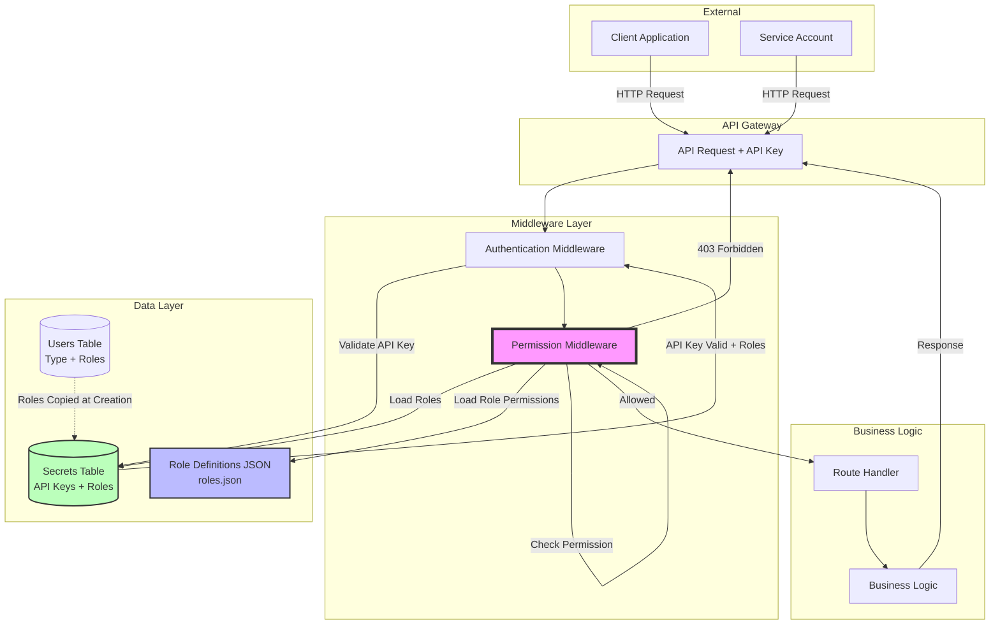

---

### Diagram 2: Data Model & Relationships

**Description**: Entity-Relationship diagram showing the database schema changes for RBAC, including the new fields in Users and Secrets tables, and their relationships. This illustrates how roles are denormalized from Users to Secrets for performance.

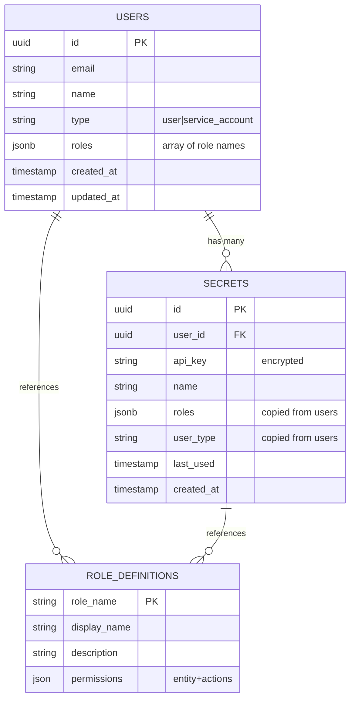

---

### Diagram 3: User Creation Workflow

**Description**: Complete workflow for creating users, showing the decision tree based on user type and the validation rules applied. This covers both regular users and service accounts with their different role requirements.


---

### Diagram 4: API Key Creation Workflow

**Description**: Shows how API keys are created with permission inheritance from users. This diagram illustrates the different paths when creating keys for the current user vs. creating keys for service accounts, and how roles are copied to the Secrets table.

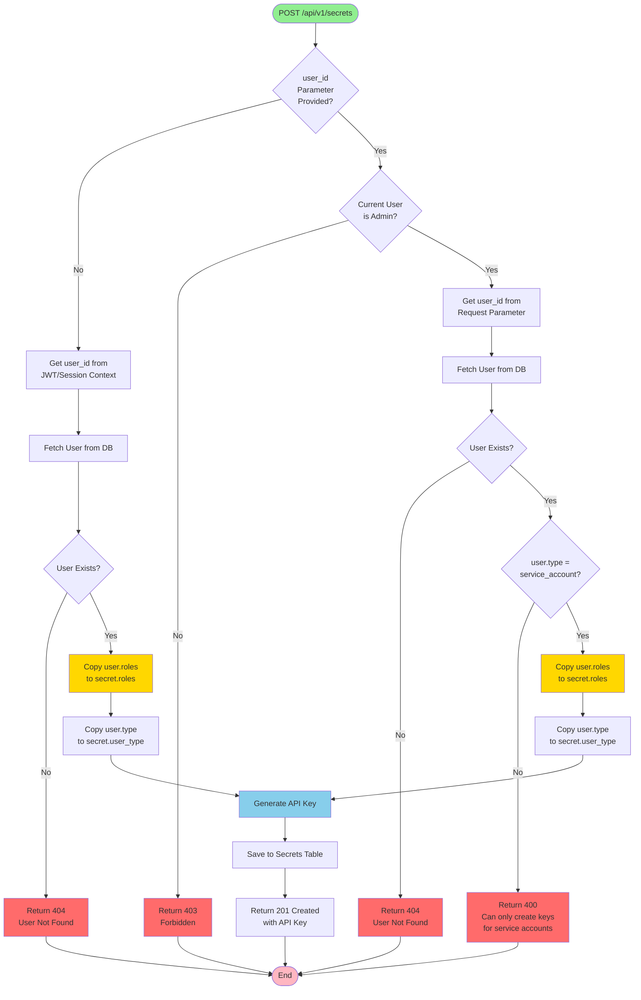

---

### Diagram 5: Permission Check Flow (Runtime)

**Description**: Detailed flow of how permission checks are performed during API request processing. This is the core RBAC enforcement logic that runs on every authenticated API request, showing the decision tree for allowing or denying access.

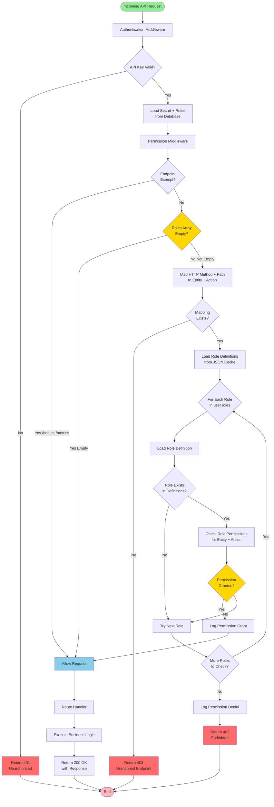

---

### Diagram 6: Role Permission Evaluation

**Description**: This diagram shows how the system evaluates whether a set of roles has permission for a specific entity and action. It illustrates the logic of checking multiple roles and the "any role grants access" principle.

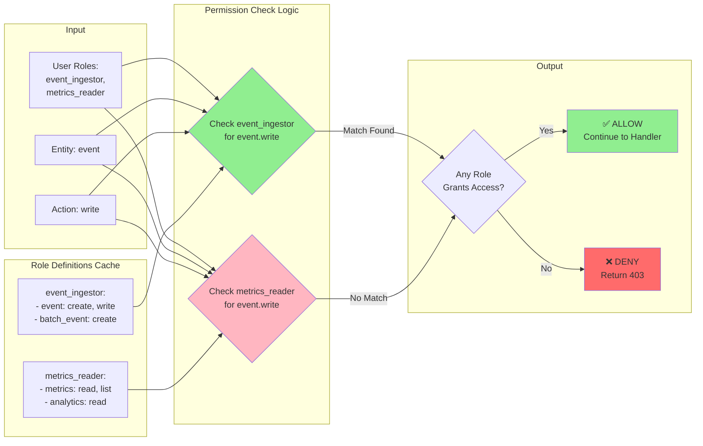

---

### Diagram 7: Permit.io Integration Architecture

**Description**: Shows how the Flexprice RBAC system integrates with Permit.io for enhanced authorization capabilities. This diagram illustrates the hybrid approach with fallback to static roles when Permit is unavailable.

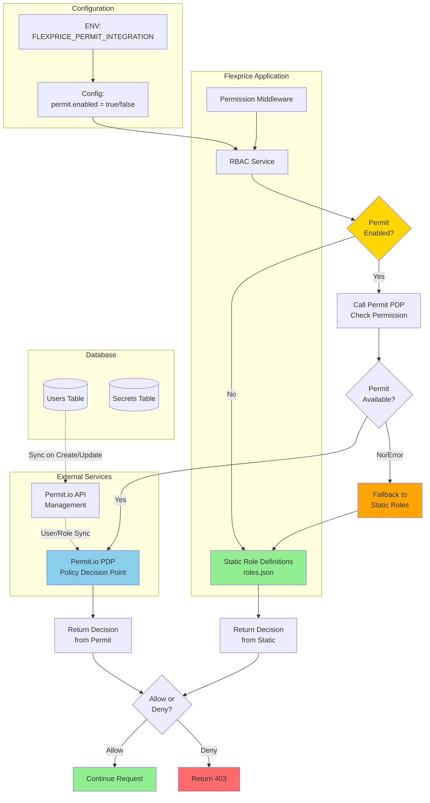

---

### Diagram 8: User & Role Sync with Permit.io

**Description**: Workflow showing how users and their roles are synchronized with Permit.io when the integration is enabled. This ensures Permit has the latest user and role information for authorization decisions.

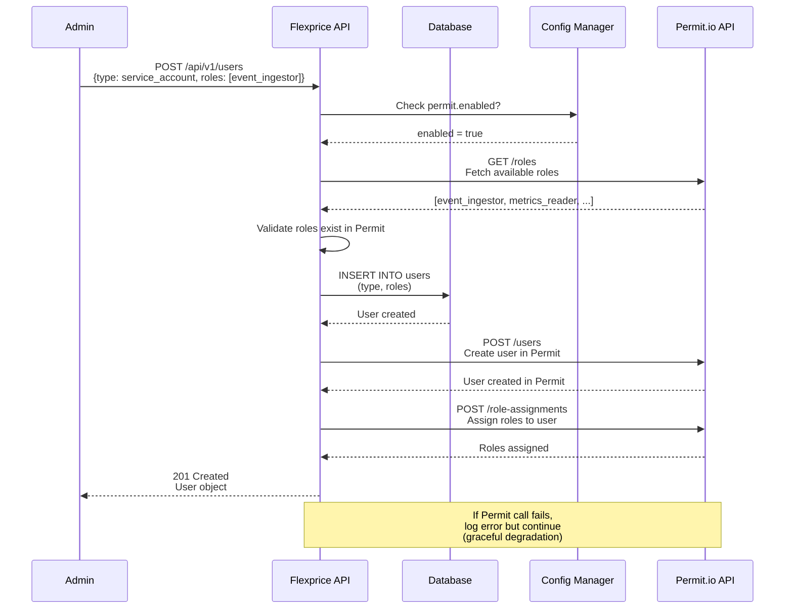

---

### Diagram 9: Migration Phases Timeline

**Description**: Visual timeline showing the three phases of RBAC implementation and deployment, from database migrations through feature flag rollout to full production release.

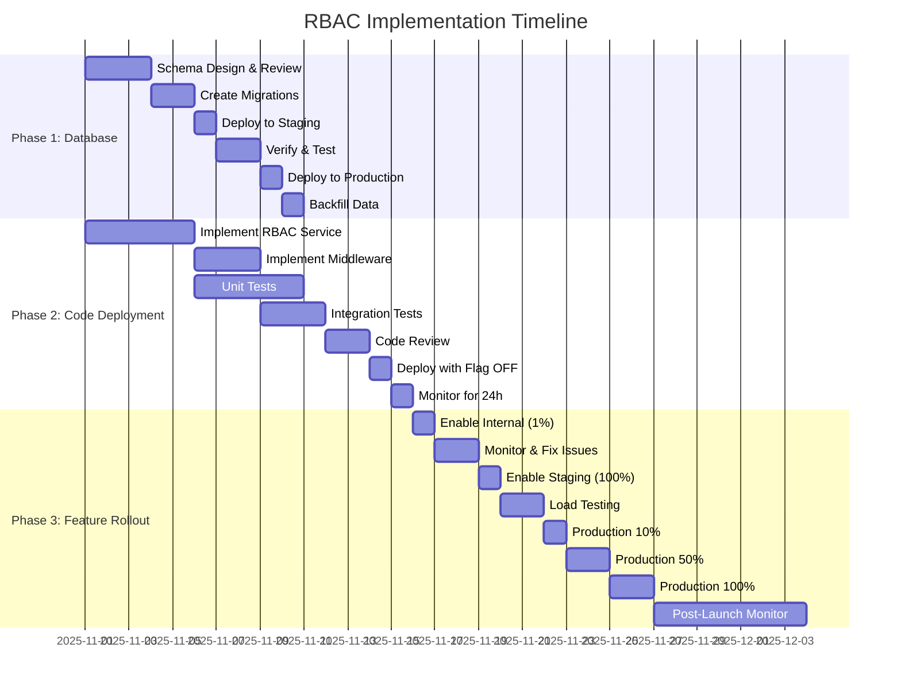

---

### Diagram 10: Permission Denial Scenarios

**Description**: Decision tree showing all possible scenarios that lead to permission denial (403 Forbidden), helping developers understand when and why access is blocked.

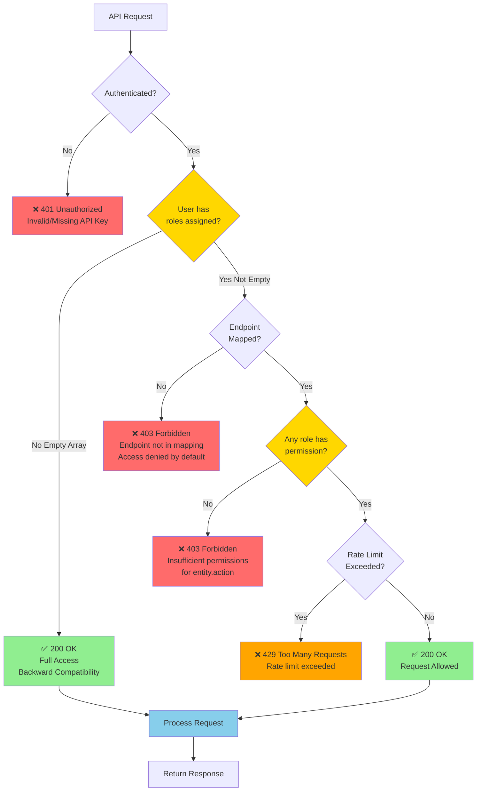

---

### Diagram 11: Role Definition Structure

**Description**: Visual representation of how roles are structured in the JSON configuration file, showing the hierarchy from role to permissions to entities and actions.

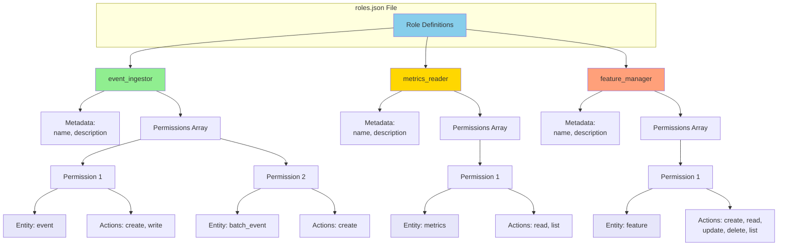

---

### Diagram 12: Complete System State Diagram

**Description**: State machine showing the lifecycle of a service account from creation through API key generation to request processing and eventual deactivation. This provides a holistic view of how service accounts move through the system.

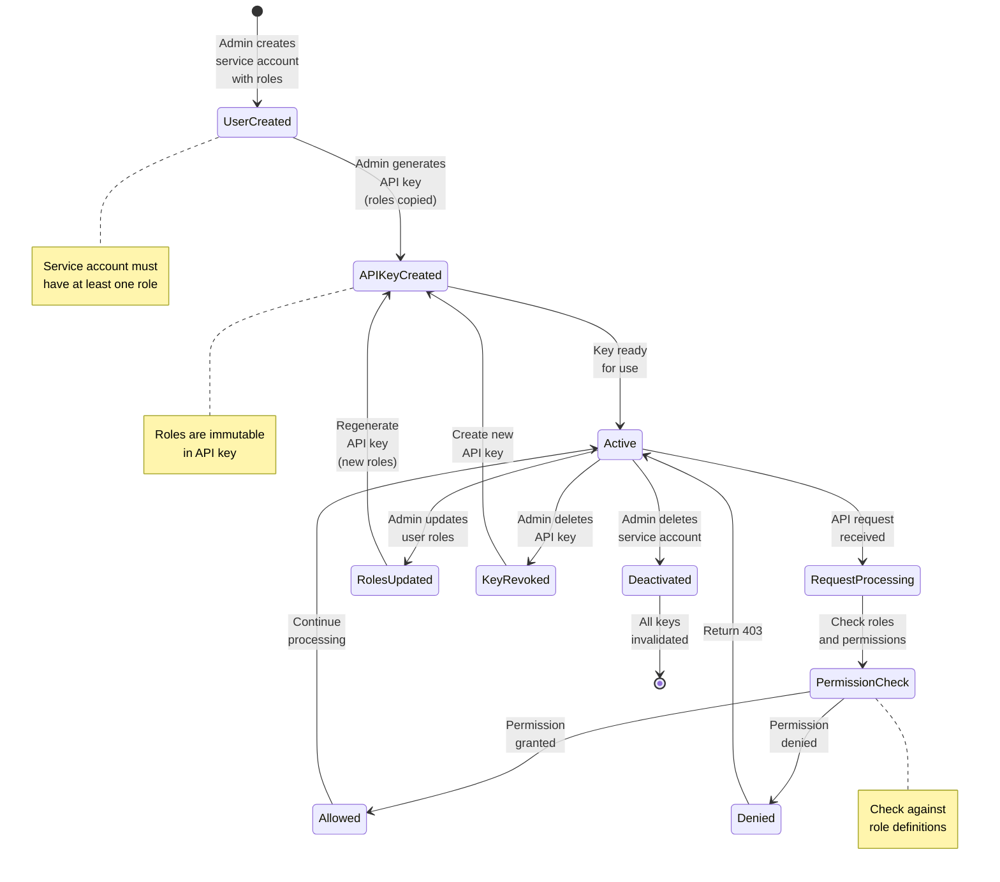

---

### Diagram 13: Backward Compatibility Flow

**Description**: Demonstrates how the RBAC system maintains backward compatibility with existing users who don't have roles assigned, ensuring zero breaking changes during rollout.

```mermaid
flowchart LR
    subgraph "Existing Users (Pre-RBAC)"
        OldUser1[Regular User<br/>roles = NULL/empty<br/>type = NULL/user]
        OldAPIKey1[Old API Keys<br/>roles = NULL/empty]
    end
    
    subgraph "Migration"
        Migration[Schema Migration<br/>+ Backfill]
    end
    
    subgraph "Post-Migration State"
        NewUser1[Regular User<br/>roles = empty array<br/>type = 'user']
        NewAPIKey1[Old API Keys<br/>roles = empty array<br/>type = 'user']
    end
    
    subgraph "Runtime Behavior"
        CheckRoles{Roles<br/>Empty?}
        FullAccess[✅ Full Access<br/>All Endpoints<br/>No Restrictions]
        NoBreaking[❌ No Breaking Changes<br/>Existing workflows work]
    end
    
    OldUser1 --> Migration
    OldAPIKey1 --> Migration
    
    Migration --> NewUser1
    Migration --> NewAPIKey1
    
    NewUser1 --> CheckRoles
    NewAPIKey1 --> CheckRoles
    
    CheckRoles -->|Yes| FullAccess
    FullAccess --> NoBreaking
    
    style OldUser1 fill:#FFE4B5
    style OldAPIKey1 fill:#FFE4B5
    style Migration fill:#87CEEB
    style FullAccess fill:#90EE90
    style NoBreaking fill:#90EE90
```

---

*End of Document*

