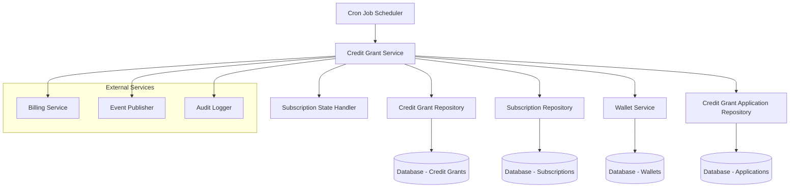
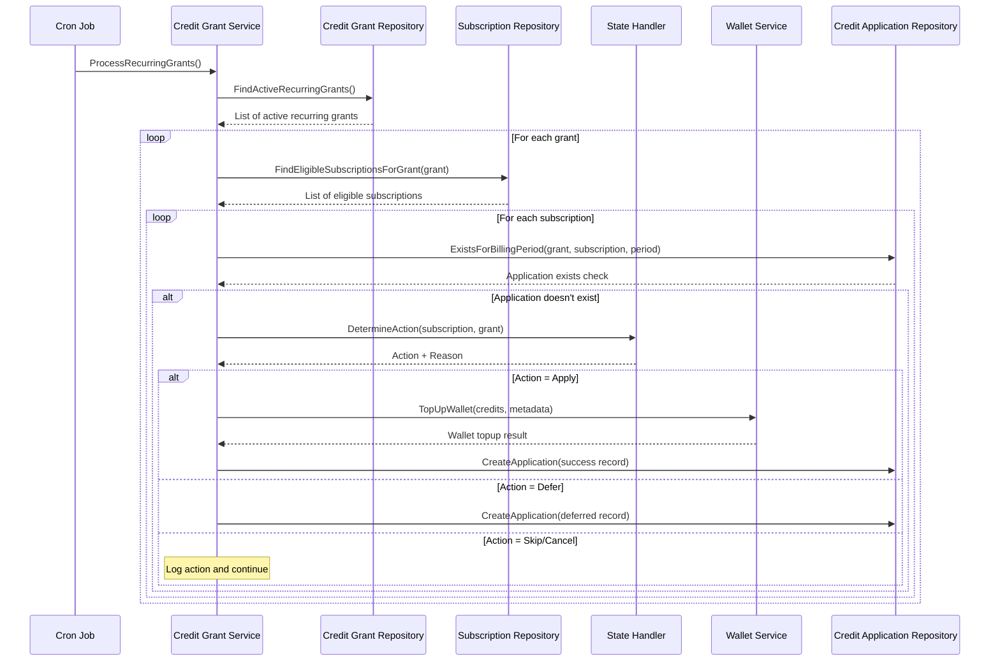
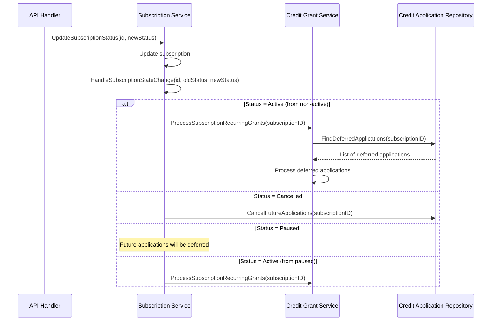
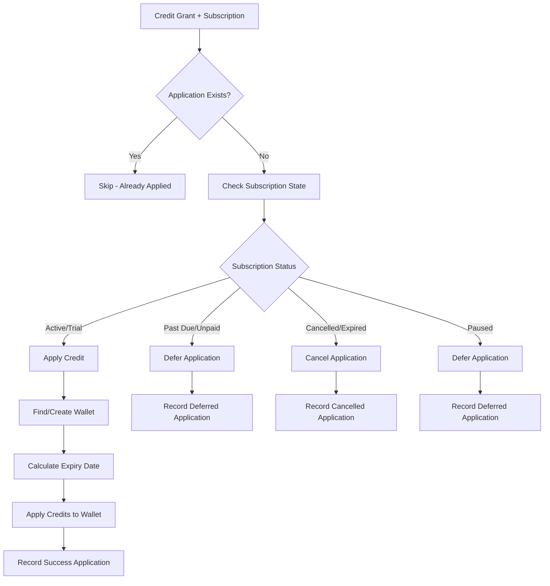

# Recurring Credit Grant Application System - Development Guide

## Table of Contents

1. [System Overview](#system-overview)
2. [Architecture Components](#architecture-components)
3. [Service Interactions](#service-interactions)
4. [Data Flow Diagrams](#data-flow-diagrams)
5. [Use Case Scenarios](#use-case-scenarios)
6. [Implementation Sequence](#implementation-sequence)
7. [API Integration Points](#api-integration-points)
8. [Error Handling Strategy](#error-handling-strategy)
9. [Monitoring and Observability](#monitoring-and-observability)
10. [Development Checklist](#development-checklist)

## System Overview

The Recurring Credit Grant Application System is a comprehensive solution that automatically processes recurring credit grants and applies them to customer wallets based on subscription billing cycles. The system integrates seamlessly with the existing FlexPrice infrastructure while maintaining proper state management and handling edge cases.

### Key Objectives

- **Automated Processing**: Daily cron job processes all recurring credit grants
- **Billing Alignment**: Credits applied in sync with subscription billing periods
- **State Awareness**: Handles all subscription states (active, paused, cancelled, etc.)
- **Idempotency**: Prevents duplicate credit applications
- **Recovery**: Handles missed applications due to system downtime
- **Scalability**: Processes thousands of grants efficiently

### Core Concepts

- **Credit Grant**: A definition of credits to be allocated to customers
- **Credit Grant Application**: A record of when and how credits were applied
- **Billing Period Alignment**: Credits applied once per subscription billing cycle
- **Subscription State Management**: Different handling based on subscription status

## Architecture Components

### Domain Layer (`internal/domain/`)

#### Credit Grant Domain (`internal/domain/creditgrant/`)

```go
// Core credit grant entity
type CreditGrant struct {
    ID                     string
    Name                   string
    Scope                  types.CreditGrantScope  // PLAN or SUBSCRIPTION
    PlanID                 *string                 // For plan-scoped grants
    SubscriptionID         *string                 // For subscription-scoped grants
    Credits                decimal.Decimal
    Currency               string
    Cadence                types.CreditGrantCadence // ONETIME or RECURRING
    Period                 *types.CreditGrantPeriod // MONTHLY, YEARLY, etc.
    PeriodCount            *int
    ExpirationType         types.CreditGrantExpiryType
    ExpirationDuration     *int
    Priority               *int
    Metadata               types.Metadata
    EnvironmentID          string
    types.BaseModel
}
```

**Key Methods:**

- `Validate()`: Business rule validation
- `FromEnt()`: Entity conversion from database
- `FromEntList()`: Batch entity conversion

#### Credit Grant Application Domain (`internal/domain/creditgrantapplication/`)

```go
// Tracks when and how credit grants are applied
type CreditGrantApplication struct {
    ID                    string
    CreditGrantID         string
    SubscriptionID        string
    WalletID              string
    CustomerID            string
    Credits               decimal.Decimal
    Currency              string
    ApplicationStatus     types.ApplicationStatus
    BillingPeriodStart    time.Time
    BillingPeriodEnd      time.Time
    ScheduledFor          *time.Time
    AppliedAt             *time.Time
    FailureReason         *string
    RetryCount            int
    NextRetryAt           *time.Time
    IdempotencyKey        string
    Metadata              types.Metadata
}
```

#### Subscription Domain (`internal/domain/subscription/`)

```go
// Subscription entity with billing period information
type Subscription struct {
    ID                 string
    CustomerID         string
    PlanID             string
    SubscriptionStatus types.SubscriptionStatus
    Currency           string
    CurrentPeriodStart time.Time
    CurrentPeriodEnd   time.Time
    BillingCadence     types.BillingCadence
    BillingPeriod      types.BillingPeriod
    // ... other fields
}
```

### Repository Layer (`internal/repository/`)

#### Enhanced Credit Grant Repository

```go
type Repository interface {
    // Existing methods...
    Create(ctx context.Context, cg *CreditGrant) (*CreditGrant, error)
    Get(ctx context.Context, id string) (*CreditGrant, error)
    List(ctx context.Context, filter *types.CreditGrantFilter) ([]*CreditGrant, error)
    Update(ctx context.Context, cg *CreditGrant) (*CreditGrant, error)
    Delete(ctx context.Context, id string) error

    // New methods for recurring processing
    FindActiveRecurringGrants(ctx context.Context) ([]*CreditGrant, error)
    FindActiveGrantsForSubscription(ctx context.Context, subscriptionID string) ([]*CreditGrant, error)
}
```

#### Enhanced Subscription Repository

```go
type Repository interface {
    // Existing methods...
    Get(ctx context.Context, id string) (*Subscription, error)
    GetWithLineItems(ctx context.Context, id string) (*Subscription, []*SubscriptionLineItem, error)

    // New methods for credit grant processing
    FindEligibleSubscriptionsForGrant(ctx context.Context, grant *CreditGrant) ([]*Subscription, error)
    FindSubscriptionsNeedingRecurringProcessing(ctx context.Context) ([]*Subscription, error)
}
```

#### Credit Grant Application Repository

```go
type Repository interface {
    Create(ctx context.Context, app *CreditGrantApplication) (*CreditGrantApplication, error)
    Update(ctx context.Context, app *CreditGrantApplication) (*CreditGrantApplication, error)
    ExistsForBillingPeriod(ctx context.Context, grantID, subscriptionID string, periodStart, periodEnd time.Time) (bool, error)
    FindDeferredApplications(ctx context.Context, subscriptionID string) ([]*CreditGrantApplication, error)
    FindFailedApplicationsForRetry(ctx context.Context, maxRetries int) ([]*CreditGrantApplication, error)
    CancelFutureApplications(ctx context.Context, subscriptionID string) error
}
```

### Service Layer (`internal/service/`)

#### Enhanced Credit Grant Service

```go
type CreditGrantService interface {
    // Existing methods...
    CreateCreditGrant(ctx context.Context, req dto.CreateCreditGrantRequest) (*dto.CreditGrantResponse, error)
    GetCreditGrant(ctx context.Context, id string) (*dto.CreditGrantResponse, error)
    ListCreditGrants(ctx context.Context, filter *types.CreditGrantFilter) (*dto.ListCreditGrantsResponse, error)

    // New recurring processing methods
    ProcessRecurringGrants(ctx context.Context) error
    ProcessGrantForSubscription(ctx context.Context, grantID, subscriptionID string) error
    RetryFailedApplications(ctx context.Context) error
}
```

#### Subscription State Handler

```go
type SubscriptionStateHandler struct {
    subscription *subscription.Subscription
    grant        *creditgrant.CreditGrant
}

func (h *SubscriptionStateHandler) DetermineAction() (StateAction, string) {
    switch h.subscription.SubscriptionStatus {
    case types.SubscriptionStatusActive:
        return StateActionApply, "subscription_active"
    case types.SubscriptionStatusTrialing:
        return StateActionApply, "trial_active"
    case types.SubscriptionStatusPastDue:
        return StateActionDefer, "subscription_past_due"
    case types.SubscriptionStatusCancelled:
        return StateActionCancel, "subscription_cancelled"
    // ... other states
    }
}
```

#### Cron Job Service

```go
type CreditGrantCronJob struct {
    subscriptionService SubscriptionService
    logger              *logger.Logger
    cron                *cron.Cron
    enabled             bool
    schedule            string
}
```

## Service Interactions

### Primary Service Flow



### Component Dependencies

1. **CreditGrantService** depends on:

   - `CreditGrantRepository` - For grant retrieval
   - `SubscriptionRepository` - For eligible subscription finding
   - `CreditGrantApplicationRepository` - For application tracking
   - `WalletService` - For credit application
   - `Logger` - For observability

2. **SubscriptionService** depends on:

   - `CreditGrantService` - For processing grants
   - `SubscriptionRepository` - For subscription management
   - State change handlers

3. **CronJob** depends on:
   - `CreditGrantService` - For scheduled processing
   - Configuration management
   - Error handling and alerting

## Data Flow Diagrams

### Daily Recurring Processing Flow



### Subscription State Change Flow



### Credit Application Flow



## Use Case Scenarios

### Use Case 1: New Active Subscription with Plan-Level Recurring Grant

**Scenario**: Customer subscribes to a plan that has a monthly $10 credit grant.

**Flow**:

1. Subscription created with status `ACTIVE`
2. Daily cron job runs
3. System finds plan-level recurring grant
4. Finds eligible active subscription
5. Checks no application exists for current billing period
6. Applies $10 credit to customer's wallet
7. Records successful application

**Services Involved**:

- `CreditGrantService.ProcessRecurringGrants()`
- `CreditGrantRepository.FindActiveRecurringGrants()`
- `SubscriptionRepository.FindEligibleSubscriptionsForGrant()`
- `WalletService.TopUpWallet()`

### Use Case 2: Subscription Goes from Paused to Active

**Scenario**: Customer resumes a paused subscription that has missed recurring credits.

**Flow**:

1. Subscription status updated from `PAUSED` to `ACTIVE`
2. `SubscriptionService.HandleSubscriptionStateChange()` triggered
3. System processes recurring grants for this subscription
4. Finds deferred applications from pause period
5. Applies deferred credits to wallet
6. Updates application records

**Services Involved**:

- `SubscriptionService.HandleSubscriptionStateChange()`
- `CreditGrantService.ProcessSubscriptionRecurringGrants()`
- `CreditGrantApplicationRepository.FindDeferredApplications()`

### Use Case 3: Subscription Cancellation

**Scenario**: Customer cancels subscription with future scheduled credits.

**Flow**:

1. Subscription status updated to `CANCELLED`
2. `SubscriptionService.HandleSubscriptionStateChange()` triggered
3. System cancels future scheduled applications
4. No more credits will be applied for this subscription

**Services Involved**:

- `SubscriptionService.HandleSubscriptionStateChange()`
- `CreditGrantApplicationRepository.CancelFutureApplications()`

### Use Case 4: Failed Credit Application Retry

**Scenario**: Credit application failed due to wallet service issue, needs retry.

**Flow**:

1. Original application failed and recorded
2. Retry cron job runs
3. System finds failed applications within retry limit
4. Attempts to reapply credits
5. Updates application status based on result

**Services Involved**:

- `CreditGrantService.RetryFailedApplications()`
- `CreditGrantApplicationRepository.FindFailedApplicationsForRetry()`

### Use Case 5: Multi-Currency Handling

**Scenario**: Subscription in EUR with USD credit grant.

**Flow**:

1. System processes recurring grant
2. Finds subscription with EUR currency
3. Grant specifies USD credits
4. Creates/finds USD wallet for customer
5. Applies USD credits to USD wallet

**Services Involved**:

- `WalletService.GetWalletsByCustomerID()`
- `WalletService.CreateWallet()` (if no matching currency wallet)

## Implementation Sequence

### Phase 1: Foundation (Week 1)

#### Day 1-2: Repository Layer Enhancements

```go
// Add to existing repositories
internal/repository/ent/creditgrant.go:
- FindActiveRecurringGrants()
- FindActiveGrantsForSubscription()

internal/repository/ent/subscription.go:
- FindEligibleSubscriptionsForGrant()
- FindSubscriptionsNeedingRecurringProcessing()
```

#### Day 3-4: Domain Model Extensions

```go
// Create new domain model
internal/domain/creditgrantapplication/model.go:
- CreditGrantApplication struct
- Validation methods
- Entity conversion methods
```

#### Day 5: Repository Implementation

```go
// New repository
internal/repository/ent/creditgrantapplication.go:
- Full CRUD operations
- Specialized query methods
```

#### Testing:

```bash
# Unit tests for repositories
go test ./internal/repository/ent -v -run TestCreditGrant
go test ./internal/repository/ent -v -run TestCreditGrantApplication
```

### Phase 2: Core Processing Logic (Week 2)

#### Day 1-2: Subscription State Handler

```go
internal/service/subscription_state_handler.go:
- SubscriptionStateHandler struct
- DetermineAction() method
- State transition logic
```

#### Day 3-5: Enhanced Credit Grant Service

```go
internal/service/creditgrant.go:
- ProcessRecurringGrants()
- processRecurringGrant()
- processGrantForSubscription()
- applyRecurringGrant()
```

#### Testing:

```bash
# Service layer tests
go test ./internal/service -v -run TestCreditGrantService_ProcessRecurring
go test ./internal/service -v -run TestSubscriptionStateHandler
```

### Phase 3: Integration and Scheduling (Week 3)

#### Day 1-2: Subscription Service Integration

```go
internal/service/subscription.go:
- ProcessRecurringCreditGrants()
- ProcessSubscriptionRecurringGrants()
- HandleSubscriptionStateChange()
- State change handlers
```

#### Day 3-4: Cron Job Implementation

```go
internal/service/credit_grant_cron.go:
- CreditGrantCronJob struct
- Scheduling logic
- Error handling and recovery
```

#### Day 5: Configuration and Startup

```go
internal/config/config.go:
- CreditGrantCronConfig struct

cmd/server/main.go:
- Cron job initialization
- Graceful shutdown handling
```

### Phase 4: API and Monitoring (Week 4)

#### Day 1-2: API Endpoints

```go
internal/handlers/creditgrant.go:
- POST /admin/credit-grants/process-recurring
- GET /admin/credit-grants/applications

internal/handlers/subscription.go:
- POST /subscriptions/{id}/process-recurring-grants
```

#### Day 3-4: Monitoring and Observability

```go
// Add metrics and tracing
internal/service/creditgrant.go:
- Prometheus metrics
- Distributed tracing
- Error alerting

internal/service/credit_grant_cron.go:
- Success/failure metrics
- Processing duration tracking
```

#### Day 5: Documentation and Testing

- Integration tests
- End-to-end scenarios
- Performance testing
- Documentation updates

## API Integration Points

### Admin Endpoints

#### Process All Recurring Grants

```http
POST /v1/admin/credit-grants/process-recurring
Authorization: Bearer {admin-token}
Content-Type: application/json

Response:
{
    "message": "Recurring credit grants processed successfully",
    "processed_grants": 45,
    "processed_subscriptions": 123,
    "successful_applications": 120,
    "failed_applications": 3
}
```

#### Get Credit Grant Applications

```http
GET /v1/admin/credit-grants/applications?subscription_id={id}&status=failed
Authorization: Bearer {admin-token}

Response:
{
    "items": [
        {
            "id": "app_123",
            "credit_grant_id": "cg_456",
            "subscription_id": "sub_789",
            "status": "failed",
            "failure_reason": "wallet_service_unavailable",
            "retry_count": 2,
            "next_retry_at": "2024-01-15T10:00:00Z"
        }
    ],
    "pagination": {...}
}
```

### Subscription Endpoints

#### Process Subscription Recurring Grants

```http
POST /v1/subscriptions/{id}/process-recurring-grants
Authorization: Bearer {token}

Response:
{
    "message": "Recurring credit grants processed for subscription",
    "subscription_id": "sub_123",
    "processed_grants": 2,
    "successful_applications": 2
}
```

### Webhook Events

#### Credit Grant Applied Event

```json
{
  "event_type": "credit_grant.applied",
  "timestamp": "2024-01-15T10:00:00Z",
  "data": {
    "credit_grant_id": "cg_123",
    "subscription_id": "sub_456",
    "customer_id": "cust_789",
    "wallet_id": "wallet_101",
    "credits_applied": "10.00",
    "currency": "USD",
    "billing_period_start": "2024-01-01T00:00:00Z",
    "billing_period_end": "2024-01-31T23:59:59Z",
    "application_id": "app_202"
  }
}
```

## Error Handling Strategy

### Error Categories

#### 1. Transient Errors (Retry)

- Database connection failures
- Wallet service unavailable
- Rate limiting

```go
type RetryableError struct {
    OriginalError error
    RetryAfter    time.Duration
    MaxRetries    int
}
```

#### 2. Business Logic Errors (Skip)

- Invalid subscription state
- Grant configuration errors
- Currency mismatches

```go
type BusinessError struct {
    Code    string
    Message string
    Details map[string]interface{}
}
```

#### 3. Fatal Errors (Alert)

- Configuration issues
- Database schema problems
- Service dependency failures

### Retry Strategy

```go
type RetryConfig struct {
    MaxRetries      int           `default:"3"`
    InitialDelay    time.Duration `default:"1m"`
    BackoffFactor   float64       `default:"2.0"`
    MaxDelay        time.Duration `default:"10m"`
}
```

#### Implementation:

```go
func (s *creditGrantService) applyRecurringGrant(ctx context.Context, grant *creditgrant.CreditGrant, subscription *subscription.Subscription) error {
    operation := func() error {
        return s.doApplyGrant(ctx, grant, subscription)
    }

    return retry.Do(operation,
        retry.Attempts(3),
        retry.Delay(time.Minute),
        retry.DelayType(retry.BackOffDelay),
    )
}
```

### Error Recovery

#### Failed Application Recovery

```go
// Daily job to retry failed applications
func (s *creditGrantService) RetryFailedApplications(ctx context.Context) error {
    failedApps, err := s.applicationRepo.FindFailedApplicationsForRetry(ctx, 3)
    if err != nil {
        return err
    }

    for _, app := range failedApps {
        if err := s.retryApplication(ctx, app); err != nil {
            s.logger.Errorw("retry failed", "application_id", app.ID, "error", err)
        }
    }

    return nil
}
```

## Monitoring and Observability

### Metrics to Track

#### Business Metrics

```go
var (
    RecurringGrantsProcessed = prometheus.NewCounterVec(
        prometheus.CounterOpts{
            Name: "recurring_grants_processed_total",
            Help: "Total number of recurring grants processed",
        },
        []string{"status", "tenant_id"},
    )

    CreditApplicationsDuration = prometheus.NewHistogramVec(
        prometheus.HistogramOpts{
            Name: "credit_applications_duration_seconds",
            Help: "Duration of credit applications",
        },
        []string{"grant_type", "subscription_status"},
    )

    CreditAmountApplied = prometheus.NewCounterVec(
        prometheus.CounterOpts{
            Name: "credit_amount_applied_total",
            Help: "Total credit amount applied",
        },
        []string{"currency", "grant_scope"},
    )
)
```

#### System Metrics

```go
var (
    CronJobExecutions = prometheus.NewCounterVec(
        prometheus.CounterOpts{
            Name: "cron_job_executions_total",
            Help: "Total cron job executions",
        },
        []string{"job_name", "status"},
    )

    DatabaseOperationsDuration = prometheus.NewHistogramVec(
        prometheus.HistogramOpts{
            Name: "database_operations_duration_seconds",
            Help: "Duration of database operations",
        },
        []string{"operation", "table"},
    )
)
```

### Logging Strategy

#### Structured Logging

```go
func (s *creditGrantService) ProcessRecurringGrants(ctx context.Context) error {
    logger := s.logger.With(
        "operation", "process_recurring_grants",
        "tenant_id", types.GetTenantID(ctx),
        "correlation_id", correlation.FromContext(ctx),
    )

    logger.Infow("starting recurring credit grant processing")

    grants, err := s.repo.FindActiveRecurringGrants(ctx)
    if err != nil {
        logger.Errorw("failed to find active grants", "error", err)
        return err
    }

    logger.Infow("found active recurring grants",
        "count", len(grants),
        "grant_ids", extractIDs(grants),
    )

    // Processing logic...
}
```

#### Audit Logging

```go
func (s *creditGrantService) applyRecurringGrant(ctx context.Context, grant *creditgrant.CreditGrant, subscription *subscription.Subscription) error {
    // Apply credit logic...

    // Audit log
    auditEvent := &audit.Event{
        Type:      "credit_grant_applied",
        Actor:     "system",
        Resource:  fmt.Sprintf("subscription:%s", subscription.ID),
        Action:    "apply_recurring_credit",
        Details: map[string]interface{}{
            "grant_id":        grant.ID,
            "subscription_id": subscription.ID,
            "credits":         grant.Credits,
            "currency":        grant.Currency,
            "billing_period":  fmt.Sprintf("%s to %s", subscription.CurrentPeriodStart, subscription.CurrentPeriodEnd),
        },
    }

    s.auditLogger.Log(ctx, auditEvent)

    return nil
}
```

### Health Checks

#### Cron Job Health

```go
type HealthChecker struct {
    lastSuccessfulRun time.Time
    mu                sync.RWMutex
}

func (h *HealthChecker) Check() error {
    h.mu.RLock()
    defer h.mu.RUnlock()

    if time.Since(h.lastSuccessfulRun) > 25*time.Hour { // Daily job + buffer
        return errors.New("recurring credit grant processing overdue")
    }

    return nil
}
```

### Alerting Rules

#### Critical Alerts

```yaml
groups:
  - name: recurring_credit_grants
    rules:
      - alert: RecurringCreditGrantJobFailed
        expr: increase(cron_job_executions_total{job_name="recurring_credits",status="failed"}[1h]) > 0
        for: 0m
        labels:
          severity: critical
        annotations:
          summary: "Recurring credit grant job failed"

      - alert: HighCreditApplicationFailureRate
        expr: rate(recurring_grants_processed_total{status="failed"}[5m]) > 0.1
        for: 2m
        labels:
          severity: warning
        annotations:
          summary: "High failure rate in credit applications"
```

## Development Checklist

### Pre-Development Setup

- [ ] Review existing credit grant and subscription services
- [ ] Understand current database schema
- [ ] Set up local development environment
- [ ] Review PRD requirements thoroughly

### Phase 1: Foundation

- [ ] Add repository methods for active grant queries
- [ ] Add repository methods for eligible subscription queries
- [ ] Create credit grant application domain model
- [ ] Implement credit grant application repository
- [ ] Write unit tests for repositories
- [ ] Add database migrations if needed

### Phase 2: Core Logic

- [ ] Implement subscription state handler
- [ ] Add recurring processing methods to credit grant service
- [ ] Integrate with existing wallet service
- [ ] Implement billing period alignment logic
- [ ] Add idempotency handling
- [ ] Write comprehensive service layer tests

### Phase 3: Integration

- [ ] Add state change handlers to subscription service
- [ ] Implement cron job scheduler
- [ ] Add configuration management
- [ ] Integrate with existing error handling
- [ ] Add proper logging and metrics
- [ ] Test integration scenarios

### Phase 4: Production Readiness

- [ ] Add API endpoints for manual operations
- [ ] Implement monitoring dashboards
- [ ] Set up alerting rules
- [ ] Add health checks
- [ ] Performance testing
- [ ] Documentation updates
- [ ] Deployment procedures

### Testing Checklist

- [ ] Unit tests for all new components
- [ ] Integration tests for service interactions
- [ ] End-to-end tests for key scenarios
- [ ] Performance tests for large datasets
- [ ] Error scenario testing
- [ ] Concurrent processing tests
- [ ] Database migration tests

### Security Checklist

- [ ] Input validation for all API endpoints
- [ ] Authorization checks for admin endpoints
- [ ] Audit logging for all credit applications
- [ ] Rate limiting for manual triggers
- [ ] Sensitive data handling review
- [ ] SQL injection prevention

### Performance Checklist

- [ ] Database query optimization
- [ ] Batch processing for large datasets
- [ ] Connection pooling configuration
- [ ] Memory usage optimization
- [ ] Concurrent processing limits
- [ ] Caching strategy review

This comprehensive development guide provides a complete roadmap for implementing the recurring credit grant application system, ensuring proper integration with the existing FlexPrice infrastructure while maintaining high standards for reliability, observability, and maintainability.
