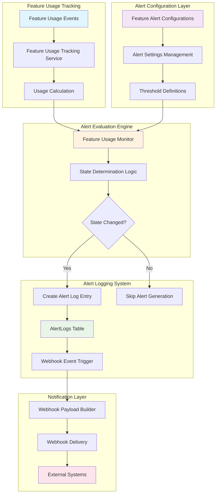
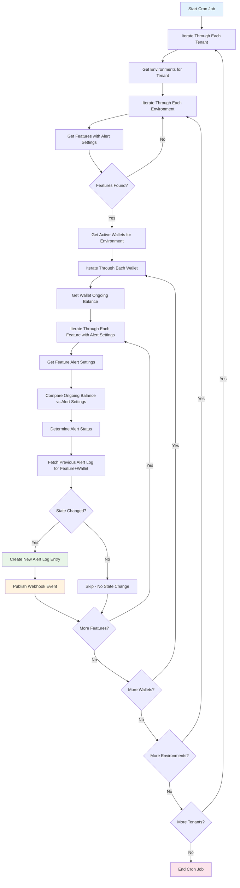
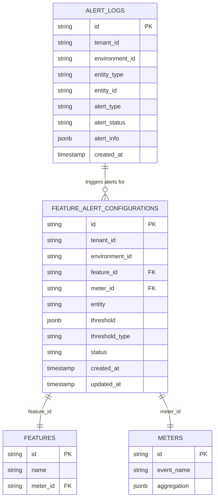
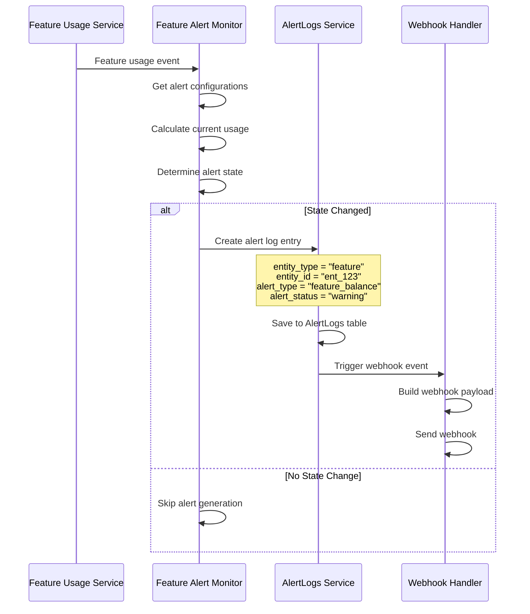
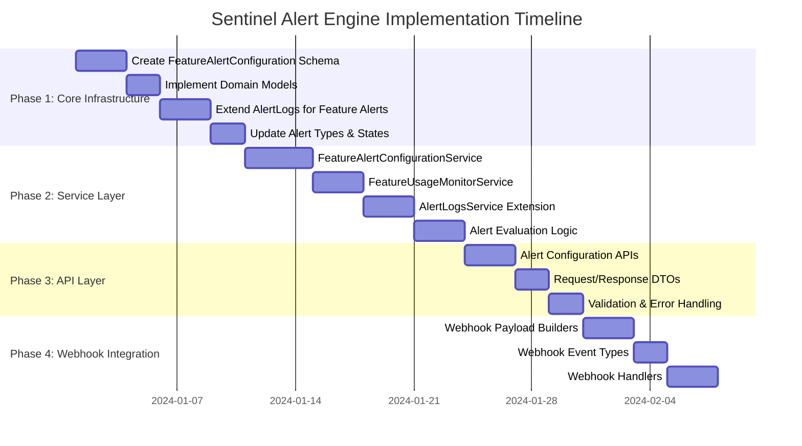
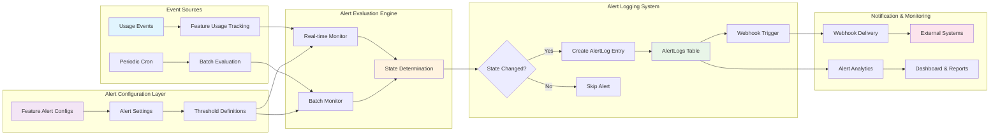
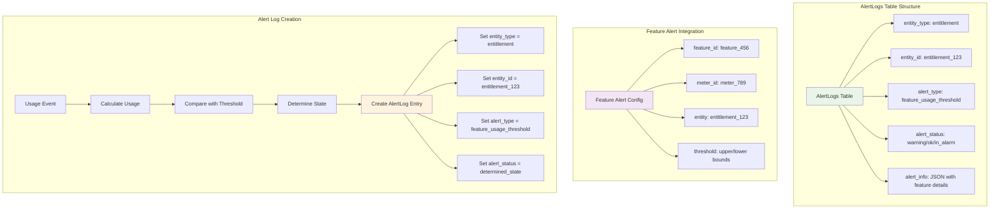
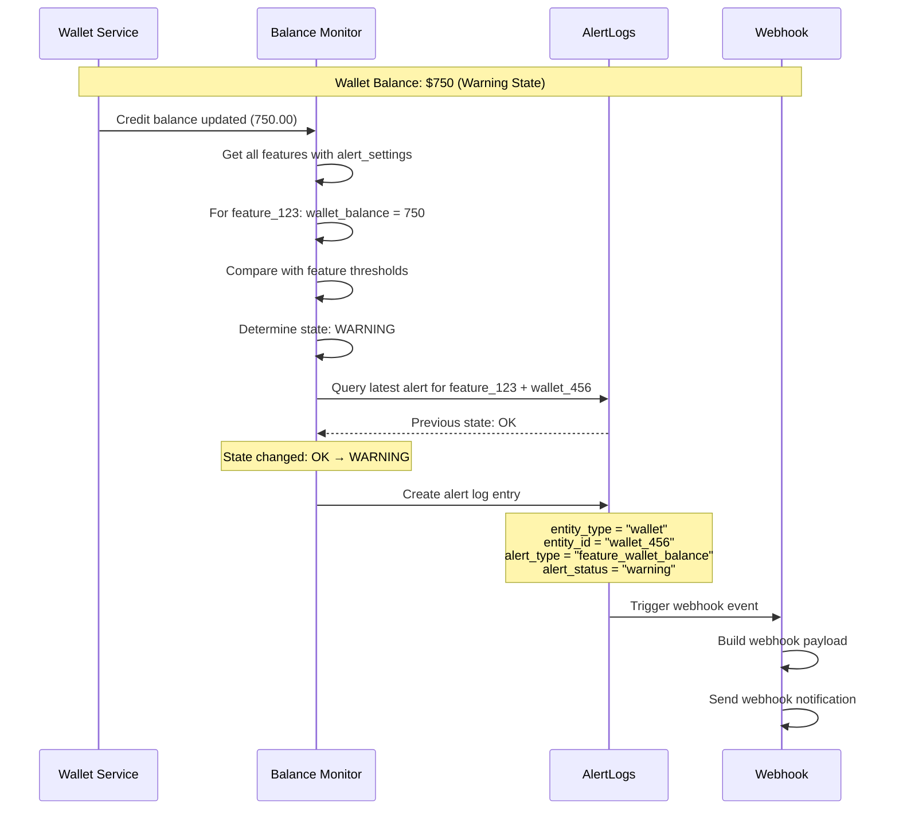

# Feature-Level Alert System (Sentinel Alert Engine)

## 1. Executive Summary

### 1.1 Overview
The Sentinel Alert Engine introduces a comprehensive feature-level alert system that monitors feature usage against configurable thresholds and triggers alerts based on state transitions. This system extends the existing alert-logging infrastructure to provide granular monitoring of feature consumption across different aggregation types.

### 1.2 Objectives
- **Proactive Monitoring**: Enable real-time monitoring of feature usage against configurable thresholds
- **Flexible Alerting**: Support multiple alert states (OK, Warning, In Alarm) with customizable threshold ranges
- **Seamless Integration**: Leverage existing alert infrastructure and webhook system
- **Scalable Architecture**: Support high-volume feature usage monitoring across multiple tenants and environments

### 1.3 Success Metrics
- Reduce feature overage incidents by 80%
- Enable proactive customer engagement through usage alerts
- Provide real-time visibility into feature consumption patterns
- Support 99.9% alert delivery reliability

## 2. Problem Statement

### 2.1 Current State
- No proactive monitoring of feature usage consumption
- Customers experience unexpected overages without warning
- Manual monitoring required for feature usage tracking

### 2.2 Pain Points
- **Reactive Monitoring**: Alerts only trigger after usage limits are exceeded
- **Limited Granularity**: No feature-specific alert configurations
- **Poor User Experience**: Customers surprised by unexpected charges
- **Operational Overhead**: Manual monitoring of feature consumption

## 3. Solution Overview

### 3.1 System Architecture Overview



### 3.2 Core Components

#### 3.1.1 Feature Alert Settings Column
Add an `alert_settings` column to the existing `features` table to store threshold configurations:

```sql
ALTER TABLE features 
ADD COLUMN alert_settings JSONB DEFAULT NULL;

-- Example alert_settings structure:
-- threshold {
--   "upperbound": "1000.00",
--   "lowerbound": "100.00"
-- }
```

#### 3.1.2 Alert State Logic
The system supports three distinct alert states based on ongoing wallet balance comparison with feature thresholds:

- **ok State**: `ongoing_balance >= feature.upperbound` - Balance is at or above the upper threshold (healthy)
- **warning State**: `feature.upperbound > ongoing_balance && ongoing_balance > feature.lowerbound` - Balance is within the warning range
- **in_alarm State**: `ongoing_balance <= feature.lowerbound` - Balance is at or below the lower threshold (critical)

#### 3.1.3 Threshold Configuration
```json
{
  "upperbound": "1000.00",
  "lowerbound": "100.00"
}
```

### 3.2 Architecture Integration

#### 3.2.1 Existing Infrastructure Reuse
- **AlertLogs Table**: Extend to support feature entity type
- **Webhook System**: Leverage existing webhook infrastructure
- **Alert Service**: Extend current alert service for feature monitoring

#### 3.2.2 New Components
- **Feature Alert Settings**: Column-based alert configuration in features table
- **Wallet Balance Monitor**: Component to evaluate wallet balance against feature thresholds
- **Bulk Feature Alert Processor**: Service to process all features for wallet balance alerts
- **Feature Alert Webhook Payloads**: New webhook payload builders

## 4. Technical Specification

### 4.1 Data Models

#### 4.1.1 Feature Alert Settings Schema
```go
// Update existing Feature schema to include alert_settings
func (Feature) Fields() []ent.Field {
    return []ent.Field{
        // ... existing fields ...
        field.JSON("alert_settings", FeatureAlertSettings{}).
            Optional().
            Nillable().
            SchemaType(map[string]string{
                "postgres": "jsonb",
            }),
    }
}

type FeatureAlertSettings struct {
    Upperbound decimal.Decimal `json:"upperbound"`
    Lowerbound decimal.Decimal `json:"lowerbound"`
}
```

#### 4.1.2 Extended Alert Types
```go
// internal/types/alertlogs.go
const (
    // Existing wallet alerts
    AlertTypeLowOngoingBalance AlertType = "low_ongoing_balance"
    AlertTypeLowCreditBalance  AlertType = "low_credit_balance"
    
    // New feature alerts
    AlertTypeFeatureBalance AlertType = "feature_balance"
)

const (
    // Existing entity types
    AlertEntityTypeWallet   AlertEntityType = "wallet"
    AlertEntityTypeFeature  AlertEntityType = "feature"  // New entity type
)

// Extended alert states
const (
    AlertStateOk      AlertState = "ok"
    AlertStateWarning AlertState = "warning"  // New state
    AlertStateInAlarm AlertState = "in_alarm"
)
```

#### 4.1.3 Feature Alert Info Structure
```go
type FeatureAlertInfo struct {
    FeatureID      string                `json:"feature_id"`
    FeatureName    string                `json:"feature_name"`
    WalletID       string                `json:"wallet_id"`
    AlertSettings  FeatureAlertSettings  `json:"alert_settings"`
    WalletBalance  decimal.Decimal       `json:"wallet_balance"`
    BalanceType    string                `json:"balance_type"` // credit_balance or ongoing_balance
    Timestamp      time.Time             `json:"timestamp"`
}
```

### 4.2 Service Layer

#### 4.2.1 Feature Alert Settings Service
```go
type FeatureAlertSettingsService interface {
    CreateFeatureAlertSettings(ctx context.Context, featureID string, settings *FeatureAlertSettings) error
    UpdateFeatureAlertSettings(ctx context.Context, featureID string, settings *FeatureAlertSettings) error
    GetFeatureAlertSettings(ctx context.Context, featureID string) (*FeatureAlertSettings, error)
    // No delete method - settings can be set to null instead
}
```

#### 4.2.2 Wallet Balance Alert Monitor Service
```go
type WalletBalanceAlertMonitorService interface {
    // Triggered on credit balance updates (static runtime flag)
    EvaluateWalletBalanceAlerts(ctx context.Context, walletID string) error
    
    // Triggered by cron for ongoing balance
    EvaluateAllWalletBalanceAlerts(ctx context.Context) error
    
    // Bulk process all features for a wallet
    ProcessWalletFeaturesAlerts(ctx context.Context, walletID string, balance decimal.Decimal) error
}
```

### 4.3 Alert Evaluation Logic

#### 4.3.1 Wallet Balance Comparison
The system compares wallet balance against feature alert thresholds:
- **Credit Balance**: Evaluated on balance updates (static runtime flag)
- **Ongoing Balance**: Evaluated by cron job periodically
- **Bulk Processing**: All features are processed for each wallet

#### 4.3.2 State Determination Algorithm
```go
func DetermineFeatureAlertStatus(ongoingBalance decimal.Decimal, alertSettings *FeatureAlertSettings) AlertState {
    if ongoingBalance.GreaterThanOrEqual(*alertSettings.Upperbound) {
        return AlertStateOk
    } else if ongoingBalance.GreaterThan(*alertSettings.Lowerbound) && 
              ongoingBalance.LessThan(*alertSettings.Upperbound) {
        return AlertStateWarning
    } else { // ongoingBalance <= lowerbound
        return AlertStateInAlarm
    }
}
```

#### 4.3.3 Feature Alert State Check Cron Workflow

The system runs a scheduled cron job to evaluate feature alerts against wallet ongoing balances:



**Detailed Workflow Steps:**

1. **Tenant & Environment Iteration**
   - Iterate through each tenant
   - Get all environments for the current tenant
   - Process each environment in the context

2. **Bulk Feature Fetch**
   - Query features filtered by:
     - `tenant_id` = current tenant
     - `environment_id` = current environment
     - `alert_settings IS NOT NULL` (database-level filter)
   - Only fetch features that have alert configurations

3. **Active Wallet Fetch**
   - Get all active wallets for the current tenant and environment
   - Filter wallets with `wallet_status = active` and `alert_enabled = true`

4. **Per-Wallet Processing**
   - For each active wallet:
     - Get the **ongoing balance** (real-time balance including pending charges)
     - Iterate through all features with alert settings

5. **Feature Alert Evaluation**
   - For each feature:
     - Get the `alert_settings` (upperbound, lowerbound)
     - Compare `ongoing_balance` against thresholds
     - Determine alert status using state determination algorithm

6. **Alert State Determination**
   ```
   if ongoing_balance >= upperbound:
       alert_status = ok
   
   if upperbound > ongoing_balance && ongoing_balance > lowerbound:
       alert_status = warning
   
   if ongoing_balance <= lowerbound:
       alert_status = in_alarm
   ```

7. **State Transition Check**
   - Fetch latest alert log for this specific `feature_id` + `wallet_id` combination
   - Compare previous alert status with newly determined status
   - Only proceed if state has changed

8. **Alert Logging & Webhook Publishing**
   - If state changed:
     - Create alert log entry with:
       - `entity_type` = "feature"
       - `entity_id` = feature ID
       - `alert_type` = "feature_balance"
       - `alert_status` = determined status (ok, warning, in_alarm)
       - `metadata` = { "wallet_id": wallet.id }
     - Publish webhook event with payload containing:
       - Complete feature object (with alert_settings)
       - Complete wallet object
       - `alert_status`
       - `alert_type`

#### 4.3.4 State Transition Logic

The system implements intelligent state transition logic to prevent alert spam:

**When to Log & Publish Alert:**

1. **Fetch Previous Alert**
   ```
   prev_alertLog = GetLatestByEntityAlertTypeAndMetadata(
       entity_type: "feature",
       entity_id: feature.id,
       alert_type: "feature_balance",
       metadata: { "wallet_id": wallet.id }
   )
   ```

2. **State Transition Rules**

   | Determined Status | Previous Status | Action |
   |------------------|----------------|--------|
   | **ok** | in_alarm OR warning | ✅ Create new alert log |
   | **ok** | ok | ❌ Skip - no change |
   | **ok** | NULL (no previous) | ✅ Create new alert log |
   | **warning** | ok OR in_alarm | ✅ Create new alert log |
   | **warning** | warning | ❌ Skip - no change |
   | **warning** | NULL (no previous) | ✅ Create new alert log |
   | **in_alarm** | ok OR warning | ✅ Create new alert log |
   | **in_alarm** | in_alarm | ❌ Skip - no change |
   | **in_alarm** | NULL (no previous) | ✅ Create new alert log |

3. **State Transition Logic (Code)**
   ```go
   if prev_alertLog == nil {
       // No previous alert exists - create new alert log
       shouldCreateLog = true
   } else if prev_alertLog.alert_status != determined_alert_status {
       // State changed - create new alert log
       shouldCreateLog = true
   } else {
       // State unchanged - skip alert generation
       shouldCreateLog = false
   }
   ```

4. **Alert Log Creation**
   - Only create alert log when `shouldCreateLog == true`
   - Store complete alert context in `alert_info`:
     - Feature alert settings (upperbound, lowerbound)
     - Ongoing balance at time of check
     - Timestamp
   - Store `wallet_id` in `metadata` field for proper alert uniqueness per wallet

5. **Webhook Event Publishing**
   - Event Name: `feature.balance.threshold.alert` (for all states)
   - Payload includes:
     ```json
     {
       "event_type": "feature.balance.threshold.alert",
       "alert_type": "feature_balance",
       "alert_status": "warning",
       "feature": { /* complete feature object with alert_settings */ },
       "wallet": { /* complete wallet object */ }
     }
     ```

### 4.4 Alert Logging Integration Details

#### 4.4.1 AlertLogs Table Integration



#### 4.4.2 Alert Logging Workflow



### 4.5 Webhook Integration

#### 4.5.1 New Webhook Events
```go
// internal/types/webhook.go
const (
    // Feature alert events - single event for all states
    WebhookEventFeatureBalanceThresholdAlert = "feature.balance.threshold.alert"
    
    // Wallet alert events (existing)
    WebhookEventWalletOngoingBalanceDropped   = "wallet.ongoing_balance.dropped"
    WebhookEventWalletOngoingBalanceRecovered = "wallet.ongoing_balance.recovered"
    WebhookEventWalletCreditBalanceDropped    = "wallet.credit_balance.dropped"
    WebhookEventWalletCreditBalanceRecovered  = "wallet.credit_balance.recovered"
)
```

#### 4.4.2 Feature Alert Webhook Payload
```go
type FeatureAlertWebhookPayload struct {
    EventType       string                `json:"event_type"`
    FeatureID       string                `json:"feature_id"`
    FeatureName     string                `json:"feature_name"`
    MeterID         string                `json:"meter_id"`
    Entity          string                `json:"entity"` // entitlement_id, customer_id, etc.
    EntityType      string                `json:"entity_type"` // entitlement, customer, subscription, etc.
    AlertState      types.AlertState      `json:"alert_state"`
    CurrentUsage    decimal.Decimal       `json:"current_usage"`
    Threshold       FeatureAlertThreshold `json:"threshold"`
    AggregationType types.AggregationType `json:"aggregation_type"`
    Period          string                `json:"period"`
    Timestamp       time.Time             `json:"timestamp"`
    TenantID        string                `json:"tenant_id"`
    EnvironmentID   string                `json:"environment_id"`
}
```

### 4.5 API Endpoints

#### 4.5.1 Feature Alert Settings Management
```go
// POST /api/v1/features/{feature_id}/alert-settings
type CreateFeatureAlertSettingsRequest struct {
    AlertSettings FeatureAlertSettings `json:"alert_settings" validate:"required"`
}

// PUT /api/v1/features/{feature_id}/alert-settings
type UpdateFeatureAlertSettingsRequest struct {
    AlertSettings FeatureAlertSettings `json:"alert_settings" validate:"required"`
}

// GET /api/v1/features/{feature_id}/alert-settings
// Returns the current alert settings for a feature

// GET /api/v1/features?has_alert_settings=true
// List features that have alert settings configured
```

## 5. Implementation Plan

### 5.1 Implementation Workflow with Alert Logging Integration



### 5.2 Phase 1: Core Infrastructure (Week 1-2)
- [ ] Add alert_settings column to features table
- [ ] Update Feature Ent schema to include alert_settings
- [ ] Extend AlertLogs to support wallet entity type
- [ ] Update alert types and states in types package

### 5.3 Phase 2: Service Layer (Week 3-4)
- [ ] Implement FeatureAlertSettingsService
- [ ] Create WalletBalanceAlertMonitorService
- [ ] Extend AlertLogsService for wallet alerts
- [ ] Implement bulk feature processing logic

### 5.4 Phase 3: API Layer (Week 5)
- [ ] Create feature alert settings API endpoints
- [ ] Implement request/response DTOs
- [ ] Add validation and error handling
- [ ] Create API documentation

### 5.4 Phase 4: Webhook Integration (Week 6)
- [ ] Create feature alert webhook payload builders
- [ ] Extend webhook event types
- [ ] Implement feature alert webhook handlers
- [ ] Test webhook delivery

### 5.5 Phase 5: Monitoring Integration (Week 7-8)
- [ ] Integrate with feature usage tracking service
- [ ] Implement real-time alert evaluation
- [ ] Create cron job for periodic alert checks
- [ ] Add monitoring and logging

### 5.6 Phase 6: Testing & Documentation (Week 9-10)
- [ ] Comprehensive unit and integration tests
- [ ] Performance testing with high-volume scenarios
- [ ] API documentation and examples
- [ ] User guide and troubleshooting documentation

## 6. Integration Points

### 6.1 Feature Usage Tracking Integration
- Hook into existing feature usage calculation pipeline
- Trigger alert evaluation on usage updates
- Support all aggregation types (SUM, MAX, COUNT, etc.)

### 6.2 Existing Alert Infrastructure
- Reuse AlertLogs table with new entity type
- Leverage existing webhook delivery system
- Maintain consistent alert state transition logic

### 6.3 Cron Job Integration
- Extend existing cron infrastructure
- Periodic evaluation of all feature alert configurations
- Catch any missed real-time evaluations

### 6.4 Complete Data Flow Integration



### 6.5 AlertLogs Table Schema Integration



## 7. Security & Performance Considerations

### 7.1 Security
- **Tenant Isolation**: All alert configurations scoped to tenant/environment
- **Access Control**: Feature alert configuration requires appropriate permissions
- **Data Protection**: No sensitive data in webhook payloads
- **Audit Trail**: Complete audit log of configuration changes

### 7.2 Performance
- **Efficient Queries**: Optimized database queries with proper indexing
- **Caching Strategy**: Cache frequently accessed configurations
- **Batch Processing**: Efficient bulk alert evaluation for cron jobs
- **Rate Limiting**: Prevent webhook spam with intelligent rate limiting

### 7.3 Scalability
- **Horizontal Scaling**: Stateless service design for easy scaling
- **Database Optimization**: Proper indexing and query optimization
- **Async Processing**: Non-blocking alert evaluation and webhook delivery
- **Resource Management**: Configurable limits and throttling

## 8. Monitoring & Observability

### 8.1 Metrics
- Alert evaluation latency
- Webhook delivery success rate
- Configuration creation/update rates
- Alert state transition frequencies

### 8.2 Logging
- Structured logging for all alert evaluations
- Detailed webhook delivery logs
- Configuration change audit logs
- Error tracking and alerting

### 8.3 Health Checks
- Service health endpoints
- Database connectivity checks
- Webhook delivery system health
- Alert evaluation pipeline status

## 9. Testing Strategy

### 9.1 Unit Tests
- Alert state determination logic
- Threshold validation
- Usage calculation accuracy
- Service layer functionality

### 9.2 Integration Tests
- End-to-end alert flow
- Webhook delivery verification
- Database operations
- API endpoint functionality

### 9.3 Performance Tests
- High-volume alert evaluation
- Concurrent configuration management
- Webhook delivery under load
- Database performance with large datasets

## 10. Migration & Rollout

### 10.1 Database Migration
- Create new tables with proper constraints
- Add indexes for optimal performance
- Ensure backward compatibility

### 10.2 Feature Flags
- Gradual rollout with feature flags
- Tenant-by-tenant enablement
- Easy rollback capability

### 10.3 Monitoring
- Real-time monitoring during rollout
- Performance impact assessment
- User feedback collection

## 11. Future Enhancements

### 11.1 Advanced Alerting
- Multi-condition alerts (AND/OR logic)
- Time-based alert suppression
- Alert escalation policies
- Custom alert templates

### 11.2 Analytics Integration
- Alert effectiveness analytics
- Usage pattern analysis
- Predictive alerting capabilities
- Custom dashboard integration

### 11.3 External Integrations
- Slack/Teams notifications
- PagerDuty integration
- Email alert delivery
- SMS notifications

## 12. Success Criteria

### 12.1 Functional Requirements
- ✅ Support all three alert states (OK, Warning, In Alarm)
- ✅ Real-time alert evaluation on usage updates
- ✅ Configurable thresholds per feature/entity combination
- ✅ Seamless webhook integration
- ✅ Comprehensive API for configuration management

### 12.2 Non-Functional Requirements
- ✅ 99.9% alert delivery reliability
- ✅ Sub-second alert evaluation latency
- ✅ Support for 10,000+ concurrent alert configurations
- ✅ Zero-downtime deployments
- ✅ Complete audit trail and observability

### 12.3 Business Impact
- ✅ 80% reduction in feature overage incidents
- ✅ Improved customer satisfaction through proactive alerts
- ✅ Enhanced operational visibility into feature usage
- ✅ Reduced support tickets related to unexpected charges

---

## Appendix A: Database Schema

### Feature Alert Settings Column
```sql
-- Add alert_settings column to existing features table
ALTER TABLE features 
ADD COLUMN alert_settings JSONB DEFAULT NULL;

-- Create index for features with alert settings
CREATE INDEX idx_features_alert_settings ON features(alert_settings) WHERE alert_settings IS NOT NULL;

-- Example alert_settings structure:
-- {
--   "upperbound": "1000.00",
--   "lowerbound": "100.00"
-- }
```

## Appendix B: API Examples

### Create Feature Alert Settings
```bash
curl -X POST /api/v1/features/feature_123/alert-settings \
  -H "Content-Type: application/json" \
  -d '{
    "alert_settings": {
      "upperbound": "1000.00",
      "lowerbound": "100.00"
    }
  }'
```

### Update Feature Alert Settings
```bash
curl -X PUT /api/v1/features/feature_123/alert-settings \
  -H "Content-Type: application/json" \
  -d '{
    "alert_settings": {
      "upperbound": "1500.00",
      "lowerbound": "200.00"
    }
  }'
```

### Get Feature Alert Settings
```bash
curl -X GET /api/v1/features/feature_123/alert-settings
```

### List Features with Alert Settings
```bash
curl -X GET /api/v1/features?has_alert_settings=true
```

### Webhook Payload Example
```json
{
  "event_type": "feature.wallet.balance.warning",
  "feature_id": "feature_123",
  "feature_name": "API Calls",
  "wallet_id": "wallet_456",
  "entity": "wallet_456",
  "entity_type": "wallet",
  "alert_state": "warning",
  "wallet_balance": "750.00",
  "alert_settings": {
    "upperbound": "1000.00",
    "lowerbound": "100.00"
  },
  "balance_type": "credit_balance",
  "timestamp": "2024-01-15T10:30:00Z",
  "tenant_id": "tenant_123",
  "environment_id": "env_456"
}
```

## Appendix C: Alert Logging Integration Examples

### AlertLogs Table Entry Example
```sql
INSERT INTO alert_logs (
    id,
    tenant_id,
    environment_id,
    entity_type,
    entity_id,
    alert_type,
    alert_status,
    alert_info,
    created_at
) VALUES (
    'alert_12345',
    'tenant_123',
    'env_456',
    'wallet',
    'wallet_456',
    'feature_wallet_balance',
    'warning',
    '{
        "feature_id": "feature_123",
        "feature_name": "API Calls",
        "wallet_id": "wallet_456",
        "alert_settings": {
            "upperbound": "1000.00",
            "lowerbound": "100.00"
        },
        "wallet_balance": "750.00",
        "balance_type": "credit_balance",
        "timestamp": "2024-01-15T10:30:00Z"
    }',
    NOW()
);
```

### Alert State Transition Example


### Wallet Balance Alert Evaluation Workflow

# Sequence diagrams
```
sequenceDiagram
  autonumber
  participant Cron as Cron Wallet Handler
  participant FeatureSvc as FeatureService
  participant WalletSvc as WalletService
  participant AlertSvc as AlertLogsService
  participant Repo as AlertLogsRepo
  participant Webhook as WebhookPublisher

  Cron->>FeatureSvc: ListFeatures(has_alert_settings=true) per tenant/env
  Cron->>WalletSvc: ListWallets()
  loop For each wallet
    Cron->>WalletSvc: ComputeOngoingBalance(wallet)
    Note over Cron: For each feature with alert_settings
    Cron->>AlertSvc: LogAlert(type=FeatureBalance,<br/>entity=Feature,<br/>status=DetermineStatus(balance, bounds),<br/>metadata={wallet_id,...})
    alt FeatureBalance alert
      AlertSvc->>Repo: GetLatestByEntityAlertTypeAndMetadata(...)
      Repo-->>AlertSvc: Latest or nil
      alt State changed or no prior
        AlertSvc->>Repo: Create AlertLog (with metadata)
        AlertSvc->>Webhook: Publish feature.balance.threshold.alert
        Webhook-->>AlertSvc: Ack/Err
      else Unchanged
        Note right of AlertSvc: Skip log/webhook
      end
    end
    Cron->>AlertSvc: LogAlert(type=WalletBalance, entity=Wallet, status=...)
  end
```

```
sequenceDiagram
  autonumber
  participant Publisher as AlertLogsService
  participant PayloadFactory as Webhook Payload Factory
  participant Builder as AlertPayloadBuilder
  participant FeatureSvc as FeatureService
  participant WalletSvc as WalletService
  participant Sink as Webhook Sink

  Publisher->>PayloadFactory: Build(WebhookEventFeatureBalanceThresholdAlert, data)
  PayloadFactory-->>Builder: AlertPayloadBuilder
  Builder->>Builder: Unmarshal InternalAlertEvent
  alt Has FeatureID and WalletID
    Builder->>FeatureSvc: GetFeature(FeatureID)
    Builder->>WalletSvc: GetWallet(WalletID)
    Builder-->>Publisher: JSON payload (feature, wallet, alert_type, alert_status)
    Publisher->>Sink: Publish(payload)
  else Missing IDs
    Builder-->>Publisher: nil payload (no-op)
  end

```