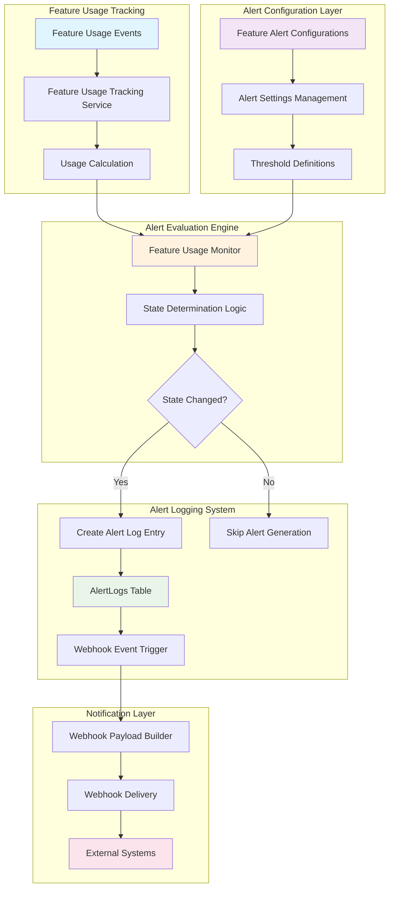
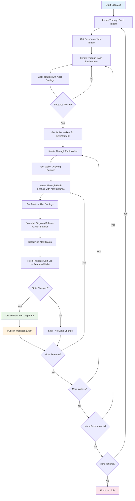
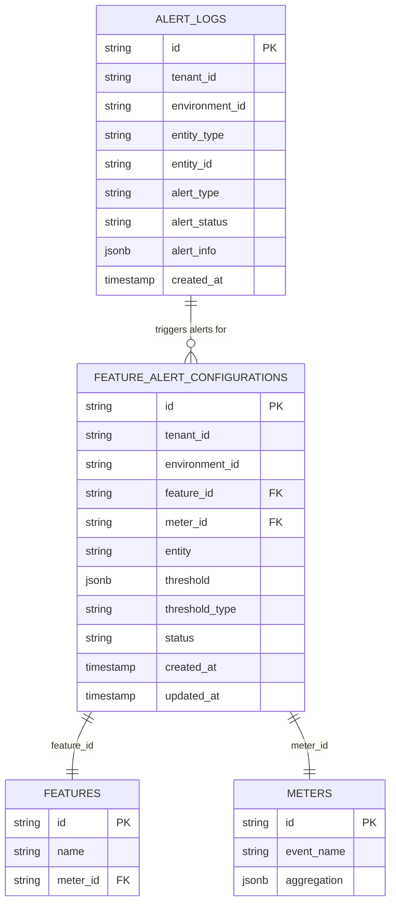
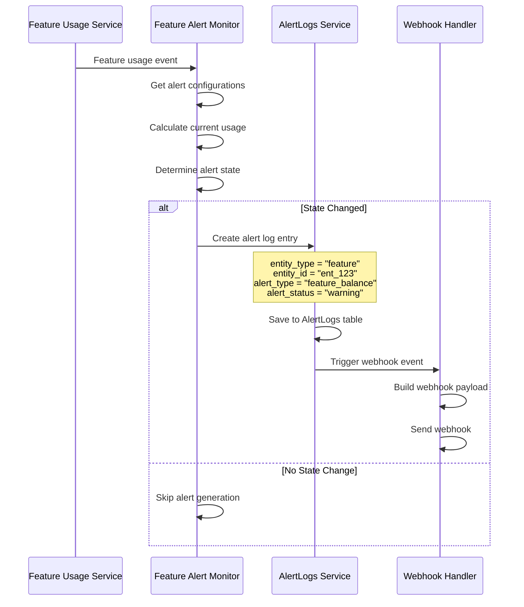
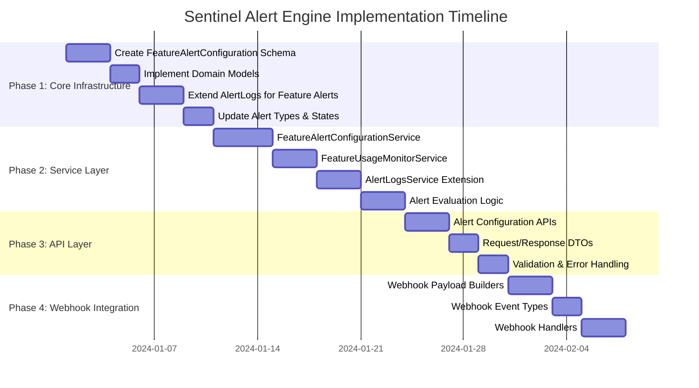
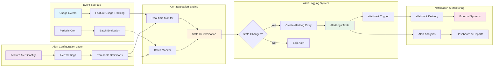
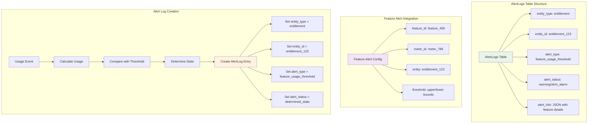
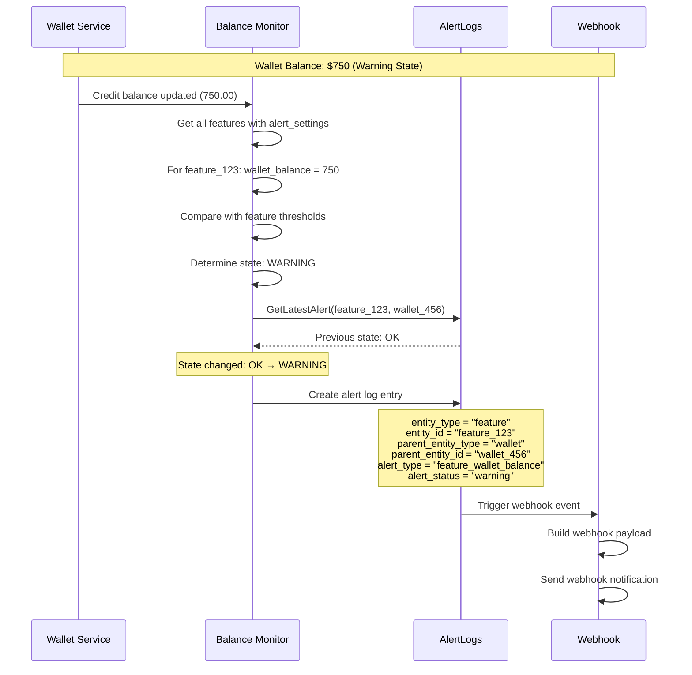
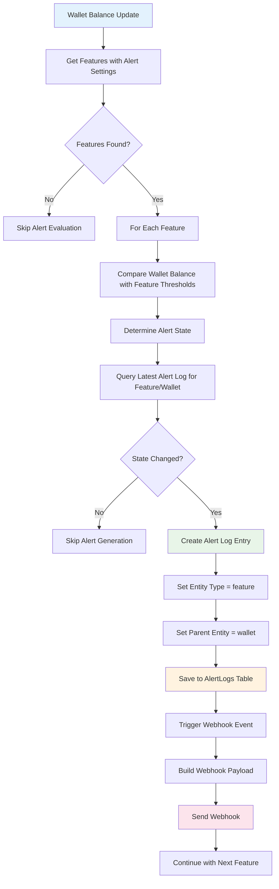

# Feature-Level Alert System (Sentinel Alert Engine)

## 1. Executive Summary

### 1.1 Overview
The Sentinel Alert Engine introduces a comprehensive feature-level alert system that monitors feature usage against configurable thresholds and triggers alerts based on state transitions. This system extends the existing alert-logging infrastructure to provide granular monitoring of feature consumption across different aggregation types.

### 1.2 Objectives
- **Proactive Monitoring**: Enable real-time monitoring of feature usage against configurable thresholds
- **Flexible Alerting**: Support multiple alert states (OK, Warning, In Alarm) with customizable threshold ranges
- **Seamless Integration**: Leverage existing alert infrastructure and webhook system
- **Scalable Architecture**: Support high-volume feature usage monitoring across multiple tenants and environments

### 1.3 Success Metrics
- Reduce feature overage incidents by 80%
- Enable proactive customer engagement through usage alerts
- Provide real-time visibility into feature consumption patterns
- Support 99.9% alert delivery reliability

## 2. Problem Statement

### 2.1 Current State
- No proactive monitoring of feature usage consumption
- Customers experience unexpected overages without warning
- Manual monitoring required for feature usage tracking

### 2.2 Pain Points
- **Reactive Monitoring**: Alerts only trigger after usage limits are exceeded
- **Limited Granularity**: No feature-specific alert configurations
- **Poor User Experience**: Customers surprised by unexpected charges
- **Operational Overhead**: Manual monitoring of feature consumption

## 3. Solution Overview

### 3.1 System Architecture Overview



### 3.2 Core Components

#### 3.1.1 Feature Alert Settings Column
Add an `alert_settings` column to the existing `features` table to store threshold configurations:

```sql
ALTER TABLE features 
ADD COLUMN alert_settings JSONB DEFAULT NULL;

-- Example alert_settings structure:
-- threshold {
--   "upperbound": "1000.00",
--   "lowerbound": "100.00"
-- }
```

#### 3.1.2 Alert State Logic
The system supports three distinct alert states based on ongoing wallet balance comparison with feature thresholds:

- **ok State**: `ongoing_balance >= feature.upperbound` - Balance is at or above the upper threshold (healthy)
- **warning State**: `feature.upperbound > ongoing_balance && ongoing_balance > feature.lowerbound` - Balance is within the warning range
- **in_alarm State**: `ongoing_balance <= feature.lowerbound` - Balance is at or below the lower threshold (critical)

#### 3.1.3 Threshold Configuration
```json
{
  "upperbound": "1000.00",
  "lowerbound": "100.00"
}
```

### 3.2 Architecture Integration

#### 3.2.1 Existing Infrastructure Reuse
- **AlertLogs Table**: Extend to support feature entity type
- **Webhook System**: Leverage existing webhook infrastructure
- **Alert Service**: Extend current alert service for feature monitoring

#### 3.2.2 New Components
- **Feature Alert Settings**: Column-based alert configuration in features table
- **Wallet Balance Monitor**: Component to evaluate wallet balance against feature thresholds
- **Bulk Feature Alert Processor**: Service to process all features for wallet balance alerts
- **Feature Alert Webhook Payloads**: New webhook payload builders

## 4. Technical Specification

### 4.1 Data Models

#### 4.1.1 Feature Alert Settings Schema
```go
// Update existing Feature schema to include alert_settings
func (Feature) Fields() []ent.Field {
    return []ent.Field{
        // ... existing fields ...
        field.JSON("alert_settings", FeatureAlertSettings{}).
            Optional().
            Nillable().
            SchemaType(map[string]string{
                "postgres": "jsonb",
            }),
    }
}

type FeatureAlertSettings struct {
    Upperbound   *decimal.Decimal `json:"upperbound"`
    Lowerbound   *decimal.Decimal `json:"lowerbound"`
    AlertEnabled *bool            `json:"alert_enabled"` // Defaults to false if not provided
}
```

#### 4.1.2 Extended Alert Types
```go
// internal/types/alertlogs.go
const (
    // Existing wallet alerts
    AlertTypeLowOngoingBalance AlertType = "low_ongoing_balance"
    AlertTypeLowCreditBalance  AlertType = "low_credit_balance"
    
    // New feature alerts
    AlertTypeFeatureWalletBalance AlertType = "feature_wallet_balance"
)

const (
    // Existing entity types
    AlertEntityTypeWallet   AlertEntityType = "wallet"
    AlertEntityTypeFeature  AlertEntityType = "feature"  // New entity type
)

// Extended alert states
const (
    AlertStateOk      AlertState = "ok"
    AlertStateWarning AlertState = "warning"  // New state
    AlertStateInAlarm AlertState = "in_alarm"
)
```

#### 4.1.3 Alert Info Structure
```go
type AlertInfo struct {
    Threshold            AlertThreshold        `json:"threshold,omitempty"`              // For wallet alerts
    FeatureAlertSettings *FeatureAlertSettings `json:"feature_alert_settings,omitempty"` // For feature alerts
    ValueAtTime          decimal.Decimal       `json:"value_at_time"`
    Timestamp            time.Time             `json:"timestamp"`
}
```

#### 4.1.4 Alert Logs Schema with Parent Entity Support
```go
type AlertLog struct {
    ID               string
    TenantID         string
    EnvironmentID    string
    EntityType       AlertEntityType  // "wallet" or "feature"
    EntityID         string           // wallet_id or feature_id
    ParentEntityType *string          // "wallet" for feature alerts, nil for wallet alerts
    ParentEntityID   *string          // wallet_id for feature alerts, nil for wallet alerts
    AlertType        AlertType        // "low_ongoing_balance", "feature_wallet_balance", etc.
    AlertStatus      AlertState       // "ok", "warning", "in_alarm"
    AlertInfo        AlertInfo        // Contextual information
    CreatedAt        time.Time
    UpdatedAt        time.Time
}
```

### 4.2 Service Layer

#### 4.2.1 Feature Alert Settings Service
```go
type FeatureAlertSettingsService interface {
    CreateFeatureAlertSettings(ctx context.Context, featureID string, settings *FeatureAlertSettings) error
    UpdateFeatureAlertSettings(ctx context.Context, featureID string, settings *FeatureAlertSettings) error
    GetFeatureAlertSettings(ctx context.Context, featureID string) (*FeatureAlertSettings, error)
    // No delete method - settings can be set to null instead
}
```

#### 4.2.2 Wallet Balance Alert Monitor Service
```go
type WalletBalanceAlertMonitorService interface {
    // Triggered on credit balance updates (static runtime flag)
    EvaluateWalletBalanceAlerts(ctx context.Context, walletID string) error
    
    // Triggered by cron for ongoing balance
    EvaluateAllWalletBalanceAlerts(ctx context.Context) error
    
    // Bulk process all features for a wallet
    ProcessWalletFeaturesAlerts(ctx context.Context, walletID string, balance decimal.Decimal) error
}
```

### 4.3 Alert Evaluation Logic

#### 4.3.1 Wallet Balance Comparison
The system compares wallet balance against feature alert thresholds:
- **Credit Balance**: Evaluated on balance updates (static runtime flag)
- **Ongoing Balance**: Evaluated by cron job periodically
- **Bulk Processing**: All features are processed for each wallet

#### 4.3.2 State Determination Algorithm
```go
func DetermineFeatureAlertStatus(ongoingBalance decimal.Decimal, alertSettings *FeatureAlertSettings) AlertState {
    if ongoingBalance.GreaterThanOrEqual(*alertSettings.Upperbound) {
        return AlertStateOk
    } else if ongoingBalance.GreaterThan(*alertSettings.Lowerbound) && 
              ongoingBalance.LessThan(*alertSettings.Upperbound) {
        return AlertStateWarning
    } else { // ongoingBalance <= lowerbound
        return AlertStateInAlarm
    }
}
```

#### 4.3.3 Feature Alert State Check Cron Workflow

The system runs a scheduled cron job to evaluate feature alerts against wallet ongoing balances:



**Detailed Workflow Steps:**

1. **Tenant & Environment Iteration**
   - Iterate through each tenant
   - Get all environments for the current tenant
   - Process each environment in the context

2. **Bulk Feature Fetch**
   - Query ALL features for the tenant and environment
   - No database-level filtering on `alert_settings`
   - In-memory filter: Skip features where:
     - `alert_settings == nil` OR
     - `alert_settings.alert_enabled == false`
   - Only process features with `alert_enabled = true`

3. **Active Wallet Fetch**
   - Get all active wallets for the current tenant and environment
   - Filter wallets with `wallet_status = active` and `alert_enabled = true`

4. **Per-Wallet Processing**
   - For each active wallet:
     - Get the **ongoing balance** (real-time balance including pending charges)
     - Iterate through all features with alert settings

5. **Feature Alert Evaluation**
   - For each feature:
     - Skip if `alert_settings == nil`
     - Skip if `alert_settings.alert_enabled == false`
     - Get the `alert_settings` (upperbound, lowerbound, alert_enabled)
     - Compare `ongoing_balance` against thresholds
     - Determine alert status using state determination algorithm

6. **Alert State Determination**
   ```
   if ongoing_balance >= upperbound:
       alert_status = ok
   
   if upperbound > ongoing_balance && ongoing_balance > lowerbound:
       alert_status = warning
   
   if ongoing_balance <= lowerbound:
       alert_status = in_alarm
   ```

7. **State Transition Check**
   - Fetch latest alert log for this specific `feature_id` + `wallet_id` combination using:
     ```go
     GetLatestAlert(
         ctx,
         entity_type: "feature",
         entity_id: feature.id,
         alert_type: "feature_wallet_balance",
         parent_entity_type: "wallet",
         parent_entity_id: wallet.id
     )
     ```
   - Compare previous alert status with newly determined status
   - Apply state transition rules (skip if OK and no previous alert)
   - Only proceed if state has changed or problem detected

8. **Alert Logging & Webhook Publishing**
   - If state changed or problem detected:
     - Create alert log entry with:
       - `entity_type` = "feature"
       - `entity_id` = feature ID
       - `parent_entity_type` = "wallet"
       - `parent_entity_id` = wallet ID
       - `alert_type` = "feature_wallet_balance"
       - `alert_status` = determined status (ok, warning, in_alarm)
       - `alert_info` = { feature_alert_settings, value_at_time, timestamp }
     - Publish webhook event with payload containing:
       - Complete feature object (with alert_settings)
       - Complete wallet object  
       - `alert_status`
       - `alert_type`
   - Note: Wallet ID retrieved using `lo.FromPtr(alertLog.ParentEntityID)`

#### 4.3.4 State Transition Logic

The system implements intelligent state transition logic to prevent alert spam:

**When to Log & Publish Alert:**

1. **Fetch Previous Alert** (Unified Method)
   ```go
   // Single method handles all alert types with optional parent entity filtering
   prev_alertLog = GetLatestAlert(
       ctx,
       entity_type: "feature",
       entity_id: feature.id,
       alert_type: "feature_wallet_balance",
       parent_entity_type: "wallet",    // Optional - nil for wallet alerts
       parent_entity_id: wallet.id      // Optional - nil for wallet alerts
   )
   ```

2. **State Transition Rules**

   | Determined Status | Previous Status | Action |
   |------------------|----------------|--------|
   | **ok** | in_alarm OR warning | ✅ Create new alert log (recovery) |
   | **ok** | ok | ❌ Skip - no change |
   | **ok** | NULL (no previous) | ❌ Skip - system healthy from start |
   | **warning** | ok OR in_alarm | ✅ Create new alert log (state change) |
   | **warning** | warning | ❌ Skip - no change |
   | **warning** | NULL (no previous) | ✅ Create new alert log (problem detected) |
   | **in_alarm** | ok OR warning | ✅ Create new alert log (escalation) |
   | **in_alarm** | in_alarm | ❌ Skip - no change |
   | **in_alarm** | NULL (no previous) | ✅ Create new alert log (critical problem) |

3. **State Transition Logic (Code)**
   ```go
   shouldCreateLog := false
   
   if prev_alertLog == nil {
       // No previous alert exists
       if determined_alert_status == AlertStateOk {
           // System is healthy from the start - no need to log
           shouldCreateLog = false
       } else {
           // Problem state detected for first time (WARNING or IN_ALARM) - create alert
           shouldCreateLog = true
       }
   } else if prev_alertLog.alert_status != determined_alert_status {
       // State changed - create new alert log (recovery, escalation, or change)
       shouldCreateLog = true
   } else {
       // State unchanged - skip alert generation
       shouldCreateLog = false
   }
   ```

4. **Alert Log Creation**
   - Only create alert log when `shouldCreateLog == true`
   - Store complete alert context in `alert_info`:
     - Feature alert settings (upperbound, lowerbound, alert_enabled)
     - Ongoing balance at time of check
     - Timestamp
   - For feature alerts, use parent entity fields:
     - `parent_entity_type` = "wallet"
     - `parent_entity_id` = wallet.id
   - For wallet alerts, parent entity fields are nil

5. **Webhook Event Publishing**
   - Event Name: `feature.balance.threshold.alert` (for all states)
   - Payload includes:
     ```json
     {
       "event_type": "feature.balance.threshold.alert",
       "alert_type": "feature_wallet_balance",
       "alert_status": "warning",
       "feature": { 
         "id": "feat_xxx",
         "name": "API Calls",
         "alert_settings": {
           "upperbound": "1000",
           "lowerbound": "100",
           "alert_enabled": true
         }
       },
       "wallet": { 
         "id": "wallet_xxx",
         "balance": "750",
         "currency": "usd"
       }
     }
     ```

### 4.4 Alert Logging Integration Details

#### 4.4.1 AlertLogs Table Integration



#### 4.4.2 Alert Logging Workflow



### 4.5 Webhook Integration

#### 4.5.1 New Webhook Events
```go
// internal/types/webhook.go
const (
    // Feature alert events - single event for all states
    WebhookEventFeatureBalanceThresholdAlert = "feature.balance.threshold.alert"
    
    // Wallet alert events (existing)
    WebhookEventWalletOngoingBalanceDropped   = "wallet.ongoing_balance.dropped"
    WebhookEventWalletOngoingBalanceRecovered = "wallet.ongoing_balance.recovered"
    WebhookEventWalletCreditBalanceDropped    = "wallet.credit_balance.dropped"
    WebhookEventWalletCreditBalanceRecovered  = "wallet.credit_balance.recovered"
)
```

#### 4.4.2 Feature Alert Webhook Payload
```go
type FeatureAlertWebhookPayload struct {
    EventType       string                `json:"event_type"`
    FeatureID       string                `json:"feature_id"`
    FeatureName     string                `json:"feature_name"`
    MeterID         string                `json:"meter_id"`
    Entity          string                `json:"entity"` // entitlement_id, customer_id, etc.
    EntityType      string                `json:"entity_type"` // entitlement, customer, subscription, etc.
    AlertState      types.AlertState      `json:"alert_state"`
    CurrentUsage    decimal.Decimal       `json:"current_usage"`
    Threshold       FeatureAlertThreshold `json:"threshold"`
    AggregationType types.AggregationType `json:"aggregation_type"`
    Period          string                `json:"period"`
    Timestamp       time.Time             `json:"timestamp"`
    TenantID        string                `json:"tenant_id"`
    EnvironmentID   string                `json:"environment_id"`
}
```

### 4.5 API Endpoints

#### 4.5.1 Feature Alert Settings Management

Alert settings are managed directly through the standard Feature API endpoints:

```go
// POST /api/v1/features - Create Feature with Alert Settings
type CreateFeatureRequest struct {
    Name          string                      `json:"name" binding:"required"`
    Description   string                      `json:"description"`
    Type          FeatureType                 `json:"type" binding:"required"`
    MeterID       string                      `json:"meter_id,omitempty"`
    AlertSettings *FeatureAlertSettings       `json:"alert_settings,omitempty"`
}

// PUT /api/v1/features/{feature_id} - Update Feature Alert Settings
type UpdateFeatureRequest struct {
    Name          *string                     `json:"name,omitempty"`
    Description   *string                     `json:"description,omitempty"`
    AlertSettings *FeatureAlertSettings       `json:"alert_settings,omitempty"`
}
```

**Feature CREATE Behavior:**
- Normalization happens in `ToFeature()` DTO method (NOT in validation)
- If only `upperbound` provided → `lowerbound = upperbound`
- If only `lowerbound` provided → `upperbound = lowerbound`
- If `alert_enabled` not provided → defaults to `false`
- Validation: At least one bound required, `upperbound >= lowerbound`

**Feature UPDATE Behavior:**
- NO normalization - only update provided fields
- Validation happens in service layer AFTER merging with existing values
- If request has empty `alert_settings` object → error (at least one field required)
- Merge existing values with request values, then validate
- Validation: `upperbound >= lowerbound` on final merged state

```go
// Example UPDATE workflow in service layer:
1. Get existing feature from DB
2. Start with existing alert_settings
3. Overwrite only fields provided in request
4. Validate final merged state
5. If valid, assign to feature and save
```

## 5. Implementation Plan

### 5.1 Implementation Workflow with Alert Logging Integration



### 5.2 Phase 1: Core Infrastructure (Week 1-2)
- [x] Add alert_settings column to features table
- [x] Update Feature Ent schema to include alert_settings (with alert_enabled field)
- [x] Extend AlertLogs to support feature entity type
- [x] Add parent_entity_type and parent_entity_id columns (nillable, optional)
- [x] Update alert types and states in types package
- [x] Create index on alert_logs for parent entity queries

### 5.3 Phase 2: Service Layer (Week 3-4)
- [x] Feature alert settings integrated into FeatureService (CREATE/UPDATE)
- [x] CREATE: Normalization in `ToFeature()` DTO method
- [x] UPDATE: Validation after merge in service layer
- [x] Extend AlertLogsService for feature alerts
- [x] Consolidate repository methods into single `GetLatestAlert()`
- [x] Implement bulk feature processing logic in cron job
- [x] State transition logic (skip OK alerts when no previous alert)

### 5.4 Phase 3: API Layer (Week 5)
- [x] Feature alert settings managed via existing Feature API
- [x] Implement request/response DTOs with alert_settings
- [x] Add validation: at least one field required in UPDATE
- [x] CREATE validation: at least one bound required
- [x] UPDATE validation: final merged state must be valid
- [x] Error handling for invalid configurations

### 5.4 Phase 4: Webhook Integration (Week 6)
- [x] Create feature alert webhook payload builders
- [x] Extend webhook event types (feature.balance.threshold.alert)
- [x] Implement feature alert webhook handlers
- [x] Payload includes complete feature and wallet objects
- [x] Use parent_entity_id for wallet retrieval

### 5.5 Phase 5: Monitoring Integration (Week 7-8)
- [x] Integrate with wallet balance monitoring
- [x] Create cron job for periodic alert checks
- [x] In-memory filtering for alert_enabled features
- [x] Add comprehensive structured logging
- [x] Log messages: "evaluating", "skipping", "creating", "alert log created"
- [x] Accurate log messages (no misleading "logged successfully" when skipped)

### 5.6 Phase 6: Testing & Documentation (Week 9-10)
- [ ] Comprehensive unit and integration tests
- [ ] Performance testing with high-volume scenarios
- [ ] API documentation and examples
- [ ] User guide and troubleshooting documentation

## 6. Integration Points

### 6.1 Feature Usage Tracking Integration
- Hook into existing feature usage calculation pipeline
- Trigger alert evaluation on usage updates
- Support all aggregation types (SUM, MAX, COUNT, etc.)

### 6.2 Existing Alert Infrastructure
- Reuse AlertLogs table with new entity type
- Leverage existing webhook delivery system
- Maintain consistent alert state transition logic

### 6.3 Cron Job Integration
- Extend existing cron infrastructure
- Periodic evaluation of all feature alert configurations
- Catch any missed real-time evaluations

### 6.4 Complete Data Flow Integration



### 6.5 AlertLogs Table Schema Integration



## 7. Security & Performance Considerations

### 7.1 Security
- **Tenant Isolation**: All alert configurations scoped to tenant/environment
- **Access Control**: Feature alert configuration requires appropriate permissions
- **Data Protection**: No sensitive data in webhook payloads
- **Audit Trail**: Complete audit log of configuration changes

### 7.2 Performance
- **Efficient Queries**: Optimized database queries with proper indexing
- **Caching Strategy**: Cache frequently accessed configurations
- **Batch Processing**: Efficient bulk alert evaluation for cron jobs
- **Rate Limiting**: Prevent webhook spam with intelligent rate limiting

### 7.3 Scalability
- **Horizontal Scaling**: Stateless service design for easy scaling
- **Database Optimization**: Proper indexing and query optimization
- **Async Processing**: Non-blocking alert evaluation and webhook delivery
- **Resource Management**: Configurable limits and throttling

## 8. Monitoring & Observability

### 8.1 Metrics
- Alert evaluation latency
- Webhook delivery success rate
- Configuration creation/update rates
- Alert state transition frequencies

### 8.2 Logging
- Structured logging for all alert evaluations
- Detailed webhook delivery logs
- Configuration change audit logs
- Error tracking and alerting

### 8.3 Health Checks
- Service health endpoints
- Database connectivity checks
- Webhook delivery system health
- Alert evaluation pipeline status

## 9. Testing Strategy

### 9.1 Unit Tests
- Alert state determination logic
- Threshold validation
- Usage calculation accuracy
- Service layer functionality

### 9.2 Integration Tests
- End-to-end alert flow
- Webhook delivery verification
- Database operations
- API endpoint functionality

### 9.3 Performance Tests
- High-volume alert evaluation
- Concurrent configuration management
- Webhook delivery under load
- Database performance with large datasets

## 10. Migration & Rollout

### 10.1 Database Migration
- Create new tables with proper constraints
- Add indexes for optimal performance
- Ensure backward compatibility

### 10.2 Feature Flags
- Gradual rollout with feature flags
- Tenant-by-tenant enablement
- Easy rollback capability

### 10.3 Monitoring
- Real-time monitoring during rollout
- Performance impact assessment
- User feedback collection

## 11. Future Enhancements

### 11.1 Advanced Alerting
- Multi-condition alerts (AND/OR logic)
- Time-based alert suppression
- Alert escalation policies
- Custom alert templates

### 11.2 Analytics Integration
- Alert effectiveness analytics
- Usage pattern analysis
- Predictive alerting capabilities
- Custom dashboard integration

### 11.3 External Integrations
- Slack/Teams notifications
- PagerDuty integration
- Email alert delivery
- SMS notifications

## 12. Success Criteria

### 12.1 Functional Requirements
- ✅ Support all three alert states (OK, Warning, In Alarm)
- ✅ Real-time alert evaluation on usage updates
- ✅ Configurable thresholds per feature/entity combination
- ✅ Seamless webhook integration
- ✅ Comprehensive API for configuration management

### 12.2 Non-Functional Requirements
- ✅ 99.9% alert delivery reliability
- ✅ Sub-second alert evaluation latency
- ✅ Support for 10,000+ concurrent alert configurations
- ✅ Zero-downtime deployments
- ✅ Complete audit trail and observability

### 12.3 Business Impact
- ✅ 80% reduction in feature overage incidents
- ✅ Improved customer satisfaction through proactive alerts
- ✅ Enhanced operational visibility into feature usage
- ✅ Reduced support tickets related to unexpected charges

---

## Appendix A: Implementation Details

### A.1 Key Design Decisions

#### A.1.1 Alert Settings Storage
- **Decision**: Store alert settings as JSONB column in features table
- **Rationale**: Flexible schema, easy to extend, efficient queries
- **Fields**:
  - `upperbound`: *decimal.Decimal (optional pointer)
  - `lowerbound`: *decimal.Decimal (optional pointer)
  - `alert_enabled`: *bool (defaults to false if not provided)

#### A.1.2 Parent Entity Architecture
- **Decision**: Add `parent_entity_type` and `parent_entity_id` columns to alert_logs
- **Rationale**: 
  - Replaces metadata approach for cleaner queries
  - Supports hierarchical alerts (feature → wallet)
  - Enables efficient index-based lookups
- **Implementation**: 
  - Both columns are nillable and optional
  - Wallet alerts: parent fields are nil
  - Feature alerts: parent_entity_type="wallet", parent_entity_id=wallet.id

#### A.1.3 Alert Enabled Default
- **Decision**: `alert_enabled` defaults to `false` when not provided
- **Rationale**: 
  - Opt-in model for alerts (safer default)
  - Explicit activation required
  - Prevents accidental alert spam on new features

#### A.1.4 Feature Filtering Strategy
- **Decision**: NO database-level filtering on `alert_settings`, filter in-memory
- **Rationale**:
  - Simpler query logic
  - More flexible (can check multiple conditions)
  - Avoids complex DB filters
- **Implementation**:
  - Fetch all features for tenant/environment
  - Skip if `alert_settings == nil`
  - Skip if `alert_settings.alert_enabled == false`

#### A.1.5 Repository Method Consolidation
- **Decision**: Single `GetLatestAlert()` method replaces multiple specialized methods
- **Old Methods** (removed):
  - `GetLatestByEntity`
  - `GetLatestByEntityAndAlertType`
  - `GetLatestByEntityAlertTypeAndMetadata`
- **New Method**:
  ```go
  GetLatestAlert(
      ctx context.Context,
      entityType types.AlertEntityType,
      entityID string,
      alertType *types.AlertType,              // optional
      parentEntityType *string,                 // optional
      parentEntityID *string                    // optional
  ) (*AlertLog, error)
  ```
- **Benefits**:
  - Single method handles all alert types
  - Optional parameters enable flexible queries
  - Cleaner service layer code

### A.2 CREATE vs UPDATE Behavior

#### A.2.1 Feature CREATE
**Normalization Location**: `ToFeature()` in DTO layer

```go
func (r *CreateFeatureRequest) ToFeature(ctx context.Context) (*feature.Feature, error) {
    var alertSettings *types.FeatureAlertSettings
    if r.AlertSettings != nil {
        alertSettings = &types.FeatureAlertSettings{
            Upperbound:   r.AlertSettings.Upperbound,
            Lowerbound:   r.AlertSettings.Lowerbound,
            AlertEnabled: r.AlertSettings.AlertEnabled,
        }
        
        // Normalize: If only one bound provided, set the other
        if alertSettings.Upperbound != nil && alertSettings.Lowerbound == nil {
            alertSettings.Lowerbound = alertSettings.Upperbound
        }
        if alertSettings.Lowerbound != nil && alertSettings.Upperbound == nil {
            alertSettings.Upperbound = alertSettings.Lowerbound
        }
        
        // Default alert_enabled to false
        if alertSettings.AlertEnabled == nil {
            alertSettings.AlertEnabled = lo.ToPtr(false)
        }
    }
    
    return &feature.Feature{
        // ... other fields ...
        AlertSettings: alertSettings,
    }, nil
}
```

**Validation**: Pure validation, NO mutation
```go
func (r *CreateFeatureRequest) Validate() error {
    if r.AlertSettings != nil {
        // Only validate - no mutation
        if err := r.AlertSettings.Validate(); err != nil {
            return err
        }
    }
    return nil
}
```

#### A.2.2 Feature UPDATE
**Validation Location**: Service layer AFTER merging

```go
func (s *featureService) UpdateFeature(ctx context.Context, id string, req dto.UpdateFeatureRequest) (*dto.FeatureResponse, error) {
    feature, err := s.FeatureRepo.Get(ctx, id)
    if err != nil {
        return nil, err
    }
    
    if req.AlertSettings != nil {
        // 1. Check if at least one field provided
        if req.AlertSettings.Upperbound == nil && 
           req.AlertSettings.Lowerbound == nil && 
           req.AlertSettings.AlertEnabled == nil {
            return nil, ierr.NewError("at least one alert setting field must be provided")
        }
        
        // 2. Start with existing settings (or empty)
        newAlertSettings := &types.FeatureAlertSettings{}
        if feature.AlertSettings != nil {
            newAlertSettings.Upperbound = feature.AlertSettings.Upperbound
            newAlertSettings.Lowerbound = feature.AlertSettings.Lowerbound
            newAlertSettings.AlertEnabled = feature.AlertSettings.AlertEnabled
        }
        
        // 3. Overwrite only fields provided in request
        if req.AlertSettings.Upperbound != nil {
            newAlertSettings.Upperbound = req.AlertSettings.Upperbound
        }
        if req.AlertSettings.Lowerbound != nil {
            newAlertSettings.Lowerbound = req.AlertSettings.Lowerbound
        }
        if req.AlertSettings.AlertEnabled != nil {
            newAlertSettings.AlertEnabled = req.AlertSettings.AlertEnabled
        }
        
        // 4. Validate final merged state
        if err := newAlertSettings.Validate(); err != nil {
            return nil, err
        }
        
        // 5. Validation passed - assign to feature
        feature.AlertSettings = newAlertSettings
    }
    
    // Save to DB
    if err := s.FeatureRepo.Update(ctx, feature); err != nil {
        return nil, err
    }
    
    return &dto.FeatureResponse{Feature: feature}, nil
}
```

**DTO Validation**: Empty (validation happens in service)
```go
func (r *UpdateFeatureRequest) Validate() error {
    // No validation here - done in service after merge
    return nil
}
```

### A.3 State Transition Logic

#### A.3.1 The "Healthy from Start" Rule
**Key Insight**: If no previous alert exists and status is OK, don't create an alert

**Rationale**:
- OK status with no history means system was always healthy
- No need to log "everything is fine"
- Reduces noise and database entries
- Only log when problems occur or recover

**Implementation**:
```go
if existingAlert == nil {
    if req.AlertStatus == types.AlertStateOk {
        // System is healthy from the start - skip
        s.Logger.Debugw("skipping alert - no previous alert and status is ok (system healthy)")
        return nil
    } else {
        // Problem detected for first time - create alert
        shouldCreateLog = true
    }
}
```

#### A.3.2 State Transition Matrix

| Current State | Previous State | Action | Reason |
|--------------|---------------|--------|---------|
| OK | NULL | ❌ Skip | Healthy from start |
| WARNING | NULL | ✅ Log | Problem detected |
| IN_ALARM | NULL | ✅ Log | Critical problem |
| OK | WARNING | ✅ Log | Recovery |
| OK | IN_ALARM | ✅ Log | Recovery |
| WARNING | OK | ✅ Log | Degradation |
| WARNING | IN_ALARM | ✅ Log | Improvement |
| IN_ALARM | OK | ✅ Log | Critical drop |
| IN_ALARM | WARNING | ✅ Log | Escalation |
| OK | OK | ❌ Skip | No change |
| WARNING | WARNING | ❌ Skip | No change |
| IN_ALARM | IN_ALARM | ❌ Skip | No change |

### A.4 Logging Strategy

#### A.4.1 Log Levels
- **DEBUG**: Evaluation, skipping, detailed flow
- **INFO**: Alert creation, webhook events
- **ERROR**: Failures, errors

#### A.4.2 Log Messages
- `"evaluating alert status"` - Starting evaluation (DEBUG)
- `"skipping alert - no previous alert and status is ok"` - Healthy skip (DEBUG)
- `"skipping alert - status unchanged"` - No state change (DEBUG)
- `"creating alert - problem detected for first time"` - First problem (INFO)
- `"creating alert - state changed"` - State transition (INFO)
- `"alert log created successfully"` - DB write success (INFO)
- `"feature alert check completed"` - Cron completed (DEBUG)

#### A.4.3 Misleading Logs AVOIDED
- ❌ DON'T: "logging alert" at start (might skip)
- ❌ DON'T: "alert logged successfully" when skipped
- ✅ DO: "evaluating alert status" (accurate)
- ✅ DO: "alert log created successfully" (only when actually created)

### A.5 Pointer Handling
- **Pattern**: Use `lo.FromPtr()` for dereferencing pointers
- **Examples**:
  ```go
  walletID := lo.FromPtr(alertLog.ParentEntityID)
  upperbound := lo.FromPtr(f.Upperbound)
  ```
- **Rationale**: Safe dereferencing with zero-value fallback

---

## Appendix B: Database Schema

### B.1 Feature Alert Settings Column
```sql
-- Add alert_settings column to existing features table
ALTER TABLE features 
ADD COLUMN alert_settings JSONB DEFAULT NULL;

-- Create index for features with alert settings (optional - we filter in-memory)
CREATE INDEX idx_features_alert_settings ON features(alert_settings) WHERE alert_settings IS NOT NULL;

-- Example alert_settings structure:
-- {
--   "upperbound": "1000.00",
--   "lowerbound": "100.00",
--   "alert_enabled": false
-- }
```

### B.2 Alert Logs Parent Entity Columns
```sql
-- Add parent entity columns to alert_logs table
ALTER TABLE alert_logs
ADD COLUMN parent_entity_type VARCHAR(50),
ADD COLUMN parent_entity_id VARCHAR(255);

-- Create composite index for efficient parent entity queries
CREATE INDEX idx_alert_logs_parent_entity 
ON alert_logs(entity_type, entity_id, alert_type, parent_entity_type, parent_entity_id) 
WHERE parent_entity_id IS NOT NULL;

-- Create index for latest alert queries
CREATE INDEX idx_alert_logs_entity_type_alert_type_created 
ON alert_logs(entity_type, entity_id, alert_type, created_at DESC);
```

## Appendix C: API Examples

### Create Feature with Alert Settings
```bash
curl -X POST /api/v1/features \
  -H "Content-Type: application/json" \
  -d '{
    "name": "API Calls",
    "description": "Track API usage",
    "type": "usage",
    "meter_id": "meter_123",
    "alert_settings": {
      "upperbound": "1000.00",
      "lowerbound": "100.00",
      "alert_enabled": true
    }
  }'
# Response: lowerbound will equal upperbound if only one provided
# alert_enabled defaults to false if not provided
```

### Update Feature Alert Settings
```bash
# Update only upperbound (lowerbound and alert_enabled remain unchanged)
curl -X PUT /api/v1/features/feature_123 \
  -H "Content-Type: application/json" \
  -d '{
    "alert_settings": {
      "upperbound": "1500.00"
    }
  }'

# Update multiple fields
curl -X PUT /api/v1/features/feature_123 \
  -H "Content-Type: application/json" \
  -d '{
    "alert_settings": {
      "upperbound": "2000.00",
      "lowerbound": "200.00",
      "alert_enabled": true
    }
  }'

# Error: Empty alert_settings object
curl -X PUT /api/v1/features/feature_123 \
  -H "Content-Type: application/json" \
  -d '{
    "alert_settings": {}
  }'
# Response: 400 Bad Request - "at least one alert setting field must be provided"
```

### Get Feature with Alert Settings
```bash
curl -X GET /api/v1/features/feature_123
```

### List Features (filter in app, not API)
```bash
# Get all features, filter for alert_settings != null && alert_enabled = true in code
curl -X GET /api/v1/features
```

### Webhook Payload Example
```json
{
  "event_type": "feature.balance.threshold.alert",
  "alert_type": "feature_wallet_balance",
  "alert_status": "warning",
  "feature": {
    "id": "feature_123",
    "name": "API Calls",
    "description": "Track API usage",
    "type": "usage",
    "meter_id": "meter_789",
    "alert_settings": {
      "upperbound": "1000.00",
      "lowerbound": "100.00",
      "alert_enabled": true
    },
    "tenant_id": "tenant_123",
    "environment_id": "env_456"
  },
  "wallet": {
    "id": "wallet_456",
    "balance": "750.00",
    "currency": "usd",
    "status": "active",
    "alert_enabled": true
  },
  "timestamp": "2024-01-15T10:30:00Z"
}
```

## Appendix D: Alert Logging Integration Examples

### AlertLogs Table Entry Examples

#### Feature Alert Log Entry
```sql
INSERT INTO alert_logs (
    id,
    tenant_id,
    environment_id,
    entity_type,
    entity_id,
    parent_entity_type,
    parent_entity_id,
    alert_type,
    alert_status,
    alert_info,
    created_at
) VALUES (
    'alert_12345',
    'tenant_123',
    'env_456',
    'feature',                        -- entity_type = feature
    'feature_123',                    -- entity_id = feature ID
    'wallet',                         -- parent_entity_type = wallet
    'wallet_456',                     -- parent_entity_id = wallet ID
    'feature_wallet_balance',
    'warning',
    '{
        "feature_alert_settings": {
            "upperbound": "1000.00",
            "lowerbound": "100.00",
            "alert_enabled": true
        },
        "value_at_time": "750.00",
        "timestamp": "2024-01-15T10:30:00Z"
    }',
    NOW()
);
```

#### Wallet Alert Log Entry (for comparison)
```sql
INSERT INTO alert_logs (
    id,
    tenant_id,
    environment_id,
    entity_type,
    entity_id,
    parent_entity_type,              -- NULL for wallet alerts
    parent_entity_id,                -- NULL for wallet alerts
    alert_type,
    alert_status,
    alert_info,
    created_at
) VALUES (
    'alert_67890',
    'tenant_123',
    'env_456',
    'wallet',                        -- entity_type = wallet
    'wallet_456',                    -- entity_id = wallet ID
    NULL,                            -- no parent for wallet alerts
    NULL,                            -- no parent for wallet alerts
    'low_ongoing_balance',
    'in_alarm',
    '{
        "threshold": {
            "value": "100.00"
        },
        "value_at_time": "50.00",
        "timestamp": "2024-01-15T10:30:00Z"
    }',
    NOW()
);
```

### Alert State Transition Example


### Wallet Balance Alert Evaluation Workflow


## Appendix E: Sequence Diagrams

### E.1 Cron Job Alert Evaluation Flow
```
sequenceDiagram
  autonumber
  participant Cron as Cron Wallet Handler
  participant FeatureSvc as FeatureService
  participant WalletSvc as WalletService
  participant AlertSvc as AlertLogsService
  participant Repo as AlertLogsRepo
  participant Webhook as WebhookPublisher

  Cron->>FeatureSvc: ListFeatures() per tenant/env (NO filtering)
  Cron->>WalletSvc: ListWallets()
  loop For each wallet
    Cron->>WalletSvc: ComputeOngoingBalance(wallet)
    Note over Cron: For each feature with alert_settings
    alt alert_settings != nil && alert_enabled == true
      Cron->>AlertSvc: LogAlert(<br/>type=FeatureWalletBalance,<br/>entity=Feature,<br/>parent_entity_type=wallet,<br/>parent_entity_id=wallet.id,<br/>status=DetermineStatus(balance, bounds))
      AlertSvc->>Repo: GetLatestAlert(<br/>entity_type=feature,<br/>entity_id=feature.id,<br/>alert_type=feature_wallet_balance,<br/>parent_entity_type=wallet,<br/>parent_entity_id=wallet.id)
      Repo-->>AlertSvc: Latest alert or nil
      alt existingAlert == nil && status == OK
        Note right of AlertSvc: Skip - system healthy from start
      else existingAlert != nil && status == existingAlert.status
        Note right of AlertSvc: Skip - status unchanged
      else State changed or problem detected
        AlertSvc->>Repo: Create AlertLog (with parent_entity fields)
        AlertSvc->>Webhook: Publish feature.balance.threshold.alert
        Webhook-->>AlertSvc: Ack/Err
      end
    else alert_settings == nil || alert_enabled == false
      Note right of Cron: Skip feature - alerts disabled
    end
    Cron->>AlertSvc: LogAlert(type=WalletBalance, entity=Wallet, status=...)
  end
```

### E.2 Webhook Payload Building Flow
```
sequenceDiagram
  autonumber
  participant Publisher as AlertLogsService
  participant PayloadFactory as Webhook Payload Factory
  participant Builder as AlertPayloadBuilder
  participant FeatureSvc as FeatureService
  participant WalletSvc as WalletService
  participant Sink as Webhook Sink

  Publisher->>PayloadFactory: Build(WebhookEventFeatureBalanceThresholdAlert, alert_log)
  PayloadFactory-->>Builder: AlertPayloadBuilder
  Builder->>Builder: Extract entity_id (feature_id)
  Builder->>Builder: Extract parent_entity_id (wallet_id) using lo.FromPtr()
  alt Has feature_id and wallet_id
    Builder->>FeatureSvc: GetFeature(feature_id)
    FeatureSvc-->>Builder: Feature (with alert_settings)
    Builder->>WalletSvc: GetWallet(wallet_id)
    WalletSvc-->>Builder: Wallet (with balance)
    Builder-->>Publisher: JSON payload {<br/>event_type, alert_type, alert_status,<br/>feature, wallet<br/>}
    Publisher->>Sink: Publish(payload)
    Sink-->>Publisher: Ack
  else Missing IDs
    Builder-->>Publisher: error (skip webhook)
  end
```