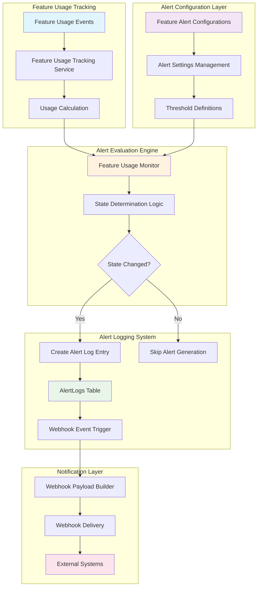
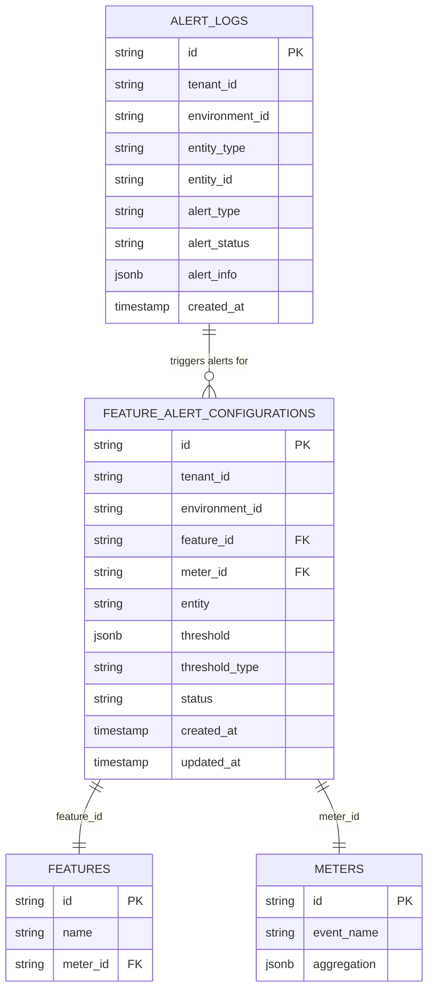
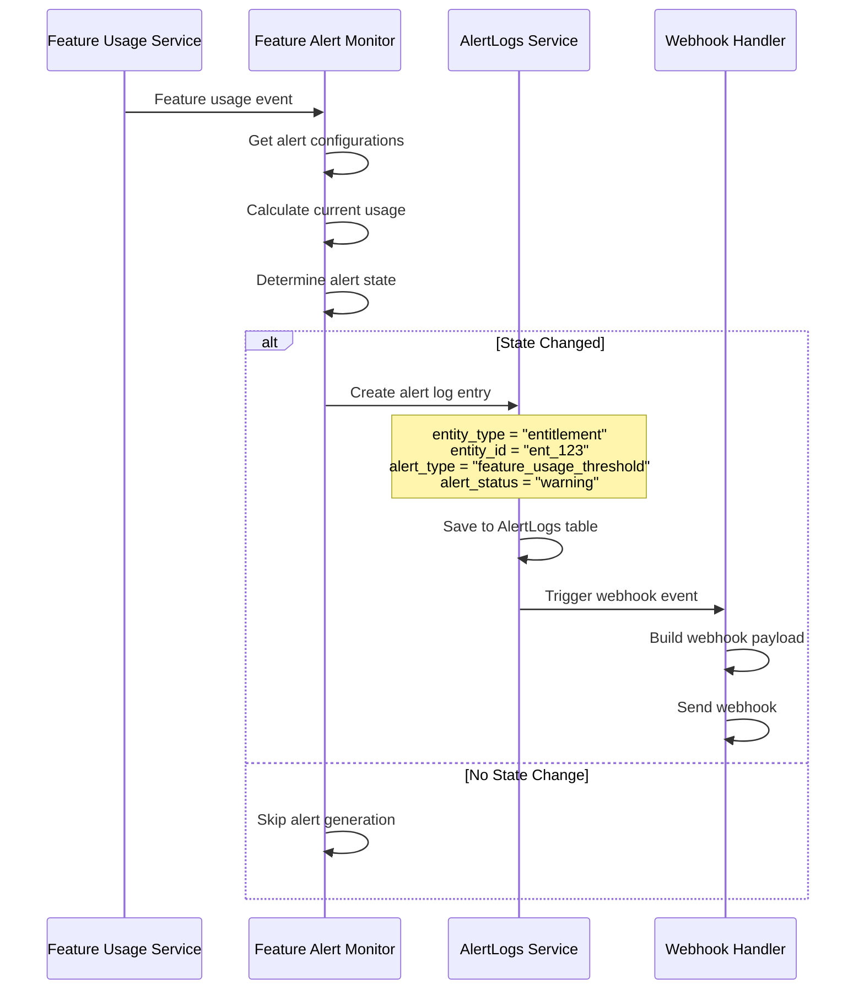
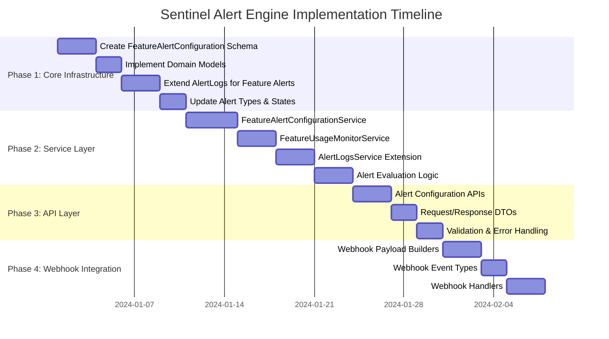
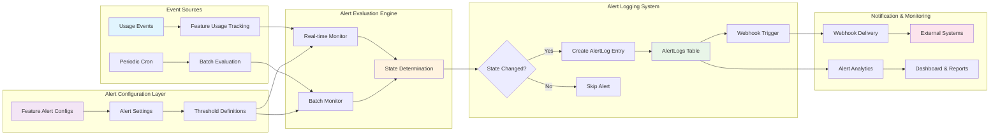
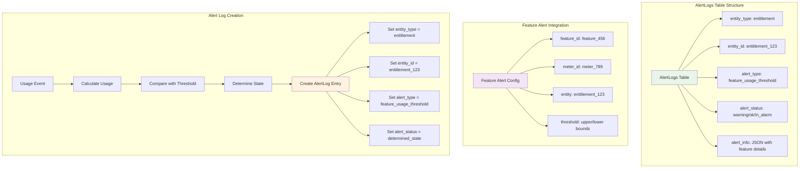
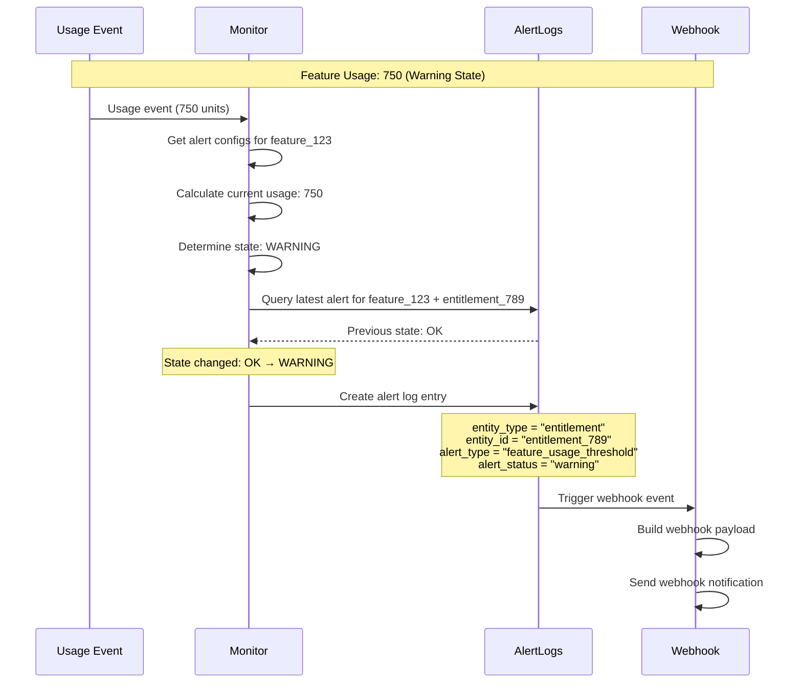

# Feature-Level Alert System (Sentinel Alert Engine)

## 1. Executive Summary

### 1.1 Overview
The Sentinel Alert Engine introduces a comprehensive feature-level alert system that monitors feature usage against configurable thresholds and triggers alerts based on state transitions. This system extends the existing alert-logging infrastructure to provide granular monitoring of feature consumption across different aggregation types.

### 1.2 Objectives
- **Proactive Monitoring**: Enable real-time monitoring of feature usage against configurable thresholds
- **Flexible Alerting**: Support multiple alert states (OK, Warning, In Alarm) with customizable threshold ranges
- **Seamless Integration**: Leverage existing alert infrastructure and webhook system
- **Scalable Architecture**: Support high-volume feature usage monitoring across multiple tenants and environments

### 1.3 Success Metrics
- Reduce feature overage incidents by 80%
- Enable proactive customer engagement through usage alerts
- Provide real-time visibility into feature consumption patterns
- Support 99.9% alert delivery reliability

## 2. Problem Statement

### 2.1 Current State
- No proactive monitoring of feature usage consumption
- Customers experience unexpected overages without warning
- Manual monitoring required for feature usage tracking

### 2.2 Pain Points
- **Reactive Monitoring**: Alerts only trigger after usage limits are exceeded
- **Limited Granularity**: No feature-specific alert configurations
- **Poor User Experience**: Customers surprised by unexpected charges
- **Operational Overhead**: Manual monitoring of feature consumption

## 3. Solution Overview

### 3.1 System Architecture Overview



### 3.2 Core Components

#### 3.1.1 Feature Alert Configuration Table
A new table to store alert configurations at the feature level:

```sql
CREATE TABLE feature_alert_configurations (
    id VARCHAR(50) PRIMARY KEY,
    tenant_id VARCHAR(50) NOT NULL,
    environment_id VARCHAR(50) NOT NULL,
    feature_id VARCHAR(50) NOT NULL,
    meter_id VARCHAR(50) NOT NULL,
    entity VARCHAR(50) NOT NULL, -- entitlement_id, customer_id, subscription_id, etc.
    threshold JSONB NOT NULL, -- {upperbound: decimal, lowerbound: decimal}
    threshold_type VARCHAR(50) NOT NULL DEFAULT 'usage_amount',
    status VARCHAR(20) NOT NULL DEFAULT 'published',
    created_at TIMESTAMP NOT NULL DEFAULT NOW(),
    updated_at TIMESTAMP NOT NULL DEFAULT NOW(),
    created_by VARCHAR(50),
    updated_by VARCHAR(50),
    
    CONSTRAINT fk_feature_alert_feature FOREIGN KEY (feature_id) REFERENCES features(id),
    CONSTRAINT fk_feature_alert_meter FOREIGN KEY (meter_id) REFERENCES meters(id),
    CONSTRAINT unique_feature_alert_config UNIQUE (tenant_id, environment_id, feature_id, meter_id, entity)
);
```

#### 3.1.2 Alert State Logic
The system supports three distinct alert states based on usage value comparison:

- **ok State**: `value > upperbound` - Usage is above the upper threshold (healthy)
- **warning State**: `lowerbound <= value <= upperbound` - Usage is within the warning range
- **in_alarm State**: `value < lowerbound` - Usage is below the lower threshold (critical)

#### 3.1.3 Threshold Configuration
```json
{
  "upperbound": "1000.00",
  "lowerbound": "100.00"
}
```

### 3.2 Architecture Integration

#### 3.2.1 Existing Infrastructure Reuse
- **AlertLogs Table**: Extend to support feature entity type
- **Webhook System**: Leverage existing webhook infrastructure
- **Alert Service**: Extend current alert service for feature monitoring

#### 3.2.2 New Components
- **FeatureAlertConfiguration Entity**: New Ent schema and domain model
- **Feature Alert Service**: Service layer for alert configuration management
- **Feature Usage Monitor**: Component to evaluate feature usage against thresholds
- **Feature Alert Webhook Payloads**: New webhook payload builders

## 4. Technical Specification

### 4.1 Data Models

#### 4.1.1 Feature Alert Configuration Schema
```go
// ent/schema/featurealertconfiguration.go
type FeatureAlertConfiguration struct {
    ent.Schema
}

func (FeatureAlertConfiguration) Fields() []ent.Field {
    return []ent.Field{
        field.String("id").Unique().Immutable(),
        field.String("feature_id").NotEmpty(),
        field.String("meter_id").NotEmpty(),
        field.String("entity").NotEmpty(),
        field.JSON("threshold", FeatureAlertThreshold{}),
        field.String("threshold_type").Default("usage_amount"),
    }
}

type FeatureAlertThreshold struct {
    Upperbound decimal.Decimal `json:"upperbound"`
    Lowerbound decimal.Decimal `json:"lowerbound"`
}
```

#### 4.1.2 Extended Alert Types
```go
// internal/types/alertlogs.go
const (
    // Existing wallet alerts
    AlertTypeLowOngoingBalance AlertType = "low_ongoing_balance"
    AlertTypeLowCreditBalance  AlertType = "low_credit_balance"
    
    // New feature alerts
    AlertTypeFeatureUsageThreshold AlertType = "feature_usage_threshold"
)

const (
    // Existing entity types
    AlertEntityTypeWallet AlertEntityType = "wallet"
    
    // New entity types for feature alerts
    AlertEntityTypeEntitlement AlertEntityType = "entitlement"
    AlertEntityTypeSubscription AlertEntityType = "subscription"
)

// Extended alert states
const (
    AlertStateOk      AlertState = "ok"
    AlertStateWarning AlertState = "warning"  // New state
    AlertStateInAlarm AlertState = "in_alarm"
)
```

#### 4.1.3 Feature Alert Info Structure
```go
type FeatureAlertInfo struct {
    FeatureID      string                `json:"feature_id"`
    MeterID        string                `json:"meter_id"`
    Entity         string                `json:"entity"` // entitlement_id, customer_id, etc.
    EntityType     string                `json:"entity_type"` // entitlement, customer, subscription, etc.
    Threshold      FeatureAlertThreshold `json:"threshold"`
    CurrentUsage   decimal.Decimal       `json:"current_usage"`
    AggregationType types.AggregationType `json:"aggregation_type"`
    Period         string                `json:"period"`
    Timestamp      time.Time             `json:"timestamp"`
}
```

### 4.2 Service Layer

#### 4.2.1 Feature Alert Configuration Service
```go
type FeatureAlertConfigurationService interface {
    CreateSetting(ctx context.Context, req *CreateFeatureAlertConfigRequest) (*FeatureAlertConfiguration, error)
    DeleteSetting(ctx context.Context, id string) error
    GetSetting(ctx context.Context, id string) (*FeatureAlertConfiguration, error)
    ListSettings(ctx context.Context, filter *FeatureAlertConfigFilter) (*ListFeatureAlertConfigResponse, error)
    GetSettingsByFeature(ctx context.Context, featureID string) ([]*FeatureAlertConfiguration, error)
    // No UpdateSetting method - mutations not allowed at feature level
}
```

#### 4.2.2 Feature Usage Monitor Service
```go
type FeatureUsageMonitorService interface {
    EvaluateFeatureUsage(ctx context.Context, featureID, entity, entityType string, currentUsage decimal.Decimal) error
    CheckAllFeatureAlerts(ctx context.Context) error // For cron jobs
    GetFeatureUsageForAlert(ctx context.Context, featureID, meterID, entity, entityType string) (decimal.Decimal, error)
}
```

### 4.3 Alert Evaluation Logic

#### 4.3.1 Usage Calculation
The system calculates current usage based on the meter's aggregation type:
- **SUM/COUNT**: Total accumulated usage in current period
- **MAX**: Maximum recorded value in current period  
- **LATEST**: Most recent recorded value
- **COUNT_UNIQUE**: Count of unique values in current period
- **AVERAGE**: Average value in current period

#### 4.3.2 State Determination Algorithm
```go
func DetermineAlertState(currentUsage decimal.Decimal, threshold FeatureAlertThreshold) AlertState {
    if currentUsage.GreaterThan(threshold.Upperbound) {
        return AlertStateOk
    } else if currentUsage.GreaterThanOrEqual(threshold.Lowerbound) && 
              currentUsage.LessThanOrEqual(threshold.Upperbound) {
        return AlertStateWarning
    } else {
        return AlertStateInAlarm
    }
}
```

#### 4.3.3 State Transition Logic
The system follows the existing alert engine pattern:
1. Calculate current feature usage for the specific entity (entitlement, customer, etc.)
2. Determine new alert state based on thresholds
3. Query latest alert log for this feature/entity combination
4. If state has changed or no previous alert exists:
   - Create new alert log entry with entity_type as the actual entity being monitored
   - Trigger appropriate webhook event
5. If state unchanged, skip alert generation

### 4.4 Alert Logging Integration Details

#### 4.4.1 AlertLogs Table Integration



#### 4.4.2 Alert Logging Workflow



### 4.5 Webhook Integration

#### 4.5.1 New Webhook Events
```go
// internal/types/webhook.go
const (
    // Feature alert events
    WebhookEventFeatureUsageThresholdOk      = "feature.usage.threshold.ok"
    WebhookEventFeatureUsageThresholdWarning = "feature.usage.threshold.warning"
    WebhookEventFeatureUsageThresholdAlarm   = "feature.usage.threshold.alarm"
)
```

#### 4.4.2 Feature Alert Webhook Payload
```go
type FeatureAlertWebhookPayload struct {
    EventType       string                `json:"event_type"`
    FeatureID       string                `json:"feature_id"`
    FeatureName     string                `json:"feature_name"`
    MeterID         string                `json:"meter_id"`
    Entity          string                `json:"entity"` // entitlement_id, customer_id, etc.
    EntityType      string                `json:"entity_type"` // entitlement, customer, subscription, etc.
    AlertState      types.AlertState      `json:"alert_state"`
    CurrentUsage    decimal.Decimal       `json:"current_usage"`
    Threshold       FeatureAlertThreshold `json:"threshold"`
    AggregationType types.AggregationType `json:"aggregation_type"`
    Period          string                `json:"period"`
    Timestamp       time.Time             `json:"timestamp"`
    TenantID        string                `json:"tenant_id"`
    EnvironmentID   string                `json:"environment_id"`
}
```

### 4.5 API Endpoints

#### 4.5.1 Feature Alert Configuration Management
```go
// POST /api/v1/feature-alert-setting
type CreateFeatureAlertConfigRequest struct {
    FeatureID     string                `json:"feature_id" validate:"required"`
    MeterID       string                `json:"meter_id" validate:"required"`
    Entity        string                `json:"entity" validate:"required"` // entitlement_id, subscription_id, etc.
    EntityType    string                `json:"entity_type" validate:"required"` // entitlement, subscription, etc.
    Threshold     FeatureAlertThreshold `json:"threshold" validate:"required"`
    ThresholdType string                `json:"threshold_type,omitempty"`
}

// DELETE /api/v1/feature-alert-setting/{id}
// No update endpoint - mutations not allowed at feature level

// GET /api/v1/feature-alert-setting
type FeatureAlertConfigFilter struct {
    *types.QueryFilter
    FeatureID  string `json:"feature_id,omitempty" form:"feature_id"`
    MeterID    string `json:"meter_id,omitempty" form:"meter_id"`
    Entity     string `json:"entity,omitempty" form:"entity"`
    EntityType string `json:"entity_type,omitempty" form:"entity_type"`
}
```

## 5. Implementation Plan

### 5.1 Implementation Workflow with Alert Logging Integration



### 5.2 Phase 1: Core Infrastructure (Week 1-2)
- [ ] Create FeatureAlertConfiguration Ent schema
- [ ] Implement domain models and repositories
- [ ] Extend AlertLogs to support feature entity type
- [ ] Update alert types and states in types package

### 5.2 Phase 2: Service Layer (Week 3-4)
- [ ] Implement FeatureAlertConfigurationService
- [ ] Create FeatureUsageMonitorService
- [ ] Extend AlertLogsService for feature alerts
- [ ] Implement alert evaluation logic

### 5.3 Phase 3: API Layer (Week 5)
- [ ] Create feature alert configuration API endpoints
- [ ] Implement request/response DTOs
- [ ] Add validation and error handling
- [ ] Create API documentation

### 5.4 Phase 4: Webhook Integration (Week 6)
- [ ] Create feature alert webhook payload builders
- [ ] Extend webhook event types
- [ ] Implement feature alert webhook handlers
- [ ] Test webhook delivery

### 5.5 Phase 5: Monitoring Integration (Week 7-8)
- [ ] Integrate with feature usage tracking service
- [ ] Implement real-time alert evaluation
- [ ] Create cron job for periodic alert checks
- [ ] Add monitoring and logging

### 5.6 Phase 6: Testing & Documentation (Week 9-10)
- [ ] Comprehensive unit and integration tests
- [ ] Performance testing with high-volume scenarios
- [ ] API documentation and examples
- [ ] User guide and troubleshooting documentation

## 6. Integration Points

### 6.1 Feature Usage Tracking Integration
- Hook into existing feature usage calculation pipeline
- Trigger alert evaluation on usage updates
- Support all aggregation types (SUM, MAX, COUNT, etc.)

### 6.2 Existing Alert Infrastructure
- Reuse AlertLogs table with new entity type
- Leverage existing webhook delivery system
- Maintain consistent alert state transition logic

### 6.3 Cron Job Integration
- Extend existing cron infrastructure
- Periodic evaluation of all feature alert configurations
- Catch any missed real-time evaluations

### 6.4 Complete Data Flow Integration



### 6.5 AlertLogs Table Schema Integration



## 7. Security & Performance Considerations

### 7.1 Security
- **Tenant Isolation**: All alert configurations scoped to tenant/environment
- **Access Control**: Feature alert configuration requires appropriate permissions
- **Data Protection**: No sensitive data in webhook payloads
- **Audit Trail**: Complete audit log of configuration changes

### 7.2 Performance
- **Efficient Queries**: Optimized database queries with proper indexing
- **Caching Strategy**: Cache frequently accessed configurations
- **Batch Processing**: Efficient bulk alert evaluation for cron jobs
- **Rate Limiting**: Prevent webhook spam with intelligent rate limiting

### 7.3 Scalability
- **Horizontal Scaling**: Stateless service design for easy scaling
- **Database Optimization**: Proper indexing and query optimization
- **Async Processing**: Non-blocking alert evaluation and webhook delivery
- **Resource Management**: Configurable limits and throttling

## 8. Monitoring & Observability

### 8.1 Metrics
- Alert evaluation latency
- Webhook delivery success rate
- Configuration creation/update rates
- Alert state transition frequencies

### 8.2 Logging
- Structured logging for all alert evaluations
- Detailed webhook delivery logs
- Configuration change audit logs
- Error tracking and alerting

### 8.3 Health Checks
- Service health endpoints
- Database connectivity checks
- Webhook delivery system health
- Alert evaluation pipeline status

## 9. Testing Strategy

### 9.1 Unit Tests
- Alert state determination logic
- Threshold validation
- Usage calculation accuracy
- Service layer functionality

### 9.2 Integration Tests
- End-to-end alert flow
- Webhook delivery verification
- Database operations
- API endpoint functionality

### 9.3 Performance Tests
- High-volume alert evaluation
- Concurrent configuration management
- Webhook delivery under load
- Database performance with large datasets

## 10. Migration & Rollout

### 10.1 Database Migration
- Create new tables with proper constraints
- Add indexes for optimal performance
- Ensure backward compatibility

### 10.2 Feature Flags
- Gradual rollout with feature flags
- Tenant-by-tenant enablement
- Easy rollback capability

### 10.3 Monitoring
- Real-time monitoring during rollout
- Performance impact assessment
- User feedback collection

## 11. Future Enhancements

### 11.1 Advanced Alerting
- Multi-condition alerts (AND/OR logic)
- Time-based alert suppression
- Alert escalation policies
- Custom alert templates

### 11.2 Analytics Integration
- Alert effectiveness analytics
- Usage pattern analysis
- Predictive alerting capabilities
- Custom dashboard integration

### 11.3 External Integrations
- Slack/Teams notifications
- PagerDuty integration
- Email alert delivery
- SMS notifications

## 12. Success Criteria

### 12.1 Functional Requirements
- ✅ Support all three alert states (OK, Warning, In Alarm)
- ✅ Real-time alert evaluation on usage updates
- ✅ Configurable thresholds per feature/entity combination
- ✅ Seamless webhook integration
- ✅ Comprehensive API for configuration management

### 12.2 Non-Functional Requirements
- ✅ 99.9% alert delivery reliability
- ✅ Sub-second alert evaluation latency
- ✅ Support for 10,000+ concurrent alert configurations
- ✅ Zero-downtime deployments
- ✅ Complete audit trail and observability

### 12.3 Business Impact
- ✅ 80% reduction in feature overage incidents
- ✅ Improved customer satisfaction through proactive alerts
- ✅ Enhanced operational visibility into feature usage
- ✅ Reduced support tickets related to unexpected charges

---

## Appendix A: Database Schema

### Feature Alert Configuration Table
```sql
CREATE TABLE feature_alert_configurations (
    id VARCHAR(50) PRIMARY KEY,
    tenant_id VARCHAR(50) NOT NULL,
    environment_id VARCHAR(50) NOT NULL,
    feature_id VARCHAR(50) NOT NULL,
    meter_id VARCHAR(50) NOT NULL,
    entity VARCHAR(50) NOT NULL,
    threshold JSONB NOT NULL,
    threshold_type VARCHAR(50) NOT NULL DEFAULT 'usage_amount',
    status VARCHAR(20) NOT NULL DEFAULT 'published',
    created_at TIMESTAMP NOT NULL DEFAULT NOW(),
    updated_at TIMESTAMP NOT NULL DEFAULT NOW(),
    created_by VARCHAR(50),
    updated_by VARCHAR(50),
    
    CONSTRAINT fk_feature_alert_feature FOREIGN KEY (feature_id) REFERENCES features(id),
    CONSTRAINT fk_feature_alert_meter FOREIGN KEY (meter_id) REFERENCES meters(id),
    CONSTRAINT unique_feature_alert_config UNIQUE (tenant_id, environment_id, feature_id, meter_id, entity)
);

CREATE INDEX idx_feature_alert_config_tenant_env ON feature_alert_configurations(tenant_id, environment_id);
CREATE INDEX idx_feature_alert_config_feature ON feature_alert_configurations(feature_id);
CREATE INDEX idx_feature_alert_config_meter ON feature_alert_configurations(meter_id);
CREATE INDEX idx_feature_alert_config_entity ON feature_alert_configurations(entity);
```

## Appendix B: API Examples

### Create Feature Alert Configuration
```bash
curl -X POST /api/v1/feature-alert-setting \
  -H "Content-Type: application/json" \
  -d '{
    "feature_id": "feature_123",
    "meter_id": "meter_456",
    "entity": "entitlement_789",
    "entity_type": "entitlement",
    "threshold": {
      "upperbound": "1000.00",
      "lowerbound": "100.00"
    },
    "threshold_type": "usage_amount"
  }'
```

### List Feature Alert Configurations
```bash
curl -X GET /api/v1/feature-alert-setting?feature_id=feature_123&entity_type=entitlement
```

### Webhook Payload Example
```json
{
  "event_type": "feature.usage.threshold.warning",
  "feature_id": "feature_123",
  "feature_name": "API Calls",
  "meter_id": "meter_456",
  "entity": "entitlement_789",
  "entity_type": "entitlement",
  "alert_state": "warning",
  "current_usage": "750.00",
  "threshold": {
    "upperbound": "1000.00",
    "lowerbound": "100.00"
  },
  "aggregation_type": "sum",
  "period": "2024-01",
  "timestamp": "2024-01-15T10:30:00Z",
  "tenant_id": "tenant_123",
  "environment_id": "env_456"
}
```

## Appendix C: Alert Logging Integration Examples

### AlertLogs Table Entry Example
```sql
INSERT INTO alert_logs (
    id,
    tenant_id,
    environment_id,
    entity_type,
    entity_id,
    alert_type,
    alert_status,
    alert_info,
    created_at
) VALUES (
    'alert_12345',
    'tenant_123',
    'env_456',
    'entitlement',
    'entitlement_789',
    'feature_usage_threshold',
    'warning',
    '{
        "feature_id": "feature_123",
        "meter_id": "meter_456",
        "entity": "entitlement_789",
        "entity_type": "entitlement",
        "threshold": {
            "upperbound": "1000.00",
            "lowerbound": "100.00"
        },
        "current_usage": "750.00",
        "aggregation_type": "sum",
        "period": "2024-01",
        "timestamp": "2024-01-15T10:30:00Z"
    }',
    NOW()
);
```

### Alert State Transition Example

