# Stripe Integration Flows - Detailed Technical Documentation

## Overview

This document provides comprehensive technical documentation for FlexPrice's Stripe integration, covering customer synchronization, payment processing flows, and invoice synchronization. Each flow includes detailed Mermaid diagrams and step-by-step explanations.

## Table of Contents

1. [Customer Sync Flows](#1-customer-sync-flows)
2. [Payment Processing Flows](#2-payment-processing-flows)
3. [Invoice Sync Flows](#3-invoice-sync-flows)
4. [Webhook Event Handling](#4-webhook-event-handling)
5. [Error Handling and Edge Cases](#5-error-handling-and-edge-cases)

---

## 1. Customer Sync Flows

### 1.1 Customer Sync Overview

The customer sync system ensures bidirectional synchronization between FlexPrice customers and Stripe customers. It supports multiple sync scenarios and maintains data consistency across both platforms.

### 1.2 Customer Sync Flow Diagram

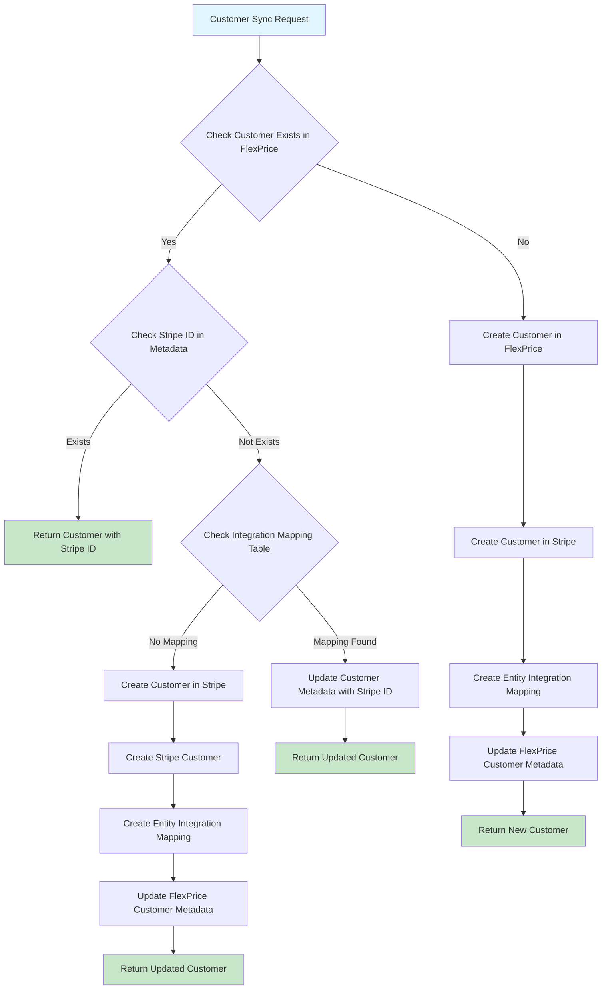

### 1.3 Customer Sync Methods

#### 1.3.1 EnsureCustomerSyncedToStripe

**Purpose**: Ensures a FlexPrice customer is synced to Stripe, creating the mapping if it doesn't exist.

**Flow Steps**:
1. Get FlexPrice customer by ID
2. Check if customer already has `stripe_customer_id` in metadata
3. If not found, check integration mapping table
4. If mapping exists, update customer metadata
5. If no mapping, create customer in Stripe
6. Create entity integration mapping
7. Update customer metadata with Stripe ID

**Key Functions**:
- `EnsureCustomerSyncedToStripe(ctx, customerID, customerService)`
- `CreateCustomerInStripe(ctx, customerID, customerService)`
- `CreateCustomerFromStripe(ctx, stripeCustomer, environmentID, customerService)`

#### 1.3.2 CreateCustomerInStripe

**Purpose**: Creates a new customer in Stripe and establishes the mapping.

**Stripe Customer Creation Parameters**:
```go
params := &stripe.CustomerCreateParams{
    Name:  stripe.String(ourCustomer.Name),
    Email: stripe.String(ourCustomer.Email),
    Metadata: map[string]string{
        "flexprice_customer_id": ourCustomer.ID,
        "flexprice_environment": ourCustomer.EnvironmentID,
        "external_id":           ourCustomer.ExternalID,
    },
}
```

#### 1.3.3 CreateCustomerFromStripe

**Purpose**: Creates a FlexPrice customer from Stripe webhook data.

**Flow**:
1. Check for existing customer by external ID
2. If exists, update with Stripe ID
3. If not exists, create new customer
4. Create entity integration mapping

### 1.4 Customer Sync Webhook Handling

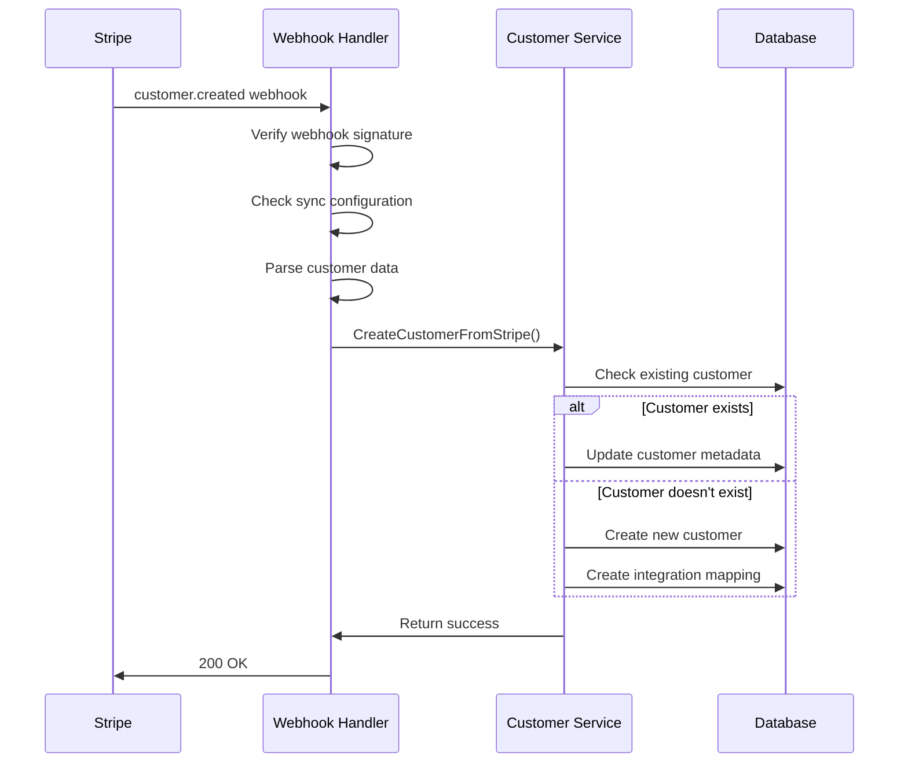

---

## 2. Payment Processing Flows

### 2.1 Payment Flow Overview

FlexPrice supports multiple payment methods through Stripe integration:
1. **Payment Links** - Stripe Checkout sessions
2. **Saved Payment Methods** - Off-session payments
3. **External Payments** - Payments made directly in Stripe
4. **Setup Intents** - Payment method collection

### 2.2 Payment Flow Architecture

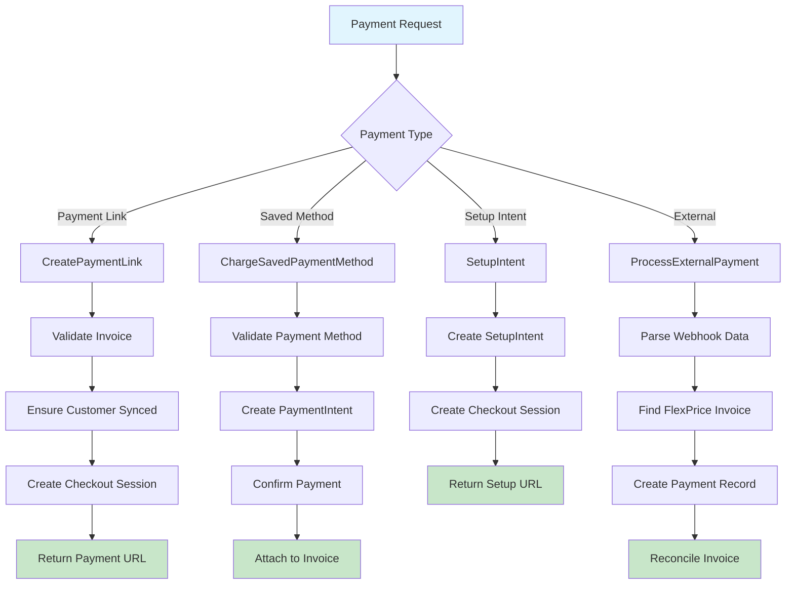

### 2.3 Payment Link Flow

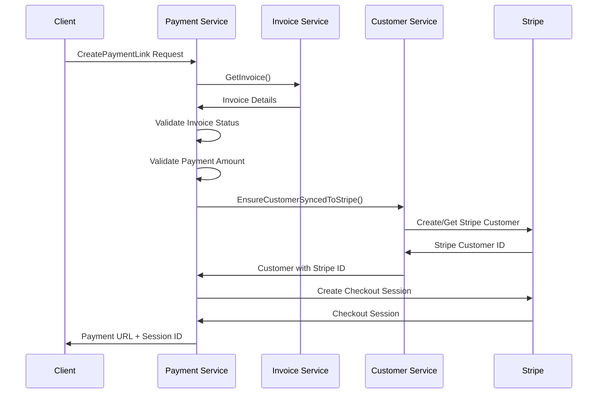

### 2.4 Saved Payment Method Flow

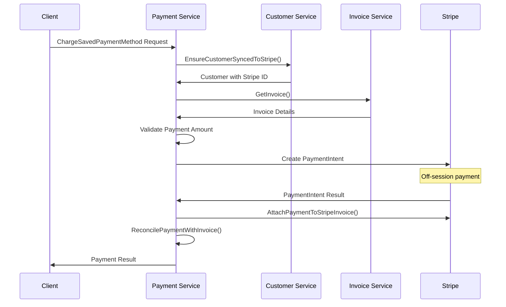

### 2.5 External Payment Processing Flow

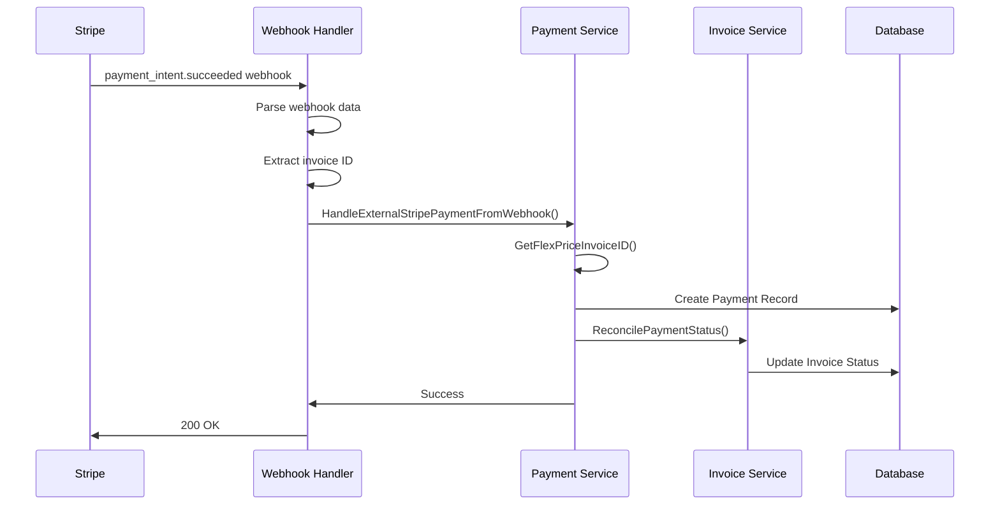

### 2.6 Webhook Event Handling

#### 2.6.1 Supported Webhook Events

| Event Type | Handler | Purpose |
|------------|---------|---------|
| `customer.created` | `handleCustomerCreated` | Create customer in FlexPrice |
| `payment_intent.succeeded` | `handlePaymentIntentSucceeded` | Process successful payment |
| `payment_intent.payment_failed` | `handlePaymentIntentPaymentFailed` | Handle failed payment |
| `setup_intent.succeeded` | `handleSetupIntentSucceeded` | Handle payment method setup |
| `invoice_payment.paid` | `handleInvoicePaymentPaid` | Process external invoice payment |
| `product.created` | `handleProductCreated` | Create plan in FlexPrice |
| `product.updated` | `handleProductUpdated` | Update plan in FlexPrice |
| `product.deleted` | `handleProductDeleted` | Delete plan in FlexPrice |
| `customer.subscription.created` | `handleSubscriptionCreated` | Create subscription in FlexPrice |
| `customer.subscription.updated` | `handleSubscriptionUpdated` | Update subscription in FlexPrice |
| `customer.subscription.deleted` | `handleSubscriptionCancellation` | Cancel subscription in FlexPrice |

#### 2.6.2 Webhook Processing Flow

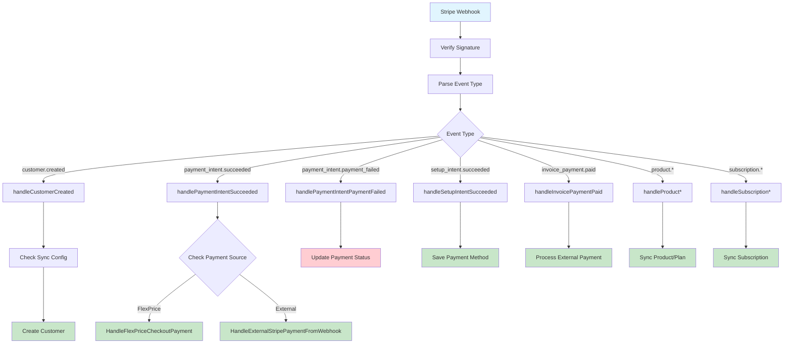

---

## 3. Invoice Sync Flows

### 3.1 Invoice Sync Overview

The invoice sync system enables bidirectional synchronization of invoices between FlexPrice and Stripe, supporting both outbound (FlexPrice → Stripe) and inbound (Stripe → FlexPrice) flows.

### 3.2 Invoice Sync Flow Diagram

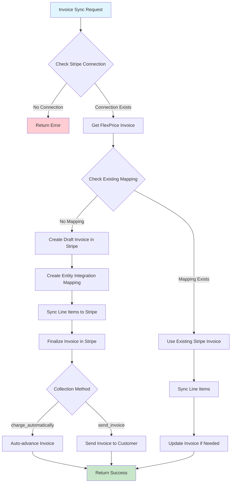

### 3.3 Invoice Sync Process Details

#### 3.3.1 SyncInvoiceToStripe - 7-Step Process

1. **Check Stripe Connection** - Verify Stripe integration is configured
2. **Get FlexPrice Invoice** - Retrieve invoice details from database
3. **Check Existing Mapping** - Avoid duplicate syncing via integration mapping table
4. **Create Draft Invoice** - Create draft invoice in Stripe with metadata
5. **Create Entity Mapping** - Track sync relationship in integration mapping table
6. **Sync Line Items** - Add all invoice line items to Stripe invoice
7. **Finalize Invoice** - Make invoice ready for payment

#### 3.3.2 Invoice Creation Parameters

```go
params := &stripe.InvoiceCreateParams{
    Customer:    stripe.String(stripeCustomerID),
    Currency:    stripe.String(strings.ToLower(flexInvoice.Currency)),
    AutoAdvance: stripe.Bool(true),
    Description: stripe.String(flexInvoice.Description),
    Metadata: map[string]string{
        "flexprice_invoice_id":     flexInvoice.ID,
        "flexprice_customer_id":    flexInvoice.CustomerID,
        "flexprice_invoice_number": flexInvoice.InvoiceNumber,
        "sync_source":              "flexprice",
    },
}
```

#### 3.3.3 Collection Methods

- **`charge_automatically`** - Automatic payment attempt using customer's default payment method
- **`send_invoice`** - Email invoice to customer for manual payment

### 3.4 Invoice Sync Sequence Diagram

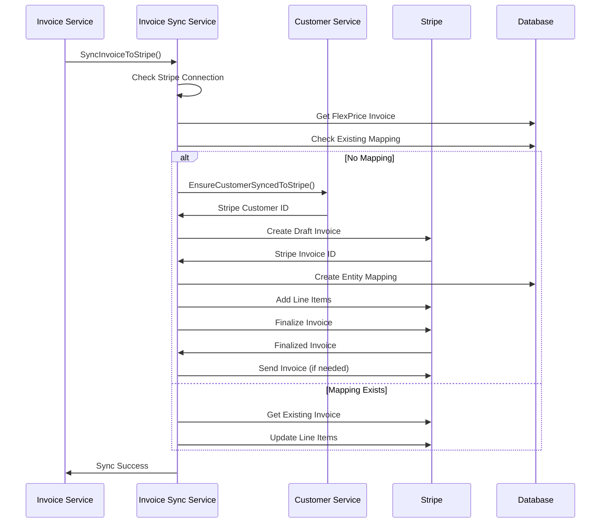

### 3.5 Invoice Reconciliation

#### 3.5.1 External Payment Reconciliation

When payments are made directly in Stripe (external to FlexPrice), the system reconciles these payments with FlexPrice invoices:

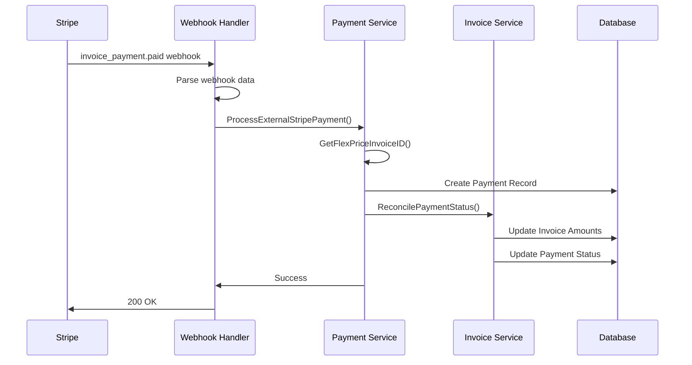

#### 3.5.2 Payment Status Calculation

The system calculates new payment status based on amounts:

```go
newAmountPaid := invoiceResp.AmountPaid.Add(paymentAmount)
newAmountRemaining := invoiceResp.AmountDue.Sub(newAmountPaid)

var newPaymentStatus types.PaymentStatus
if newAmountRemaining.IsZero() {
    newPaymentStatus = types.PaymentStatusSucceeded // Fully paid
} else if newAmountRemaining.IsNegative() {
    newPaymentStatus = types.PaymentStatusOverpaid // Overpaid
} else {
    newPaymentStatus = types.PaymentStatusPending // Partial payment
}
```

---

## 4. Webhook Event Handling

### 4.1 Webhook Processing Architecture

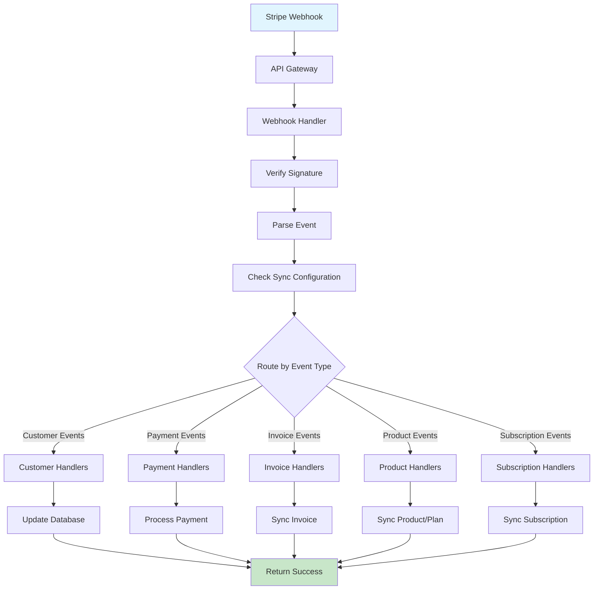

### 4.2 Webhook Security

1. **Signature Verification** - All webhooks are verified using Stripe's webhook signature
2. **Idempotency** - Duplicate events are handled gracefully
3. **Error Handling** - Failed webhooks are logged and can be retried
4. **Configuration Checks** - Sync settings are validated before processing

### 4.3 Webhook Event Details

#### 4.3.1 Payment Intent Succeeded Handler

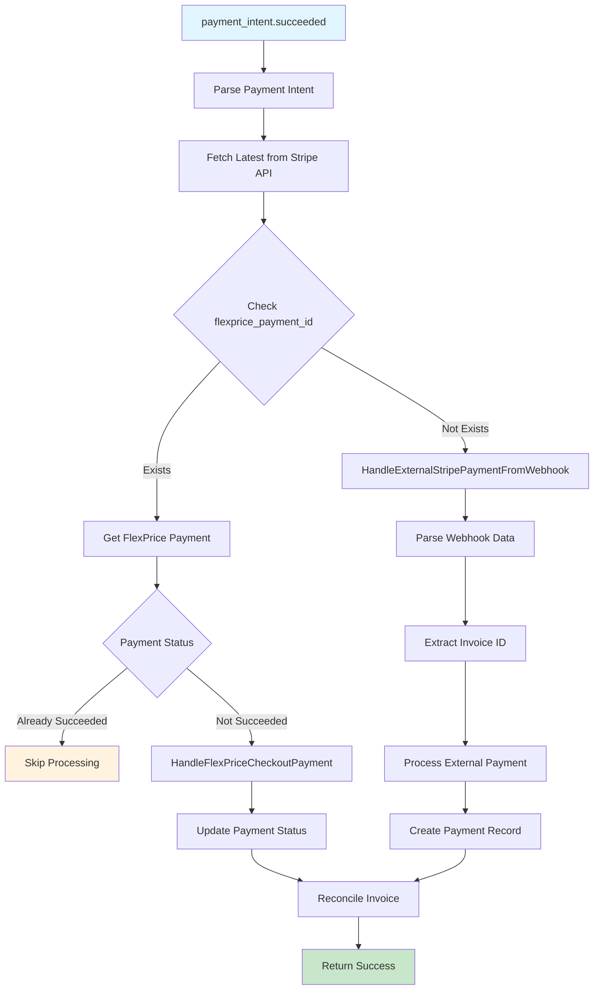

---

## 5. Error Handling and Edge Cases

### 5.1 Common Error Scenarios

1. **Customer Sync Failures**
   - Stripe API errors
   - Duplicate customer creation
   - Metadata update failures

2. **Payment Processing Errors**
   - Invalid payment methods
   - Insufficient funds
   - Authentication required

3. **Invoice Sync Issues**
   - Missing line items
   - Currency mismatches
   - Collection method conflicts

4. **Webhook Processing Failures**
   - Invalid signatures
   - Malformed payloads
   - Service unavailability

### 5.2 Error Recovery Strategies

1. **Retry Mechanisms** - Automatic retry for transient failures
2. **Fallback Processing** - Alternative flows for critical operations
3. **Manual Intervention** - Admin tools for error resolution
4. **Monitoring and Alerting** - Real-time error detection

### 5.3 Data Consistency

1. **Idempotency Keys** - Prevent duplicate processing
2. **Transaction Management** - Ensure atomic operations
3. **Reconciliation Jobs** - Periodic data consistency checks
4. **Audit Logging** - Complete operation tracking

---

## Conclusion

This document provides comprehensive technical documentation for FlexPrice's Stripe integration. The system supports complex bidirectional synchronization scenarios while maintaining data consistency and providing robust error handling. The modular architecture allows for easy extension and maintenance of integration features.

For implementation details, refer to the specific service files in the `internal/integration/stripe/` directory.


