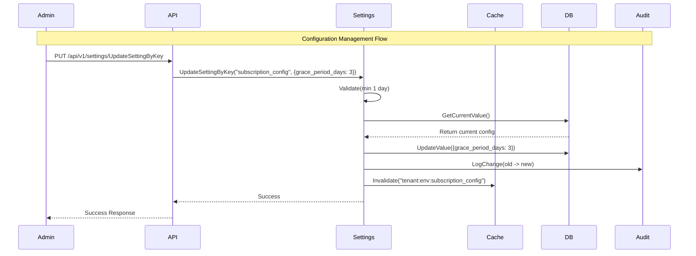
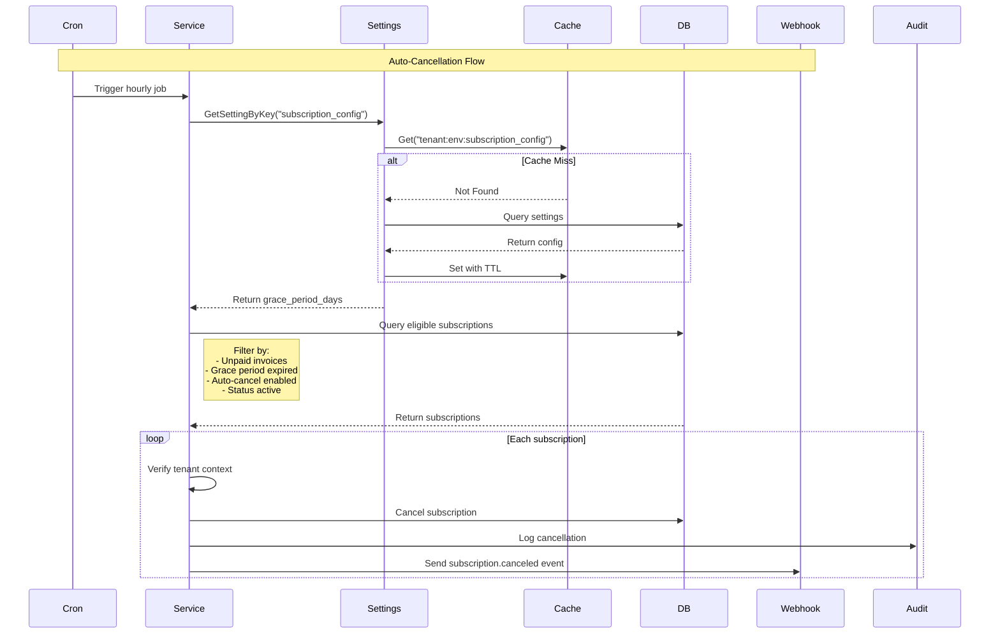
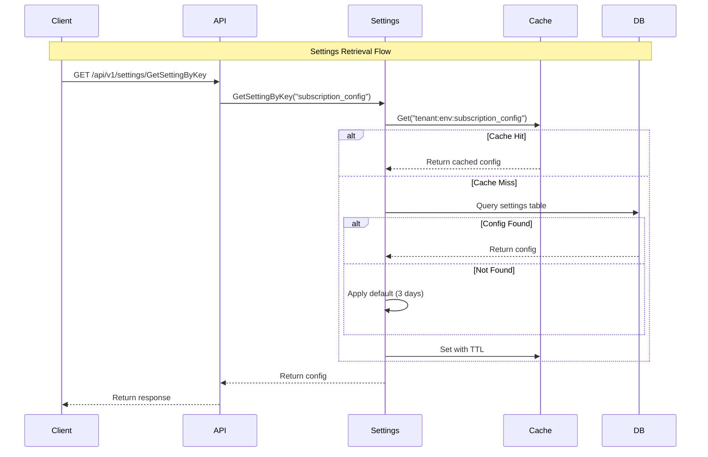
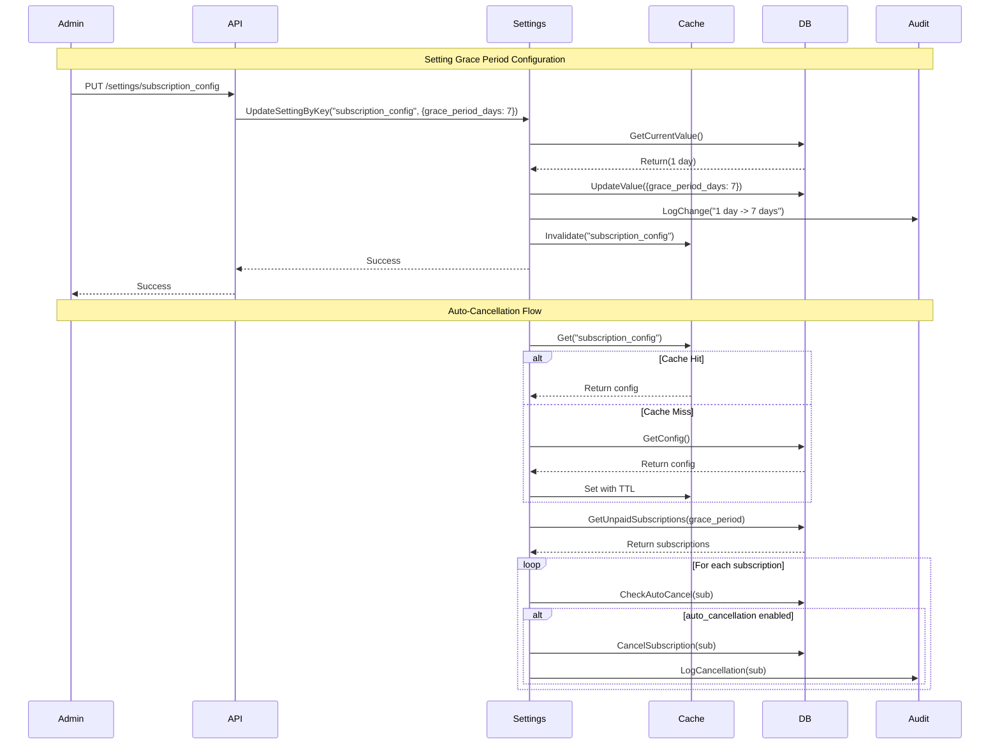
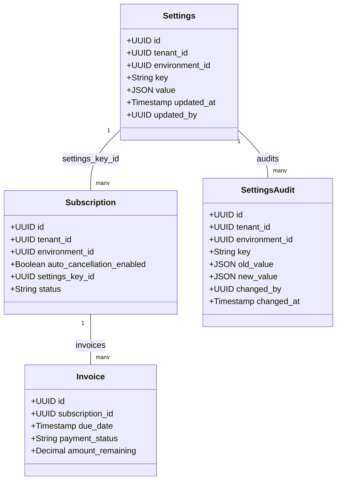

# Subscription Grace Period & Auto-Cancellation PRD

## Architecture Update (Tenant-level, supersedes per-subscription toggle)

This section updates and supersedes earlier parts of this PRD that referenced a per-subscription auto-cancellation toggle and endpoint.

- Auto-cancellation is now controlled at the tenant level (per environment) via the `subscription_config` setting.
- Every ACTIVE subscription in a tenant is subject to auto-cancellation when the tenant setting is enabled and invoice conditions are met.

### Settings Schema and API

- Key: `subscription_config`
- Value shape:
  - `grace_period_days` (integer, required, >= 1)
  - `auto_cancellation_enabled` (boolean, optional; default false if not previously set)

API:
- Upsert setting: `PUT /v1/settings/:key`
  - key: `subscription_config`
  - Partial updates are supported. Fields provided are updated; omitted fields keep their existing value.
  - If `auto_cancellation_enabled` has never been set, it defaults to `false`.

Examples:
```json
{ "value": { "grace_period_days": 6 } }
{ "value": { "auto_cancellation_enabled": true } }
{ "value": { "grace_period_days": 6, "auto_cancellation_enabled": true } }
```

Deprecated (no longer applicable):
- The per-subscription toggle endpoint `PUT /api/v1/subscriptions/{id}/auto-cancellation` is removed. All references in this PRD to subscription-level toggles should be considered obsolete.

### Cron Workflow (unchanged conceptually, clarified)

Endpoint:
- `POST /v1/cron/subscriptions/process_auto_cancellation`

Processing rules:
1. Load tenant-level `subscription_config`. If `auto_cancellation_enabled` is false (or missing), do nothing.
2. Select ONLY subscriptions with status `ACTIVE`.
3. For each subscription, fetch all invoices and check for any invoice that satisfies:
   - `(payment_status != succeeded OR amount_remaining > 0)` AND
   - `now > invoice.due_date` AND
   - `now > invoice.due_date + grace_period_days`.
4. If any invoice matches, cancel the subscription immediately (not at period end) if it is still `ACTIVE`.

Audit & Notifications:
- Changes are audited via settings updates and cancellation events as before. Webhooks continue to emit `subscription.canceled` on auto-cancellation.

Backward compatibility:
- Existing clients that only change `grace_period_days` without sending `auto_cancellation_enabled` will not flip the enable flag; the value persists.


## Overview
This document outlines the requirements for implementing a configurable grace period and automatic subscription cancellation system for unpaid invoices in FlexPrice, leveraging the existing settings management system.

## Problem Statement
When customers fail to pay their invoices by the due date, there needs to be an automated system to:
1. Allow a configurable grace period for payment completion
2. Automatically cancel subscriptions after the grace period expires (if opted in)
3. Maintain audit trails of all configuration changes
4. Ensure complete tenant and environment isolation

## Core Concepts

### Settings Integration
- **Key**: `subscription_config`
- **Default Value**:
  ```json
  {
    "grace_period_days": 3
  }
  ```
- **Scope**: Tenant × Environment
- **Storage**: Settings table with JSON value
- **Cache**: 1-hour TTL
- **Validation**: min 1 day

### Auto-Cancellation
- **Default State**: Disabled per subscription
- **Control**: Explicit opt-in required
- **Scope**: Individual subscription level
- **Conditions**: 
  - Only active subscriptions
  - Must have unpaid invoices
  - Grace period must have expired

### Configuration Management
- **Settings System**:
  - Reuse existing settings endpoints
  - Maintain tenant isolation
  - Audit trail for changes
  - Cache with TTL
- **Subscription Settings**:
  - Foreign key to settings table
  - Auto-cancellation flag
  - Status tracking

## Technical Specifications

### Database Schema Changes

```sql
-- Add to existing Settings table validation
ALTER TABLE settings
ADD CONSTRAINT check_subscription_config 
CHECK (
    (key != 'subscription_config') OR 
    (jsonb_typeof(value->'grace_period_days') = 'number' AND 
     (value->>'grace_period_days')::int min 1 day)
);

-- Modify Subscriptions table
ALTER TABLE subscriptions
ADD COLUMN auto_cancellation_enabled BOOLEAN DEFAULT FALSE,
ADD COLUMN settings_key_id UUID,
ADD COLUMN auto_cancellation_updated_at TIMESTAMP,
ADD COLUMN auto_cancellation_updated_by UUID,
ADD CONSTRAINT fk_settings_key 
    FOREIGN KEY (settings_key_id) 
    REFERENCES settings(id);

-- Settings Audit table already exists and will be used
```

### Settings Workflow

```go
// Example settings value
type SubscriptionConfig struct {
    GracePeriodDays int `json:"grace_period_days" validate:"required,min=1"`
}

// Get configuration
func GetSubscriptionConfig(ctx context.Context) (*SubscriptionConfig, error) {
    // Use existing settings.GetByKey("subscription_config")
    setting, err := settingsService.GetByKey(ctx, "subscription_config")
    if err != nil {
        if errors.Is(err, ErrNotFound) {
            return &SubscriptionConfig{
                GracePeriodDays: 1, // Default value
            }, nil
        }
        return nil, err
    }
    return setting.Value.(*SubscriptionConfig), nil
}

// Update configuration
func UpdateSubscriptionConfig(ctx context.Context, config *SubscriptionConfig) error {
    // Use existing settings.UpdateByKey("subscription_config")
    return settingsService.UpdateByKey(ctx, "subscription_config", config)
}
```

### Auto-Cancellation Process

```go
func processUnpaidSubscriptions(ctx context.Context) error {
    // Get configuration from settings
    config, err := GetSubscriptionConfig(ctx)
    if err != nil {
        return err
    }

    // Find eligible subscriptions
    subs, err := db.Query(`
        SELECT s.* FROM subscriptions s
        JOIN invoices i ON s.id = i.subscription_id
        WHERE 
            s.tenant_id = ? AND 
            s.environment_id = ? AND
            s.auto_cancellation_enabled = true AND
            s.status = 'active' AND
            (i.payment_status != 'succeeded' OR i.amount_remaining > 0) AND
            NOW() > i.due_date + make_interval(days => ?)
    `, tenantID, envID, config.GracePeriodDays)

    // Process each subscription
    for _, sub := range subs {
        if err := cancelSubscription(ctx, sub); err != nil {
            log.Error(err)
            continue
        }
        audit.Log("subscription_cancelled", map[string]interface{}{
            "reason": "grace_period_expired",
            "grace_period_days": config.GracePeriodDays,
        })
    }
    return nil
}
```

### API Endpoints

```
# Existing Settings endpoints will be used
GET /api/v1/settings/GetSettingByKey
    Response: {
        "grace_period_days": number
    }

PUT /api/v1/settings/UpdateSettingByKey
    Request: {
        "grace_period_days": number  // min- 1 day
    }
    Response: {
        "status": "success"
    }

# New Subscription endpoint
PUT /api/v1/subscriptions/{id}/auto-cancellation
    Request: {
        "enabled": boolean
    }
    Response: {
        "status": "success"
    }
```

## Implementation Flow

### Configuration Management Flow
1. Admin accesses settings management
2. Updates subscription_config via settings API
3. System validates grace period range (min 1 day)
4. Change is stored in settings table
5. Audit record is created
6. Cache is invalidated
7. Success response returned

### Auto-Cancellation Flow
1. Cron job triggers hourly
2. Retrieves subscription_config from settings for tenant x env
3. Queries eligible subscriptions:
   - Has unpaid invoices
   - Grace period expired
   - Auto-cancellation enabled
   - Status is active
4. For each subscription:
   - Verifies tenant context
   - Executes cancellation
   - Creates audit log
   - Sends notifications via existing webhook only- subscription.canceled

### Settings Retrieval Flow
1. Request for subscription_config
2. Check settings cache
3. If cache miss:
   - Query settings table
   - Apply default if not found
   - Update cache
4. Return configuration

## Flow Diagrams

### Configuration Management Flow


### Auto-Cancellation Flow


### Settings Retrieval Flow


## System Architecture

### Configuration Flow


### Database Schema


## Security Considerations

### Tenant Isolation
- Settings scoped to tenant×environment
- Subscription operations verify tenant context
- Cache keys include tenant and environment
- Database queries enforce tenant boundaries

### Access Control
- Settings management requires admin privileges
- Auto-cancellation toggle requires subscription access
- Audit trail for all changes
- Tenant-specific API keys

### Data Validation
- Grace period range: min 1 Day
- Auto-cancellation state: boolean only
- Subscription status validation
- Tenant context verification

## Testing Requirements

### Unit Tests
- Settings validation
- Grace period calculations
- Auto-cancellation eligibility
- Default value handling

### Integration Tests
- Settings API endpoints
- Subscription updates
- Cache operations
- Audit logging

### End-to-End Tests
- Complete configuration flow
- Auto-cancellation process
- Tenant isolation
- Error handling

## Monitoring

### Metrics
- Configuration changes
- Auto-cancellations executed
- Grace period statistics
- Cache hit/miss ratio

### Alerts
- Configuration changes
- Bulk cancellations
- System errors
- Validation failures

## Future Considerations
1. Variable grace periods by subscription type
2. Customizable notification templates
3. Grace period analytics
4. Machine learning for optimal grace period
5. Batch configuration updates
6. Integration with payment reminder system


## Visuals

### _Settings Configuration Workflow_
<svg aria-roledescription="sequence" role="graphics-document document" viewBox="-50 -10 1449 1282" style="max-width: 1449px;" xmlns="http://www.w3.org/2000/svg" width="100%" id="mermaid-svg-1756302243428-q4nr3fj19"><g><rect class="actor" ry="3" rx="3" height="65" width="150" stroke="#666" fill="#eaeaea" y="1196" x="1199"/><text style="text-anchor: middle; font-size: 16px; font-weight: 400;" class="actor" alignment-baseline="central" dominant-baseline="central" y="1228.5" x="1274"><tspan dy="0" x="1274">Audit</tspan></text></g><g><rect class="actor" ry="3" rx="3" height="65" width="150" stroke="#666" fill="#eaeaea" y="1196" x="999"/><text style="text-anchor: middle; font-size: 16px; font-weight: 400;" class="actor" alignment-baseline="central" dominant-baseline="central" y="1228.5" x="1074"><tspan dy="0" x="1074">DB</tspan></text></g><g><rect class="actor" ry="3" rx="3" height="65" width="150" stroke="#666" fill="#eaeaea" y="1196" x="799"/><text style="text-anchor: middle; font-size: 16px; font-weight: 400;" class="actor" alignment-baseline="central" dominant-baseline="central" y="1228.5" x="874"><tspan dy="0" x="874">Cache</tspan></text></g><g><rect class="actor" ry="3" rx="3" height="65" width="150" stroke="#666" fill="#eaeaea" y="1196" x="556"/><text style="text-anchor: middle; font-size: 16px; font-weight: 400;" class="actor" alignment-baseline="central" dominant-baseline="central" y="1228.5" x="631"><tspan dy="0" x="631">Settings</tspan></text></g><g><rect class="actor" ry="3" rx="3" height="65" width="150" stroke="#666" fill="#eaeaea" y="1196" x="222"/><text style="text-anchor: middle; font-size: 16px; font-weight: 400;" class="actor" alignment-baseline="central" dominant-baseline="central" y="1228.5" x="297"><tspan dy="0" x="297">API</tspan></text></g><g><rect class="actor" ry="3" rx="3" height="65" width="150" stroke="#666" fill="#eaeaea" y="1196" x="0"/><text style="text-anchor: middle; font-size: 16px; font-weight: 400;" class="actor" alignment-baseline="central" dominant-baseline="central" y="1228.5" x="75"><tspan dy="0" x="75">Admin</tspan></text></g><g><line stroke="#999" stroke-width="0.5px" class="200" y2="1196" x2="1274" y1="5" x1="1274" id="actor218"/><g id="root-218"><rect class="actor" ry="3" rx="3" height="65" width="150" stroke="#666" fill="#eaeaea" y="0" x="1199"/><text style="text-anchor: middle; font-size: 16px; font-weight: 400;" class="actor" alignment-baseline="central" dominant-baseline="central" y="32.5" x="1274"><tspan dy="0" x="1274">Audit</tspan></text></g></g><g><line stroke="#999" stroke-width="0.5px" class="200" y2="1196" x2="1074" y1="5" x1="1074" id="actor217"/><g id="root-217"><rect class="actor" ry="3" rx="3" height="65" width="150" stroke="#666" fill="#eaeaea" y="0" x="999"/><text style="text-anchor: middle; font-size: 16px; font-weight: 400;" class="actor" alignment-baseline="central" dominant-baseline="central" y="32.5" x="1074"><tspan dy="0" x="1074">DB</tspan></text></g></g><g><line stroke="#999" stroke-width="0.5px" class="200" y2="1196" x2="874" y1="5" x1="874" id="actor216"/><g id="root-216"><rect class="actor" ry="3" rx="3" height="65" width="150" stroke="#666" fill="#eaeaea" y="0" x="799"/><text style="text-anchor: middle; font-size: 16px; font-weight: 400;" class="actor" alignment-baseline="central" dominant-baseline="central" y="32.5" x="874"><tspan dy="0" x="874">Cache</tspan></text></g></g><g><line stroke="#999" stroke-width="0.5px" class="200" y2="1196" x2="631" y1="5" x1="631" id="actor215"/><g id="root-215"><rect class="actor" ry="3" rx="3" height="65" width="150" stroke="#666" fill="#eaeaea" y="0" x="556"/><text style="text-anchor: middle; font-size: 16px; font-weight: 400;" class="actor" alignment-baseline="central" dominant-baseline="central" y="32.5" x="631"><tspan dy="0" x="631">Settings</tspan></text></g></g><g><line stroke="#999" stroke-width="0.5px" class="200" y2="1196" x2="297" y1="5" x1="297" id="actor214"/><g id="root-214"><rect class="actor" ry="3" rx="3" height="65" width="150" stroke="#666" fill="#eaeaea" y="0" x="222"/><text style="text-anchor: middle; font-size: 16px; font-weight: 400;" class="actor" alignment-baseline="central" dominant-baseline="central" y="32.5" x="297"><tspan dy="0" x="297">API</tspan></text></g></g><g><line stroke="#999" stroke-width="0.5px" class="200" y2="1196" x2="75" y1="5" x1="75" id="actor213"/><g id="root-213"><rect class="actor" ry="3" rx="3" height="65" width="150" stroke="#666" fill="#eaeaea" y="0" x="0"/><text style="text-anchor: middle; font-size: 16px; font-weight: 400;" class="actor" alignment-baseline="central" dominant-baseline="central" y="32.5" x="75"><tspan dy="0" x="75">Admin</tspan></text></g></g><style>#mermaid-svg-1756302243428-q4nr3fj19{font-family:"trebuchet ms",verdana,arial,sans-serif;font-size:16px;fill:rgba(204, 204, 204, 0.87);}#mermaid-svg-1756302243428-q4nr3fj19 .error-icon{fill:#bf616a;}#mermaid-svg-1756302243428-q4nr3fj19 .error-text{fill:#bf616a;stroke:#bf616a;}#mermaid-svg-1756302243428-q4nr3fj19 .edge-thickness-normal{stroke-width:2px;}#mermaid-svg-1756302243428-q4nr3fj19 .edge-thickness-thick{stroke-width:3.5px;}#mermaid-svg-1756302243428-q4nr3fj19 .edge-pattern-solid{stroke-dasharray:0;}#mermaid-svg-1756302243428-q4nr3fj19 .edge-pattern-dashed{stroke-dasharray:3;}#mermaid-svg-1756302243428-q4nr3fj19 .edge-pattern-dotted{stroke-dasharray:2;}#mermaid-svg-1756302243428-q4nr3fj19 .marker{fill:rgba(204, 204, 204, 0.87);stroke:rgba(204, 204, 204, 0.87);}#mermaid-svg-1756302243428-q4nr3fj19 .marker.cross{stroke:rgba(204, 204, 204, 0.87);}#mermaid-svg-1756302243428-q4nr3fj19 svg{font-family:"trebuchet ms",verdana,arial,sans-serif;font-size:16px;}#mermaid-svg-1756302243428-q4nr3fj19 .actor{stroke:hsl(210, 0%, 73.137254902%);fill:#81a1c1;}#mermaid-svg-1756302243428-q4nr3fj19 text.actor&gt;tspan{fill:#191c22;stroke:none;}#mermaid-svg-1756302243428-q4nr3fj19 .actor-line{stroke:rgba(204, 204, 204, 0.87);}#mermaid-svg-1756302243428-q4nr3fj19 .messageLine0{stroke-width:1.5;stroke-dasharray:none;stroke:rgba(204, 204, 204, 0.87);}#mermaid-svg-1756302243428-q4nr3fj19 .messageLine1{stroke-width:1.5;stroke-dasharray:2,2;stroke:rgba(204, 204, 204, 0.87);}#mermaid-svg-1756302243428-q4nr3fj19 #arrowhead path{fill:rgba(204, 204, 204, 0.87);stroke:rgba(204, 204, 204, 0.87);}#mermaid-svg-1756302243428-q4nr3fj19 .sequenceNumber{fill:rgba(204, 204, 204, 0.61);}#mermaid-svg-1756302243428-q4nr3fj19 #sequencenumber{fill:rgba(204, 204, 204, 0.87);}#mermaid-svg-1756302243428-q4nr3fj19 #crosshead path{fill:rgba(204, 204, 204, 0.87);stroke:rgba(204, 204, 204, 0.87);}#mermaid-svg-1756302243428-q4nr3fj19 .messageText{fill:rgba(204, 204, 204, 0.87);stroke:none;}#mermaid-svg-1756302243428-q4nr3fj19 .labelBox{stroke:#454545;fill:#141414;}#mermaid-svg-1756302243428-q4nr3fj19 .labelText,#mermaid-svg-1756302243428-q4nr3fj19 .labelText&gt;tspan{fill:rgba(204, 204, 204, 0.87);stroke:none;}#mermaid-svg-1756302243428-q4nr3fj19 .loopText,#mermaid-svg-1756302243428-q4nr3fj19 .loopText&gt;tspan{fill:#d8dee9;stroke:none;}#mermaid-svg-1756302243428-q4nr3fj19 .loopLine{stroke-width:2px;stroke-dasharray:2,2;stroke:#454545;fill:#454545;}#mermaid-svg-1756302243428-q4nr3fj19 .note{stroke:#2a2a2a;fill:#1a1a1a;}#mermaid-svg-1756302243428-q4nr3fj19 .noteText,#mermaid-svg-1756302243428-q4nr3fj19 .noteText&gt;tspan{fill:rgba(204, 204, 204, 0.87);stroke:none;}#mermaid-svg-1756302243428-q4nr3fj19 .activation0{fill:rgba(64, 64, 64, 0.47);stroke:#30373a;}#mermaid-svg-1756302243428-q4nr3fj19 .activation1{fill:rgba(64, 64, 64, 0.47);stroke:#30373a;}#mermaid-svg-1756302243428-q4nr3fj19 .activation2{fill:rgba(64, 64, 64, 0.47);stroke:#30373a;}#mermaid-svg-1756302243428-q4nr3fj19 .actorPopupMenu{position:absolute;}#mermaid-svg-1756302243428-q4nr3fj19 .actorPopupMenuPanel{position:absolute;fill:#81a1c1;box-shadow:0px 8px 16px 0px rgba(0,0,0,0.2);filter:drop-shadow(3px 5px 2px rgb(0 0 0 / 0.4));}#mermaid-svg-1756302243428-q4nr3fj19 .actor-man line{stroke:hsl(210, 0%, 73.137254902%);fill:#81a1c1;}#mermaid-svg-1756302243428-q4nr3fj19 .actor-man circle,#mermaid-svg-1756302243428-q4nr3fj19 line{stroke:hsl(210, 0%, 73.137254902%);fill:#81a1c1;stroke-width:2px;}#mermaid-svg-1756302243428-q4nr3fj19 :root{--mermaid-font-family:"trebuchet ms",verdana,arial,sans-serif;}</style><g/><defs><symbol height="24" width="24" id="computer"><path d="M2 2v13h20v-13h-20zm18 11h-16v-9h16v9zm-10.228 6l.466-1h3.524l.467 1h-4.457zm14.228 3h-24l2-6h2.104l-1.33 4h18.45l-1.297-4h2.073l2 6zm-5-10h-14v-7h14v7z" transform="scale(.5)"/></symbol></defs><defs><symbol clip-rule="evenodd" fill-rule="evenodd" id="database"><path d="M12.258.001l.256.004.255.005.253.008.251.01.249.012.247.015.246.016.242.019.241.02.239.023.236.024.233.027.231.028.229.031.225.032.223.034.22.036.217.038.214.04.211.041.208.043.205.045.201.046.198.048.194.05.191.051.187.053.183.054.18.056.175.057.172.059.168.06.163.061.16.063.155.064.15.066.074.033.073.033.071.034.07.034.069.035.068.035.067.035.066.035.064.036.064.036.062.036.06.036.06.037.058.037.058.037.055.038.055.038.053.038.052.038.051.039.05.039.048.039.047.039.045.04.044.04.043.04.041.04.04.041.039.041.037.041.036.041.034.041.033.042.032.042.03.042.029.042.027.042.026.043.024.043.023.043.021.043.02.043.018.044.017.043.015.044.013.044.012.044.011.045.009.044.007.045.006.045.004.045.002.045.001.045v17l-.001.045-.002.045-.004.045-.006.045-.007.045-.009.044-.011.045-.012.044-.013.044-.015.044-.017.043-.018.044-.02.043-.021.043-.023.043-.024.043-.026.043-.027.042-.029.042-.03.042-.032.042-.033.042-.034.041-.036.041-.037.041-.039.041-.04.041-.041.04-.043.04-.044.04-.045.04-.047.039-.048.039-.05.039-.051.039-.052.038-.053.038-.055.038-.055.038-.058.037-.058.037-.06.037-.06.036-.062.036-.064.036-.064.036-.066.035-.067.035-.068.035-.069.035-.07.034-.071.034-.073.033-.074.033-.15.066-.155.064-.16.063-.163.061-.168.06-.172.059-.175.057-.18.056-.183.054-.187.053-.191.051-.194.05-.198.048-.201.046-.205.045-.208.043-.211.041-.214.04-.217.038-.22.036-.223.034-.225.032-.229.031-.231.028-.233.027-.236.024-.239.023-.241.02-.242.019-.246.016-.247.015-.249.012-.251.01-.253.008-.255.005-.256.004-.258.001-.258-.001-.256-.004-.255-.005-.253-.008-.251-.01-.249-.012-.247-.015-.245-.016-.243-.019-.241-.02-.238-.023-.236-.024-.234-.027-.231-.028-.228-.031-.226-.032-.223-.034-.22-.036-.217-.038-.214-.04-.211-.041-.208-.043-.204-.045-.201-.046-.198-.048-.195-.05-.19-.051-.187-.053-.184-.054-.179-.056-.176-.057-.172-.059-.167-.06-.164-.061-.159-.063-.155-.064-.151-.066-.074-.033-.072-.033-.072-.034-.07-.034-.069-.035-.068-.035-.067-.035-.066-.035-.064-.036-.063-.036-.062-.036-.061-.036-.06-.037-.058-.037-.057-.037-.056-.038-.055-.038-.053-.038-.052-.038-.051-.039-.049-.039-.049-.039-.046-.039-.046-.04-.044-.04-.043-.04-.041-.04-.04-.041-.039-.041-.037-.041-.036-.041-.034-.041-.033-.042-.032-.042-.03-.042-.029-.042-.027-.042-.026-.043-.024-.043-.023-.043-.021-.043-.02-.043-.018-.044-.017-.043-.015-.044-.013-.044-.012-.044-.011-.045-.009-.044-.007-.045-.006-.045-.004-.045-.002-.045-.001-.045v-17l.001-.045.002-.045.004-.045.006-.045.007-.045.009-.044.011-.045.012-.044.013-.044.015-.044.017-.043.018-.044.02-.043.021-.043.023-.043.024-.043.026-.043.027-.042.029-.042.03-.042.032-.042.033-.042.034-.041.036-.041.037-.041.039-.041.04-.041.041-.04.043-.04.044-.04.046-.04.046-.039.049-.039.049-.039.051-.039.052-.038.053-.038.055-.038.056-.038.057-.037.058-.037.06-.037.061-.036.062-.036.063-.036.064-.036.066-.035.067-.035.068-.035.069-.035.07-.034.072-.034.072-.033.074-.033.151-.066.155-.064.159-.063.164-.061.167-.06.172-.059.176-.057.179-.056.184-.054.187-.053.19-.051.195-.05.198-.048.201-.046.204-.045.208-.043.211-.041.214-.04.217-.038.22-.036.223-.034.226-.032.228-.031.231-.028.234-.027.236-.024.238-.023.241-.02.243-.019.245-.016.247-.015.249-.012.251-.01.253-.008.255-.005.256-.004.258-.001.258.001zm-9.258 20.499v.01l.001.021.003.021.004.022.005.021.006.022.007.022.009.023.01.022.011.023.012.023.013.023.015.023.016.024.017.023.018.024.019.024.021.024.022.025.023.024.024.025.052.049.056.05.061.051.066.051.07.051.075.051.079.052.084.052.088.052.092.052.097.052.102.051.105.052.11.052.114.051.119.051.123.051.127.05.131.05.135.05.139.048.144.049.147.047.152.047.155.047.16.045.163.045.167.043.171.043.176.041.178.041.183.039.187.039.19.037.194.035.197.035.202.033.204.031.209.03.212.029.216.027.219.025.222.024.226.021.23.02.233.018.236.016.24.015.243.012.246.01.249.008.253.005.256.004.259.001.26-.001.257-.004.254-.005.25-.008.247-.011.244-.012.241-.014.237-.016.233-.018.231-.021.226-.021.224-.024.22-.026.216-.027.212-.028.21-.031.205-.031.202-.034.198-.034.194-.036.191-.037.187-.039.183-.04.179-.04.175-.042.172-.043.168-.044.163-.045.16-.046.155-.046.152-.047.148-.048.143-.049.139-.049.136-.05.131-.05.126-.05.123-.051.118-.052.114-.051.11-.052.106-.052.101-.052.096-.052.092-.052.088-.053.083-.051.079-.052.074-.052.07-.051.065-.051.06-.051.056-.05.051-.05.023-.024.023-.025.021-.024.02-.024.019-.024.018-.024.017-.024.015-.023.014-.024.013-.023.012-.023.01-.023.01-.022.008-.022.006-.022.006-.022.004-.022.004-.021.001-.021.001-.021v-4.127l-.077.055-.08.053-.083.054-.085.053-.087.052-.09.052-.093.051-.095.05-.097.05-.1.049-.102.049-.105.048-.106.047-.109.047-.111.046-.114.045-.115.045-.118.044-.12.043-.122.042-.124.042-.126.041-.128.04-.13.04-.132.038-.134.038-.135.037-.138.037-.139.035-.142.035-.143.034-.144.033-.147.032-.148.031-.15.03-.151.03-.153.029-.154.027-.156.027-.158.026-.159.025-.161.024-.162.023-.163.022-.165.021-.166.02-.167.019-.169.018-.169.017-.171.016-.173.015-.173.014-.175.013-.175.012-.177.011-.178.01-.179.008-.179.008-.181.006-.182.005-.182.004-.184.003-.184.002h-.37l-.184-.002-.184-.003-.182-.004-.182-.005-.181-.006-.179-.008-.179-.008-.178-.01-.176-.011-.176-.012-.175-.013-.173-.014-.172-.015-.171-.016-.17-.017-.169-.018-.167-.019-.166-.02-.165-.021-.163-.022-.162-.023-.161-.024-.159-.025-.157-.026-.156-.027-.155-.027-.153-.029-.151-.03-.15-.03-.148-.031-.146-.032-.145-.033-.143-.034-.141-.035-.14-.035-.137-.037-.136-.037-.134-.038-.132-.038-.13-.04-.128-.04-.126-.041-.124-.042-.122-.042-.12-.044-.117-.043-.116-.045-.113-.045-.112-.046-.109-.047-.106-.047-.105-.048-.102-.049-.1-.049-.097-.05-.095-.05-.093-.052-.09-.051-.087-.052-.085-.053-.083-.054-.08-.054-.077-.054v4.127zm0-5.654v.011l.001.021.003.021.004.021.005.022.006.022.007.022.009.022.01.022.011.023.012.023.013.023.015.024.016.023.017.024.018.024.019.024.021.024.022.024.023.025.024.024.052.05.056.05.061.05.066.051.07.051.075.052.079.051.084.052.088.052.092.052.097.052.102.052.105.052.11.051.114.051.119.052.123.05.127.051.131.05.135.049.139.049.144.048.147.048.152.047.155.046.16.045.163.045.167.044.171.042.176.042.178.04.183.04.187.038.19.037.194.036.197.034.202.033.204.032.209.03.212.028.216.027.219.025.222.024.226.022.23.02.233.018.236.016.24.014.243.012.246.01.249.008.253.006.256.003.259.001.26-.001.257-.003.254-.006.25-.008.247-.01.244-.012.241-.015.237-.016.233-.018.231-.02.226-.022.224-.024.22-.025.216-.027.212-.029.21-.03.205-.032.202-.033.198-.035.194-.036.191-.037.187-.039.183-.039.179-.041.175-.042.172-.043.168-.044.163-.045.16-.045.155-.047.152-.047.148-.048.143-.048.139-.05.136-.049.131-.05.126-.051.123-.051.118-.051.114-.052.11-.052.106-.052.101-.052.096-.052.092-.052.088-.052.083-.052.079-.052.074-.051.07-.052.065-.051.06-.05.056-.051.051-.049.023-.025.023-.024.021-.025.02-.024.019-.024.018-.024.017-.024.015-.023.014-.023.013-.024.012-.022.01-.023.01-.023.008-.022.006-.022.006-.022.004-.021.004-.022.001-.021.001-.021v-4.139l-.077.054-.08.054-.083.054-.085.052-.087.053-.09.051-.093.051-.095.051-.097.05-.1.049-.102.049-.105.048-.106.047-.109.047-.111.046-.114.045-.115.044-.118.044-.12.044-.122.042-.124.042-.126.041-.128.04-.13.039-.132.039-.134.038-.135.037-.138.036-.139.036-.142.035-.143.033-.144.033-.147.033-.148.031-.15.03-.151.03-.153.028-.154.028-.156.027-.158.026-.159.025-.161.024-.162.023-.163.022-.165.021-.166.02-.167.019-.169.018-.169.017-.171.016-.173.015-.173.014-.175.013-.175.012-.177.011-.178.009-.179.009-.179.007-.181.007-.182.005-.182.004-.184.003-.184.002h-.37l-.184-.002-.184-.003-.182-.004-.182-.005-.181-.007-.179-.007-.179-.009-.178-.009-.176-.011-.176-.012-.175-.013-.173-.014-.172-.015-.171-.016-.17-.017-.169-.018-.167-.019-.166-.02-.165-.021-.163-.022-.162-.023-.161-.024-.159-.025-.157-.026-.156-.027-.155-.028-.153-.028-.151-.03-.15-.03-.148-.031-.146-.033-.145-.033-.143-.033-.141-.035-.14-.036-.137-.036-.136-.037-.134-.038-.132-.039-.13-.039-.128-.04-.126-.041-.124-.042-.122-.043-.12-.043-.117-.044-.116-.044-.113-.046-.112-.046-.109-.046-.106-.047-.105-.048-.102-.049-.1-.049-.097-.05-.095-.051-.093-.051-.09-.051-.087-.053-.085-.052-.083-.054-.08-.054-.077-.054v4.139zm0-5.666v.011l.001.02.003.022.004.021.005.022.006.021.007.022.009.023.01.022.011.023.012.023.013.023.015.023.016.024.017.024.018.023.019.024.021.025.022.024.023.024.024.025.052.05.056.05.061.05.066.051.07.051.075.052.079.051.084.052.088.052.092.052.097.052.102.052.105.051.11.052.114.051.119.051.123.051.127.05.131.05.135.05.139.049.144.048.147.048.152.047.155.046.16.045.163.045.167.043.171.043.176.042.178.04.183.04.187.038.19.037.194.036.197.034.202.033.204.032.209.03.212.028.216.027.219.025.222.024.226.021.23.02.233.018.236.017.24.014.243.012.246.01.249.008.253.006.256.003.259.001.26-.001.257-.003.254-.006.25-.008.247-.01.244-.013.241-.014.237-.016.233-.018.231-.02.226-.022.224-.024.22-.025.216-.027.212-.029.21-.03.205-.032.202-.033.198-.035.194-.036.191-.037.187-.039.183-.039.179-.041.175-.042.172-.043.168-.044.163-.045.16-.045.155-.047.152-.047.148-.048.143-.049.139-.049.136-.049.131-.051.126-.05.123-.051.118-.052.114-.051.11-.052.106-.052.101-.052.096-.052.092-.052.088-.052.083-.052.079-.052.074-.052.07-.051.065-.051.06-.051.056-.05.051-.049.023-.025.023-.025.021-.024.02-.024.019-.024.018-.024.017-.024.015-.023.014-.024.013-.023.012-.023.01-.022.01-.023.008-.022.006-.022.006-.022.004-.022.004-.021.001-.021.001-.021v-4.153l-.077.054-.08.054-.083.053-.085.053-.087.053-.09.051-.093.051-.095.051-.097.05-.1.049-.102.048-.105.048-.106.048-.109.046-.111.046-.114.046-.115.044-.118.044-.12.043-.122.043-.124.042-.126.041-.128.04-.13.039-.132.039-.134.038-.135.037-.138.036-.139.036-.142.034-.143.034-.144.033-.147.032-.148.032-.15.03-.151.03-.153.028-.154.028-.156.027-.158.026-.159.024-.161.024-.162.023-.163.023-.165.021-.166.02-.167.019-.169.018-.169.017-.171.016-.173.015-.173.014-.175.013-.175.012-.177.01-.178.01-.179.009-.179.007-.181.006-.182.006-.182.004-.184.003-.184.001-.185.001-.185-.001-.184-.001-.184-.003-.182-.004-.182-.006-.181-.006-.179-.007-.179-.009-.178-.01-.176-.01-.176-.012-.175-.013-.173-.014-.172-.015-.171-.016-.17-.017-.169-.018-.167-.019-.166-.02-.165-.021-.163-.023-.162-.023-.161-.024-.159-.024-.157-.026-.156-.027-.155-.028-.153-.028-.151-.03-.15-.03-.148-.032-.146-.032-.145-.033-.143-.034-.141-.034-.14-.036-.137-.036-.136-.037-.134-.038-.132-.039-.13-.039-.128-.041-.126-.041-.124-.041-.122-.043-.12-.043-.117-.044-.116-.044-.113-.046-.112-.046-.109-.046-.106-.048-.105-.048-.102-.048-.1-.05-.097-.049-.095-.051-.093-.051-.09-.052-.087-.052-.085-.053-.083-.053-.08-.054-.077-.054v4.153zm8.74-8.179l-.257.004-.254.005-.25.008-.247.011-.244.012-.241.014-.237.016-.233.018-.231.021-.226.022-.224.023-.22.026-.216.027-.212.028-.21.031-.205.032-.202.033-.198.034-.194.036-.191.038-.187.038-.183.04-.179.041-.175.042-.172.043-.168.043-.163.045-.16.046-.155.046-.152.048-.148.048-.143.048-.139.049-.136.05-.131.05-.126.051-.123.051-.118.051-.114.052-.11.052-.106.052-.101.052-.096.052-.092.052-.088.052-.083.052-.079.052-.074.051-.07.052-.065.051-.06.05-.056.05-.051.05-.023.025-.023.024-.021.024-.02.025-.019.024-.018.024-.017.023-.015.024-.014.023-.013.023-.012.023-.01.023-.01.022-.008.022-.006.023-.006.021-.004.022-.004.021-.001.021-.001.021.001.021.001.021.004.021.004.022.006.021.006.023.008.022.01.022.01.023.012.023.013.023.014.023.015.024.017.023.018.024.019.024.02.025.021.024.023.024.023.025.051.05.056.05.06.05.065.051.07.052.074.051.079.052.083.052.088.052.092.052.096.052.101.052.106.052.11.052.114.052.118.051.123.051.126.051.131.05.136.05.139.049.143.048.148.048.152.048.155.046.16.046.163.045.168.043.172.043.175.042.179.041.183.04.187.038.191.038.194.036.198.034.202.033.205.032.21.031.212.028.216.027.22.026.224.023.226.022.231.021.233.018.237.016.241.014.244.012.247.011.25.008.254.005.257.004.26.001.26-.001.257-.004.254-.005.25-.008.247-.011.244-.012.241-.014.237-.016.233-.018.231-.021.226-.022.224-.023.22-.026.216-.027.212-.028.21-.031.205-.032.202-.033.198-.034.194-.036.191-.038.187-.038.183-.04.179-.041.175-.042.172-.043.168-.043.163-.045.16-.046.155-.046.152-.048.148-.048.143-.048.139-.049.136-.05.131-.05.126-.051.123-.051.118-.051.114-.052.11-.052.106-.052.101-.052.096-.052.092-.052.088-.052.083-.052.079-.052.074-.051.07-.052.065-.051.06-.05.056-.05.051-.05.023-.025.023-.024.021-.024.02-.025.019-.024.018-.024.017-.023.015-.024.014-.023.013-.023.012-.023.01-.023.01-.022.008-.022.006-.023.006-.021.004-.022.004-.021.001-.021.001-.021-.001-.021-.001-.021-.004-.021-.004-.022-.006-.021-.006-.023-.008-.022-.01-.022-.01-.023-.012-.023-.013-.023-.014-.023-.015-.024-.017-.023-.018-.024-.019-.024-.02-.025-.021-.024-.023-.024-.023-.025-.051-.05-.056-.05-.06-.05-.065-.051-.07-.052-.074-.051-.079-.052-.083-.052-.088-.052-.092-.052-.096-.052-.101-.052-.106-.052-.11-.052-.114-.052-.118-.051-.123-.051-.126-.051-.131-.05-.136-.05-.139-.049-.143-.048-.148-.048-.152-.048-.155-.046-.16-.046-.163-.045-.168-.043-.172-.043-.175-.042-.179-.041-.183-.04-.187-.038-.191-.038-.194-.036-.198-.034-.202-.033-.205-.032-.21-.031-.212-.028-.216-.027-.22-.026-.224-.023-.226-.022-.231-.021-.233-.018-.237-.016-.241-.014-.244-.012-.247-.011-.25-.008-.254-.005-.257-.004-.26-.001-.26.001z" transform="scale(.5)"/></symbol></defs><defs><symbol height="24" width="24" id="clock"><path d="M12 2c5.514 0 10 4.486 10 10s-4.486 10-10 10-10-4.486-10-10 4.486-10 10-10zm0-2c-6.627 0-12 5.373-12 12s5.373 12 12 12 12-5.373 12-12-5.373-12-12-12zm5.848 12.459c.202.038.202.333.001.372-1.907.361-6.045 1.111-6.547 1.111-.719 0-1.301-.582-1.301-1.301 0-.512.77-5.447 1.125-7.445.034-.192.312-.181.343.014l.985 6.238 5.394 1.011z" transform="scale(.5)"/></symbol></defs><defs><marker orient="auto" markerHeight="12" markerWidth="12" markerUnits="userSpaceOnUse" refY="5" refX="7.9" id="arrowhead"><path d="M 0 0 L 10 5 L 0 10 z"/></marker></defs><defs><marker refY="4.5" refX="4" orient="auto" markerHeight="8" markerWidth="15" id="crosshead"><path style="stroke-dasharray: 0, 0;" d="M 1,2 L 6,7 M 6,2 L 1,7" stroke-width="1pt" stroke="#000000" fill="none"/></marker></defs><defs><marker orient="auto" markerHeight="28" markerWidth="20" refY="7" refX="15.5" id="filled-head"><path d="M 18,7 L9,13 L14,7 L9,1 Z"/></marker></defs><defs><marker orient="auto" markerHeight="40" markerWidth="60" refY="15" refX="15" id="sequencenumber"><circle r="6" cy="15" cx="15"/></marker></defs><g><rect class="note" ry="0" rx="0" height="39" width="1249" stroke="#666" fill="#EDF2AE" y="75" x="50"/><text style="font-size: 16px; font-weight: 400;" dy="1em" class="noteText" alignment-baseline="middle" dominant-baseline="middle" text-anchor="middle" y="80" x="675"><tspan x="675">Setting Grace Period to 7 days</tspan></text></g><g><rect class="note" ry="0" rx="0" height="39" width="1249" stroke="#666" fill="#EDF2AE" y="556" x="50"/><text style="font-size: 16px; font-weight: 400;" dy="1em" class="noteText" alignment-baseline="middle" dominant-baseline="middle" text-anchor="middle" y="561" x="675"><tspan x="675">Getting Grace Period</tspan></text></g><g><line class="loopLine" y2="653" x2="1085" y1="653" x1="620"/><line class="loopLine" y2="935" x2="1085" y1="653" x1="1085"/><line class="loopLine" y2="935" x2="1085" y1="935" x1="620"/><line class="loopLine" y2="935" x2="620" y1="653" x1="620"/><line style="stroke-dasharray: 3, 3;" class="loopLine" y2="751" x2="1085" y1="751" x1="620"/><polygon class="labelBox" points="620,653 670,653 670,666 661.6,673 620,673"/><text style="font-size: 16px; font-weight: 400;" class="labelText" alignment-baseline="middle" dominant-baseline="middle" text-anchor="middle" y="666" x="645">alt</text><text style="font-size: 16px; font-weight: 400;" class="loopText" text-anchor="middle" y="671" x="877.5"><tspan x="877.5">[Cache Hit]</tspan></text><text style="font-size: 16px; font-weight: 400;" class="loopText" text-anchor="middle" y="769" x="852.5">[Cache Miss]</text></g><g><rect class="note" ry="0" rx="0" height="39" width="1249" stroke="#666" fill="#EDF2AE" y="945" x="50"/><text style="font-size: 16px; font-weight: 400;" dy="1em" class="noteText" alignment-baseline="middle" dominant-baseline="middle" text-anchor="middle" y="950" x="675"><tspan x="675">Viewing History</tspan></text></g><text style="font-size: 16px; font-weight: 400;" dy="1em" class="messageText" alignment-baseline="middle" dominant-baseline="middle" text-anchor="middle" y="129" x="185">SetGracePeriod(7 days)</text><line style="fill: none;" marker-end="url(#arrowhead)" stroke="none" stroke-width="2" class="messageLine0" y2="162" x2="293" y1="162" x1="76"/><text style="font-size: 16px; font-weight: 400;" dy="1em" class="messageText" alignment-baseline="middle" dominant-baseline="middle" text-anchor="middle" y="177" x="463">GetSettingByKey("subscription_config")</text><line style="fill: none;" marker-end="url(#arrowhead)" stroke="none" stroke-width="2" class="messageLine0" y2="210" x2="627" y1="210" x1="298"/><text style="font-size: 16px; font-weight: 400;" dy="1em" class="messageText" alignment-baseline="middle" dominant-baseline="middle" text-anchor="middle" y="225" x="851">Get current value (5 days)</text><line style="fill: none;" marker-end="url(#arrowhead)" stroke="none" stroke-width="2" class="messageLine0" y2="258" x2="1070" y1="258" x1="632"/><text style="font-size: 16px; font-weight: 400;" dy="1em" class="messageText" alignment-baseline="middle" dominant-baseline="middle" text-anchor="middle" y="273" x="854">Return current=5</text><line style="stroke-dasharray: 3, 3; fill: none;" marker-end="url(#arrowhead)" stroke="none" stroke-width="2" class="messageLine1" y2="306" x2="635" y1="306" x1="1073"/><text style="font-size: 16px; font-weight: 400;" dy="1em" class="messageText" alignment-baseline="middle" dominant-baseline="middle" text-anchor="middle" y="321" x="851">Update value to 7</text><line style="fill: none;" marker-end="url(#arrowhead)" stroke="none" stroke-width="2" class="messageLine0" y2="354" x2="1070" y1="354" x1="632"/><text style="font-size: 16px; font-weight: 400;" dy="1em" class="messageText" alignment-baseline="middle" dominant-baseline="middle" text-anchor="middle" y="369" x="951">Log change (5-&gt;7)</text><line style="fill: none;" marker-end="url(#arrowhead)" stroke="none" stroke-width="2" class="messageLine0" y2="402" x2="1270" y1="402" x1="632"/><text style="font-size: 16px; font-weight: 400;" dy="1em" class="messageText" alignment-baseline="middle" dominant-baseline="middle" text-anchor="middle" y="417" x="751">Invalidate</text><line style="fill: none;" marker-end="url(#arrowhead)" stroke="none" stroke-width="2" class="messageLine0" y2="450" x2="870" y1="450" x1="632"/><text style="font-size: 16px; font-weight: 400;" dy="1em" class="messageText" alignment-baseline="middle" dominant-baseline="middle" text-anchor="middle" y="465" x="466">Success</text><line style="stroke-dasharray: 3, 3; fill: none;" marker-end="url(#arrowhead)" stroke="none" stroke-width="2" class="messageLine1" y2="498" x2="301" y1="498" x1="630"/><text style="font-size: 16px; font-weight: 400;" dy="1em" class="messageText" alignment-baseline="middle" dominant-baseline="middle" text-anchor="middle" y="513" x="188">Success</text><line style="stroke-dasharray: 3, 3; fill: none;" marker-end="url(#arrowhead)" stroke="none" stroke-width="2" class="messageLine1" y2="546" x2="79" y1="546" x1="296"/><text style="font-size: 16px; font-weight: 400;" dy="1em" class="messageText" alignment-baseline="middle" dominant-baseline="middle" text-anchor="middle" y="610" x="751">Get("subscription_config")</text><line style="fill: none;" marker-end="url(#arrowhead)" stroke="none" stroke-width="2" class="messageLine0" y2="643" x2="870" y1="643" x1="632"/><text style="font-size: 16px; font-weight: 400;" dy="1em" class="messageText" alignment-baseline="middle" dominant-baseline="middle" text-anchor="middle" y="703" x="754">Return cached value</text><line style="stroke-dasharray: 3, 3; fill: none;" marker-end="url(#arrowhead)" stroke="none" stroke-width="2" class="messageLine1" y2="736" x2="635" y1="736" x1="873"/><text style="font-size: 16px; font-weight: 400;" dy="1em" class="messageText" alignment-baseline="middle" dominant-baseline="middle" text-anchor="middle" y="796" x="851">Query settings</text><line style="fill: none;" marker-end="url(#arrowhead)" stroke="none" stroke-width="2" class="messageLine0" y2="829" x2="1070" y1="829" x1="632"/><text style="font-size: 16px; font-weight: 400;" dy="1em" class="messageText" alignment-baseline="middle" dominant-baseline="middle" text-anchor="middle" y="844" x="854">Return value=7</text><line style="stroke-dasharray: 3, 3; fill: none;" marker-end="url(#arrowhead)" stroke="none" stroke-width="2" class="messageLine1" y2="877" x2="635" y1="877" x1="1073"/><text style="font-size: 16px; font-weight: 400;" dy="1em" class="messageText" alignment-baseline="middle" dominant-baseline="middle" text-anchor="middle" y="892" x="751">Store in cache</text><line style="fill: none;" marker-end="url(#arrowhead)" stroke="none" stroke-width="2" class="messageLine0" y2="925" x2="870" y1="925" x1="632"/><text style="font-size: 16px; font-weight: 400;" dy="1em" class="messageText" alignment-baseline="middle" dominant-baseline="middle" text-anchor="middle" y="999" x="185">GetConfigHistory()</text><line style="fill: none;" marker-end="url(#arrowhead)" stroke="none" stroke-width="2" class="messageLine0" y2="1032" x2="293" y1="1032" x1="76"/><text style="font-size: 16px; font-weight: 400;" dy="1em" class="messageText" alignment-baseline="middle" dominant-baseline="middle" text-anchor="middle" y="1047" x="784">Get all changes</text><line style="fill: none;" marker-end="url(#arrowhead)" stroke="none" stroke-width="2" class="messageLine0" y2="1080" x2="1270" y1="1080" x1="298"/><text style="font-size: 16px; font-weight: 400;" dy="1em" class="messageText" alignment-baseline="middle" dominant-baseline="middle" text-anchor="middle" y="1095" x="787">Return changes</text><line style="stroke-dasharray: 3, 3; fill: none;" marker-end="url(#arrowhead)" stroke="none" stroke-width="2" class="messageLine1" y2="1128" x2="301" y1="1128" x1="1273"/><text style="font-size: 16px; font-weight: 400;" dy="1em" class="messageText" alignment-baseline="middle" dominant-baseline="middle" text-anchor="middle" y="1143" x="188">Show history</text><line style="stroke-dasharray: 3, 3; fill: none;" marker-end="url(#arrowhead)" stroke="none" stroke-width="2" class="messageLine1" y2="1176" x2="79" y1="1176" x1="296"/></svg>

### _Sequential Workflow_
<svg aria-roledescription="sequence" role="graphics-document document" viewBox="-50 -10 1698 1153" style="max-width: 1698px;" xmlns="http://www.w3.org/2000/svg" width="100%" id="mermaid-svg-1756300230046-459oo4hjj"><g><rect class="actor" ry="3" rx="3" height="65" width="150" stroke="#666" fill="#eaeaea" y="1067" x="1448"/><text style="text-anchor: middle; font-size: 16px; font-weight: 400;" class="actor" alignment-baseline="central" dominant-baseline="central" y="1099.5" x="1523"><tspan dy="0" x="1523">Audit</tspan></text></g><g><rect class="actor" ry="3" rx="3" height="65" width="150" stroke="#666" fill="#eaeaea" y="1067" x="1248"/><text style="text-anchor: middle; font-size: 16px; font-weight: 400;" class="actor" alignment-baseline="central" dominant-baseline="central" y="1099.5" x="1323"><tspan dy="0" x="1323">Webhook</tspan></text></g><g><rect class="actor" ry="3" rx="3" height="65" width="150" stroke="#666" fill="#eaeaea" y="1067" x="1048"/><text style="text-anchor: middle; font-size: 16px; font-weight: 400;" class="actor" alignment-baseline="central" dominant-baseline="central" y="1099.5" x="1123"><tspan dy="0" x="1123">DB</tspan></text></g><g><rect class="actor" ry="3" rx="3" height="65" width="150" stroke="#666" fill="#eaeaea" y="1067" x="848"/><text style="text-anchor: middle; font-size: 16px; font-weight: 400;" class="actor" alignment-baseline="central" dominant-baseline="central" y="1099.5" x="923"><tspan dy="0" x="923">Cache</tspan></text></g><g><rect class="actor" ry="3" rx="3" height="65" width="150" stroke="#666" fill="#eaeaea" y="1067" x="534"/><text style="text-anchor: middle; font-size: 16px; font-weight: 400;" class="actor" alignment-baseline="central" dominant-baseline="central" y="1099.5" x="609"><tspan dy="0" x="609">Settings</tspan></text></g><g><rect class="actor" ry="3" rx="3" height="65" width="150" stroke="#666" fill="#eaeaea" y="1067" x="200"/><text style="text-anchor: middle; font-size: 16px; font-weight: 400;" class="actor" alignment-baseline="central" dominant-baseline="central" y="1099.5" x="275"><tspan dy="0" x="275">Service</tspan></text></g><g><rect class="actor" ry="3" rx="3" height="65" width="150" stroke="#666" fill="#eaeaea" y="1067" x="0"/><text style="text-anchor: middle; font-size: 16px; font-weight: 400;" class="actor" alignment-baseline="central" dominant-baseline="central" y="1099.5" x="75"><tspan dy="0" x="75">Cron</tspan></text></g><g><line stroke="#999" stroke-width="0.5px" class="200" y2="1067" x2="1523" y1="5" x1="1523" id="actor305"/><g id="root-305"><rect class="actor" ry="3" rx="3" height="65" width="150" stroke="#666" fill="#eaeaea" y="0" x="1448"/><text style="text-anchor: middle; font-size: 16px; font-weight: 400;" class="actor" alignment-baseline="central" dominant-baseline="central" y="32.5" x="1523"><tspan dy="0" x="1523">Audit</tspan></text></g></g><g><line stroke="#999" stroke-width="0.5px" class="200" y2="1067" x2="1323" y1="5" x1="1323" id="actor304"/><g id="root-304"><rect class="actor" ry="3" rx="3" height="65" width="150" stroke="#666" fill="#eaeaea" y="0" x="1248"/><text style="text-anchor: middle; font-size: 16px; font-weight: 400;" class="actor" alignment-baseline="central" dominant-baseline="central" y="32.5" x="1323"><tspan dy="0" x="1323">Webhook</tspan></text></g></g><g><line stroke="#999" stroke-width="0.5px" class="200" y2="1067" x2="1123" y1="5" x1="1123" id="actor303"/><g id="root-303"><rect class="actor" ry="3" rx="3" height="65" width="150" stroke="#666" fill="#eaeaea" y="0" x="1048"/><text style="text-anchor: middle; font-size: 16px; font-weight: 400;" class="actor" alignment-baseline="central" dominant-baseline="central" y="32.5" x="1123"><tspan dy="0" x="1123">DB</tspan></text></g></g><g><line stroke="#999" stroke-width="0.5px" class="200" y2="1067" x2="923" y1="5" x1="923" id="actor302"/><g id="root-302"><rect class="actor" ry="3" rx="3" height="65" width="150" stroke="#666" fill="#eaeaea" y="0" x="848"/><text style="text-anchor: middle; font-size: 16px; font-weight: 400;" class="actor" alignment-baseline="central" dominant-baseline="central" y="32.5" x="923"><tspan dy="0" x="923">Cache</tspan></text></g></g><g><line stroke="#999" stroke-width="0.5px" class="200" y2="1067" x2="609" y1="5" x1="609" id="actor301"/><g id="root-301"><rect class="actor" ry="3" rx="3" height="65" width="150" stroke="#666" fill="#eaeaea" y="0" x="534"/><text style="text-anchor: middle; font-size: 16px; font-weight: 400;" class="actor" alignment-baseline="central" dominant-baseline="central" y="32.5" x="609"><tspan dy="0" x="609">Settings</tspan></text></g></g><g><line stroke="#999" stroke-width="0.5px" class="200" y2="1067" x2="275" y1="5" x1="275" id="actor300"/><g id="root-300"><rect class="actor" ry="3" rx="3" height="65" width="150" stroke="#666" fill="#eaeaea" y="0" x="200"/><text style="text-anchor: middle; font-size: 16px; font-weight: 400;" class="actor" alignment-baseline="central" dominant-baseline="central" y="32.5" x="275"><tspan dy="0" x="275">Service</tspan></text></g></g><g><line stroke="#999" stroke-width="0.5px" class="200" y2="1067" x2="75" y1="5" x1="75" id="actor299"/><g id="root-299"><rect class="actor" ry="3" rx="3" height="65" width="150" stroke="#666" fill="#eaeaea" y="0" x="0"/><text style="text-anchor: middle; font-size: 16px; font-weight: 400;" class="actor" alignment-baseline="central" dominant-baseline="central" y="32.5" x="75"><tspan dy="0" x="75">Cron</tspan></text></g></g><style>#mermaid-svg-1756300230046-459oo4hjj{font-family:"trebuchet ms",verdana,arial,sans-serif;font-size:16px;fill:rgba(204, 204, 204, 0.87);}#mermaid-svg-1756300230046-459oo4hjj .error-icon{fill:#bf616a;}#mermaid-svg-1756300230046-459oo4hjj .error-text{fill:#bf616a;stroke:#bf616a;}#mermaid-svg-1756300230046-459oo4hjj .edge-thickness-normal{stroke-width:2px;}#mermaid-svg-1756300230046-459oo4hjj .edge-thickness-thick{stroke-width:3.5px;}#mermaid-svg-1756300230046-459oo4hjj .edge-pattern-solid{stroke-dasharray:0;}#mermaid-svg-1756300230046-459oo4hjj .edge-pattern-dashed{stroke-dasharray:3;}#mermaid-svg-1756300230046-459oo4hjj .edge-pattern-dotted{stroke-dasharray:2;}#mermaid-svg-1756300230046-459oo4hjj .marker{fill:rgba(204, 204, 204, 0.87);stroke:rgba(204, 204, 204, 0.87);}#mermaid-svg-1756300230046-459oo4hjj .marker.cross{stroke:rgba(204, 204, 204, 0.87);}#mermaid-svg-1756300230046-459oo4hjj svg{font-family:"trebuchet ms",verdana,arial,sans-serif;font-size:16px;}#mermaid-svg-1756300230046-459oo4hjj .actor{stroke:hsl(210, 0%, 73.137254902%);fill:#81a1c1;}#mermaid-svg-1756300230046-459oo4hjj text.actor&gt;tspan{fill:#191c22;stroke:none;}#mermaid-svg-1756300230046-459oo4hjj .actor-line{stroke:rgba(204, 204, 204, 0.87);}#mermaid-svg-1756300230046-459oo4hjj .messageLine0{stroke-width:1.5;stroke-dasharray:none;stroke:rgba(204, 204, 204, 0.87);}#mermaid-svg-1756300230046-459oo4hjj .messageLine1{stroke-width:1.5;stroke-dasharray:2,2;stroke:rgba(204, 204, 204, 0.87);}#mermaid-svg-1756300230046-459oo4hjj #arrowhead path{fill:rgba(204, 204, 204, 0.87);stroke:rgba(204, 204, 204, 0.87);}#mermaid-svg-1756300230046-459oo4hjj .sequenceNumber{fill:rgba(204, 204, 204, 0.61);}#mermaid-svg-1756300230046-459oo4hjj #sequencenumber{fill:rgba(204, 204, 204, 0.87);}#mermaid-svg-1756300230046-459oo4hjj #crosshead path{fill:rgba(204, 204, 204, 0.87);stroke:rgba(204, 204, 204, 0.87);}#mermaid-svg-1756300230046-459oo4hjj .messageText{fill:rgba(204, 204, 204, 0.87);stroke:none;}#mermaid-svg-1756300230046-459oo4hjj .labelBox{stroke:#454545;fill:#141414;}#mermaid-svg-1756300230046-459oo4hjj .labelText,#mermaid-svg-1756300230046-459oo4hjj .labelText&gt;tspan{fill:rgba(204, 204, 204, 0.87);stroke:none;}#mermaid-svg-1756300230046-459oo4hjj .loopText,#mermaid-svg-1756300230046-459oo4hjj .loopText&gt;tspan{fill:#d8dee9;stroke:none;}#mermaid-svg-1756300230046-459oo4hjj .loopLine{stroke-width:2px;stroke-dasharray:2,2;stroke:#454545;fill:#454545;}#mermaid-svg-1756300230046-459oo4hjj .note{stroke:#2a2a2a;fill:#1a1a1a;}#mermaid-svg-1756300230046-459oo4hjj .noteText,#mermaid-svg-1756300230046-459oo4hjj .noteText&gt;tspan{fill:rgba(204, 204, 204, 0.87);stroke:none;}#mermaid-svg-1756300230046-459oo4hjj .activation0{fill:rgba(64, 64, 64, 0.47);stroke:#30373a;}#mermaid-svg-1756300230046-459oo4hjj .activation1{fill:rgba(64, 64, 64, 0.47);stroke:#30373a;}#mermaid-svg-1756300230046-459oo4hjj .activation2{fill:rgba(64, 64, 64, 0.47);stroke:#30373a;}#mermaid-svg-1756300230046-459oo4hjj .actorPopupMenu{position:absolute;}#mermaid-svg-1756300230046-459oo4hjj .actorPopupMenuPanel{position:absolute;fill:#81a1c1;box-shadow:0px 8px 16px 0px rgba(0,0,0,0.2);filter:drop-shadow(3px 5px 2px rgb(0 0 0 / 0.4));}#mermaid-svg-1756300230046-459oo4hjj .actor-man line{stroke:hsl(210, 0%, 73.137254902%);fill:#81a1c1;}#mermaid-svg-1756300230046-459oo4hjj .actor-man circle,#mermaid-svg-1756300230046-459oo4hjj line{stroke:hsl(210, 0%, 73.137254902%);fill:#81a1c1;stroke-width:2px;}#mermaid-svg-1756300230046-459oo4hjj :root{--mermaid-font-family:"trebuchet ms",verdana,arial,sans-serif;}</style><g/><defs><symbol height="24" width="24" id="computer"><path d="M2 2v13h20v-13h-20zm18 11h-16v-9h16v9zm-10.228 6l.466-1h3.524l.467 1h-4.457zm14.228 3h-24l2-6h2.104l-1.33 4h18.45l-1.297-4h2.073l2 6zm-5-10h-14v-7h14v7z" transform="scale(.5)"/></symbol></defs><defs><symbol clip-rule="evenodd" fill-rule="evenodd" id="database"><path d="M12.258.001l.256.004.255.005.253.008.251.01.249.012.247.015.246.016.242.019.241.02.239.023.236.024.233.027.231.028.229.031.225.032.223.034.22.036.217.038.214.04.211.041.208.043.205.045.201.046.198.048.194.05.191.051.187.053.183.054.18.056.175.057.172.059.168.06.163.061.16.063.155.064.15.066.074.033.073.033.071.034.07.034.069.035.068.035.067.035.066.035.064.036.064.036.062.036.06.036.06.037.058.037.058.037.055.038.055.038.053.038.052.038.051.039.05.039.048.039.047.039.045.04.044.04.043.04.041.04.04.041.039.041.037.041.036.041.034.041.033.042.032.042.03.042.029.042.027.042.026.043.024.043.023.043.021.043.02.043.018.044.017.043.015.044.013.044.012.044.011.045.009.044.007.045.006.045.004.045.002.045.001.045v17l-.001.045-.002.045-.004.045-.006.045-.007.045-.009.044-.011.045-.012.044-.013.044-.015.044-.017.043-.018.044-.02.043-.021.043-.023.043-.024.043-.026.043-.027.042-.029.042-.03.042-.032.042-.033.042-.034.041-.036.041-.037.041-.039.041-.04.041-.041.04-.043.04-.044.04-.045.04-.047.039-.048.039-.05.039-.051.039-.052.038-.053.038-.055.038-.055.038-.058.037-.058.037-.06.037-.06.036-.062.036-.064.036-.064.036-.066.035-.067.035-.068.035-.069.035-.07.034-.071.034-.073.033-.074.033-.15.066-.155.064-.16.063-.163.061-.168.06-.172.059-.175.057-.18.056-.183.054-.187.053-.191.051-.194.05-.198.048-.201.046-.205.045-.208.043-.211.041-.214.04-.217.038-.22.036-.223.034-.225.032-.229.031-.231.028-.233.027-.236.024-.239.023-.241.02-.242.019-.246.016-.247.015-.249.012-.251.01-.253.008-.255.005-.256.004-.258.001-.258-.001-.256-.004-.255-.005-.253-.008-.251-.01-.249-.012-.247-.015-.245-.016-.243-.019-.241-.02-.238-.023-.236-.024-.234-.027-.231-.028-.228-.031-.226-.032-.223-.034-.22-.036-.217-.038-.214-.04-.211-.041-.208-.043-.204-.045-.201-.046-.198-.048-.195-.05-.19-.051-.187-.053-.184-.054-.179-.056-.176-.057-.172-.059-.167-.06-.164-.061-.159-.063-.155-.064-.151-.066-.074-.033-.072-.033-.072-.034-.07-.034-.069-.035-.068-.035-.067-.035-.066-.035-.064-.036-.063-.036-.062-.036-.061-.036-.06-.037-.058-.037-.057-.037-.056-.038-.055-.038-.053-.038-.052-.038-.051-.039-.049-.039-.049-.039-.046-.039-.046-.04-.044-.04-.043-.04-.041-.04-.04-.041-.039-.041-.037-.041-.036-.041-.034-.041-.033-.042-.032-.042-.03-.042-.029-.042-.027-.042-.026-.043-.024-.043-.023-.043-.021-.043-.02-.043-.018-.044-.017-.043-.015-.044-.013-.044-.012-.044-.011-.045-.009-.044-.007-.045-.006-.045-.004-.045-.002-.045-.001-.045v-17l.001-.045.002-.045.004-.045.006-.045.007-.045.009-.044.011-.045.012-.044.013-.044.015-.044.017-.043.018-.044.02-.043.021-.043.023-.043.024-.043.026-.043.027-.042.029-.042.03-.042.032-.042.033-.042.034-.041.036-.041.037-.041.039-.041.04-.041.041-.04.043-.04.044-.04.046-.04.046-.039.049-.039.049-.039.051-.039.052-.038.053-.038.055-.038.056-.038.057-.037.058-.037.06-.037.061-.036.062-.036.063-.036.064-.036.066-.035.067-.035.068-.035.069-.035.07-.034.072-.034.072-.033.074-.033.151-.066.155-.064.159-.063.164-.061.167-.06.172-.059.176-.057.179-.056.184-.054.187-.053.19-.051.195-.05.198-.048.201-.046.204-.045.208-.043.211-.041.214-.04.217-.038.22-.036.223-.034.226-.032.228-.031.231-.028.234-.027.236-.024.238-.023.241-.02.243-.019.245-.016.247-.015.249-.012.251-.01.253-.008.255-.005.256-.004.258-.001.258.001zm-9.258 20.499v.01l.001.021.003.021.004.022.005.021.006.022.007.022.009.023.01.022.011.023.012.023.013.023.015.023.016.024.017.023.018.024.019.024.021.024.022.025.023.024.024.025.052.049.056.05.061.051.066.051.07.051.075.051.079.052.084.052.088.052.092.052.097.052.102.051.105.052.11.052.114.051.119.051.123.051.127.05.131.05.135.05.139.048.144.049.147.047.152.047.155.047.16.045.163.045.167.043.171.043.176.041.178.041.183.039.187.039.19.037.194.035.197.035.202.033.204.031.209.03.212.029.216.027.219.025.222.024.226.021.23.02.233.018.236.016.24.015.243.012.246.01.249.008.253.005.256.004.259.001.26-.001.257-.004.254-.005.25-.008.247-.011.244-.012.241-.014.237-.016.233-.018.231-.021.226-.021.224-.024.22-.026.216-.027.212-.028.21-.031.205-.031.202-.034.198-.034.194-.036.191-.037.187-.039.183-.04.179-.04.175-.042.172-.043.168-.044.163-.045.16-.046.155-.046.152-.047.148-.048.143-.049.139-.049.136-.05.131-.05.126-.05.123-.051.118-.052.114-.051.11-.052.106-.052.101-.052.096-.052.092-.052.088-.053.083-.051.079-.052.074-.052.07-.051.065-.051.06-.051.056-.05.051-.05.023-.024.023-.025.021-.024.02-.024.019-.024.018-.024.017-.024.015-.023.014-.024.013-.023.012-.023.01-.023.01-.022.008-.022.006-.022.006-.022.004-.022.004-.021.001-.021.001-.021v-4.127l-.077.055-.08.053-.083.054-.085.053-.087.052-.09.052-.093.051-.095.05-.097.05-.1.049-.102.049-.105.048-.106.047-.109.047-.111.046-.114.045-.115.045-.118.044-.12.043-.122.042-.124.042-.126.041-.128.04-.13.04-.132.038-.134.038-.135.037-.138.037-.139.035-.142.035-.143.034-.144.033-.147.032-.148.031-.15.03-.151.03-.153.029-.154.027-.156.027-.158.026-.159.025-.161.024-.162.023-.163.022-.165.021-.166.02-.167.019-.169.018-.169.017-.171.016-.173.015-.173.014-.175.013-.175.012-.177.011-.178.01-.179.008-.179.008-.181.006-.182.005-.182.004-.184.003-.184.002h-.37l-.184-.002-.184-.003-.182-.004-.182-.005-.181-.006-.179-.008-.179-.008-.178-.01-.176-.011-.176-.012-.175-.013-.173-.014-.172-.015-.171-.016-.17-.017-.169-.018-.167-.019-.166-.02-.165-.021-.163-.022-.162-.023-.161-.024-.159-.025-.157-.026-.156-.027-.155-.027-.153-.029-.151-.03-.15-.03-.148-.031-.146-.032-.145-.033-.143-.034-.141-.035-.14-.035-.137-.037-.136-.037-.134-.038-.132-.038-.13-.04-.128-.04-.126-.041-.124-.042-.122-.042-.12-.044-.117-.043-.116-.045-.113-.045-.112-.046-.109-.047-.106-.047-.105-.048-.102-.049-.1-.049-.097-.05-.095-.05-.093-.052-.09-.051-.087-.052-.085-.053-.083-.054-.08-.054-.077-.054v4.127zm0-5.654v.011l.001.021.003.021.004.021.005.022.006.022.007.022.009.022.01.022.011.023.012.023.013.023.015.024.016.023.017.024.018.024.019.024.021.024.022.024.023.025.024.024.052.05.056.05.061.05.066.051.07.051.075.052.079.051.084.052.088.052.092.052.097.052.102.052.105.052.11.051.114.051.119.052.123.05.127.051.131.05.135.049.139.049.144.048.147.048.152.047.155.046.16.045.163.045.167.044.171.042.176.042.178.04.183.04.187.038.19.037.194.036.197.034.202.033.204.032.209.03.212.028.216.027.219.025.222.024.226.022.23.02.233.018.236.016.24.014.243.012.246.01.249.008.253.006.256.003.259.001.26-.001.257-.003.254-.006.25-.008.247-.01.244-.012.241-.015.237-.016.233-.018.231-.02.226-.022.224-.024.22-.025.216-.027.212-.029.21-.03.205-.032.202-.033.198-.035.194-.036.191-.037.187-.039.183-.039.179-.041.175-.042.172-.043.168-.044.163-.045.16-.045.155-.047.152-.047.148-.048.143-.048.139-.05.136-.049.131-.05.126-.051.123-.051.118-.051.114-.052.11-.052.106-.052.101-.052.096-.052.092-.052.088-.052.083-.052.079-.052.074-.051.07-.052.065-.051.06-.05.056-.051.051-.049.023-.025.023-.024.021-.025.02-.024.019-.024.018-.024.017-.024.015-.023.014-.023.013-.024.012-.022.01-.023.01-.023.008-.022.006-.022.006-.022.004-.021.004-.022.001-.021.001-.021v-4.139l-.077.054-.08.054-.083.054-.085.052-.087.053-.09.051-.093.051-.095.051-.097.05-.1.049-.102.049-.105.048-.106.047-.109.047-.111.046-.114.045-.115.044-.118.044-.12.044-.122.042-.124.042-.126.041-.128.04-.13.039-.132.039-.134.038-.135.037-.138.036-.139.036-.142.035-.143.033-.144.033-.147.033-.148.031-.15.03-.151.03-.153.028-.154.028-.156.027-.158.026-.159.025-.161.024-.162.023-.163.022-.165.021-.166.02-.167.019-.169.018-.169.017-.171.016-.173.015-.173.014-.175.013-.175.012-.177.011-.178.009-.179.009-.179.007-.181.007-.182.005-.182.004-.184.003-.184.002h-.37l-.184-.002-.184-.003-.182-.004-.182-.005-.181-.007-.179-.007-.179-.009-.178-.009-.176-.011-.176-.012-.175-.013-.173-.014-.172-.015-.171-.016-.17-.017-.169-.018-.167-.019-.166-.02-.165-.021-.163-.022-.162-.023-.161-.024-.159-.025-.157-.026-.156-.027-.155-.028-.153-.028-.151-.03-.15-.03-.148-.031-.146-.033-.145-.033-.143-.033-.141-.035-.14-.036-.137-.036-.136-.037-.134-.038-.132-.039-.13-.039-.128-.04-.126-.041-.124-.042-.122-.043-.12-.043-.117-.044-.116-.044-.113-.046-.112-.046-.109-.046-.106-.047-.105-.048-.102-.049-.1-.049-.097-.05-.095-.051-.093-.051-.09-.051-.087-.053-.085-.052-.083-.054-.08-.054-.077-.054v4.139zm0-5.666v.011l.001.02.003.022.004.021.005.022.006.021.007.022.009.023.01.022.011.023.012.023.013.023.015.023.016.024.017.024.018.023.019.024.021.025.022.024.023.024.024.025.052.05.056.05.061.05.066.051.07.051.075.052.079.051.084.052.088.052.092.052.097.052.102.052.105.051.11.052.114.051.119.051.123.051.127.05.131.05.135.05.139.049.144.048.147.048.152.047.155.046.16.045.163.045.167.043.171.043.176.042.178.04.183.04.187.038.19.037.194.036.197.034.202.033.204.032.209.03.212.028.216.027.219.025.222.024.226.021.23.02.233.018.236.017.24.014.243.012.246.01.249.008.253.006.256.003.259.001.26-.001.257-.003.254-.006.25-.008.247-.01.244-.013.241-.014.237-.016.233-.018.231-.02.226-.022.224-.024.22-.025.216-.027.212-.029.21-.03.205-.032.202-.033.198-.035.194-.036.191-.037.187-.039.183-.039.179-.041.175-.042.172-.043.168-.044.163-.045.16-.045.155-.047.152-.047.148-.048.143-.049.139-.049.136-.049.131-.051.126-.05.123-.051.118-.052.114-.051.11-.052.106-.052.101-.052.096-.052.092-.052.088-.052.083-.052.079-.052.074-.052.07-.051.065-.051.06-.051.056-.05.051-.049.023-.025.023-.025.021-.024.02-.024.019-.024.018-.024.017-.024.015-.023.014-.024.013-.023.012-.023.01-.022.01-.023.008-.022.006-.022.006-.022.004-.022.004-.021.001-.021.001-.021v-4.153l-.077.054-.08.054-.083.053-.085.053-.087.053-.09.051-.093.051-.095.051-.097.05-.1.049-.102.048-.105.048-.106.048-.109.046-.111.046-.114.046-.115.044-.118.044-.12.043-.122.043-.124.042-.126.041-.128.04-.13.039-.132.039-.134.038-.135.037-.138.036-.139.036-.142.034-.143.034-.144.033-.147.032-.148.032-.15.03-.151.03-.153.028-.154.028-.156.027-.158.026-.159.024-.161.024-.162.023-.163.023-.165.021-.166.02-.167.019-.169.018-.169.017-.171.016-.173.015-.173.014-.175.013-.175.012-.177.01-.178.01-.179.009-.179.007-.181.006-.182.006-.182.004-.184.003-.184.001-.185.001-.185-.001-.184-.001-.184-.003-.182-.004-.182-.006-.181-.006-.179-.007-.179-.009-.178-.01-.176-.01-.176-.012-.175-.013-.173-.014-.172-.015-.171-.016-.17-.017-.169-.018-.167-.019-.166-.02-.165-.021-.163-.023-.162-.023-.161-.024-.159-.024-.157-.026-.156-.027-.155-.028-.153-.028-.151-.03-.15-.03-.148-.032-.146-.032-.145-.033-.143-.034-.141-.034-.14-.036-.137-.036-.136-.037-.134-.038-.132-.039-.13-.039-.128-.041-.126-.041-.124-.041-.122-.043-.12-.043-.117-.044-.116-.044-.113-.046-.112-.046-.109-.046-.106-.048-.105-.048-.102-.048-.1-.05-.097-.049-.095-.051-.093-.051-.09-.052-.087-.052-.085-.053-.083-.053-.08-.054-.077-.054v4.153zm8.74-8.179l-.257.004-.254.005-.25.008-.247.011-.244.012-.241.014-.237.016-.233.018-.231.021-.226.022-.224.023-.22.026-.216.027-.212.028-.21.031-.205.032-.202.033-.198.034-.194.036-.191.038-.187.038-.183.04-.179.041-.175.042-.172.043-.168.043-.163.045-.16.046-.155.046-.152.048-.148.048-.143.048-.139.049-.136.05-.131.05-.126.051-.123.051-.118.051-.114.052-.11.052-.106.052-.101.052-.096.052-.092.052-.088.052-.083.052-.079.052-.074.051-.07.052-.065.051-.06.05-.056.05-.051.05-.023.025-.023.024-.021.024-.02.025-.019.024-.018.024-.017.023-.015.024-.014.023-.013.023-.012.023-.01.023-.01.022-.008.022-.006.023-.006.021-.004.022-.004.021-.001.021-.001.021.001.021.001.021.004.021.004.022.006.021.006.023.008.022.01.022.01.023.012.023.013.023.014.023.015.024.017.023.018.024.019.024.02.025.021.024.023.024.023.025.051.05.056.05.06.05.065.051.07.052.074.051.079.052.083.052.088.052.092.052.096.052.101.052.106.052.11.052.114.052.118.051.123.051.126.051.131.05.136.05.139.049.143.048.148.048.152.048.155.046.16.046.163.045.168.043.172.043.175.042.179.041.183.04.187.038.191.038.194.036.198.034.202.033.205.032.21.031.212.028.216.027.22.026.224.023.226.022.231.021.233.018.237.016.241.014.244.012.247.011.25.008.254.005.257.004.26.001.26-.001.257-.004.254-.005.25-.008.247-.011.244-.012.241-.014.237-.016.233-.018.231-.021.226-.022.224-.023.22-.026.216-.027.212-.028.21-.031.205-.032.202-.033.198-.034.194-.036.191-.038.187-.038.183-.04.179-.041.175-.042.172-.043.168-.043.163-.045.16-.046.155-.046.152-.048.148-.048.143-.048.139-.049.136-.05.131-.05.126-.051.123-.051.118-.051.114-.052.11-.052.106-.052.101-.052.096-.052.092-.052.088-.052.083-.052.079-.052.074-.051.07-.052.065-.051.06-.05.056-.05.051-.05.023-.025.023-.024.021-.024.02-.025.019-.024.018-.024.017-.023.015-.024.014-.023.013-.023.012-.023.01-.023.01-.022.008-.022.006-.023.006-.021.004-.022.004-.021.001-.021.001-.021-.001-.021-.001-.021-.004-.021-.004-.022-.006-.021-.006-.023-.008-.022-.01-.022-.01-.023-.012-.023-.013-.023-.014-.023-.015-.024-.017-.023-.018-.024-.019-.024-.02-.025-.021-.024-.023-.024-.023-.025-.051-.05-.056-.05-.06-.05-.065-.051-.07-.052-.074-.051-.079-.052-.083-.052-.088-.052-.092-.052-.096-.052-.101-.052-.106-.052-.11-.052-.114-.052-.118-.051-.123-.051-.126-.051-.131-.05-.136-.05-.139-.049-.143-.048-.148-.048-.152-.048-.155-.046-.16-.046-.163-.045-.168-.043-.172-.043-.175-.042-.179-.041-.183-.04-.187-.038-.191-.038-.194-.036-.198-.034-.202-.033-.205-.032-.21-.031-.212-.028-.216-.027-.22-.026-.224-.023-.226-.022-.231-.021-.233-.018-.237-.016-.241-.014-.244-.012-.247-.011-.25-.008-.254-.005-.257-.004-.26-.001-.26.001z" transform="scale(.5)"/></symbol></defs><defs><symbol height="24" width="24" id="clock"><path d="M12 2c5.514 0 10 4.486 10 10s-4.486 10-10 10-10-4.486-10-10 4.486-10 10-10zm0-2c-6.627 0-12 5.373-12 12s5.373 12 12 12 12-5.373 12-12-5.373-12-12-12zm5.848 12.459c.202.038.202.333.001.372-1.907.361-6.045 1.111-6.547 1.111-.719 0-1.301-.582-1.301-1.301 0-.512.77-5.447 1.125-7.445.034-.192.312-.181.343.014l.985 6.238 5.394 1.011z" transform="scale(.5)"/></symbol></defs><defs><marker orient="auto" markerHeight="12" markerWidth="12" markerUnits="userSpaceOnUse" refY="5" refX="7.9" id="arrowhead"><path d="M 0 0 L 10 5 L 0 10 z"/></marker></defs><defs><marker refY="4.5" refX="4" orient="auto" markerHeight="8" markerWidth="15" id="crosshead"><path style="stroke-dasharray: 0, 0;" d="M 1,2 L 6,7 M 6,2 L 1,7" stroke-width="1pt" stroke="#000000" fill="none"/></marker></defs><defs><marker orient="auto" markerHeight="28" markerWidth="20" refY="7" refX="15.5" id="filled-head"><path d="M 18,7 L9,13 L14,7 L9,1 Z"/></marker></defs><defs><marker orient="auto" markerHeight="40" markerWidth="60" refY="15" refX="15" id="sequencenumber"><circle r="6" cy="15" cx="15"/></marker></defs><g><rect class="note" ry="0" rx="0" height="39" width="1298" stroke="#666" fill="#EDF2AE" y="75" x="50"/><text style="font-size: 16px; font-weight: 400;" dy="1em" class="noteText" alignment-baseline="middle" dominant-baseline="middle" text-anchor="middle" y="80" x="699"><tspan x="699">Auto-Cancellation Flow</tspan></text></g><g><line class="loopLine" y2="268" x2="1134" y1="268" x1="598"/><line class="loopLine" y2="503" x2="1134" y1="268" x1="1134"/><line class="loopLine" y2="503" x2="1134" y1="503" x1="598"/><line class="loopLine" y2="503" x2="598" y1="268" x1="598"/><polygon class="labelBox" points="598,268 648,268 648,281 639.6,288 598,288"/><text style="font-size: 16px; font-weight: 400;" class="labelText" alignment-baseline="middle" dominant-baseline="middle" text-anchor="middle" y="281" x="623">alt</text><text style="font-size: 16px; font-weight: 400;" class="loopText" text-anchor="middle" y="286" x="891"><tspan x="891">[Cache Miss]</tspan></text></g><g><rect class="note" ry="0" rx="0" height="113" width="164" stroke="#666" fill="#EDF2AE" y="609" x="300"/><text style="font-size: 16px; font-weight: 400;" dy="1em" class="noteText" alignment-baseline="middle" dominant-baseline="middle" text-anchor="middle" y="614" x="382"><tspan x="382">Filter by:</tspan></text><text style="font-size: 16px; font-weight: 400;" dy="1em" class="noteText" alignment-baseline="middle" dominant-baseline="middle" text-anchor="middle" y="633" x="382"><tspan x="382">- Unpaid invoices</tspan></text><text style="font-size: 16px; font-weight: 400;" dy="1em" class="noteText" alignment-baseline="middle" dominant-baseline="middle" text-anchor="middle" y="651" x="382"><tspan x="382">- Grace period expired</tspan></text><text style="font-size: 16px; font-weight: 400;" dy="1em" class="noteText" alignment-baseline="middle" dominant-baseline="middle" text-anchor="middle" y="670" x="382"><tspan x="382">- Auto-cancel enabled</tspan></text><text style="font-size: 16px; font-weight: 400;" dy="1em" class="noteText" alignment-baseline="middle" dominant-baseline="middle" text-anchor="middle" y="688" x="382"><tspan x="382">- Status active</tspan></text></g><g><line class="loopLine" y2="780" x2="1534" y1="780" x1="191"/><line class="loopLine" y2="1047" x2="1534" y1="780" x1="1534"/><line class="loopLine" y2="1047" x2="1534" y1="1047" x1="191"/><line class="loopLine" y2="1047" x2="191" y1="780" x1="191"/><polygon class="labelBox" points="191,780 241,780 241,793 232.6,800 191,800"/><text style="font-size: 16px; font-weight: 400;" class="labelText" alignment-baseline="middle" dominant-baseline="middle" text-anchor="middle" y="793" x="216">loop</text><text style="font-size: 16px; font-weight: 400;" class="loopText" text-anchor="middle" y="798" x="887.5"><tspan x="887.5">[Each subscription]</tspan></text></g><text style="font-size: 16px; font-weight: 400;" dy="1em" class="messageText" alignment-baseline="middle" dominant-baseline="middle" text-anchor="middle" y="129" x="174">Trigger hourly job</text><line style="fill: none;" marker-end="url(#arrowhead)" stroke="none" stroke-width="2" class="messageLine0" y2="162" x2="271" y1="162" x1="76"/><text style="font-size: 16px; font-weight: 400;" dy="1em" class="messageText" alignment-baseline="middle" dominant-baseline="middle" text-anchor="middle" y="177" x="441">GetSettingByKey("subscription_config")</text><line style="fill: none;" marker-end="url(#arrowhead)" stroke="none" stroke-width="2" class="messageLine0" y2="210" x2="605" y1="210" x1="276"/><text style="font-size: 16px; font-weight: 400;" dy="1em" class="messageText" alignment-baseline="middle" dominant-baseline="middle" text-anchor="middle" y="225" x="765">Get("tenant:env:subscription_config")</text><line style="fill: none;" marker-end="url(#arrowhead)" stroke="none" stroke-width="2" class="messageLine0" y2="258" x2="919" y1="258" x1="610"/><text style="font-size: 16px; font-weight: 400;" dy="1em" class="messageText" alignment-baseline="middle" dominant-baseline="middle" text-anchor="middle" y="318" x="768">Not Found</text><line style="stroke-dasharray: 3, 3; fill: none;" marker-end="url(#arrowhead)" stroke="none" stroke-width="2" class="messageLine1" y2="351" x2="613" y1="351" x1="922"/><text style="font-size: 16px; font-weight: 400;" dy="1em" class="messageText" alignment-baseline="middle" dominant-baseline="middle" text-anchor="middle" y="366" x="865">Query settings</text><line style="fill: none;" marker-end="url(#arrowhead)" stroke="none" stroke-width="2" class="messageLine0" y2="399" x2="1119" y1="399" x1="610"/><text style="font-size: 16px; font-weight: 400;" dy="1em" class="messageText" alignment-baseline="middle" dominant-baseline="middle" text-anchor="middle" y="414" x="868">Return config</text><line style="stroke-dasharray: 3, 3; fill: none;" marker-end="url(#arrowhead)" stroke="none" stroke-width="2" class="messageLine1" y2="447" x2="613" y1="447" x1="1122"/><text style="font-size: 16px; font-weight: 400;" dy="1em" class="messageText" alignment-baseline="middle" dominant-baseline="middle" text-anchor="middle" y="462" x="765">Set with TTL</text><line style="fill: none;" marker-end="url(#arrowhead)" stroke="none" stroke-width="2" class="messageLine0" y2="493" x2="919" y1="493" x1="610"/><text style="font-size: 16px; font-weight: 400;" dy="1em" class="messageText" alignment-baseline="middle" dominant-baseline="middle" text-anchor="middle" y="518" x="444">Return grace_period_days</text><line style="stroke-dasharray: 3, 3; fill: none;" marker-end="url(#arrowhead)" stroke="none" stroke-width="2" class="messageLine1" y2="551" x2="279" y1="551" x1="608"/><text style="font-size: 16px; font-weight: 400;" dy="1em" class="messageText" alignment-baseline="middle" dominant-baseline="middle" text-anchor="middle" y="566" x="698">Query eligible subscriptions</text><line style="fill: none;" marker-end="url(#arrowhead)" stroke="none" stroke-width="2" class="messageLine0" y2="599" x2="1119" y1="599" x1="276"/><text style="font-size: 16px; font-weight: 400;" dy="1em" class="messageText" alignment-baseline="middle" dominant-baseline="middle" text-anchor="middle" y="737" x="701">Return subscriptions</text><line style="stroke-dasharray: 3, 3; fill: none;" marker-end="url(#arrowhead)" stroke="none" stroke-width="2" class="messageLine1" y2="770" x2="279" y1="770" x1="1122"/><text style="font-size: 16px; font-weight: 400;" dy="1em" class="messageText" alignment-baseline="middle" dominant-baseline="middle" text-anchor="middle" y="830" x="276">Verify tenant context</text><path style="fill: none;" marker-end="url(#arrowhead)" stroke="none" stroke-width="2" class="messageLine0" d="M 276,863 C 336,853 336,893 276,883"/><text style="font-size: 16px; font-weight: 400;" dy="1em" class="messageText" alignment-baseline="middle" dominant-baseline="middle" text-anchor="middle" y="908" x="698">Cancel subscription</text><line style="fill: none;" marker-end="url(#arrowhead)" stroke="none" stroke-width="2" class="messageLine0" y2="941" x2="1119" y1="941" x1="276"/><text style="font-size: 16px; font-weight: 400;" dy="1em" class="messageText" alignment-baseline="middle" dominant-baseline="middle" text-anchor="middle" y="956" x="898">Log cancellation</text><line style="fill: none;" marker-end="url(#arrowhead)" stroke="none" stroke-width="2" class="messageLine0" y2="989" x2="1519" y1="989" x1="276"/><text style="font-size: 16px; font-weight: 400;" dy="1em" class="messageText" alignment-baseline="middle" dominant-baseline="middle" text-anchor="middle" y="1004" x="798">Send subscription.canceled event</text><line style="fill: none;" marker-end="url(#arrowhead)" stroke="none" stroke-width="2" class="messageLine0" y2="1037" x2="1319" y1="1037" x1="276"/></svg>
