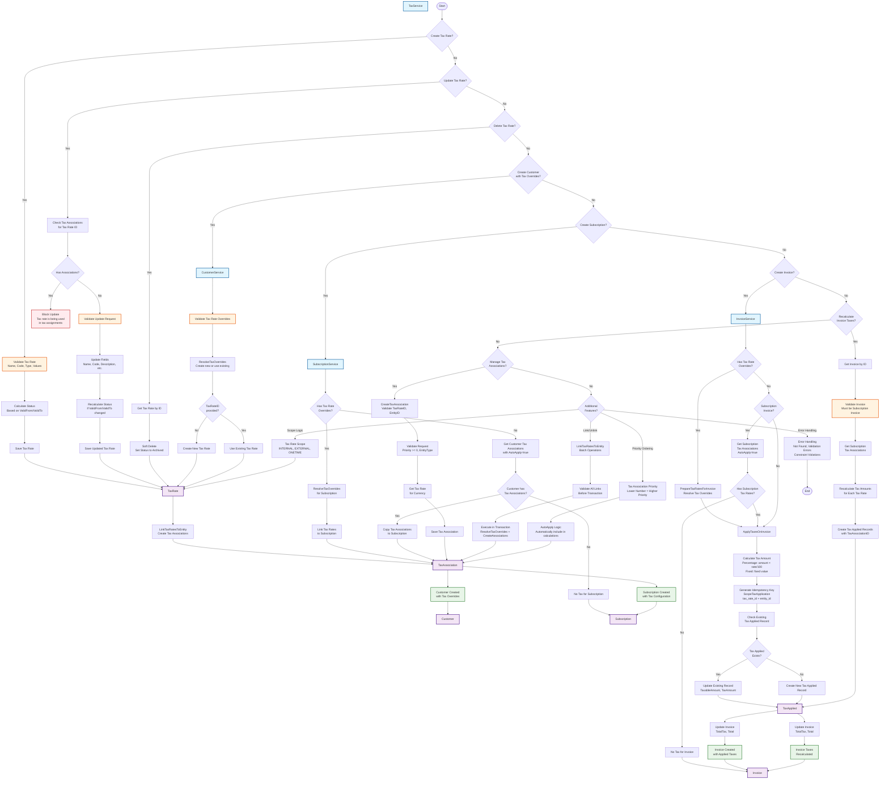

```mermaid
flowchart TD
%% Services
TS[TaxService]
CS[CustomerService]
SS[SubscriptionService]
IS[InvoiceService]

    %% Entities
    TR[TaxRate]
    TA[TaxAssociation]
    TAP[TaxApplied]
    CUST[Customer]
    SUB[Subscription]
    INV[Invoice]

    %% Tax Rate Management Flow
    START([Start]) --> CreateTR{Create Tax Rate?}
    CreateTR -->|Yes| ValidateTR[Validate Tax Rate<br/>Name, Code, Type, Values]
    ValidateTR --> CalcStatus[Calculate Status<br/>Based on ValidFrom/ValidTo]
    CalcStatus --> SaveTR[Save Tax Rate]
    SaveTR --> TR

    %% Update Tax Rate Flow
    CreateTR -->|No| UpdateTR{Update Tax Rate?}
    UpdateTR -->|Yes| CheckAssoc[Check Tax Associations<br/>for Tax Rate ID]
    CheckAssoc --> HasAssoc{Has Associations?}
    HasAssoc -->|Yes| BlockUpdate[Block Update<br/>Tax rate is being used<br/>in tax assignments]
    HasAssoc -->|No| ValidateUpdate[Validate Update Request]
    ValidateUpdate --> UpdateFields[Update Fields<br/>Name, Code, Description, etc.]
    UpdateFields --> UpdateStatus[Recalculate Status<br/>if ValidFrom/ValidTo changed]
    UpdateStatus --> SaveUpdatedTR[Save Updated Tax Rate]
    SaveUpdatedTR --> TR

    %% Delete Tax Rate Flow
    UpdateTR -->|No| DeleteTR{Delete Tax Rate?}
    DeleteTR -->|Yes| GetTRForDelete[Get Tax Rate by ID]
    GetTRForDelete --> SoftDelete[Soft Delete<br/>Set Status to Archived]
    SoftDelete --> TR

    %% Customer Tax Override Flow
    DeleteTR -->|No| CreateCust{Create Customer<br/>with Tax Overrides?}
    CreateCust -->|Yes| CS
    CS --> ValidateCustTax[Validate Tax Rate Overrides]
    ValidateCustTax --> ResolveTaxOverrides[ResolveTaxOverrides<br/>Create new or use existing]
    ResolveTaxOverrides --> CreateTaxID{TaxRateID<br/>provided?}
    CreateTaxID -->|No| CreateNewTR[Create New Tax Rate]
    CreateNewTR --> TR
    CreateTaxID -->|Yes| UseExistingTR[Use Existing Tax Rate]
    UseExistingTR --> TR
    TR --> LinkTaxToEntity[LinkTaxRatesToEntity<br/>Create Tax Associations]
    LinkTaxToEntity --> TA
    TA --> CreateCustSuccess[Customer Created<br/>with Tax Overrides]
    CreateCustSuccess --> CUST

    %% Subscription Creation Flow
    CreateCust -->|No| CreateSub{Create Subscription?}
    CreateSub -->|Yes| SS
    SS --> HasSubTaxOver{Has Tax Rate<br/>Overrides?}
    HasSubTaxOver -->|Yes| SubResolveTax[ResolveTaxOverrides<br/>for Subscription]
    SubResolveTax --> SubLinkTax[Link Tax Rates<br/>to Subscription]
    SubLinkTax --> TA
    HasSubTaxOver -->|No| InheritFromCust[Get Customer Tax Associations<br/>with AutoApply=true]
    InheritFromCust --> CustHasTax{Customer has<br/>Tax Associations?}
    CustHasTax -->|Yes| CopyTaxToSub[Copy Tax Associations<br/>to Subscription]
    CopyTaxToSub --> TA
    CustHasTax -->|No| NoTaxForSub[No Tax for Subscription]
    NoTaxForSub --> SUB
    TA --> SubSuccess[Subscription Created<br/>with Tax Configuration]
    SubSuccess --> SUB

    %% Invoice Creation Flow
    CreateSub -->|No| CreateInv{Create Invoice?}
    CreateInv -->|Yes| IS
    IS --> InvHasTaxOver{Has Tax Rate<br/>Overrides?}
    InvHasTaxOver -->|Yes| PrepareInvTax[PrepareTaxRatesForInvoice<br/>Resolve Tax Overrides]
    PrepareInvTax --> ApplyTaxToInv[ApplyTaxesOnInvoice]
    InvHasTaxOver -->|No| IsSubInv{Subscription<br/>Invoice?}
    IsSubInv -->|Yes| GetSubTax[Get Subscription<br/>Tax Associations<br/>AutoApply=true]
    GetSubTax --> HasSubTax{Has Subscription<br/>Tax Rates?}
    HasSubTax -->|Yes| ApplyTaxToInv
    HasSubTax -->|No| NoTaxForInv[No Tax for Invoice]
    NoTaxForInv --> INV
    IsSubInv -->|No| ApplyTaxToInv

    %% Tax Application Flow
    ApplyTaxToInv --> CalcTaxAmount[Calculate Tax Amount<br/>Percentage: amount × rate/100<br/>Fixed: fixed value]
    CalcTaxAmount --> GenerateIdempKey[Generate Idempotency Key<br/>ScopeTaxApplication<br/>tax_rate_id + entity_id]
    GenerateIdempKey --> CheckExisting[Check Existing<br/>Tax Applied Record]
    CheckExisting --> TaxExists{Tax Applied<br/>Exists?}
    TaxExists -->|Yes| UpdateExisting[Update Existing Record<br/>TaxableAmount, TaxAmount]
    TaxExists -->|No| CreateTaxApplied[Create New Tax Applied Record]
    UpdateExisting --> TAP
    CreateTaxApplied --> TAP
    TAP --> UpdateInvTotal[Update Invoice<br/>TotalTax, Total]
    UpdateInvTotal --> InvSuccess[Invoice Created<br/>with Applied Taxes]
    InvSuccess --> INV

    %% Tax Recalculation Flow
    CreateInv -->|No| RecalcTax{Recalculate<br/>Invoice Taxes?}
    RecalcTax -->|Yes| GetInvForRecalc[Get Invoice by ID]
    GetInvForRecalc --> ValidateInvForRecalc[Validate Invoice<br/>Must be Subscription Invoice]
    ValidateInvForRecalc --> GetSubTaxForRecalc[Get Subscription<br/>Tax Associations]
    GetSubTaxForRecalc --> RecalcTaxAmount[Recalculate Tax Amounts<br/>for Each Tax Rate]
    RecalcTaxAmount --> CreateRecalcTaxApplied[Create Tax Applied Records<br/>with TaxAssociationID]
    CreateRecalcTaxApplied --> TAP
    TAP --> UpdateRecalcInv[Update Invoice<br/>TotalTax, Total]
    UpdateRecalcInv --> RecalcSuccess[Invoice Taxes<br/>Recalculated]
    RecalcSuccess --> INV

    %% Tax Association Management
    RecalcTax -->|No| ManageTaxAssoc{Manage Tax<br/>Associations?}
    ManageTaxAssoc -->|Yes| CreateTaxAssoc[CreateTaxAssociation<br/>Validate TaxRateID, EntityID]
    CreateTaxAssoc --> ValidateTaxAssocReq[Validate Request<br/>Priority >= 0, EntityType]
    ValidateTaxAssocReq --> GetTaxRateForAssoc[Get Tax Rate<br/>for Currency]
    GetTaxRateForAssoc --> SaveTaxAssoc[Save Tax Association]
    SaveTaxAssoc --> TA

    %% Additional Validations and Features
    ManageTaxAssoc -->|No| AdditionalFeatures{Additional<br/>Features?}
    AdditionalFeatures -->|Link/Unlink| LinkUnlinkFlow[LinkTaxRatesToEntity<br/>Batch Operations]
    LinkUnlinkFlow --> ValidateBatchReq[Validate All Links<br/>Before Transaction]
    ValidateBatchReq --> BatchTransaction[Execute in Transaction<br/>ResolveTaxOverrides + CreateAssociations]
    BatchTransaction --> TA

    AdditionalFeatures -->|Priority Ordering| PriorityOrder[Tax Association Priority<br/>Lower Number = Higher Priority]
    PriorityOrder --> AutoApplyLogic[AutoApply Logic<br/>Automatically include in calculations]
    AutoApplyLogic --> TA

    AdditionalFeatures -->|Scope Logic| ScopeLogic[Tax Rate Scope<br/>INTERNAL, EXTERNAL, ONETIME]
    ScopeLogic --> TR

    AdditionalFeatures -->|Error Handling| ErrorHandling[Error Handling<br/>Not Found, Validation Errors<br/>Constraint Violations]
    ErrorHandling --> END([End])

    %% Styling
    classDef serviceClass fill:#e1f5fe,stroke:#01579b,stroke-width:2px
    classDef entityClass fill:#f3e5f5,stroke:#4a148c,stroke-width:2px
    classDef validationClass fill:#fff3e0,stroke:#e65100,stroke-width:2px
    classDef successClass fill:#e8f5e8,stroke:#2e7d32,stroke-width:2px
    classDef errorClass fill:#ffebee,stroke:#c62828,stroke-width:2px

    class TS,CS,SS,IS serviceClass
    class TR,TA,TAP,CUST,SUB,INV entityClass
    class ValidateTR,ValidateUpdate,ValidateCustTax,ValidateInvForRecalc validationClass
    class CreateCustSuccess,SubSuccess,InvSuccess,RecalcSuccess successClass
    class BlockUpdate errorClass
```