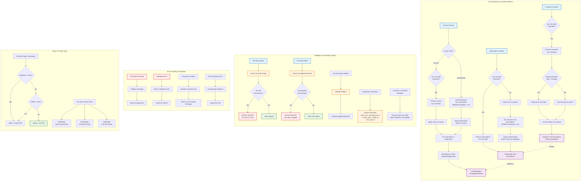

```mermaid
flowchart TD
%% Tax Override & Inheritance Patterns
subgraph "Tax Inheritance & Override Patterns"
direction TB

        %% Customer Level
        CustCreate[Customer Creation] --> CustTaxOver{Has Tax Rate<br/>Overrides?}
        CustTaxOver -->|Yes| ProcessCustOver[Process Customer<br/>Tax Overrides]
        ProcessCustOver --> MixedOverrides{Mixed Overrides?<br/>New + Existing}
        MixedOverrides -->|Yes| ResolveNewTax[Create New Tax Rates]
        MixedOverrides -->|No| UseExistingTax[Use Existing Tax Rates]
        ResolveNewTax --> LinkCustTax[Link Tax Rates to Customer]
        UseExistingTax --> LinkCustTax
        LinkCustTax --> CustTaxAssoc[Customer Tax Associations<br/>Priority, AutoApply]

        %% Subscription Level
        SubCreate[Subscription Creation] --> SubTaxOver{Has Tax Rate<br/>Overrides?}
        SubTaxOver -->|Yes| ProcessSubOver[Process Subscription<br/>Tax Overrides]
        ProcessSubOver --> SubTaxAssoc[Subscription Tax Associations]

        SubTaxOver -->|No| InheritFromCust[Inherit from Customer]
        InheritFromCust --> GetCustTax[Get Customer Tax Associations<br/>WHERE AutoApply = true]
        GetCustTax --> CopyToSub[Copy to Subscription<br/>Same Priority & AutoApply]
        CopyToSub --> SubTaxAssoc

        %% Invoice Level
        InvCreate[Invoice Creation] --> InvType{Invoice Type?}
        InvType -->|One-off| InvTaxOver{Has Tax Rate<br/>Overrides?}
        InvTaxOver -->|Yes| ProcessInvOver[Process Invoice<br/>Tax Overrides]
        ProcessInvOver --> ApplyInvTax[Apply Taxes to Invoice]

        InvType -->|Subscription| GetSubTax[Get Subscription<br/>Tax Associations<br/>WHERE AutoApply = true]
        GetSubTax --> ApplySubTax[Apply Subscription<br/>Taxes to Invoice]

        %% Tax Application
        ApplyInvTax --> TaxCalc[Tax Calculation & Application]
        ApplySubTax --> TaxCalc
        TaxCalc --> IdempotencyCheck[Idempotency Check<br/>ScopeTaxApplication]
        IdempotencyCheck --> TaxAppliedRecord[Create/Update<br/>Tax Applied Record]

        %% Inheritance Priority
        CustTaxAssoc -.->|Inherits| SubTaxAssoc
        SubTaxAssoc -.->|Applies to| TaxAppliedRecord
    end

    %% Validation & Cascading Checks
    subgraph "Validation & Cascading Checks"
        direction TB

        TaxRateUpdate[Tax Rate Update] --> CheckUsage[Check Tax Rate Usage]
        CheckUsage --> HasAssociations{Has Tax<br/>Associations?}
        HasAssociations -->|Yes| BlockUpdate[BLOCK UPDATE<br/>Tax rate is in use]
        HasAssociations -->|No| AllowUpdate[Allow Update]

        TaxRateDelete[Tax Rate Delete] --> CheckApplied[Check Tax Applied Records]
        CheckApplied --> HasApplied{Has Applied<br/>Tax Records?}
        HasApplied -->|Yes| BlockDelete[BLOCK DELETE<br/>Tax rate is applied]
        HasApplied -->|No| AllowDelete[Allow Soft Delete]

        TaxAssocDelete[Tax Association Delete] --> ValidateAssocDel[Validate Deletion]
        ValidateAssocDel --> CleanupApplied[Cleanup Applied Records?]

        DuplicationCheck[Duplication Prevention] --> UniqueConstraint[Unique Constraint<br/>tenant_id + environment_id<br/>+ entity_type + entity_id<br/>+ tax_rate_id]

        OverrideValidation[Override vs Inherited<br/>Validation] --> PreventDuplicate[Prevent Same Tax Rate<br/>Both Inherited & Overridden]
    end

    %% Error Handling & Fallbacks
    subgraph "Error Handling & Fallbacks"
        direction TB

        TaxNotFound[Tax Rate Not Found] --> FallbackHandling[Fallback Handling]
        FallbackHandling --> SkipTax[Skip Tax Application]

        ValidationError[Validation Error] --> ReturnError[Return Validation Error]
        ReturnError --> LogError[Log Error Details]

        ConstraintViolation[Constraint Violation] --> HandleConstraint[Handle Constraint Error]
        HandleConstraint --> UserFriendlyMsg[Return User-Friendly Message]

        TaxCalculationError[Tax Calculation Error] --> RecalcFallback[Recalculation Fallback]
        RecalcFallback --> ZeroTax[Apply Zero Tax]
    end

    %% Status & Scope Logic
    subgraph "Status & Scope Logic"
        direction TB

        TaxRateStatus[Tax Rate Status Calculation]
        TaxRateStatus --> ValidFromCheck{ValidFrom > Now?}
        ValidFromCheck -->|Yes| InactiveStatus[Status = INACTIVE]
        ValidFromCheck -->|No| ValidToCheck{ValidTo < Now?}
        ValidToCheck -->|Yes| InactiveStatus
        ValidToCheck -->|No| ActiveStatus[Status = ACTIVE]

        ScopeCheck[Tax Rate Scope Check]
        ScopeCheck --> ScopeInternal[INTERNAL<br/>Internal operations]
        ScopeCheck --> ScopeExternal[EXTERNAL<br/>Customer-facing]
        ScopeCheck --> ScopeOneTime[ONETIME<br/>One-off invoices]
    end

    %% Styling
    classDef processClass fill:#e3f2fd,stroke:#1976d2,stroke-width:2px
    classDef validationClass fill:#fff3e0,stroke:#f57c00,stroke-width:2px
    classDef errorClass fill:#ffebee,stroke:#d32f2f,stroke-width:2px
    classDef successClass fill:#e8f5e8,stroke:#388e3c,stroke-width:2px
    classDef entityClass fill:#f3e5f5,stroke:#7b1fa2,stroke-width:2px

    class CustCreate,SubCreate,InvCreate,TaxRateUpdate,TaxRateDelete processClass
    class CheckUsage,CheckApplied,ValidateAssocDel,UniqueConstraint validationClass
    class BlockUpdate,BlockDelete,TaxNotFound,ValidationError errorClass
    class AllowUpdate,AllowDelete,ActiveStatus successClass
    class CustTaxAssoc,SubTaxAssoc,TaxAppliedRecord entityClass
```