# Detailed Temporal Flow Diagram

```mermaid
graph TD
    %% Application Startup Phase
    subgraph "🚀 Application Startup"
        A1[Application Starts] --> A2[Initialize ServiceParams]
        A2 --> A3[Create Temporal Client]
        A3 --> A4[Create Temporal Service]
        A4 --> A5[Register Workflows & Activities]
    end

    %% Registration Phase
    subgraph "📝 Registration Phase (registration.go)"
        A5 --> R1[Register Workflows]
        R1 --> R2["RegisterWorkflow(workflows.CronBillingWorkflow)<br/>→ Name: 'CronBillingWorkflow'"]
        R2 --> R3["RegisterWorkflow(workflows.CalculateChargesWorkflow)<br/>→ Name: 'CalculateChargesWorkflow'"]
        R3 --> R4["RegisterWorkflow(workflows.PriceSyncWorkflow)<br/>→ Name: 'PriceSyncWorkflow'"]

        R4 --> R5[Create Dependencies]
        R5 --> R6["service.NewPlanService(params)<br/>→ Creates PlanService instance"]
        R6 --> R7["activities.NewPlanActivities(planService)<br/>→ Injects PlanService into PlanActivities"]
        R7 --> R8["&activities.BillingActivities{}<br/>→ Creates BillingActivities instance"]

        R8 --> R9[Register Activities]
        R9 --> R10["RegisterActivity(planActivities.SyncPlanPrices)<br/>→ Name: 'SyncPlanPrices'"]
        R10 --> R11["RegisterActivity(billingActivities.FetchDataActivity)<br/>→ Name: 'FetchDataActivity'"]
        R11 --> R12["RegisterActivity(billingActivities.CalculateActivity)<br/>→ Name: 'CalculateActivity'"]
    end

    %% HTTP Request Phase
    subgraph "🌐 HTTP Request Phase"
        R12 --> H1[HTTP Request: POST /plans/123/sync/subscriptions]
        H1 --> H2[Gin Router]
        H2 --> H3[PlanHandler.SyncPlanPrices]
        H3 --> H4["Extract Plan ID: '123'<br/>from c.Param('id')"]
        H4 --> H5["Extract Context:<br/>- Tenant ID<br/>- Environment ID<br/>- API Key"]
    end

    %% Temporal Service Phase
    subgraph "⚙️ Temporal Service Phase (service.go)"
        H5 --> T1[temporalService.StartPlanPriceSync]
        T1 --> T2["Extract Tenant Info:<br/>tenantID = types.GetTenantID(ctx)<br/>environmentID = types.GetEnvironmentID(ctx)"]
        T2 --> T3["Generate Workflow ID:<br/>'price-sync-123-1703123456'"]
        T3 --> T4["Create Workflow Options:<br/>- ID: workflowID<br/>- TaskQueue: cfg.TaskQueue"]
        T4 --> T5["Execute Workflow:<br/>Workflow Name: 'PriceSyncWorkflow'<br/>Input: PriceSyncWorkflowInput"]
        T5 --> T6["Wait for Completion:<br/>we.Get(ctx, &result)"]
    end

    %% Temporal Worker Phase
    subgraph "👷 Temporal Worker Phase"
        T6 --> W1[Temporal Worker Picks Up Workflow]
        W1 --> W2["Find Registered Workflow:<br/>'PriceSyncWorkflow'"]
        W2 --> W3[Execute PriceSyncWorkflow]
    end

    %% Workflow Execution Phase
    subgraph "🔄 Workflow Execution (price_sync_workflow.go)"
        W3 --> WF1["PriceSyncWorkflow(ctx, input)"]
        WF1 --> WF2["Validate Input:<br/>in.Validate()"]
        WF2 --> WF3["Create Activity Input:<br/>{PlanID, TenantID, EnvironmentID}"]
        WF3 --> WF4["Set Activity Options:<br/>- Timeout: 5 minutes<br/>- Retry: 3 attempts<br/>- Backoff: 2.0 coefficient"]
        WF4 --> WF5["Execute Activity:<br/>Activity Name: 'SyncPlanPrices'<br/>Input: activityInput"]
        WF5 --> WF6["Wait for Activity Result:<br/>workflow.ExecuteActivity().Get()"]
    end

    %% Activity Execution Phase
    subgraph "⚡ Activity Execution (plan_activities.go)"
        WF6 --> AC1["PlanActivities.SyncPlanPrices(ctx, input)"]
        AC1 --> AC2["Validate Input:<br/>- PlanID required<br/>- TenantID required<br/>- EnvironmentID required"]
        AC2 --> AC3["Set Context Values:<br/>ctx = context.WithValue(ctx, CtxTenantID, tenantID)<br/>ctx = context.WithValue(ctx, CtxEnvironmentID, environmentID)"]
        AC3 --> AC4["Call Business Logic:<br/>planService.SyncPlanPrices(ctx, planID)"]
        AC4 --> AC5["Return Result:<br/>dto.SyncPlanPricesResponse"]
    end

    %% Business Service Phase
    subgraph "💼 Business Service Phase"
        AC4 --> BS1[PlanService.SyncPlanPrices]
        BS1 --> BS2["Business Logic Execution:<br/>- Find all active subscriptions<br/>- Update prices<br/>- Handle conflicts<br/>- Generate reports"]
        BS2 --> BS3["Return Business Result:<br/>SyncPlanPricesResponse"]
    end

    %% Result Flow Back
    subgraph "📤 Result Flow Back"
        BS3 --> RF1[Activity Returns Result]
        RF1 --> RF2[Workflow Receives Result]
        RF2 --> RF3[Temporal Service Gets Result]
        RF3 --> RF4[PlanHandler Returns HTTP Response]
        RF4 --> RF5["HTTP 200 OK<br/>{'message': 'sync completed', 'affected_subscriptions': 42}"]
    end

    %% Error Handling
    subgraph "❌ Error Handling"
        WF2 -->|Validation Error| E1[Return Validation Error]
        AC2 -->|Validation Error| E2[Return Validation Error]
        BS2 -->|Business Error| E3[Return Business Error]
        E1 --> E4[HTTP 400 Bad Request]
        E2 --> E4
        E3 --> E5[HTTP 500 Internal Server Error]
    end

    %% Retry Logic
    subgraph "🔄 Retry Logic"
        AC4 -->|Activity Fails| RT1[Temporal Retry Policy]
        RT1 --> RT2["Retry 1: Wait 1 second"]
        RT2 --> RT3["Retry 2: Wait 2 seconds"]
        RT3 --> RT4["Retry 3: Wait 4 seconds"]
        RT4 -->|Still Fails| E6[Activity Failed - Return Error]
        RT2 -->|Success| AC5
        RT3 -->|Success| AC5
        RT4 -->|Success| AC5
    end

    %% Styling
    classDef startup fill:#e1f5fe
    classDef registration fill:#f3e5f5
    classDef http fill:#e8f5e8
    classDef temporal fill:#fff3e0
    classDef worker fill:#fce4ec
    classDef workflow fill:#e0f2f1
    classDef activity fill:#f1f8e9
    classDef business fill:#e3f2fd
    classDef result fill:#e8f5e8
    classDef error fill:#ffebee
    classDef retry fill:#fff8e1

    class A1,A2,A3,A4,A5 startup
    class R1,R2,R3,R4,R5,R6,R7,R8,R9,R10,R11,R12 registration
    class H1,H2,H3,H4,H5 http
    class T1,T2,T3,T4,T5,T6 temporal
    class W1,W2,W3 worker
    class WF1,WF2,WF3,WF4,WF5,WF6 workflow
    class AC1,AC2,AC3,AC4,AC5 activity
    class BS1,BS2,BS3 business
    class RF1,RF2,RF3,RF4,RF5 result
    class E1,E2,E3,E4,E5,E6 error
    class RT1,RT2,RT3,RT4 retry
```

## Key Registration Names

### Workflows Registered:

- `"CronBillingWorkflow"` → `workflows.CronBillingWorkflow`
- `"CalculateChargesWorkflow"` → `workflows.CalculateChargesWorkflow`
- `"PriceSyncWorkflow"` → `workflows.PriceSyncWorkflow`

### Activities Registered:

- `"SyncPlanPrices"` → `planActivities.SyncPlanPrices`
- `"FetchDataActivity"` → `billingActivities.FetchDataActivity`
- `"CalculateActivity"` → `billingActivities.CalculateActivity`

## Context Flow:

1. **HTTP Context** → Contains Tenant ID, Environment ID, API Key
2. **Temporal Context** → Workflow execution context with timeouts/retries
3. **Activity Context** → Business logic context with tenant/environment values
4. **Service Context** → Database and business logic context

## Data Transformation:

- **Input**: Plan ID from URL parameter
- **Workflow Input**: `{PlanID, TenantID, EnvironmentID}`
- **Activity Input**: `{plan_id, tenant_id, environment_id}`
- **Service Input**: Context with tenant/env + Plan ID
- **Output**: `SyncPlanPricesResponse` with sync results
