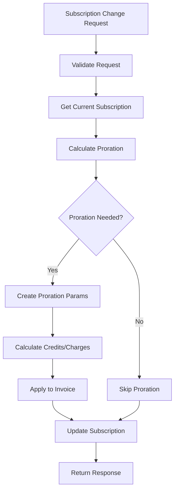
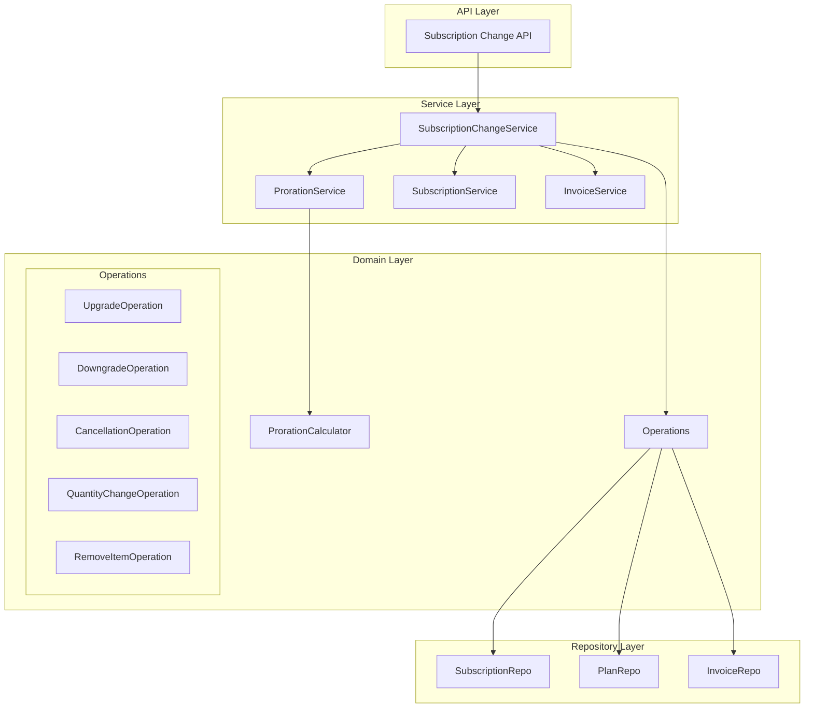

# Upgrade/Downgrade and Cancellation Proration Implementation Guide

## Table of Contents
1. [Overview](#overview)
2. [Current State Analysis](#current-state-analysis)
3. [Architecture Design](#architecture-design)
4. [Implementation Plan](#implementation-plan)
5. [Integration Points](#integration-points)
6. [Edge Cases and Considerations](#edge-cases-and-considerations)
7. [Testing Strategy](#testing-strategy)
8. [Rollout Plan](#rollout-plan)
9. [Monitoring and Observability](#monitoring-and-observability)

## Overview

This document outlines the implementation strategy for extending FlexPrice's existing proration service to support **Upgrade/Downgrade** and **Cancellation** scenarios. The current system already has a robust proration foundation with support for `add_item` operations. This implementation will leverage the existing architecture while adding new capabilities.

### Goals
- Enable seamless subscription upgrades and downgrades with accurate proration
- Support subscription and line item cancellations with appropriate credit calculations
- Maintain consistency with existing proration behavior
- Ensure transaction safety and data integrity
- Provide comprehensive preview capabilities

### Success Criteria
- All upgrade/downgrade scenarios are handled with accurate proration calculations
- Cancellation scenarios properly credit customers for unused time
- Preview functionality works correctly for all new operations
- Performance impact is minimal
- Full backward compatibility is maintained

## Current State Analysis

### Existing Proration Infrastructure

Based on the codebase analysis, FlexPrice already has a solid proration foundation:

**Core Components:**
- `ProrationService` interface with calculator abstraction
- `ProrationCalculator` with day-based strategy implementation
- `ProrationParams` and `ProrationResult` data structures
- Integration with subscription change service
- Support for timezone-aware calculations
- Credit capping logic to prevent over-crediting

**Supported Operations:**
- ✅ `add_item` - Adding new line items to subscriptions
- ✅ Basic subscription-level proration calculations
- ✅ Credit/charge line item generation
- ✅ Preview mode support

**Missing Operations:**
- ❌ `upgrade` - Plan/price upgrades with proration
- ❌ `downgrade` - Plan/price downgrades with proration  
- ❌ `quantity_change` - Quantity modifications
- ❌ `cancellation` - Subscription/line item cancellations
- ❌ `remove_item` - Removing specific line items

### Current Proration Flow



## Architecture Design

### Enhanced Proration Service Architecture

The implementation will extend the existing architecture without breaking changes:



### Operation-Based Design Pattern

Each proration scenario will be implemented as a discrete operation:

1. **UpgradeOperation**: Handles plan/price upgrades
2. **DowngradeOperation**: Handles plan/price downgrades  
3. **CancellationOperation**: Handles subscription cancellations
4. **QuantityChangeOperation**: Handles quantity modifications
5. **RemoveItemOperation**: Handles line item removals

Each operation implements a common interface:

```go
type ProrationOperation interface {
    // Validate checks if the operation can be performed
    Validate(ctx context.Context, subscription *Subscription) error
    
    // CalculateProration computes the proration impact
    CalculateProration(ctx context.Context, params OperationParams) (*ProrationResult, error)
    
    // Execute performs the actual changes
    Execute(ctx context.Context, params OperationParams) error
    
    // Preview shows the impact without making changes
    Preview(ctx context.Context, params OperationParams) (*PreviewResult, error)
}
```

## Implementation Plan

### Phase 1: Core Operation Framework

#### 1.1 Extend ProrationAction Types
The existing `ProrationAction` enum already includes the required values:
- `ProrationActionUpgrade`
- `ProrationActionDowngrade` 
- `ProrationActionQuantityChange`
- `ProrationActionCancellation`
- `ProrationActionRemoveItem`

#### 1.2 Enhance ProrationParams Structure
Extend the existing `ProrationParams` to support new operations:

```go
type ProrationParams struct {
    // ... existing fields ...
    
    // Enhanced for new operations
    ChangeReason         string                    // Business reason for change
    PreserveTrialPeriod  bool                     // Whether to preserve trial
    RefundPolicy         types.RefundPolicy       // How to handle refunds
    GracePeriod          *time.Duration           // Grace period for changes
    
    // Cancellation-specific
    CancellationReason   types.CancellationReason // Why subscription is being cancelled
    CancellationDate     time.Time                // When cancellation takes effect
    
    // Upgrade/Downgrade specific  
    PriceOverrides       map[string]*PriceOverride // Custom pricing for specific items
    QuantityOverrides    map[string]decimal.Decimal // Custom quantities
}
```

#### 1.3 Create Operation Implementations

**UpgradeOperation Implementation:**
```go
type UpgradeOperation struct {
    subscriptionRepo SubscriptionRepository
    planRepo         PlanRepository
    priceRepo        PriceRepository
    prorationService ProrationService
}

func (op *UpgradeOperation) CalculateProration(
    ctx context.Context, 
    params OperationParams,
) (*ProrationResult, error) {
    // 1. Validate upgrade is possible
    if err := op.validateUpgrade(ctx, params); err != nil {
        return nil, err
    }
    
    // 2. Calculate credit for unused time on current plan
    currentCredit, err := op.calculateCurrentPlanCredit(ctx, params)
    if err != nil {
        return nil, err
    }
    
    // 3. Calculate charge for new plan (prorated)
    newCharge, err := op.calculateNewPlanCharge(ctx, params)
    if err != nil {
        return nil, err
    }
    
    // 4. Apply credit capping logic
    cappedCredit := op.applyCreditCapping(currentCredit, params)
    
    // 5. Build result
    return &ProrationResult{
        CreditItems: []ProrationLineItem{cappedCredit},
        ChargeItems: []ProrationLineItem{newCharge},
        NetAmount:   newCharge.Amount.Add(cappedCredit.Amount), // Credit is negative
        Action:      types.ProrationActionUpgrade,
        // ... other fields
    }, nil
}
```

**DowngradeOperation Implementation:**
```go
type DowngradeOperation struct {
    subscriptionRepo SubscriptionRepository
    planRepo         PlanRepository
    priceRepo        PriceRepository
    prorationService ProrationService
}

func (op *DowngradeOperation) CalculateProration(
    ctx context.Context,
    params OperationParams,
) (*ProrationResult, error) {
    // 1. Validate downgrade is allowed
    if err := op.validateDowngrade(ctx, params); err != nil {
        return nil, err
    }
    
    // 2. Calculate credit for unused time on current plan
    currentCredit, err := op.calculateCurrentPlanCredit(ctx, params)
    if err != nil {
        return nil, err
    }
    
    // 3. Calculate charge for new (lower) plan
    newCharge, err := op.calculateNewPlanCharge(ctx, params)
    if err != nil {
        return nil, err
    }
    
    // 4. Handle downgrade-specific logic
    // - Check minimum commitment periods
    // - Apply early termination fees if applicable
    // - Consider retention offers
    
    return &ProrationResult{
        CreditItems: []ProrationLineItem{currentCredit},
        ChargeItems: []ProrationLineItem{newCharge},
        NetAmount:   newCharge.Amount.Add(currentCredit.Amount),
        Action:      types.ProrationActionDowngrade,
        // ... other fields
    }, nil
}
```

**CancellationOperation Implementation:**
```go
type CancellationOperation struct {
    subscriptionRepo SubscriptionRepository
    invoiceRepo      InvoiceRepository
    prorationService ProrationService
}

func (op *CancellationOperation) CalculateProration(
    ctx context.Context,
    params OperationParams,
) (*ProrationResult, error) {
    // 1. Validate cancellation is allowed
    if err := op.validateCancellation(ctx, params); err != nil {
        return nil, err
    }
    
    // 2. Determine cancellation type (immediate vs end of period)
    cancellationType := op.determineCancellationType(params)
    
    // 3. Calculate credits based on cancellation type
    var credits []ProrationLineItem
    if cancellationType == types.CancellationImmediate {
        // Credit for unused time on all line items
        credits, err = op.calculateImmediateCancellationCredits(ctx, params)
        if err != nil {
            return nil, err
        }
    }
    
    // 4. Handle cancellation fees or penalties
    penalties, err := op.calculateCancellationPenalties(ctx, params)
    if err != nil {
        return nil, err
    }
    
    return &ProrationResult{
        CreditItems: credits,
        ChargeItems: penalties,
        NetAmount:   op.calculateNetAmount(credits, penalties),
        Action:      types.ProrationActionCancellation,
        // ... other fields
    }, nil
}
```

### Phase 2: Enhanced Calculator Logic

#### 2.1 Upgrade/Downgrade Calculation Logic

The existing `dayBasedCalculator` needs enhancement to handle different scenarios:

```go
func (c *dayBasedCalculator) Calculate(
    ctx context.Context, 
    params ProrationParams,
) (*ProrationResult, error) {
    // ... existing validation and setup ...
    
    switch params.Action {
    case types.ProrationActionUpgrade:
        return c.calculateUpgrade(ctx, params)
    case types.ProrationActionDowngrade:
        return c.calculateDowngrade(ctx, params)
    case types.ProrationActionCancellation:
        return c.calculateCancellation(ctx, params)
    case types.ProrationActionQuantityChange:
        return c.calculateQuantityChange(ctx, params)
    case types.ProrationActionRemoveItem:
        return c.calculateRemoveItem(ctx, params)
    case types.ProrationActionAddItem:
        return c.calculateAddItem(ctx, params) // existing logic
    default:
        return nil, fmt.Errorf("unsupported proration action: %s", params.Action)
    }
}
```

#### 2.2 Credit Capping Enhancement

Extend the existing credit capping logic to handle multiple scenarios:

```go
func (c *dayBasedCalculator) capCreditAmount(
    potentialCredit decimal.Decimal,
    originalAmountPaid decimal.Decimal,
    previousCreditsIssued decimal.Decimal,
    action types.ProrationAction,
) decimal.Decimal {
    // Base capping logic (existing)
    baseCappedCredit := c.baseCapCreditAmount(
        potentialCredit, 
        originalAmountPaid, 
        previousCreditsIssued,
    )
    
    // Apply action-specific rules
    switch action {
    case types.ProrationActionDowngrade:
        // Downgrades might have different capping rules
        return c.applyDowngradeCapRules(baseCappedCredit, originalAmountPaid)
    case types.ProrationActionCancellation:
        // Cancellations might allow higher credit percentages
        return c.applyCancellationCapRules(baseCappedCredit, originalAmountPaid)
    default:
        return baseCappedCredit
    }
}
```

### Phase 3: Service Integration

#### 3.1 Enhanced Subscription Change Service

Extend the existing `SubscriptionChangeService` to handle new operations:

```go
func (s *subscriptionChangeService) ExecuteSubscriptionChange(
    ctx context.Context,
    subscriptionID string,
    req dto.SubscriptionChangeRequest,
) (*dto.SubscriptionChangeExecuteResponse, error) {
    // ... existing validation ...
    
    // Determine operation type
    operation, err := s.createOperationFromRequest(ctx, req)
    if err != nil {
        return nil, err
    }
    
    // Execute within transaction
    return s.executeOperationWithTransaction(ctx, subscriptionID, operation, req)
}

func (s *subscriptionChangeService) createOperationFromRequest(
    ctx context.Context,
    req dto.SubscriptionChangeRequest,
) (ProrationOperation, error) {
    switch req.ChangeType {
    case types.SubscriptionChangeTypeUpgrade:
        return NewUpgradeOperation(s.serviceParams), nil
    case types.SubscriptionChangeTypeDowngrade:
        return NewDowngradeOperation(s.serviceParams), nil
    case types.SubscriptionChangeTypeCancellation:
        return NewCancellationOperation(s.serviceParams), nil
    case types.SubscriptionChangeTypeQuantityChange:
        return NewQuantityChangeOperation(s.serviceParams), nil
    default:
        return nil, fmt.Errorf("unsupported change type: %s", req.ChangeType)
    }
}
```

#### 3.2 Transaction Management

Ensure all operations are atomic:

```go
func (s *subscriptionChangeService) executeOperationWithTransaction(
    ctx context.Context,
    subscriptionID string,
    operation ProrationOperation,
    req dto.SubscriptionChangeRequest,
) (*dto.SubscriptionChangeExecuteResponse, error) {
    var result *dto.SubscriptionChangeExecuteResponse
    
    err := s.serviceParams.DB.WithTx(ctx, func(txCtx context.Context) error {
        // 1. Get current subscription state
        subscription, err := s.serviceParams.SubRepo.GetWithLineItems(txCtx, subscriptionID)
        if err != nil {
            return err
        }
        
        // 2. Validate operation
        if err := operation.Validate(txCtx, subscription); err != nil {
            return err
        }
        
        // 3. Calculate proration
        params := s.buildOperationParams(subscription, req)
        prorationResult, err := operation.CalculateProration(txCtx, params)
        if err != nil {
            return err
        }
        
        // 4. Execute the operation
        if err := operation.Execute(txCtx, params); err != nil {
            return err
        }
        
        // 5. Apply proration to invoice
        if req.ProrationBehavior == types.ProrationBehaviorCreateProrations {
            if err := s.applyProrationToInvoice(txCtx, subscription, prorationResult); err != nil {
                return err
            }
        }
        
        // 6. Build response
        result = s.buildExecuteResponse(subscription, prorationResult, req)
        return nil
    })
    
    return result, err
}
```

## Integration Points

### 4.1 API Layer Integration

#### Enhanced DTO Structures

```go
// Enhanced subscription change request
type SubscriptionChangeRequest struct {
    // Existing fields...
    TargetPlanID     string                       `json:"target_plan_id"`
    EffectiveDate    *time.Time                  `json:"effective_date,omitempty"`
    ProrationBehavior types.ProrationBehavior    `json:"proration_behavior"`
    
    // New fields for enhanced operations
    ChangeType       types.SubscriptionChangeType `json:"change_type"`
    LineItemChanges  []LineItemChange            `json:"line_item_changes,omitempty"`
    CancellationReason *string                   `json:"cancellation_reason,omitempty"`
    PreserveTrialPeriod bool                     `json:"preserve_trial_period"`
    
    // Quantity changes
    QuantityOverrides map[string]decimal.Decimal `json:"quantity_overrides,omitempty"`
    
    // Price overrides for custom pricing
    PriceOverrides   map[string]*PriceOverride   `json:"price_overrides,omitempty"`
}

type LineItemChange struct {
    LineItemID   string               `json:"line_item_id"`
    Action       types.ProrationAction `json:"action"`
    NewPriceID   *string              `json:"new_price_id,omitempty"`
    NewQuantity  *decimal.Decimal     `json:"new_quantity,omitempty"`
}

// Enhanced response with detailed proration breakdown
type SubscriptionChangeExecuteResponse struct {
    // Existing fields...
    UpdatedSubscription *SubscriptionResponse  `json:"updated_subscription"`
    ProrationDetails    *ProrationDetails     `json:"proration_details,omitempty"`
    
    // New fields
    ChangeType          types.SubscriptionChangeType `json:"change_type"`
    EffectiveDate       time.Time                   `json:"effective_date"`
    PreviousSubscription *SubscriptionResponse      `json:"previous_subscription"`
    InvoiceGenerated    *InvoiceResponse            `json:"invoice_generated,omitempty"`
    
    // Warnings and notices
    Warnings            []string                    `json:"warnings,omitempty"`
    NextBillingDate     *time.Time                 `json:"next_billing_date,omitempty"`
}
```

#### New API Endpoints

```go
// Preview specific operation types
POST /subscriptions/{id}/preview-upgrade
POST /subscriptions/{id}/preview-downgrade  
POST /subscriptions/{id}/preview-cancellation

// Execute specific operation types
POST /subscriptions/{id}/upgrade
POST /subscriptions/{id}/downgrade
POST /subscriptions/{id}/cancel

// Bulk operations
POST /subscriptions/{id}/bulk-changes
```

### 4.2 Database Integration

#### Subscription History Tracking

```sql
-- Track subscription changes for audit trail
CREATE TABLE subscription_changes (
    id UUID PRIMARY KEY DEFAULT gen_random_uuid(),
    subscription_id UUID NOT NULL REFERENCES subscriptions(id),
    change_type VARCHAR(50) NOT NULL,
    previous_plan_id UUID REFERENCES plans(id),
    new_plan_id UUID REFERENCES plans(id),
    effective_date TIMESTAMP NOT NULL,
    proration_amount DECIMAL(12,4),
    created_at TIMESTAMP DEFAULT NOW(),
    created_by UUID,
    metadata JSONB
);

-- Track line item changes
CREATE TABLE subscription_line_item_changes (
    id UUID PRIMARY KEY DEFAULT gen_random_uuid(),
    subscription_change_id UUID NOT NULL REFERENCES subscription_changes(id),
    line_item_id UUID NOT NULL,
    action VARCHAR(50) NOT NULL,
    previous_price_id UUID REFERENCES prices(id),
    new_price_id UUID REFERENCES prices(id),
    previous_quantity DECIMAL(12,4),
    new_quantity DECIMAL(12,4),
    proration_amount DECIMAL(12,4),
    created_at TIMESTAMP DEFAULT NOW()
);
```

### 4.3 Invoice Integration

#### Proration Line Items

Extend invoice line items to support proration tracking:

```go
type InvoiceLineItem struct {
    // Existing fields...
    ID               string          `json:"id"`
    InvoiceID        string          `json:"invoice_id"`
    Description      string          `json:"description"`
    Amount           decimal.Decimal `json:"amount"`
    
    // Enhanced proration fields
    ProrationDetails *ProrationLineItemDetails `json:"proration_details,omitempty"`
    SourceChangeID   *string                   `json:"source_change_id,omitempty"`
    ProrationPeriod  *ProrationPeriod          `json:"proration_period,omitempty"`
}

type ProrationLineItemDetails struct {
    Action           types.ProrationAction `json:"action"`
    OriginalAmount   decimal.Decimal      `json:"original_amount"`
    ProrationFactor  decimal.Decimal      `json:"proration_factor"`
    PeriodStart      time.Time            `json:"period_start"`
    PeriodEnd        time.Time            `json:"period_end"`
}
```

## Edge Cases and Considerations

### 5.1 Billing Cycle Considerations

#### Anniversary vs Calendar Billing
```go
func (op *UpgradeOperation) handleBillingCycleAlignment(
    ctx context.Context,
    subscription *Subscription,
    targetPlan *Plan,
    effectiveDate time.Time,
) (*BillingAlignment, error) {
    if subscription.BillingCycle == types.BillingCycleCalendar {
        // For calendar billing, align to calendar periods
        return op.calculateCalendarAlignment(effectiveDate, targetPlan.BillingPeriod)
    }
    
    // For anniversary billing, maintain current cycle
    return op.calculateAnniversaryAlignment(
        subscription.BillingAnchor,
        effectiveDate,
        targetPlan.BillingPeriod,
    )
}
```

### 5.2 Trial Period Handling

```go
func (op *UpgradeOperation) handleTrialPeriod(
    ctx context.Context,
    subscription *Subscription,
    params OperationParams,
) error {
    if subscription.IsInTrial() {
        if params.PreserveTrialPeriod {
            // Extend trial period to new plan
            return op.extendTrialToNewPlan(ctx, subscription, params)
        } else {
            // End trial and start billing immediately
            return op.endTrialAndStartBilling(ctx, subscription, params)
        }
    }
    return nil
}
```

### 5.3 Multiple Changes in Same Period

```go
func (c *dayBasedCalculator) handleMultipleChanges(
    ctx context.Context,
    params ProrationParams,
) (*ProrationResult, error) {
    // Get all changes in current billing period
    previousChanges, err := c.getPreviousChangesInPeriod(
        ctx,
        params.SubscriptionID,
        params.CurrentPeriodStart,
        params.CurrentPeriodEnd,
    )
    if err != nil {
        return nil, err
    }
    
    // Calculate cumulative credit cap
    totalPreviousCredits := decimal.Zero
    for _, change := range previousChanges {
        totalPreviousCredits = totalPreviousCredits.Add(change.CreditAmount)
    }
    
    // Apply enhanced credit capping
    return c.calculateWithCumulativeCapLimit(params, totalPreviousCredits)
}
```

### 5.4 Timezone Edge Cases

```go
func (c *dayBasedCalculator) handleTimezoneEdgeCases(
    prorationDate time.Time,
    customerTimezone string,
) (time.Time, error) {
    loc, err := time.LoadLocation(customerTimezone)
    if err != nil {
        return time.Time{}, err
    }
    
    // Handle DST transitions
    localTime := prorationDate.In(loc)
    
    // Check if we're in a DST transition period
    if c.isDSTTransition(localTime) {
        // Adjust to avoid ambiguous times
        return c.adjustForDSTTransition(localTime), nil
    }
    
    return localTime, nil
}
```

### 5.5 Minimum Commitment Periods

```go
func (op *DowngradeOperation) validateMinimumCommitment(
    ctx context.Context,
    subscription *Subscription,
    targetPlan *Plan,
) error {
    if subscription.HasMinimumCommitment() {
        commitmentEnd := subscription.CommitmentEndDate
        if time.Now().Before(commitmentEnd) {
            // Check if downgrade is allowed during commitment
            if !targetPlan.AllowDowngradeDuringCommitment {
                return ierr.NewError("downgrade not allowed during minimum commitment period").
                    WithHint(fmt.Sprintf("Commitment ends on %s", commitmentEnd.Format("2006-01-02"))).
                    Mark(ierr.ErrValidation)
            }
            
            // Calculate early termination fee if applicable
            etf, err := op.calculateEarlyTerminationFee(ctx, subscription, commitmentEnd)
            if err != nil {
                return err
            }
            
            if etf.GreaterThan(decimal.Zero) {
                // Add ETF to the operation
                op.addEarlyTerminationFee(etf)
            }
        }
    }
    return nil
}
```

## Testing Strategy

### 6.1 Unit Testing

#### Calculator Tests
```go
func TestCalculator_UpgradeScenarios(t *testing.T) {
    tests := []struct {
        name           string
        params         ProrationParams
        expectedResult *ProrationResult
        expectedError  string
    }{
        {
            name: "mid_period_upgrade_advance_billing",
            params: ProrationParams{
                Action:             types.ProrationActionUpgrade,
                OldPricePerUnit:    decimal.NewFromInt(50),
                NewPricePerUnit:    decimal.NewFromInt(100),
                OldQuantity:        decimal.NewFromInt(1),
                NewQuantity:        decimal.NewFromInt(1),
                ProrationDate:      time.Date(2024, 3, 15, 0, 0, 0, 0, time.UTC),
                CurrentPeriodStart: time.Date(2024, 3, 1, 0, 0, 0, 0, time.UTC),
                CurrentPeriodEnd:   time.Date(2024, 3, 31, 0, 0, 0, 0, time.UTC),
                PlanPayInAdvance:   true,
                OriginalAmountPaid: decimal.NewFromInt(50),
                CustomerTimezone:   "UTC",
                Currency:           "USD",
            },
            expectedResult: &ProrationResult{
                NetAmount: decimal.NewFromFloat(27.42), // (100-50) * 17/31
                Action:    types.ProrationActionUpgrade,
                CreditItems: []ProrationLineItem{
                    {
                        Amount:    decimal.NewFromFloat(-27.42), // -(50 * 17/31)
                        IsCredit:  true,
                        PriceID:   "old_price",
                    },
                },
                ChargeItems: []ProrationLineItem{
                    {
                        Amount:   decimal.NewFromFloat(54.84), // (100 * 17/31)
                        IsCredit: false,
                        PriceID:  "new_price",
                    },
                },
            },
        },
        // Add more test cases for different scenarios
    }
    
    for _, tt := range tests {
        t.Run(tt.name, func(t *testing.T) {
            calculator := NewCalculator(logger)
            result, err := calculator.Calculate(context.Background(), tt.params)
            
            if tt.expectedError != "" {
                assert.Error(t, err)
                assert.Contains(t, err.Error(), tt.expectedError)
                return
            }
            
            assert.NoError(t, err)
            assert.Equal(t, tt.expectedResult.NetAmount.Round(2), result.NetAmount.Round(2))
            // ... additional assertions
        })
    }
}
```

#### Operation Tests
```go
func TestUpgradeOperation_Execute(t *testing.T) {
    // Setup mocks
    mockSubRepo := &MockSubscriptionRepository{}
    mockPlanRepo := &MockPlanRepository{}
    mockProrationService := &MockProrationService{}
    
    operation := NewUpgradeOperation(ServiceParams{
        SubRepo:          mockSubRepo,
        PlanRepo:         mockPlanRepo,
        ProrationService: mockProrationService,
    })
    
    // Test successful upgrade
    t.Run("successful_upgrade", func(t *testing.T) {
        // Setup test data
        subscription := &Subscription{
            ID:     "sub_123",
            PlanID: "plan_basic",
            // ... other fields
        }
        
        params := OperationParams{
            SubscriptionID: "sub_123",
            TargetPlanID:   "plan_premium",
            EffectiveDate:  time.Now(),
        }
        
        // Setup expectations
        mockSubRepo.On("Get", mock.Anything, "sub_123").Return(subscription, nil)
        mockPlanRepo.On("Get", mock.Anything, "plan_premium").Return(&Plan{}, nil)
        mockProrationService.On("CalculateProration", mock.Anything, mock.Anything).
            Return(&ProrationResult{}, nil)
        
        // Execute
        err := operation.Execute(context.Background(), params)
        
        // Assert
        assert.NoError(t, err)
        mockSubRepo.AssertExpectations(t)
        mockPlanRepo.AssertExpectations(t)
        mockProrationService.AssertExpectations(t)
    })
}
```

### 6.2 Integration Testing

#### End-to-End Scenarios
```go
func TestSubscriptionChangeService_IntegrationTests(t *testing.T) {
    // Setup test database and services
    testDB := setupTestDatabase(t)
    defer testDB.Close()
    
    service := setupSubscriptionChangeService(testDB)
    
    t.Run("upgrade_with_proration", func(t *testing.T) {
        // 1. Create test subscription
        subscription := createTestSubscription(t, testDB, "basic_plan")
        
        // 2. Execute upgrade
        req := dto.SubscriptionChangeRequest{
            TargetPlanID:      "premium_plan",
            ChangeType:        types.SubscriptionChangeTypeUpgrade,
            ProrationBehavior: types.ProrationBehaviorCreateProrations,
            EffectiveDate:     timePtr(time.Now()),
        }
        
        response, err := service.ExecuteSubscriptionChange(
            context.Background(),
            subscription.ID,
            req,
        )
        
        // 3. Verify results
        assert.NoError(t, err)
        assert.NotNil(t, response.ProrationDetails)
        assert.Equal(t, "premium_plan", response.UpdatedSubscription.PlanID)
        assert.True(t, response.ProrationDetails.NetAmount.GreaterThan(decimal.Zero))
        
        // 4. Verify database state
        updatedSub, err := testDB.GetSubscription(subscription.ID)
        assert.NoError(t, err)
        assert.Equal(t, "premium_plan", updatedSub.PlanID)
        
        // 5. Verify invoice was created
        invoices, err := testDB.GetInvoicesBySubscription(subscription.ID)
        assert.NoError(t, err)
        assert.True(t, len(invoices) > 0)
        
        // Find proration line items
        prorationItems := findProrationLineItems(invoices)
        assert.True(t, len(prorationItems) > 0)
    })
}
```

### 6.3 Load Testing

```go
func TestProrationService_LoadTesting(t *testing.T) {
    if testing.Short() {
        t.Skip("skipping load test in short mode")
    }
    
    service := setupProrationService()
    
    // Test concurrent proration calculations
    numWorkers := 100
    numOperationsPerWorker := 50
    
    var wg sync.WaitGroup
    errorChan := make(chan error, numWorkers*numOperationsPerWorker)
    
    for i := 0; i < numWorkers; i++ {
        wg.Add(1)
        go func(workerID int) {
            defer wg.Done()
            
            for j := 0; j < numOperationsPerWorker; j++ {
                params := generateRandomProrationParams(workerID, j)
                _, err := service.CalculateProration(context.Background(), params)
                if err != nil {
                    errorChan <- err
                }
            }
        }(i)
    }
    
    wg.Wait()
    close(errorChan)
    
    // Check for errors
    var errors []error
    for err := range errorChan {
        errors = append(errors, err)
    }
    
    if len(errors) > 0 {
        t.Fatalf("Load test failed with %d errors. First error: %v", len(errors), errors[0])
    }
}
```

## Rollout Plan

### Phase 1: Foundation (Week 1-2)
- [ ] Implement enhanced ProrationParams structure
- [ ] Extend calculator with new action support
- [ ] Create operation interface and base implementations
- [ ] Add comprehensive unit tests
- [ ] Update existing proration service to support new operations

### Phase 2: Core Operations (Week 3-4)
- [ ] Implement UpgradeOperation
- [ ] Implement DowngradeOperation  
- [ ] Implement CancellationOperation
- [ ] Add integration tests
- [ ] Create database migration scripts

### Phase 3: API Integration (Week 5-6)
- [ ] Extend SubscriptionChangeService
- [ ] Add new API endpoints
- [ ] Implement preview functionality
- [ ] Add API validation and error handling
- [ ] Create comprehensive API tests

### Phase 4: Advanced Features (Week 7-8)
- [ ] Implement QuantityChangeOperation
- [ ] Implement RemoveItemOperation
- [ ] Add bulk operation support
- [ ] Implement advanced edge case handling
- [ ] Add performance optimizations

### Phase 5: Production Readiness (Week 9-10)
- [ ] Load testing and performance tuning
- [ ] Security review and audit
- [ ] Documentation completion
- [ ] Monitoring and alerting setup
- [ ] Feature flag implementation

### Phase 6: Rollout (Week 11-12)
- [ ] Staged rollout with feature flags
- [ ] Monitor system performance
- [ ] Collect user feedback
- [ ] Address any issues
- [ ] Full production deployment

## Monitoring and Observability

### 7.1 Metrics

#### Business Metrics
```go
// Track proration operations
prorationOperationsTotal := prometheus.NewCounterVec(
    prometheus.CounterOpts{
        Name: "proration_operations_total",
        Help: "Total number of proration operations by type",
    },
    []string{"action", "status"},
)

// Track proration amounts
prorationAmountHistogram := prometheus.NewHistogramVec(
    prometheus.HistogramOpts{
        Name: "proration_amount_distribution",
        Help: "Distribution of proration amounts",
        Buckets: prometheus.ExponentialBuckets(1, 2, 10),
    },
    []string{"action", "currency"},
)

// Track operation duration
prorationDurationHistogram := prometheus.NewHistogramVec(
    prometheus.HistogramOpts{
        Name: "proration_operation_duration_seconds",
        Help: "Duration of proration operations",
        Buckets: prometheus.DefBuckets,
    },
    []string{"action"},
)
```

#### Technical Metrics
```go
// Track credit capping events
creditCappingEventsTotal := prometheus.NewCounterVec(
    prometheus.CounterOpts{
        Name: "proration_credit_capping_events_total",
        Help: "Number of times credit capping was applied",
    },
    []string{"reason"},
)

// Track calculation errors
calculationErrorsTotal := prometheus.NewCounterVec(
    prometheus.CounterOpts{
        Name: "proration_calculation_errors_total", 
        Help: "Number of proration calculation errors",
    },
    []string{"error_type"},
)
```

### 7.2 Logging

#### Structured Logging
```go
func (s *prorationService) CalculateProration(
    ctx context.Context,
    params ProrationParams,
) (*ProrationResult, error) {
    logger := s.serviceParams.Logger.With(
        zap.String("subscription_id", params.SubscriptionID),
        zap.String("action", string(params.Action)),
        zap.String("proration_date", params.ProrationDate.Format(time.RFC3339)),
        zap.String("currency", params.Currency),
    )
    
    logger.Info("starting proration calculation")
    
    result, err := s.calculator.Calculate(ctx, params)
    if err != nil {
        logger.Error("proration calculation failed",
            zap.Error(err),
            zap.Any("params", params),
        )
        return nil, err
    }
    
    logger.Info("proration calculation completed",
        zap.String("net_amount", result.NetAmount.String()),
        zap.Int("credit_items", len(result.CreditItems)),
        zap.Int("charge_items", len(result.ChargeItems)),
    )
    
    return result, nil
}
```

### 7.3 Alerting

#### Critical Alerts
- High error rate in proration calculations (>5% in 5 minutes)
- Significant credit amounts being issued (>$1000 in single operation)
- Proration calculation taking too long (>30 seconds)
- Credit capping being triggered frequently (>10 times in 5 minutes)

#### Warning Alerts  
- Unusual patterns in upgrade/downgrade ratios
- High volume of cancellations with proration
- Timezone-related calculation issues

### 7.4 Dashboards

#### Proration Operations Dashboard
- Total operations by type (upgrade/downgrade/cancellation)
- Success/error rates
- Average proration amounts
- Credit vs charge distribution
- Geographic distribution of operations

#### Performance Dashboard
- Operation latency percentiles
- Database query performance
- Memory usage patterns
- Error rate trends

## Conclusion

This implementation guide provides a comprehensive roadmap for extending FlexPrice's proration service to support upgrade/downgrade and cancellation scenarios. The design leverages the existing architecture while adding robust new capabilities.

### Key Benefits
1. **Extensible Architecture**: Operation-based design allows easy addition of new proration scenarios
2. **Backward Compatibility**: All existing functionality remains unchanged
3. **Transaction Safety**: All operations are atomic and consistent
4. **Comprehensive Testing**: Multiple layers of testing ensure reliability
5. **Production Ready**: Includes monitoring, alerting, and rollout strategy

### Success Metrics
- 100% backward compatibility maintained
- <1% error rate for new operations
- <500ms average response time for proration calculations
- 99.9% uptime during rollout
- Zero data integrity issues

This implementation will significantly enhance FlexPrice's subscription management capabilities while maintaining the high standards of reliability and performance that customers expect.
