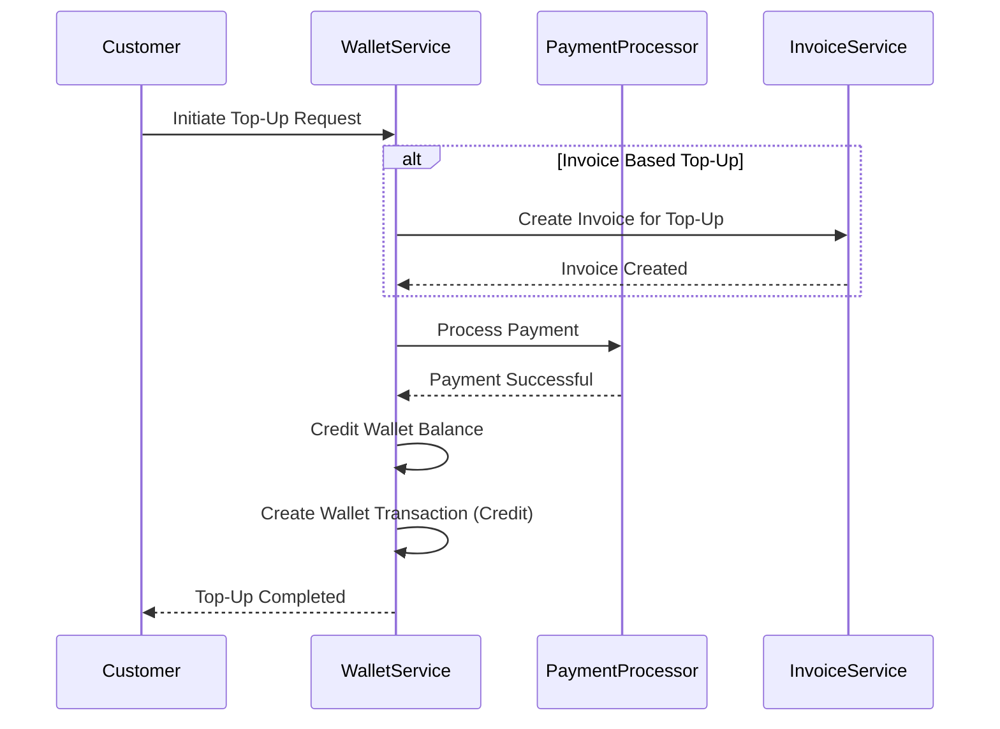
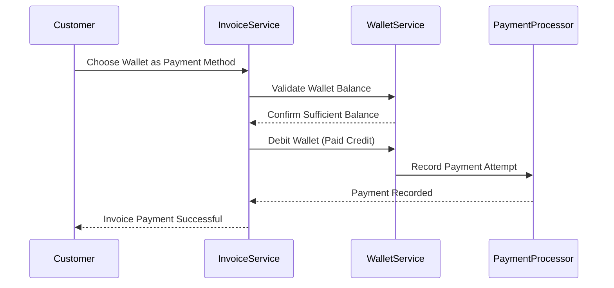

# Wallet Enrichment Design (Updated)

## Overview
This document outlines our plan to enrich the wallet functionality in our billing system. The enhancements will address a range of use cases, such as credit purchases, partial invoice payments, applying loyalty (free) credits for discounts, auto top-ups on low balances, and manual admin adjustments. The goal is to deliver a highly configurable and extendable solution that interconnects the three core entities: **Invoices**, **Payments**, and **Wallets**.

## Goals
- **Multi-Workflow Integration:** Seamlessly integrate wallet operations with invoice and payment workflows.
- **Flexible Credit Handling:** Support different wallet transaction types:
  - _Purchased Credits_ (from wallet top-ups)
  - _Paid Credits_ (when used to pay for an invoice)
  - _Free/Loyalty Credits_ (applied as discounts)
- **Auto Top-Up & Alerting:** Configure automatic wallet top-ups when balances drop below a configurable threshold.
- **Audit and Transparency:** Maintain detailed ledger transactions for every wallet change, linked to invoices and payment records.
- **Extensibility:** Design wallet components to support future enhancements like multi-currency support, enhanced loyalty programs, and even blockchain-based ledgers if needed.

## High-Level Architecture & Integration
The enriched wallet system connects directly to our existing:
- **Invoices Module:**  
  - Wallet top-ups may be invoiced.
  - Invoice payments can be fully or partially satisfied using wallet credits.
- **Payments Module:**  
  - Payment records (for both wallet top-ups and invoice payments) are linked back to wallet transactions.
  - Payment method validations are specific; for example, credits as a payment method must be validated and tracked.
- **Wallets Module (enhanced):**  
  - New configuration settings for auto top-up.
  - Extended ledger transactions with detailed reference fields (e.g., linking a wallet transaction to an invoice or external reference).

## Use Cases

### 1. Wallet Top-Up with Invoice Creation (Credit Purchase)
- **Scenario:**  
  A customer wishes to add funds to their wallet by purchasing credits using a payment method (e.g., card or ACH). An invoice is generated to record this transaction.
- **Flow:**
  1. Customer initiates a wallet top-up.
  2. The system creates an invoice for the top-up amount.
  3. Payment is processed and on success:
      - The wallet balance is credited.
      - A wallet transaction of type _Purchased Credit_ (or simply _Credit_) is created, referencing both the invoice and the payment.
- **Configuration Points:**
  - Enable/disable invoice generation for wallet top-ups per tenant.
  - Payment method validation rules.
  - Automatic invoice numbering for wallet top-ups.

### 2. Direct Wallet Top-Up (Without Invoice)
- **Scenario:**  
  In some cases, customers may wish to top-up their wallet directly without an associated invoice.
- **Flow:**
  1. Customer initiates a direct top-up.
  2. Payment is processed.
  3. On a successful payment, the wallet is credited, and a ledger transaction is recorded as a _Direct Top-Up_.
- **Configuration Points:**
  - Option flags to allow bypassing invoice generation.
  - Custom metadata to track the top-up type.

### 3. Invoice Payment Using Wallet Credits (Partial or Full)
- **Scenario:**  
  A customer pays an invoice by using wallet credits.
- **Flow:**
  1. During checkout, the customer selects their wallet (or credits within it) as the payment method.
  2. The system verifies the wallet has sufficient funds.
  3. The wallet is debited, generating a wallet transaction of type _Paid Credit_.
  4. The invoice is updated to reflect the payment, and the payment record is linked to this wallet deduction.
- **Configuration Points:**
  - Rules for partial invoice payments.
  - Ensuring currency compatibility.
  - Handling scenarios where the wallet does not have sufficient funds.

### 4. Applying Loyalty/Free Credits for Invoice Discounts
- **Scenario:**  
  Loyalty or free credits available in the wallet are used to reduce the payable invoice amount.
- **Flow:**
  1. As the invoice is generated, the system checks for available free credits.
  2. Free credits are applied automatically or manually (based on configuration) as a discount.
  3. A wallet transaction (of type _Free Credit_) is recorded to reflect the deduction.
  4. Invoice payment is recorded normally with the discounted amount.
- **Configuration Points:**
  - Maximum allowable discount percentage from free credits.
  - Priority rules when mixing free credits with other payment methods.

### 5. Manual Admin-Driven Wallet Adjustments
- **Scenario:**  
  Admins may need to adjust wallet balances manually for scenarios such as:
  - Payment of a specific invoice's line item.
  - Or ad hoc top-ups or corrections.
- **Flow:**
  1. Admin accesses the wallet through the dashboard.
  2. An adjustment (credit or debit) is applied manually.
  3. A wallet transaction is recorded, ensuring an audit trail.
- **Configuration Points:**
  - Admin permissions and override logs.
  - Mandatory audit fields (reason, reference, etc.).

### 6. Auto Top-Up and Low-Balance Alerts
- **Scenario:**  
  To prevent service interruption, the system will automatically top-up a wallet when its balance falls below a configured minimum.
- **Flow:**
  1. The wallet's balance is continuously monitored.
  2. Once the balance drops below the `AutoTopupMinBalance` threshold, an auto top-up is triggered.
  3. The auto top-up either generates an invoice (if required) or directly credits the wallet.
  4. Notifications are sent out to the customer and/or admin.
- **Configuration Points:**
  - Minimum balance thresholds (`AutoTopupMinBalance`).
  - Auto top-up amount (`AutoTopupAmount`).
  - Optional invoicing for auto top-ups.
  - Retry or failure handling strategies.

## Data Model Enhancements

### Wallet Model
We will extend the existing wallet model to include additional configuration fields:
- **AutoTopupTrigger:**  
  Defines whether auto top-up is enabled.
- **AutoTopupMinBalance:**  
  The balance level below which an auto top-up should be triggered.
- **AutoTopupAmount:**  
  The amount to add during an auto top-up.
  
The flexible `Metadata` field remains available to store any additional tenant-specific configuration.

### Wallet Transactions
Enhance the ledger entry design with clear transaction types and references:
- **Transaction Types:**  
  - `CREDIT` for wallet top-ups (both direct and invoice-based).
  - `DEBIT` for wallet usage when paying invoices.
  - `FREE_CREDIT` for loyalty discounts.
  - `PAID_CREDIT` when credits are used as a payment method.
- **Reference Fields:**  
  - Link each transaction with Invoice IDs, Payment IDs, or other external references as needed.

## API Endpoints Proposal
To support these enhancements, the following endpoints are proposed:

- **POST /v1/wallets**  
  Create a new wallet for a customer.

- **GET /v1/wallets/{id}**  
  Retrieve wallet details along with current balance and configuration.

- **POST /v1/wallets/{id}/credit**  
  Credit a wallet. This endpoint should provide options to:
  - Trigger invoice-generation if needed.
  - Record direct top-ups with proper metadata.

- **POST /v1/wallets/{id}/debit**  
  Debit a wallet (used for paying invoices or for manual adjustments).

- **GET /v1/wallets/{id}/transactions**  
  Retrieve a list of wallet transactions (ledger entries).

- **POST /v1/wallets/{id}/auto-topup-config**  
  Configure auto top-up parameters like `AutoTopupMinBalance` and `AutoTopupAmount`.

## Business Workflow Diagrams

### Wallet Top-Up Flow Diagram

### Invoice Payment Using Wallet Credits Flow Diagram

## Extensibility and Future Enhancements
- **Metadata-Driven Configuration:**  
  Further customization for each tenant can be achieved through dynamic metadata updates.
- **Event Hooks and Notifications:**  
  Integrate webhooks or event streams to trigger notifications for balance changes or auto top-ups.
- **Advanced Features:**  
  - Multi-currency support with conversion logic.
  - Loyalty program expansion.
  - Consideration for immutable ledger systems for high-value transactions.

## Open Questions
- What specific rules govern applying free credits versus paid credits? Should there be a blending or priority mechanism?
- How will auto top-up failures be managed? (e.g., immediate retry, alerting, or manual intervention)
- What are the compliance requirements for maintaining and auditing wallet transactions?

## Wallet Object Enhancements

### New Fields:
1. **Wallet Type:**  
   Represents the usage type of the wallet. Allowed values:
   - **PROMOTIONAL:** Can contain free or loyalty credits that might be subject to specific usage rules.
   - **PRE_PAID:** Typically used for purchased credits that are debited directly against the wallet during invoice payments.

2. **Configuration / Constraints:**  
   A field (or set of fields) to impose rules on how the wallet can be used. For example:
   - **allowed_price_types:** A list of price type identifiers for which the wallet can be applied.
   - **not_allowed_price_types:** A list of price types that cannot be paid using these wallet credits.
   This configuration is designed to be extensible for future constraints.

3. **Conversion Rate:**  
   A conversion factor mapping wallet credits to fiat currency. For instance, a conversion rate of:
   - 1 implies 1 credit = 1 USD
   - 2 implies 1 credit = 2 USD
   - 3 implies 1 credit = 3 USD
   This factor is critical when applying wallet credits during invoice payments or top-up operations.

## Wallet Transaction Enhancements

### New Fields:
1. **Expiry Date:**  
   A date indicating when the credits in a transaction expire. A null value means no expiry. When set (in MMDDYYYY format), it is used to determine which credits are valid for payments.

2. **Amount Used:**  
   Tracks how much of the credited amount has been used. Defaults to 0 and is incremented each time the wallet is debited.

3. **Transaction Reason:**  
   An enumerated field indicating the purpose of the transaction. Possible values include:
   - Invoice Payment
   - Free Credit Grant
   - Subscription Credit Grant
   - Purchased Credit (invoiced)
   - Purchased Credit (non-invoiced)
   - Invoice Refund
   - Credit Expired
   This field assists with reporting, auditing, and business analytics.

## Detailed Implementation Plan

Following the guidelines from the Entity Development Guide, the wallet enrichment will be implemented with the following steps:

1. **Schema Definition:**
   - Update or create the schema file (e.g., `ent/schema/wallet.go`) to include the new wallet fields:
     - Wallet Type (enum or string with validations)
     - Configuration/Constraints (JSON or structured fields)
     - Conversion Rate (numeric field)
   - Update the wallet transaction schema (e.g., `ent/schema/wallet_transaction.go`) to add:
     - Expiry Date (nullable date field)
     - Amount Used (numeric field, default 0)
     - Transaction Reason (enum)

2. **Ent Code Generation:**
   - Run:
     `go run -mod=mod entgo.io/ent/cmd/ent generate --feature sql/execquery ./ent/schema`
   to generate the updated models based on the new schema definitions.

3. **Domain Layer Implementation:**
   - Modify `internal/domain/wallet/model.go` to include the new fields in the Wallet struct. Update conversion functions (e.g., `FromEnt`) to map the new schema fields to the domain model.
   - Update any domain-level validations or conversion logic related to wallet credits and conversion rates.

4. **Repository Interface and Implementation:**
   - Update `internal/domain/wallet/repository.go` to manage CRUD operations for the new fields.
   - Enhance repository implementations to correctly persist and retrieve the extended wallet objects and transactions.
   - Ensure in-memory store implementations for testing (e.g., in `internal/testutil/inmemory_wallet_store.go`) are updated accordingly.

5. **Service Layer Updates:**
   - Extend the wallet service to include business logic handling for:
     - Applying conversion rates when debiting or crediting the wallet.
     - Enforcing configuration constraints during wallet usage.
     - Updating the Amount Used field during debit operations.
   - Add new service methods if needed for configuration updates or constraints enforcement.

6. **API Enhancements:**
   - Update endpoints under `/v1/wallets` to support:
     - Creation and updating of wallets with the new configuration fields.
     - Operations that account for conversion rates during top-up or invoice payment applications.
     - Query endpoints to filter wallet transactions based on expiry date and transaction reason.
   - Update DTOs in `internal/api/dto/wallet.go` with the new fields and validations.

7. **Factory and Dependency Injection:**
   - Integrate the updated wallet repository and service in the repository factory (e.g., in `internal/repository/factory.go`).
   - Ensure that all layers are adequately wired together for the new functionality.

8. **Documentation and Testing:**
   - Update API documentation and internal design documents to reflect the changes.
   - Develop comprehensive unit and integration tests covering the new fields and business logic.

## Expiry Mechanism for Wallet Credits

To scale the expiry process without resorting to heavy locking, consider the following approach:

- **Background Worker / Scheduled Job:**
   - Implement a separate worker (using a scheduled cron job or an event-driven mechanism) that periodically scans wallet transactions for entries with non-null expiry dates.
   - The worker determines which credits have expired based on the current date and updates their status accordingly.

- **Optimistic Concurrency Control:**
   - Use versioning or timestamp checks to ensure that expiry updates do not conflict with concurrent wallet operations.

- **Event-Driven Architecture:**
   - Leverage message queues to asynchronously handle expiry events, decoupling the expiry process from critical real-time payment processing. This minimizes performance overhead and reduces the need for database locks.

This blend of scheduled processing and optimistic control helps ensure that the expiry mechanism scales effectively and remains robust under high load.

## Conclusion
This updated design document provides a comprehensive and actionable plan for enriching the wallet functionality. By integrating the new fields and following a structured implementation plan inspired by our entity development guidelines, we ensure that:

- All business cases for wallet usage in invoices and payments are thoroughly addressed.
- The system remains scalable, robust, and maintainable.
- Future enhancements can be integrated seamlessly, with clear pathways for additional configurations and improvement in process efficiency.