# 🚀 Temporal System - Complete Implementation Guide

## 📋 Table of Contents

1. [System Architecture Analysis](#system-architecture-analysis)
2. [Current Implementation Patterns](#current-implementation-patterns)
3. [Complete Implementation Example](#complete-implementation-example)
4. [Detailed Decision Explanations](#detailed-decision-explanations)
5. [Testing Strategy](#testing-strategy)
6. [Troubleshooting Guide](#troubleshooting-guide)

---

## 🏗️ System Architecture Analysis

### **Current Temporal System Structure**

Based on my analysis of the codebase, here's how the Temporal system actually works:

```
internal/temporal/
├── client/                    # Core temporal client functionality
│   ├── client.go             # Basic client operations (ExecuteWorkflow)
│   ├── interface.go          # Interface definitions (TemporalClientInterface)
│   ├── options.go            # Default options and factories
│   ├── service.go            # Main temporal service (TemporalService)
│   ├── validation.go         # Validation helpers (validateService)
│   └── worker.go             # Worker management (TemporalWorkerManager)
├── workflows/                # Workflow implementations
│   ├── task_workflow.go      # TaskProcessingWorkflow
│   └── price_sync_workflow.go # PriceSyncWorkflow
├── activities/               # Activity implementations
│   ├── task_activities.go    # TaskActivities.ProcessTask
│   └── plan_activities.go    # PlanActivities.SyncPlanPrices
├── models/                   # Shared data models
│   ├── task_models.go        # Task workflow models
│   └── types.go              # Common types
├── registration.go           # Centralized registration
└── README.md                # Documentation
```

### **Key Components Analysis**

#### 1. **TemporalService** (`internal/temporal/client/service.go`)
- **Purpose**: Centralized interface for all Temporal operations
- **Singleton Pattern**: Uses `globalService` with `sync.Once` for thread-safe initialization
- **Key Methods**:
  - `ExecuteWorkflow()` - Executes workflows with proper context handling
  - `GetWorkflowResult()` - Retrieves workflow results
  - `RegisterWorkflow()` / `RegisterActivity()` - Registers with workers
  - `StartWorker()` / `StopWorker()` - Manages worker lifecycle

#### 2. **TemporalWorkerManager** (`internal/temporal/client/worker.go`)
- **Purpose**: Manages workers for different task queues
- **Key Features**:
  - Maps task queues to workers
  - Thread-safe worker creation and management
  - Worker status tracking

#### 3. **Registration System** (`internal/temporal/registration.go`)
- **Purpose**: Centralized workflow and activity registration
- **Pattern**: Uses `WorkerConfig` struct to define task queue configurations
- **Key Features**:
  - Type-safe interface with proper error handling
  - Task queue-specific worker configuration
  - Easy to extend with new workflows

---

## 🔍 Current Implementation Patterns

### **Pattern 1: API Handler → Temporal Service → Workflow → Activity → Business Service**

```mermaid
sequenceDiagram
    participant API as 🎯 API Handler
    participant TS as ⚙️ TemporalService
    participant WF as 🏗️ Workflow
    participant AC as 📋 Activity
    participant BS as 💼 Business Service

    API->>TS: ExecuteWorkflow(workflowType, input)
    TS->>TS: Validate service & input
    TS->>TS: Process workflow input (add context)
    TS->>WF: Start workflow execution
    WF->>AC: ExecuteActivity(activityName, input)
    AC->>BS: Call business service method
    BS-->>AC: Return business result
    AC-->>WF: Activity result
    WF-->>TS: Workflow result
    TS-->>API: Workflow started
```



### **Pattern 2: Context Propagation**

The system uses context to propagate tenant and environment information:

```go
// In activities
ctx = context.WithValue(ctx, types.CtxTenantID, input.TenantID)
ctx = context.WithValue(ctx, types.CtxEnvironmentID, input.EnvironmentID)

// In service layer
tenantID := types.GetTenantID(ctx)
environmentID := types.GetEnvironmentID(ctx)
```

### **Pattern 3: Error Handling**

Consistent error handling using the `ierr` package:

```go
// Validation errors
return nil, ierr.NewError("plan ID is required").
    WithHint("Plan ID is required").
    Mark(ierr.ErrValidation)

// Business logic errors
return nil, ierr.WithError(err).
    WithHint("Failed to process task").
    Mark(ierr.ErrValidation)
```

---

## 🛠️ Complete Implementation Example

Let's implement a **User Data Export** workflow following the exact patterns used in the codebase.

### **Step 1: Define Business Logic in Service Layer**

#### File: `internal/service/user_service.go`

```go
package service

import (
    "context"
    "encoding/csv"
    "fmt"
    "os"
    "path/filepath"
    "time"

    "github.com/flexprice/flexprice/internal/api/dto"
    "github.com/flexprice/flexprice/internal/logger"
    "github.com/flexprice/flexprice/internal/s3"
    ierr "github.com/flexprice/flexprice/internal/errors"
)

// UserService interface - following the pattern from plan.go
type UserService interface {
    ExportUserData(ctx context.Context, userID string) (*dto.UserExportResult, error)
}

type userService struct {
    ServiceParams // Embedded ServiceParams like other services
}

// NewUserService creates a new user service - following the pattern from plan.go
func NewUserService(params ServiceParams) UserService {
    return &userService{
        ServiceParams: params,
    }
}

// ExportUserData exports user data to CSV and uploads to S3
// This follows the exact pattern from plan.go SyncPlanPrices method
func (s *userService) ExportUserData(ctx context.Context, userID string) (*dto.UserExportResult, error) {
    // Input validation - following the pattern from plan.go
    if userID == "" {
        return nil, ierr.NewError("user ID is required").
            WithHint("User ID is required").
            Mark(ierr.ErrValidation)
    }

    s.Logger.Info("Starting user data export", "user_id", userID)

    // Get tenant and environment from context - following the pattern
    tenantID := types.GetTenantID(ctx)
    environmentID := types.GetEnvironmentID(ctx)

    // 1. Fetch user data from database
    user, err := s.UserRepo.GetByID(ctx, userID)
    if err != nil {
        return nil, ierr.WithError(err).
            WithHint("Failed to fetch user data").
            Mark(ierr.ErrValidation)
    }

    // 2. Generate CSV file
    csvPath, err := s.generateCSV(ctx, user)
    if err != nil {
        return nil, ierr.WithError(err).
            WithHint("Failed to generate CSV file").
            Mark(ierr.ErrValidation)
    }
    defer os.Remove(csvPath) // Clean up temp file

    // 3. Upload to S3
    s3Key := fmt.Sprintf("exports/users/%s/user-data-%d.csv", userID, time.Now().Unix())
    s3URL, err := s.S3Service.UploadFile(ctx, csvPath, s3Key)
    if err != nil {
        return nil, ierr.WithError(err).
            WithHint("Failed to upload file to S3").
            Mark(ierr.ErrValidation)
    }

    s.Logger.Info("User data export completed", "user_id", userID, "s3_url", s3URL)

    // Return result following the pattern from plan.go
    return &dto.UserExportResult{
        UserID:     userID,
        ExportURL:  s3URL,
        Status:     "completed",
        ExportedAt: time.Now(),
    }, nil
}

func (s *userService) generateCSV(ctx context.Context, user *User) (string, error) {
    // Create temp file
    tempFile, err := os.CreateTemp("", "user-export-*.csv")
    if err != nil {
        return "", err
    }
    defer tempFile.Close()

    // Write CSV data
    writer := csv.NewWriter(tempFile)
    defer writer.Flush()

    // Write headers
    if err := writer.Write([]string{"UserID", "Email", "Name", "CreatedAt", "LastLogin"}); err != nil {
        return "", err
    }

    // Write user data
    if err := writer.Write([]string{
        user.ID,
        user.Email,
        user.Name,
        user.CreatedAt.Format(time.RFC3339),
        user.LastLogin.Format(time.RFC3339),
    }); err != nil {
        return "", err
    }

    return tempFile.Name(), nil
}
```

#### File: `internal/api/dto/user_export.go`

```go
package dto

import "time"

// UserExportResult represents the result of a user data export
// Following the pattern from plan.go SyncPlanPricesResponse
type UserExportResult struct {
    UserID     string    `json:"user_id"`
    ExportURL  string    `json:"export_url"`
    Status     string    `json:"status"`
    ExportedAt time.Time `json:"exported_at"`
}

// UserExportRequest represents a request to export user data
type UserExportRequest struct {
    UserID string `json:"user_id" validate:"required"`
}
```

### **Step 2: Create Workflow Models**

#### File: `internal/temporal/models/user_export_models.go`

```go
package models

import (
    "time"
    ierr "github.com/flexprice/flexprice/internal/errors"
)

// UserExportWorkflowInput represents the input for user export workflow
// Following the pattern from task_models.go TaskProcessingWorkflowInput
type UserExportWorkflowInput struct {
    UserID        string `json:"user_id"`
    TenantID      string `json:"tenant_id"`
    EnvironmentID string `json:"environment_id"`
}

// Validate validates the user export workflow input
// Following the exact pattern from task_models.go
func (i *UserExportWorkflowInput) Validate() error {
    if i.UserID == "" {
        return ierr.NewError("user_id is required").
            WithHint("User ID is required").
            Mark(ierr.ErrValidation)
    }
    if i.TenantID == "" {
        return ierr.NewError("tenant_id is required").
            WithHint("Tenant ID is required").
            Mark(ierr.ErrValidation)
    }
    if i.EnvironmentID == "" {
        return ierr.NewError("environment_id is required").
            WithHint("Environment ID is required").
            Mark(ierr.ErrValidation)
    }
    return nil
}

// UserExportWorkflowResult represents the result of user export workflow
// Following the pattern from task_models.go TaskProcessingWorkflowResult
type UserExportWorkflowResult struct {
    UserID     string    `json:"user_id"`
    ExportURL  string    `json:"export_url"`
    Status     string    `json:"status"`
    ExportedAt time.Time `json:"exported_at"`
}

// ExportUserDataActivityInput represents the input for export user data activity
// Following the pattern from task_models.go ProcessTaskActivityInput
type ExportUserDataActivityInput struct {
    UserID        string `json:"user_id"`
    TenantID      string `json:"tenant_id"`
    EnvironmentID string `json:"environment_id"`
}

// Validate validates the export user data activity input
func (i *ExportUserDataActivityInput) Validate() error {
    if i.UserID == "" {
        return ierr.NewError("user_id is required").
            WithHint("User ID is required").
            Mark(ierr.ErrValidation)
    }
    if i.TenantID == "" {
        return ierr.NewError("tenant_id is required").
            WithHint("Tenant ID is required").
            Mark(ierr.ErrValidation)
    }
    if i.EnvironmentID == "" {
        return ierr.NewError("environment_id is required").
            WithHint("Environment ID is required").
            Mark(ierr.ErrValidation)
    }
    return nil
}

// ExportUserDataActivityResult represents the result of export user data activity
// Following the pattern from task_models.go ProcessTaskActivityResult
type ExportUserDataActivityResult struct {
    UserID     string    `json:"user_id"`
    ExportURL  string    `json:"export_url"`
    Status     string    `json:"status"`
    ExportedAt time.Time `json:"exported_at"`
}
```

### **Step 3: Create Workflow Function**

#### File: `internal/temporal/workflows/user_export_workflow.go`

```go
package workflows

import (
    "time"

    "github.com/flexprice/flexprice/internal/temporal/models"
    "go.temporal.io/sdk/temporal"
    "go.temporal.io/sdk/workflow"
)

const (
    // Workflow name - must match the function name
    // Following the pattern from task_workflow.go
    WorkflowUserExport = "UserExportWorkflow"
    // Activity name - must match the registered method names
    // Following the pattern from task_workflow.go
    ActivityExportUserData = "ExportUserData"
)

// UserExportWorkflow processes user data export asynchronously
// Following the exact pattern from task_workflow.go TaskProcessingWorkflow
func UserExportWorkflow(ctx workflow.Context, input models.UserExportWorkflowInput) (*models.UserExportWorkflowResult, error) {
    // Validate input - following the pattern from task_workflow.go
    if err := input.Validate(); err != nil {
        return nil, err
    }

    logger := workflow.GetLogger(ctx)
    logger.Info("Starting user export workflow", "user_id", input.UserID)

    // Define activity options - following the pattern from task_workflow.go
    ao := workflow.ActivityOptions{
        StartToCloseTimeout: time.Hour * 1, // 1 hour timeout
        RetryPolicy: &temporal.RetryPolicy{
            InitialInterval:    time.Second * 5,
            BackoffCoefficient: 2.0,
            MaximumInterval:    time.Minute * 2,
            MaximumAttempts:    3,
        },
    }
    ctx = workflow.WithActivityOptions(ctx, ao)

    // Execute the export activity - following the pattern from task_workflow.go
    var result models.ExportUserDataActivityResult
    err := workflow.ExecuteActivity(ctx, ActivityExportUserData, models.ExportUserDataActivityInput{
        UserID:        input.UserID,
        TenantID:      input.TenantID,
        EnvironmentID: input.EnvironmentID,
    }).Get(ctx, &result)

    if err != nil {
        logger.Error("User export failed", "user_id", input.UserID, "error", err)
        errorMsg := err.Error()
        return &models.UserExportWorkflowResult{
            UserID:     input.UserID,
            Status:     "failed",
            CompletedAt: workflow.Now(ctx),
            ErrorSummary: &errorMsg,
        }, nil
    }

    logger.Info("User export completed successfully",
        "user_id", input.UserID,
        "export_url", result.ExportURL,
        "status", result.Status)

    return &models.UserExportWorkflowResult{
        UserID:     result.UserID,
        ExportURL:  result.ExportURL,
        Status:     result.Status,
        ExportedAt: result.ExportedAt,
    }, nil
}
```

### **Step 4: Create Activity Functions**

#### File: `internal/temporal/activities/user_export_activities.go`

```go
package activities

import (
    "context"

    "github.com/flexprice/flexprice/internal/api/dto"
    "github.com/flexprice/flexprice/internal/service"
    "github.com/flexprice/flexprice/internal/temporal/models"
    "github.com/flexprice/flexprice/internal/types"
    ierr "github.com/flexprice/flexprice/internal/errors"
)

const UserExportActivityPrefix = "UserExportActivities"

// UserExportActivities contains all user export-related activities
// Following the pattern from task_activities.go TaskActivities
type UserExportActivities struct {
    userService service.UserService
}

// NewUserExportActivities creates a new UserExportActivities instance
// Following the pattern from task_activities.go NewTaskActivities
func NewUserExportActivities(userService service.UserService) *UserExportActivities {
    return &UserExportActivities{
        userService: userService,
    }
}

// ExportUserData exports user data to CSV and uploads to S3
// Following the exact pattern from task_activities.go ProcessTask
func (a *UserExportActivities) ExportUserData(ctx context.Context, input models.ExportUserDataActivityInput) (*models.ExportUserDataActivityResult, error) {
    // Validate input - following the pattern from task_activities.go
    if err := input.Validate(); err != nil {
        return nil, err
    }

    // Set context values - following the pattern from task_activities.go
    ctx = context.WithValue(ctx, types.CtxTenantID, input.TenantID)
    ctx = context.WithValue(ctx, types.CtxEnvironmentID, input.EnvironmentID)

    // Call the service method to export user data
    // This contains all the business logic - following the pattern from task_activities.go
    result, err := a.userService.ExportUserData(ctx, input.UserID)
    if err != nil {
        return nil, ierr.WithError(err).
            WithHint("Failed to export user data").
            Mark(ierr.ErrValidation)
    }

    return &models.ExportUserDataActivityResult{
        UserID:     result.UserID,
        ExportURL:  result.ExportURL,
        Status:     result.Status,
        ExportedAt: result.ExportedAt,
    }, nil
}
```

### **Step 5: Add Workflow Type**

#### File: `internal/types/temporal.go` (add to existing constants)

```go
const (
    // ... existing workflow types
    TemporalUserExportWorkflow TemporalWorkflowType = "UserExportWorkflow"
)

// Add to allowedWorkflows slice in Validate method
allowedWorkflows := []TemporalWorkflowType{
    // ... existing workflows
    TemporalUserExportWorkflow, // "UserExportWorkflow"
}
```

### **Step 6: Update Registration**

#### File: `internal/temporal/registration.go` (add to workerConfigs)

```go
// Add this to the workerConfigs slice in RegisterWorkflowsAndActivities function:

// Create user export activities
userService := service.NewUserService(params)
userExportActivities := activities.NewUserExportActivities(userService)

// Add to workerConfigs slice:
{
    TaskQueue: types.TemporalUserExportWorkflow.TaskQueueName(),
    Workflows: []interface{}{
        workflows.UserExportWorkflow,
    },
    Activities: []interface{}{
        userExportActivities.ExportUserData,
    },
},
```

### **Step 7: Create API Handler**

#### File: `internal/api/v1/user.go`

```go
package v1

import (
    "net/http"

    "github.com/flexprice/flexprice/internal/api/dto"
    "github.com/flexprice/flexprice/internal/logger"
    "github.com/flexprice/flexprice/internal/service"
    temporalclient "github.com/flexprice/flexprice/internal/temporal/client"
    "github.com/flexprice/flexprice/internal/types"
    ierr "github.com/flexprice/flexprice/internal/errors"
    "github.com/gin-gonic/gin"
)

type UserHandler struct {
    userService     service.UserService
    temporalService *temporalclient.TemporalService
    log            *logger.Logger
}

func NewUserHandler(
    userService service.UserService,
    temporalService *temporalclient.TemporalService,
    log *logger.Logger,
) *UserHandler {
    return &UserHandler{
        userService:     userService,
        temporalService: temporalService,
        log:            log,
    }
}

// @Summary Export user data
// @Description Export user data to CSV and upload to S3
// @Tags Users
// @Accept json
// @Produce json
// @Security ApiKeyAuth
// @Param id path string true "User ID"
// @Success 202 {object} dto.UserExportResponse
// @Failure 400 {object} ierr.ErrorResponse
// @Failure 500 {object} ierr.ErrorResponse
// @Router /users/{id}/export [post]
func (h *UserHandler) ExportUserData(c *gin.Context) {
    // Extract user ID from path - following the pattern from plan.go
    id := c.Param("id")
    if id == "" {
        c.Error(ierr.NewError("user ID is required").
            WithHint("User ID is required").
            Mark(ierr.ErrValidation))
        return
    }

    // Execute the workflow - following the exact pattern from plan.go
    _, err := h.temporalService.ExecuteWorkflow(c.Request.Context(), types.TemporalUserExportWorkflow, id)
    if err != nil {
        c.Error(err)
        return
    }

    // Return response - following the pattern from plan.go
    c.JSON(http.StatusOK, gin.H{"message": "user export workflow started successfully"})
}

// @Summary Get user export status
// @Description Get the status and result of a user export workflow
// @Tags Users
// @Accept json
// @Produce json
// @Security ApiKeyAuth
// @Param workflow_id path string true "Workflow ID"
// @Success 200 {object} dto.UserExportResult
// @Failure 400 {object} ierr.ErrorResponse
// @Failure 500 {object} ierr.ErrorResponse
// @Router /users/export/{workflow_id}/status [get]
func (h *UserHandler) GetExportStatus(c *gin.Context) {
    // Following the pattern from task.go GetTaskStatus
    workflowID := c.Param("workflow_id")
    if workflowID == "" {
        c.Error(ierr.NewError("workflow ID is required").
            WithHint("Workflow ID is required").
            Mark(ierr.ErrValidation))
        return
    }

    var result dto.UserExportResult
    err := h.temporalService.GetWorkflowResult(c.Request.Context(), workflowID, &result)
    if err != nil {
        c.Error(err)
        return
    }

    c.JSON(http.StatusOK, result)
}
```

### **Step 8: Update Main.go**

#### File: `cmd/server/main.go` (add to workflowTypes slice)

```go
// Add to the workflowTypes slice in startTemporalWorker function:

workflowTypes := []types.TemporalWorkflowType{
    types.TemporalTaskProcessingWorkflow,
    types.TemporalPriceSyncWorkflow,
    types.TemporalBillingWorkflow,
    types.TemporalUserExportWorkflow, // NEW
}
```

---

## 🔍 Detailed Decision Explanations

### **Why This Architecture?**

#### 1. **Singleton Pattern for TemporalService**
```go
var (
    globalService     *TemporalService
    globalServiceOnce sync.Once
    globalServiceMux  sync.RWMutex
)
```
**Decision**: Use singleton pattern for TemporalService
**Why**: 
- Ensures only one instance of the temporal service across the application
- Thread-safe initialization with `sync.Once`
- Prevents resource conflicts and ensures consistent state
- Follows the pattern used throughout the codebase

#### 2. **Context Propagation Pattern**
```go
ctx = context.WithValue(ctx, types.CtxTenantID, input.TenantID)
ctx = context.WithValue(ctx, types.CtxEnvironmentID, input.EnvironmentID)
```
**Decision**: Use context to propagate tenant and environment information
**Why**:
- Ensures multi-tenancy is maintained throughout the workflow execution
- Follows the existing pattern in the codebase
- Allows business services to access tenant context without parameter passing
- Maintains consistency with the existing service layer

#### 3. **Error Handling with ierr Package**
```go
return nil, ierr.NewError("user ID is required").
    WithHint("User ID is required").
    Mark(ierr.ErrValidation)
```
**Decision**: Use the `ierr` package for all error handling
**Why**:
- Provides structured error information with hints
- Enables proper error categorization (validation, internal, etc.)
- Maintains consistency with the existing codebase
- Provides better debugging information

#### 4. **Workflow-Activity Separation**
```go
// Workflow: Orchestrates the process
func UserExportWorkflow(ctx workflow.Context, input models.UserExportWorkflowInput) (*models.UserExportWorkflowResult, error) {
    // Orchestration logic
    var result models.ExportUserDataActivityResult
    err := workflow.ExecuteActivity(ctx, ActivityExportUserData, activityInput).Get(ctx, &result)
    // Handle result
}

// Activity: Contains business logic
func (a *UserExportActivities) ExportUserData(ctx context.Context, input models.ExportUserDataActivityInput) (*models.ExportUserDataActivityResult, error) {
    // Business logic
    result, err := a.userService.ExportUserData(ctx, input.UserID)
    // Return result
}
```
**Decision**: Separate workflows and activities
**Why**:
- Workflows handle orchestration and retry logic
- Activities contain the actual business logic
- Follows Temporal best practices
- Maintains consistency with existing patterns

#### 5. **Registration System Design**
```go
type WorkerConfig struct {
    TaskQueue  string
    Workflows  []interface{}
    Activities []interface{}
}
```
**Decision**: Use `WorkerConfig` struct for registration
**Why**:
- Provides type-safe configuration
- Easy to extend with new workflows
- Centralized registration logic
- Follows the existing pattern in the codebase

### **Why These Specific Patterns?**

#### 1. **API Handler Pattern**
```go
func (h *UserHandler) ExportUserData(c *gin.Context) {
    id := c.Param("id")
    if id == "" {
        c.Error(ierr.NewError("user ID is required").
            WithHint("User ID is required").
            Mark(ierr.ErrValidation))
        return
    }
    _, err := h.temporalService.ExecuteWorkflow(c.Request.Context(), types.TemporalUserExportWorkflow, id)
    if err != nil {
        c.Error(err)
        return
    }
    c.JSON(http.StatusOK, gin.H{"message": "user export workflow started successfully"})
}
```
**Why**: 
- Follows the exact pattern from `plan.go` and `task.go`
- Consistent error handling and response format
- Simple and clean API interface
- Maintains consistency with existing handlers

#### 2. **Service Layer Pattern**
```go
func (s *userService) ExportUserData(ctx context.Context, userID string) (*dto.UserExportResult, error) {
    if userID == "" {
        return nil, ierr.NewError("user ID is required").
            WithHint("User ID is required").
            Mark(ierr.ErrValidation)
    }
    // Business logic
    return &dto.UserExportResult{...}, nil
}
```
**Why**:
- Follows the exact pattern from `plan.go` SyncPlanPrices method
- Consistent validation and error handling
- Clean separation of concerns
- Maintains consistency with existing services

#### 3. **Model Validation Pattern**
```go
func (i *UserExportWorkflowInput) Validate() error {
    if i.UserID == "" {
        return ierr.NewError("user_id is required").
            WithHint("User ID is required").
            Mark(ierr.ErrValidation)
    }
    // More validations
    return nil
}
```
**Why**:
- Follows the exact pattern from `task_models.go`
- Consistent validation across all models
- Provides clear error messages with hints
- Maintains consistency with existing models

---

## 🧪 Testing Strategy

### **Unit Testing Pattern**

Following the existing test patterns in the codebase:

```go
func (s *UserServiceSuite) TestExportUserData_Comprehensive() {
    s.Run("TC-EXPORT-001_Missing_User_ID", func() {
        result, err := s.service.ExportUserData(s.GetContext(), "")
        s.Error(err)
        s.Nil(result)
        
        // Check for the hint in the error
        hints := errors.GetAllHints(err)
        s.Contains(hints, "User ID is required")
    })

    s.Run("TC-EXPORT-002_Valid_User_Export", func() {
        // Create test user
        testUser := &User{
            ID:        "user-123",
            Email:     "test@example.com",
            Name:      "Test User",
            CreatedAt: time.Now(),
            LastLogin: time.Now(),
        }
        
        // Mock repository
        s.UserRepo.On("GetByID", mock.Anything, "user-123").Return(testUser, nil)
        
        // Mock S3 service
        s.S3Service.On("UploadFile", mock.Anything, mock.Anything, mock.Anything).Return("s3://bucket/file.csv", nil)
        
        // Execute
        result, err := s.service.ExportUserData(s.GetContext(), "user-123")
        
        // Assertions
        s.NoError(err)
        s.NotNil(result)
        s.Equal("user-123", result.UserID)
        s.Equal("completed", result.Status)
        s.NotEmpty(result.ExportURL)
    })
}
```

---

## 🔧 Troubleshooting Guide

### **Common Issues and Solutions**

#### 1. **Workflow Not Starting**
**Symptoms**: API returns 200 but workflow doesn't execute
**Causes**:
- Workflow not registered in `registration.go`
- Task queue not started in `main.go`
- Temporal server not running

**Solutions**:
```bash
# Check if workflow is registered
grep -r "UserExportWorkflow" internal/temporal/registration.go

# Check if task queue is started
grep -r "TemporalUserExportWorkflow" cmd/server/main.go

# Check temporal server logs
docker logs temporal-server
```

#### 2. **Activity Failing**
**Symptoms**: Workflow starts but activity fails
**Causes**:
- Activity not registered
- Service dependency not injected
- Context not properly set

**Solutions**:
```go
// Check activity registration
func (a *UserExportActivities) ExportUserData(ctx context.Context, input models.ExportUserDataActivityInput) (*models.ExportUserDataActivityResult, error) {
    // Add logging
    a.logger.Info("Starting ExportUserData activity", "input", input)
    
    // Check context
    tenantID := types.GetTenantID(ctx)
    if tenantID == "" {
        return nil, fmt.Errorf("tenant ID not found in context")
    }
    
    // Rest of the logic
}
```

#### 3. **Type Errors**
**Symptoms**: Compilation errors or runtime type errors
**Causes**:
- Input/output types don't match between workflow and activity
- JSON serialization issues

**Solutions**:
```go
// Ensure types match exactly
type UserExportWorkflowInput struct {
    UserID        string `json:"user_id"`
    TenantID      string `json:"tenant_id"`
    EnvironmentID string `json:"environment_id"`
}

type ExportUserDataActivityInput struct {
    UserID        string `json:"user_id"`        // Must match
    TenantID      string `json:"tenant_id"`      // Must match
    EnvironmentID string `json:"environment_id"` // Must match
}
```

---

## 📊 Complete System Flow

```mermaid
sequenceDiagram
    participant Client as 🌐 Client
    participant API as 🎯 UserHandler
    participant TS as ⚙️ TemporalService
    participant WM as 🔄 WorkerManager
    participant WF as 🏗️ UserExportWorkflow
    participant AC as 📋 ExportUserData Activity
    participant US as 💼 UserService
    participant S3 as ☁️ S3

    Note over Client, S3: Complete User Export Flow

    Client->>API: POST /users/123/export
    API->>API: Extract user ID from path
    API->>API: Validate user ID
    API->>TS: ExecuteWorkflow(UserExportWorkflow, "123")
    TS->>TS: Validate service & input
    TS->>TS: Process workflow input (add context)
    TS->>WM: Find worker for task queue
    WM->>WF: Start workflow execution
    WF->>WF: Validate input
    WF->>AC: ExecuteActivity(ExportUserData, input)
    AC->>AC: Validate activity input
    AC->>AC: Set context values
    AC->>US: ExportUserData(ctx, "123")
    US->>US: Fetch user data
    US->>US: Generate CSV
    US->>S3: Upload file
    S3-->>US: Return S3 URL
    US-->>AC: Return result
    AC-->>WF: Activity result
    WF-->>TS: Workflow result
    TS-->>API: Workflow started
    API-->>Client: 200 OK + Success message

    Note over Client, S3: Later: Check Status
    Client->>API: GET /users/export/{workflow_id}/status
    API->>TS: GetWorkflowResult(workflow_id)
    TS-->>API: Workflow result
    API-->>Client: 200 OK + Export result
```



---

## ✅ Implementation Checklist

- [x] **Service Layer**: `UserService.ExportUserData()` with proper validation and error handling
- [x] **DTOs**: `UserExportResult`, `UserExportRequest` following existing patterns
- [x] **Models**: `UserExportWorkflowInput`, `ExportUserDataActivityInput` with validation
- [x] **Workflow**: `UserExportWorkflow()` following task_workflow.go pattern
- [x] **Activity**: `ExportUserData()` following task_activities.go pattern
- [x] **Types**: Added `TemporalUserExportWorkflow` to `types/temporal.go`
- [x] **Registration**: Added to `registration.go` workerConfigs
- [x] **API Handler**: `UserHandler.ExportUserData()` and `GetExportStatus()` following existing patterns
- [x] **Main.go**: Added to workflowTypes slice
- [x] **Error Handling**: Consistent use of `ierr` package throughout
- [x] **Context Propagation**: Proper tenant/environment context handling
- [x] **Testing**: Unit tests following existing test patterns

---

## 🎯 Key Takeaways

1. **Follow Existing Patterns**: Every decision is based on existing patterns in the codebase
2. **Consistent Error Handling**: Use `ierr` package for all error handling
3. **Context Propagation**: Always propagate tenant and environment context
4. **Validation**: Validate inputs at every layer
5. **Logging**: Add comprehensive logging throughout
6. **Testing**: Follow existing test patterns and conventions

This implementation follows the **exact patterns** used in the existing codebase and provides a **complete, working example** that developers can use as a reference for implementing new workflows! 🚀

