# 🚀 Temporal Developer Guide

A comprehensive guide for developers working with FlexPrice's Temporal setup in Go.

## 📋 Table of Contents

1. [High-Level Architecture](#high-level-architecture)
2. [How Temporal Works in FlexPrice](#how-temporal-works-in-flexprice)
3. [Local Development Setup](#local-development-setup)
4. [Implementation Guide](#implementation-guide)
5. [Best Practices & Gotchas](#best-practices--gotchas)
6. [Troubleshooting](#troubleshooting)

---

## 🏗️ High-Level Architecture

### System Overview

FlexPrice uses Temporal for reliable, long-running business processes. Our architecture follows a clean separation of concerns:

```
┌─────────────────┐    ┌─────────────────┐    ┌─────────────────┐
│   API Handler   │───▶│ Temporal Service│───▶│    Workflow     │
└─────────────────┘    └─────────────────┘    └─────────────────┘
                                                       │
                                                       ▼
┌─────────────────┐    ┌─────────────────┐    ┌─────────────────┐
│ Business Service│◀───│    Activity     │◀───│    Workflow     │
└─────────────────┘    └─────────────────┘    └─────────────────┘
```

### Directory Structure

```
internal/temporal/
├── client/                    # Core Temporal client functionality
│   ├── client.go             # Basic client operations
│   ├── interface.go          # Interface definitions
│   └── options.go            # Default options and factories
├── service/                   # Service layer (orchestration)
│   ├── service.go            # Main temporal service
│   └── interface.go          # Service interfaces
├── worker/                    # Worker management
│   ├── worker.go             # Worker implementation
│   └── manager.go            # Worker manager
├── workflows/                 # Workflow implementations
│   ├── task_workflow.go      # TaskProcessingWorkflow
│   └── price_sync_workflow.go # PriceSyncWorkflow
├── activities/                # Activity implementations
│   ├── task_activities.go    # TaskActivities
│   └── plan_activities.go    # PlanActivities
├── models/                    # Shared data models
│   ├── task_models.go        # Task workflow models
│   └── types.go              # Common types
└── registration.go           # Centralized registration
```

### Key Components

#### 1. **TemporalService** (`internal/temporal/service/service.go`)

- **Purpose**: Centralized interface for all Temporal operations
- **Key Methods**:
  - `StartWorkflow()` - Executes workflows with proper context handling
  - `RegisterWorkflow()` / `RegisterActivity()` - Registers with workers
  - `StartWorker()` / `StopWorker()` - Manages worker lifecycle

#### 2. **WorkerManager** (`internal/temporal/worker/manager.go`)

- **Purpose**: Manages workers for different task queues
- **Key Features**:
  - Maps task queues to workers
  - Thread-safe worker creation and management
  - Worker status tracking

#### 3. **Registration System** (`internal/temporal/registration.go`)

- **Purpose**: Centralized workflow and activity registration
- **Pattern**: Uses `WorkerConfig` struct to define task queue configurations

---

## 🔄 How Temporal Works in FlexPrice

### Execution Flow

1. **API Handler** receives a request
2. **Temporal Service** validates context and starts workflow
3. **Workflow** orchestrates business logic by calling activities
4. **Activities** execute business service methods
5. **Business Service** performs the actual work
6. **Results** flow back through the chain

### Example: Task Processing

```mermaid
sequenceDiagram
    participant API as 🎯 API Handler
    participant TS as ⚙️ TemporalService
    participant WF as 🏗️ TaskProcessingWorkflow
    participant AC as 📋 ProcessTask Activity
    participant BS as 💼 TaskService

    API->>TS: ExecuteWorkflow(TaskProcessingWorkflow, input)
    TS->>TS: Validate tenant context
    TS->>WF: Start workflow execution
    WF->>AC: ExecuteActivity(ProcessTask, input)
    AC->>BS: Call taskService.ProcessTask()
    BS-->>AC: Return task results
    AC-->>WF: Activity result
    WF-->>TS: Workflow result
    TS-->>API: Workflow started
```



### Task Queues

We use logical task queues to organize workflows and activities:

- **`task`** - Task processing workflows
- **`price`** - Price synchronization workflows
- **`billing`** - Billing workflows (future)
- **`subscription`** - Subscription workflows (future)
- **`notification`** - Notification workflows (future)

---

## 🛠️ Local Development Setup

### Prerequisites

- Docker and Docker Compose
- Go 1.21+
- Access to the FlexPrice repository

### 1. Start Infrastructure

```bash
# Start all services including Temporal
docker-compose up -d

# Verify services are running
docker-compose ps
```

This starts:

- **PostgreSQL** (port 5432) - Temporal's database
- **Temporal Server** (port 7233) - Temporal service
- **Temporal UI** (port 8088) - Web interface for monitoring
- **Kafka** (port 29092) - Event streaming
- **ClickHouse** (port 8123) - Analytics database

### 2. Verify Temporal Setup

```bash
# Check Temporal server health
curl http://localhost:7233/api/v1/namespaces/default

# Access Temporal UI
open http://localhost:8088
```

### 3. Run the Application

```bash
# Run in local mode (includes API + workers)
go run cmd/server/main.go

# Or run specific modes
FLEXPRICE_DEPLOYMENT_MODE=temporal_worker go run cmd/server/main.go
```

### 4. Test a Workflow

```bash
# Trigger a task processing workflow via API
curl -X POST http://localhost:8080/v1/tasks/process \
  -H "Content-Type: application/json" \
  -H "x-tenant-id: your-tenant-id" \
  -H "x-environment-id: your-env-id" \
  -d '{"task_id": "test-task-123"}'
```

---

## 📝 Implementation Guide

### Adding a New Workflow

#### Step 1: Define Models

Create input/output models in `internal/temporal/models/`:

```go
// internal/temporal/models/billing_models.go
package models

import (
    "time"
    ierr "github.com/flexprice/flexprice/internal/errors"
)

type BillingWorkflowInput struct {
    InvoiceID     string `json:"invoice_id"`
    TenantID      string `json:"tenant_id"`
    EnvironmentID string `json:"environment_id"`
}

func (i *BillingWorkflowInput) Validate() error {
    if i.InvoiceID == "" {
        return ierr.NewError("invoice_id is required").
            WithHint("Invoice ID is required").
            Mark(ierr.ErrValidation)
    }
    // ... other validations
    return nil
}

type BillingWorkflowResult struct {
    InvoiceID     string    `json:"invoice_id"`
    Status        string    `json:"status"`
    ProcessedAt   time.Time `json:"processed_at"`
    ErrorSummary  *string   `json:"error_summary,omitempty"`
}
```

#### Step 2: Create Workflow

Create the workflow in `internal/temporal/workflows/`:

```go
// internal/temporal/workflows/billing_workflow.go
package workflows

import (
    "time"

    "github.com/flexprice/flexprice/internal/temporal/models"
    "go.temporal.io/sdk/temporal"
    "go.temporal.io/sdk/workflow"
)

const (
    WorkflowBilling = "BillingWorkflow"
    ActivityProcessInvoice = "ProcessInvoice"
)

func BillingWorkflow(ctx workflow.Context, input models.BillingWorkflowInput) (*models.BillingWorkflowResult, error) {
    // Validate input
    if err := input.Validate(); err != nil {
        return nil, err
    }

    logger := workflow.GetLogger(ctx)
    logger.Info("Starting billing workflow", "invoice_id", input.InvoiceID)

    // Define activity options
    ao := workflow.ActivityOptions{
        StartToCloseTimeout: time.Hour, // Allow up to 1 hour
        RetryPolicy: &temporal.RetryPolicy{
            InitialInterval:    time.Second * 5,
            BackoffCoefficient: 2.0,
            MaximumInterval:    time.Minute * 5,
            MaximumAttempts:    3,
        },
    }
    ctx = workflow.WithActivityOptions(ctx, ao)

    // Execute the main activity
    var result models.ProcessInvoiceActivityResult
    err := workflow.ExecuteActivity(ctx, ActivityProcessInvoice, models.ProcessInvoiceActivityInput{
        InvoiceID:     input.InvoiceID,
        TenantID:      input.TenantID,
        EnvironmentID: input.EnvironmentID,
    }).Get(ctx, &result)

    if err != nil {
        logger.Error("Billing workflow failed", "invoice_id", input.InvoiceID, "error", err)
        return &models.BillingWorkflowResult{
            InvoiceID:    input.InvoiceID,
            Status:       "failed",
            ProcessedAt:  workflow.Now(ctx),
            ErrorSummary: &err.Error(),
        }, nil
    }

    logger.Info("Billing workflow completed successfully", "invoice_id", input.InvoiceID)
    return &models.BillingWorkflowResult{
        InvoiceID:   input.InvoiceID,
        Status:      "completed",
        ProcessedAt: workflow.Now(ctx),
    }, nil
}
```

#### Step 3: Create Activities

Create activities in `internal/temporal/activities/`:

```go
// internal/temporal/activities/billing_activities.go
package activities

import (
    "context"

    "github.com/flexprice/flexprice/internal/service"
    "github.com/flexprice/flexprice/internal/temporal/models"
    "github.com/flexprice/flexprice/internal/types"
)

const BillingActivityPrefix = "BillingActivities"

type BillingActivities struct {
    billingService service.BillingService
}

func NewBillingActivities(billingService service.BillingService) *BillingActivities {
    return &BillingActivities{
        billingService: billingService,
    }
}

func (a *BillingActivities) ProcessInvoice(ctx context.Context, input models.ProcessInvoiceActivityInput) (*models.ProcessInvoiceActivityResult, error) {
    // Validate input
    if err := input.Validate(); err != nil {
        return nil, err
    }

    // Set context values for tenant isolation
    ctx = context.WithValue(ctx, types.CtxTenantID, input.TenantID)
    ctx = context.WithValue(ctx, types.CtxEnvironmentID, input.EnvironmentID)

    // Call the business service
    err := a.billingService.ProcessInvoice(ctx, input.InvoiceID)
    if err != nil {
        return nil, err
    }

    return &models.ProcessInvoiceActivityResult{
        InvoiceID: input.InvoiceID,
        Status:    "processed",
    }, nil
}
```

#### Step 4: Update Types

Add workflow type to `internal/types/temporal.go`:

```go
const (
    // ... existing workflow types
    TemporalBillingWorkflow TemporalWorkflowType = "BillingWorkflow"
)

// Update TaskQueue method
func (w TemporalWorkflowType) TaskQueue() TemporalTaskQueue {
    switch w {
    // ... existing cases
    case TemporalBillingWorkflow:
        return TemporalTaskQueueBilling
    default:
        return TemporalTaskQueueTask
    }
}
```

#### Step 5: Register Workflow

Update `internal/temporal/registration.go`:

```go
func buildWorkerConfig(taskQueue types.TemporalTaskQueue, planActivities *activities.PlanActivities, taskActivities *activities.TaskActivities) WorkerConfig {
    workflowsList := []interface{}{}
    activitiesList := []interface{}{}

    switch taskQueue {
    // ... existing cases
    case types.TemporalTaskQueueBilling:
        workflowsList = append(workflowsList, workflows.BillingWorkflow)
        activitiesList = append(activitiesList, billingActivities.ProcessInvoice)
    }

    return WorkerConfig{
        TaskQueue:  taskQueue.String(),
        Workflows:  workflowsList,
        Activities: activitiesList,
    }
}
```

#### Step 6: Add API Handler

Create or update API handler to trigger the workflow:

```go
// internal/api/v1/billing_handler.go
func (h *BillingHandler) ProcessInvoice(c *gin.Context) {
    var req dto.ProcessInvoiceRequest
    if err := c.ShouldBindJSON(&req); err != nil {
        c.JSON(http.StatusBadRequest, gin.H{"error": err.Error()})
        return
    }

    // Start workflow using centralized ID generation
    workflowID := types.GenerateWorkflowIDWithContext("BillingWorkflow", req.InvoiceID)
    _, err := h.temporalService.StartWorkflow(c.Request.Context(), models.StartWorkflowOptions{
        ID:        workflowID,
        TaskQueue: types.TemporalTaskQueueBilling.String(),
    }, workflows.BillingWorkflow, models.BillingWorkflowInput{
        InvoiceID:     req.InvoiceID,
        TenantID:      req.TenantID,
        EnvironmentID: req.EnvironmentID,
    })

    if err != nil {
        c.JSON(http.StatusInternalServerError, gin.H{"error": err.Error()})
        return
    }

    c.JSON(http.StatusAccepted, gin.H{
        "message":    "Billing workflow started",
        "workflow_id": workflowID,
    })
}
```

### Adding a New Activity to Existing Workflow

#### Step 1: Add Activity Method

```go
// internal/temporal/activities/task_activities.go
func (a *TaskActivities) SendNotification(ctx context.Context, input models.SendNotificationActivityInput) (*models.SendNotificationActivityResult, error) {
    // Validate input
    if err := input.Validate(); err != nil {
        return nil, err
    }

    // Set context values
    ctx = context.WithValue(ctx, types.CtxTenantID, input.TenantID)
    ctx = context.WithValue(ctx, types.CtxEnvironmentID, input.EnvironmentID)

    // Call notification service
    err := a.notificationService.SendNotification(ctx, input.Message, input.Recipient)
    if err != nil {
        return nil, err
    }

    return &models.SendNotificationActivityResult{
        MessageID: input.MessageID,
        Status:    "sent",
    }, nil
}
```

#### Step 2: Update Workflow

```go
// internal/temporal/workflows/task_workflow.go
const (
    // ... existing constants
    ActivitySendNotification = "SendNotification"
)

func TaskProcessingWorkflow(ctx workflow.Context, input models.TaskProcessingWorkflowInput) (*models.TaskProcessingWorkflowResult, error) {
    // ... existing workflow logic

    // Send notification after task completion
    var notificationResult models.SendNotificationActivityResult
    err = workflow.ExecuteActivity(ctx, ActivitySendNotification, models.SendNotificationActivityInput{
        MessageID:     "task-completed",
        Message:       fmt.Sprintf("Task %s completed successfully", input.TaskID),
        Recipient:     "user@example.com",
        TenantID:      input.TenantID,
        EnvironmentID: input.EnvironmentID,
    }).Get(ctx, &notificationResult)

    if err != nil {
        logger.Warn("Failed to send notification", "error", err)
        // Don't fail the workflow for notification errors
    }

    // ... rest of workflow
}
```

---

## 🎯 Best Practices & Gotchas

### Naming Conventions

#### Workflows

- **Function names**: `PascalCase` (e.g., `TaskProcessingWorkflow`)
- **Constants**: `Workflow` + `PascalCase` (e.g., `WorkflowTaskProcessing`)
- **File names**: `snake_case` + `_workflow.go` (e.g., `task_workflow.go`)

#### Activities

- **Method names**: `PascalCase` (e.g., `ProcessTask`)
- **Constants**: `Activity` + `PascalCase` (e.g., `ActivityProcessTask`)
- **File names**: `snake_case` + `_activities.go` (e.g., `task_activities.go`)

#### Models

- **Input types**: `PascalCase` + `Input` (e.g., `TaskProcessingWorkflowInput`)
- **Result types**: `PascalCase` + `Result` (e.g., `TaskProcessingWorkflowResult`)
- **File names**: `snake_case` + `_models.go` (e.g., `task_models.go`)

### Idempotency

**Always make activities idempotent!** Activities can be retried, so they must produce the same result when called multiple times.

```go
// ❌ BAD - Not idempotent
func (a *TaskActivities) ProcessPayment(ctx context.Context, input models.ProcessPaymentInput) error {
    // This will charge the customer multiple times if retried!
    return a.paymentService.ChargeCustomer(input.Amount)
}

// ✅ GOOD - Idempotent
func (a *TaskActivities) ProcessPayment(ctx context.Context, input models.ProcessPaymentInput) error {
    // Check if payment already processed
    payment, err := a.paymentService.GetPayment(input.PaymentID)
    if err == nil && payment.Status == "completed" {
        return nil // Already processed
    }

    return a.paymentService.ChargeCustomer(input.Amount)
}
```

### Error Handling

#### In Activities

```go
func (a *TaskActivities) ProcessTask(ctx context.Context, input models.ProcessTaskInput) (*models.ProcessTaskResult, error) {
    // Use structured errors
    if err := input.Validate(); err != nil {
        return nil, ierr.WithError(err).
            WithHint("Invalid input provided").
            Mark(ierr.ErrValidation)
    }

    // Business logic errors should be wrapped
    err := a.taskService.ProcessTask(ctx, input.TaskID)
    if err != nil {
        return nil, ierr.WithError(err).
            WithHint("Failed to process task").
            Mark(ierr.ErrInternal)
    }

    return result, nil
}
```

#### In Workflows

```go
func TaskProcessingWorkflow(ctx workflow.Context, input models.TaskProcessingWorkflowInput) (*models.TaskProcessingWorkflowResult, error) {
    // Don't return errors from workflows unless it's a critical failure
    // Instead, return a result with error information
    var result models.ProcessTaskActivityResult
    err := workflow.ExecuteActivity(ctx, ActivityProcessTask, input).Get(ctx, &result)

    if err != nil {
        logger.Error("Task processing failed", "error", err)
        return &models.TaskProcessingWorkflowResult{
            TaskID:       input.TaskID,
            Status:       "failed",
            ErrorSummary: &err.Error(),
        }, nil // Return nil error!
    }

    return &models.TaskProcessingWorkflowResult{
        TaskID:   input.TaskID,
        Status:   "completed",
    }, nil
}
```

### Activity Granularity

**Keep activities focused and granular:**

```go
// ❌ BAD - Too coarse-grained
func (a *TaskActivities) ProcessEntireOrder(ctx context.Context, input models.OrderInput) error {
    // This does too much - validation, payment, inventory, shipping, notification
    // If any step fails, the entire activity retries
}

// ✅ GOOD - Fine-grained activities
func (a *TaskActivities) ValidateOrder(ctx context.Context, input models.ValidateOrderInput) error { /* ... */ }
func (a *TaskActivities) ProcessPayment(ctx context.Context, input models.PaymentInput) error { /* ... */ }
func (a *TaskActivities) UpdateInventory(ctx context.Context, input models.InventoryInput) error { /* ... */ }
func (a *TaskActivities) SendNotification(ctx context.Context, input models.NotificationInput) error { /* ... */ }
```

### Logging

#### In Workflows

```go
func TaskProcessingWorkflow(ctx workflow.Context, input models.TaskProcessingWorkflowInput) (*models.TaskProcessingWorkflowResult, error) {
    logger := workflow.GetLogger(ctx)

    // Use structured logging
    logger.Info("Starting task processing workflow",
        "task_id", input.TaskID,
        "tenant_id", input.TenantID)

    // Log progress
    logger.Info("Task processing completed",
        "task_id", input.TaskID,
        "processed_records", result.ProcessedRecords)
}
```

#### In Activities

```go
func (a *TaskActivities) ProcessTask(ctx context.Context, input models.ProcessTaskInput) (*models.ProcessTaskResult, error) {
    // Activities can use regular Go logging
    log.Info("Processing task", "task_id", input.TaskID)

    // Or use the logger from context if available
    if logger := logger.FromContext(ctx); logger != nil {
        logger.Info("Processing task", "task_id", input.TaskID)
    }
}
```

### Retry Policies

**Configure appropriate retry policies:**

```go
// For activities that can be safely retried
ao := workflow.ActivityOptions{
    StartToCloseTimeout: time.Hour,
    RetryPolicy: &temporal.RetryPolicy{
        InitialInterval:    time.Second * 5,
        BackoffCoefficient: 2.0,
        MaximumInterval:    time.Minute * 5,
        MaximumAttempts:    3,
    },
}

// For activities that should not be retried (e.g., sending emails)
ao := workflow.ActivityOptions{
    StartToCloseTimeout: time.Minute * 5,
    RetryPolicy: &temporal.RetryPolicy{
        MaximumAttempts: 1, // No retries
    },
}
```

### Context Propagation

**Always propagate tenant and environment context:**

```go
func (a *TaskActivities) ProcessTask(ctx context.Context, input models.ProcessTaskInput) (*models.ProcessTaskResult, error) {
    // Set context values for tenant isolation
    ctx = context.WithValue(ctx, types.CtxTenantID, input.TenantID)
    ctx = context.WithValue(ctx, types.CtxEnvironmentID, input.EnvironmentID)

    // Now all downstream calls will have the correct context
    return a.taskService.ProcessTask(ctx, input.TaskID)
}
```

---

## 🔧 Troubleshooting

### Common Issues

#### 1. Workflow Not Starting

```bash
# Check if workers are running
docker-compose logs flexprice-worker

# Check Temporal server logs
docker-compose logs temporal

# Verify workflow registration
curl http://localhost:8088/api/v1/namespaces/default/workflows
```

#### 2. Activity Timeout

```go
// Increase timeout for long-running activities
ao := workflow.ActivityOptions{
    StartToCloseTimeout: time.Hour * 2, // Increase timeout
    RetryPolicy: &temporal.RetryPolicy{
        MaximumAttempts: 1, // Reduce retries for long activities
    },
}
```

#### 3. Context Validation Errors

```go
// Ensure context has required values
func (s *temporalServiceImpl) validateTenantContext(ctx context.Context) error {
    tc, err := models.FromContext(ctx)
    if err != nil {
        return fmt.Errorf("failed to get tenant context: %w", err)
    }

    if tc.TenantID == "" {
        return models.ErrInvalidTenantContext
    }

    return nil
}
```

### Debugging Workflows

#### 1. Use Temporal UI

- Open http://localhost:8088
- Navigate to "Workflows" tab
- Search for your workflow ID
- View execution history and logs

#### 2. Add Debug Logging

```go
func TaskProcessingWorkflow(ctx workflow.Context, input models.TaskProcessingWorkflowInput) (*models.TaskProcessingWorkflowResult, error) {
    logger := workflow.GetLogger(ctx)

    // Add debug information
    logger.Debug("Workflow input", "input", input)

    // Log activity execution
    logger.Info("Executing activity", "activity", ActivityProcessTask)
    var result models.ProcessTaskActivityResult
    err := workflow.ExecuteActivity(ctx, ActivityProcessTask, input).Get(ctx, &result)

    if err != nil {
        logger.Error("Activity failed", "error", err, "activity", ActivityProcessTask)
    }
}
```

#### 3. Check Worker Status

```bash
# Check if workers are registered
curl http://localhost:7233/api/v1/namespaces/default/task-queues

# Check worker logs
docker-compose logs flexprice-worker | grep "worker"
```

### Performance Optimization

#### 1. Activity Batching

```go
// Process multiple items in a single activity
func (a *TaskActivities) ProcessBatch(ctx context.Context, input models.BatchInput) (*models.BatchResult, error) {
    results := make([]models.ItemResult, 0, len(input.Items))

    for _, item := range input.Items {
        result, err := a.processItem(ctx, item)
        if err != nil {
            // Handle individual item failures
            results = append(results, models.ItemResult{
                ItemID: item.ID,
                Status: "failed",
                Error:  err.Error(),
            })
            continue
        }
        results = append(results, result)
    }

    return &models.BatchResult{Results: results}, nil
}
```

#### 2. Parallel Activity Execution

```go
func TaskProcessingWorkflow(ctx workflow.Context, input models.TaskProcessingWorkflowInput) (*models.TaskProcessingWorkflowResult, error) {
    // Execute multiple activities in parallel
    future1 := workflow.ExecuteActivity(ctx, ActivityProcessTask, input1)
    future2 := workflow.ExecuteActivity(ctx, ActivitySendNotification, input2)
    future3 := workflow.ExecuteActivity(ctx, ActivityUpdateStatus, input3)

    // Wait for all to complete
    var result1 models.ProcessTaskResult
    var result2 models.NotificationResult
    var result3 models.StatusResult

    err1 := future1.Get(ctx, &result1)
    err2 := future2.Get(ctx, &result2)
    err3 := future3.Get(ctx, &result3)

    // Handle results...
}
```

---

## 📚 Additional Resources

- [Temporal Go SDK Documentation](https://docs.temporal.io/dev-guide/go)
- [Temporal Best Practices](https://docs.temporal.io/dev-guide/go/foundations#develop-workflows)
- [FlexPrice API Documentation](http://localhost:8080/swagger/index.html)
- [Temporal UI](http://localhost:8088)

---

## 🤝 Getting Help

- **Code Reviews**: All Temporal code must be reviewed by a senior developer
- **Questions**: Ask in the #temporal channel on Slack
- **Bugs**: Create an issue in the repository with the `temporal` label
- **Documentation**: Update this guide when adding new patterns or fixing issues

---

_Last updated: January 2025_
