# FlexPrice Temporal System Flow

This document provides a comprehensive overview of the FlexPrice Temporal system architecture, workflow execution flow, and developer guide.

## System Architecture Overview


## Detailed Workflow Execution Flow


## Workflow Types and Examples

```mermaid
graph TD
    subgraph "📋 Available Workflow Types"
        W1[TemporalTaskProcessingWorkflow<br/>📝 Process file uploads & data imports]
        W2[TemporalPriceSyncWorkflow<br/>💰 Sync plan prices across subscriptions]
        W3[TemporalBillingWorkflow<br/>💳 Execute billing cycles]
        W4[TemporalCalculationWorkflow<br/>🧮 Calculate charges and fees]
        W5[TemporalSubscriptionChangeWorkflow<br/>🔄 Handle subscription changes]
        W6[TemporalSubscriptionCreationWorkflow<br/>✨ Create new subscriptions]
        W7[TemporalTaskProcessingWithProgressWorkflow<br/>📊 Process tasks with progress updates]
    end

    subgraph "🎯 Task Queues"
        TQ1[TaskProcessingWorkflowTaskQueue]
        TQ2[PriceSyncWorkflowTaskQueue]
        TQ3[CronBillingWorkflowTaskQueue]
        TQ4[CalculateChargesWorkflowTaskQueue]
        TQ5[SubscriptionChangeWorkflowTaskQueue]
        TQ6[SubscriptionCreationWorkflowTaskQueue]
        TQ7[TaskProcessingWithProgressWorkflowTaskQueue]
    end

    W1 --> TQ1
    W2 --> TQ2
    W3 --> TQ3
    W4 --> TQ4
    W5 --> TQ5
    W6 --> TQ6
    W7 --> TQ7
```



## Detailed Code Examples

### 1. Starting a Workflow (API Handler)

```go
// Example: Plan Handler - Sync Plan Prices
func (h *PlanHandler) SyncPlanPrices(c *gin.Context) {
    id := c.Param("id")
    if id == "" {
        c.Error(ierr.NewError("plan ID is required").Mark(ierr.ErrValidation))
        return
    }

    // Execute the temporal workflow
    _, err := h.temporalService.ExecuteWorkflow(
        c.Request.Context(),
        types.TemporalPriceSyncWorkflow,
        id
    )
    if err != nil {
        c.Error(err)
        return
    }

    c.JSON(http.StatusOK, gin.H{"message": "price sync workflow started successfully"})
}
```

### 2. Workflow Implementation

```go
// Example: Price Sync Workflow
func PriceSyncWorkflow(ctx workflow.Context, in models.PriceSyncWorkflowInput) (*dto.SyncPlanPricesResponse, error) {
    // Validate input
    if err := in.Validate(); err != nil {
        return nil, err
    }

    // Set up activity options with retry policy
    ao := workflow.ActivityOptions{
        StartToCloseTimeout: time.Minute * 30,
        RetryPolicy: &temporal.RetryPolicy{
            InitialInterval:    time.Second,
            BackoffCoefficient: 2.0,
            MaximumInterval:    time.Minute * 5,
            MaximumAttempts:    3,
        },
    }
    ctx = workflow.WithActivityOptions(ctx, ao)

    // Execute the activity
    var result dto.SyncPlanPricesResponse
    err := workflow.ExecuteActivity(ctx, "SyncPlanPrices", activities.SyncPlanPricesInput{
        PlanID:        in.PlanID,
        TenantID:      in.TenantID,
        EnvironmentID: in.EnvironmentID,
    }).Get(ctx, &result)

    if err != nil {
        return nil, err
    }

    return &result, nil
}
```

### 3. Activity Implementation

```go
// Example: Plan Activities
func (a *PlanActivities) SyncPlanPrices(ctx context.Context, input SyncPlanPricesInput) (*dto.SyncPlanPricesResponse, error) {
    // Validate input
    if input.PlanID == "" {
        return nil, ierr.NewError("plan ID is required").Mark(ierr.ErrValidation)
    }

    // Set context values
    ctx = context.WithValue(ctx, types.CtxTenantID, input.TenantID)
    ctx = context.WithValue(ctx, types.CtxEnvironmentID, input.EnvironmentID)

    // Call business service
    result, err := a.planService.SyncPlanPrices(ctx, input.PlanID)
    if err != nil {
        return nil, err
    }

    return result, nil
}
```

## Developer Guide: How to Add New Workflows

### Step 1: Define Workflow Type

```go
// In internal/types/temporal.go
const (
    // Add your new workflow type
    TemporalMyNewWorkflow TemporalWorkflowType = "MyNewWorkflow"
)

// Add to allowed workflows list
func (w TemporalWorkflowType) Validate() error {
    allowedWorkflows := []TemporalWorkflowType{
        // ... existing workflows
        TemporalMyNewWorkflow, // Add your workflow here
    }
    // ... rest of validation
}
```

### Step 2: Create Workflow Implementation

```go
// In internal/temporal/workflows/my_new_workflow.go
package workflows

import (
    "time"
    "go.temporal.io/sdk/workflow"
    "go.temporal.io/sdk/temporal"
)

const (
    WorkflowMyNew = "MyNewWorkflow"
    ActivityMyNew = "MyNewActivity"
)

func MyNewWorkflow(ctx workflow.Context, input MyNewWorkflowInput) (*MyNewWorkflowResult, error) {
    // Set up activity options
    ao := workflow.ActivityOptions{
        StartToCloseTimeout: time.Minute * 10,
        RetryPolicy: &temporal.RetryPolicy{
            InitialInterval:    time.Second * 5,
            BackoffCoefficient: 2.0,
            MaximumInterval:    time.Minute * 2,
            MaximumAttempts:    3,
        },
    }
    ctx = workflow.WithActivityOptions(ctx, ao)

    // Execute activities
    var result MyNewWorkflowResult
    err := workflow.ExecuteActivity(ctx, ActivityMyNew, input).Get(ctx, &result)
    if err != nil {
        return nil, err
    }

    return &result, nil
}
```

### Step 3: Create Activity Implementation

```go
// In internal/temporal/activities/my_new_activities.go
package activities

import (
    "context"
    "github.com/flexprice/flexprice/internal/service"
)

type MyNewActivities struct {
    myService service.MyService
}

func NewMyNewActivities(myService service.MyService) *MyNewActivities {
    return &MyNewActivities{myService: myService}
}

func (a *MyNewActivities) MyNewActivity(ctx context.Context, input MyNewActivityInput) (*MyNewActivityResult, error) {
    // Implement your business logic here
    result, err := a.myService.DoSomething(ctx, input)
    if err != nil {
        return nil, err
    }

    return &MyNewActivityResult{
        // ... populate result fields
    }, nil
}
```

### Step 4: Register Workflow and Activity

```go
// In internal/temporal/registration.go
func RegisterWorkflowsAndActivities(w worker.Worker, params service.ServiceParams) {
    // Create your activity instance
    myService := service.NewMyService(params)
    myActivities := activities.NewMyNewActivities(myService)

    // Register workflow
    w.RegisterWorkflow(workflows.MyNewWorkflow)

    // Register activity
    w.RegisterActivity(myActivities.MyNewActivity)
}
```

### Step 5: Add API Handler

```go
// In internal/api/v1/my_handler.go
func (h *MyHandler) ExecuteMyWorkflow(c *gin.Context) {
    id := c.Param("id")
    if id == "" {
        c.Error(ierr.NewError("ID is required").Mark(ierr.ErrValidation))
        return
    }

    // Execute the workflow
    _, err := h.temporalService.ExecuteWorkflow(
        c.Request.Context(),
        types.TemporalMyNewWorkflow,
        id,
    )
    if err != nil {
        c.Error(err)
        return
    }

    c.JSON(http.StatusOK, gin.H{"message": "workflow started successfully"})
}
```

## Error Handling and Retry Policies

```mermaid
graph TD
    subgraph "🔄 Retry Policy Configuration"
        RP[Retry Policy]
        RP --> II[Initial Interval: 5s]
        RP --> BC[Backoff Coefficient: 2.0]
        RP --> MI[Maximum Interval: 5m]
        RP --> MA[Maximum Attempts: 3]
    end

    subgraph "❌ Error Types"
        RE[Retryable Errors]
        NRE[Non-Retryable Errors]
        RE --> DB[Database Connection Issues]
        RE --> NET[Network Timeouts]
        RE --> TEMP[Temporary Service Unavailable]
        NRE --> VAL[Validation Errors]
        NRE --> AUTH[Authentication Errors]
        NRE --> NOTF[Resource Not Found]
    end

    subgraph "🛡️ Error Handling Flow"
        E1[Error Occurs] --> E2{Is Retryable?}
        E2 -->|Yes| E3[Wait & Retry]
        E2 -->|No| E4[Fail Immediately]
        E3 --> E5{Max Attempts Reached?}
        E5 -->|No| E6[Execute Activity Again]
        E5 -->|Yes| E4
        E6 --> E1
    end
```



## Monitoring and Observability


## Best Practices

### 1. Workflow Design

- Keep workflows deterministic (no random numbers, current time, etc.)
- Use activities for all external operations
- Design for idempotency
- Handle failures gracefully

### 2. Activity Design

- Keep activities short and focused
- Use appropriate timeouts
- Implement proper error handling
- Make activities idempotent

### 3. Error Handling

- Use retry policies appropriately
- Distinguish between retryable and non-retryable errors
- Log errors with sufficient context
- Implement circuit breakers for external services

### 4. Performance

- Use appropriate task queue partitioning
- Monitor workflow and activity performance
- Implement proper backpressure handling
- Use batch operations where possible

## Troubleshooting Guide

### Common Issues

1. **Workflow Not Starting**

   - Check if Temporal service is initialized
   - Verify workflow is registered
   - Check task queue configuration

2. **Activity Failures**

   - Check activity registration
   - Verify input validation
   - Review retry policy configuration

3. **Context Issues**

   - Ensure tenant and environment IDs are set
   - Check context propagation
   - Verify authentication

4. **Performance Issues**
   - Monitor task queue sizes
   - Check activity execution times
   - Review retry policies

### Debug Commands

```bash
# Check workflow status
temporal workflow describe --workflow-id <workflow-id>

# List running workflows
temporal workflow list

# Check task queue status
temporal task-queue describe --task-queue <queue-name>

# View workflow history
temporal workflow show --workflow-id <workflow-id>
```

This comprehensive guide should help developers understand and work with the FlexPrice Temporal system effectively!
