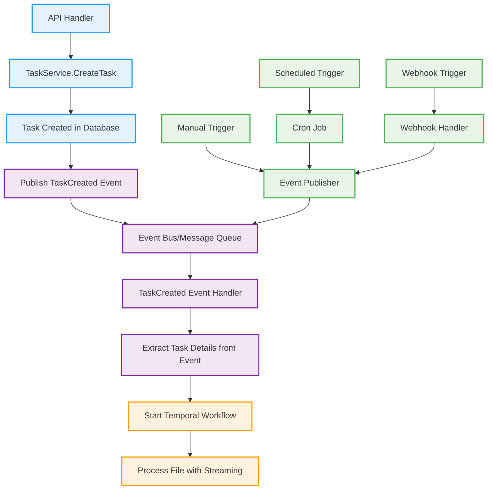

# Event-Driven File Processing Architecture

## Problem: Decoupling Temporal from API Layer

Currently, your API layer directly imports and uses Temporal, which creates tight coupling. Let's create an event-driven approach that allows triggering file processing through events without importing Temporal anywhere in the API.

## Solution: Event-Driven Architecture



## Implementation Strategy

### 1. **Event System Interface** (No Temporal Import)

```go
// internal/events/types.go
package events

// Event represents a domain event
type Event struct {
    ID        string                 `json:"id"`
    Type      string                 `json:"type"`
    Data      map[string]interface{} `json:"data"`
    Timestamp time.Time              `json:"timestamp"`
    Source    string                 `json:"source"`
}

// EventPublisher publishes events
type EventPublisher interface {
    Publish(ctx context.Context, event Event) error
}

// EventHandler handles events
type EventHandler interface {
    Handle(ctx context.Context, event Event) error
}

// EventBus manages event publishing and handling
type EventBus interface {
    Publish(ctx context.Context, event Event) error
    Subscribe(eventType string, handler EventHandler) error
    Start(ctx context.Context) error
    Stop() error
}
```

### 2. **Task Events** (Domain Events)

```go
// internal/events/task_events.go
package events

import "time"

// TaskCreatedEvent is published when a task is created
type TaskCreatedEvent struct {
    TaskID        string    `json:"task_id"`
    TenantID      string    `json:"tenant_id"`
    EnvironmentID string    `json:"environment_id"`
    FileURL       string    `json:"file_url"`
    EntityType    string    `json:"entity_type"`
    CreatedAt     time.Time `json:"created_at"`
}

// ToEvent converts TaskCreatedEvent to generic Event
func (e TaskCreatedEvent) ToEvent() Event {
    return Event{
        ID:        e.TaskID,
        Type:      "task.created",
        Data: map[string]interface{}{
            "task_id":        e.TaskID,
            "tenant_id":      e.TenantID,
            "environment_id": e.EnvironmentID,
            "file_url":       e.FileURL,
            "entity_type":    e.EntityType,
            "created_at":     e.CreatedAt,
        },
        Timestamp: time.Now(),
        Source:    "task-service",
    }
}

// TaskProcessingRequestedEvent is published when processing is requested
type TaskProcessingRequestedEvent struct {
    TaskID        string    `json:"task_id"`
    TenantID      string    `json:"tenant_id"`
    EnvironmentID string    `json:"environment_id"`
    TriggeredBy   string    `json:"triggered_by"` // "api", "manual", "scheduled", "webhook"
    RequestedAt   time.Time `json:"requested_at"`
}

func (e TaskProcessingRequestedEvent) ToEvent() Event {
    return Event{
        ID:        e.TaskID,
        Type:      "task.processing_requested",
        Data: map[string]interface{}{
            "task_id":        e.TaskID,
            "tenant_id":      e.TenantID,
            "environment_id": e.EnvironmentID,
            "triggered_by":   e.TriggeredBy,
            "requested_at":   e.RequestedAt,
        },
        Timestamp: time.Now(),
        Source:    "task-service",
    }
}
```

### 3. **Updated TaskService** (No Temporal Import)

```go
// internal/service/task.go
package service

import (
    "context"
    "github.com/flexprice/flexprice/internal/events"
    // NO TEMPORAL IMPORT HERE
)

type taskService struct {
    ServiceParams
    fileProcessor    *FileProcessor
    eventPublisher   events.EventPublisher  // Add event publisher
}

func NewTaskService(
    serviceParams ServiceParams,
    eventPublisher events.EventPublisher,  // Inject event publisher
) TaskService {
    return &taskService{
        ServiceParams:   serviceParams,
        fileProcessor:   NewFileProcessor(serviceParams.Client, serviceParams.Logger),
        eventPublisher:  eventPublisher,
    }
}

func (s *taskService) CreateTask(ctx context.Context, req dto.CreateTaskRequest) (*dto.TaskResponse, error) {
    if err := req.Validate(); err != nil {
        return nil, err
    }

    t := req.ToTask(ctx)
    if err := t.Validate(); err != nil {
        return nil, err
    }

    if err := s.TaskRepo.Create(ctx, t); err != nil {
        s.Logger.Error("failed to create task", "error", err)
        return nil, err
    }

    // Publish TaskCreated event instead of starting workflow directly
    taskEvent := events.TaskCreatedEvent{
        TaskID:        t.ID,
        TenantID:      t.TenantID,
        EnvironmentID: t.EnvironmentID,
        FileURL:       t.FileURL,
        EntityType:    string(t.EntityType),
        CreatedAt:     t.CreatedAt,
    }

    if err := s.eventPublisher.Publish(ctx, taskEvent.ToEvent()); err != nil {
        s.Logger.Error("failed to publish task created event", "error", err)
        // Don't fail the request, just log the error
    }

    return dto.NewTaskResponse(t), nil
}

// New method to trigger processing via events
func (s *taskService) RequestTaskProcessing(ctx context.Context, taskID string, triggeredBy string) error {
    t, err := s.TaskRepo.Get(ctx, taskID)
    if err != nil {
        return err
    }

    // Publish processing requested event
    processingEvent := events.TaskProcessingRequestedEvent{
        TaskID:        taskID,
        TenantID:      t.TenantID,
        EnvironmentID: t.EnvironmentID,
        TriggeredBy:   triggeredBy,
        RequestedAt:   time.Now(),
    }

    return s.eventPublisher.Publish(ctx, processingEvent.ToEvent())
}
```

### 4. **Event Handlers** (Temporal Integration Layer)

```go
// internal/events/handlers/task_handler.go
package handlers

import (
    "context"
    "github.com/flexprice/flexprice/internal/temporal/service"
    "github.com/flexprice/flexprice/internal/events"
)

type TaskEventHandler struct {
    temporalService *temporal.Service  // Temporal service injected here
    logger          *logger.Logger
}

func NewTaskEventHandler(temporalService *temporal.Service, logger *logger.Logger) *TaskEventHandler {
    return &TaskEventHandler{
        temporalService: temporalService,
        logger:          logger,
    }
}

// HandleTaskCreated handles task.created events
func (h *TaskEventHandler) HandleTaskCreated(ctx context.Context, event events.Event) error {
    taskID := event.Data["task_id"].(string)
    tenantID := event.Data["tenant_id"].(string)
    environmentID := event.Data["environment_id"].(string)

    h.logger.Info("handling task created event",
        "task_id", taskID,
        "tenant_id", tenantID,
        "environment_id", environmentID)

    // Start Temporal workflow
    result, err := h.temporalService.StartTaskProcessingWorkflow(ctx, taskID)
    if err != nil {
        h.logger.Error("failed to start task processing workflow", "error", err, "task_id", taskID)
        return err
    }

    h.logger.Info("successfully started task processing workflow",
        "task_id", taskID,
        "workflow_id", result.Metadata["workflow_id"])

    return nil
}

// HandleTaskProcessingRequested handles task.processing_requested events
func (h *TaskEventHandler) HandleTaskProcessingRequested(ctx context.Context, event events.Event) error {
    taskID := event.Data["task_id"].(string)
    triggeredBy := event.Data["triggered_by"].(string)

    h.logger.Info("handling task processing requested event",
        "task_id", taskID,
        "triggered_by", triggeredBy)

    // Start Temporal workflow
    result, err := h.temporalService.StartTaskProcessingWorkflow(ctx, taskID)
    if err != nil {
        h.logger.Error("failed to start task processing workflow", "error", err, "task_id", taskID)
        return err
    }

    h.logger.Info("successfully started task processing workflow",
        "task_id", taskID,
        "workflow_id", result.Metadata["workflow_id"],
        "triggered_by", triggeredBy)

    return nil
}
```

### 5. **Event Bus Implementation** (Memory-based for simplicity)

```go
// internal/events/memory_bus.go
package events

import (
    "context"
    "sync"
    "time"
)

type MemoryEventBus struct {
    handlers map[string][]EventHandler
    mu       sync.RWMutex
    logger   *logger.Logger
}

func NewMemoryEventBus(logger *logger.Logger) *MemoryEventBus {
    return &MemoryEventBus{
        handlers: make(map[string][]EventHandler),
        logger:   logger,
    }
}

func (b *MemoryEventBus) Publish(ctx context.Context, event Event) error {
    b.mu.RLock()
    handlers := b.handlers[event.Type]
    b.mu.RUnlock()

    b.logger.Info("publishing event", "type", event.Type, "id", event.ID)

    for _, handler := range handlers {
        go func(h EventHandler) {
            if err := h.Handle(ctx, event); err != nil {
                b.logger.Error("event handler failed", "error", err, "event_type", event.Type, "event_id", event.ID)
            }
        }(handler)
    }

    return nil
}

func (b *MemoryEventBus) Subscribe(eventType string, handler EventHandler) error {
    b.mu.Lock()
    defer b.mu.Unlock()

    b.handlers[eventType] = append(b.handlers[eventType], handler)
    b.logger.Info("subscribed to event type", "type", eventType)

    return nil
}

func (b *MemoryEventBus) Start(ctx context.Context) error {
    b.logger.Info("memory event bus started")
    return nil
}

func (b *MemoryEventBus) Stop() error {
    b.logger.Info("memory event bus stopped")
    return nil
}
```

### 6. **Alternative Triggers** (No Temporal Import)

```go
// internal/api/handlers/manual_trigger.go
package handlers

import (
    "context"
    "net/http"
    "github.com/flexprice/flexprice/internal/service"
)

type ManualTriggerHandler struct {
    taskService service.TaskService
}

func (h *ManualTriggerHandler) TriggerTaskProcessing(w http.ResponseWriter, r *http.Request) {
    taskID := r.URL.Query().Get("task_id")
    if taskID == "" {
        http.Error(w, "task_id is required", http.StatusBadRequest)
        return
    }

    // Trigger processing via event (no Temporal import)
    err := h.taskService.RequestTaskProcessing(r.Context(), taskID, "manual")
    if err != nil {
        http.Error(w, err.Error(), http.StatusInternalServerError)
        return
    }

    w.WriteHeader(http.StatusOK)
    w.Write([]byte("Task processing triggered successfully"))
}

// internal/cron/task_processor.go
package cron

import (
    "context"
    "github.com/flexprice/flexprice/internal/service"
)

type TaskProcessorCron struct {
    taskService service.TaskService
}

func (c *TaskProcessorCron) ProcessPendingTasks(ctx context.Context) error {
    // Get pending tasks from database
    // Trigger processing for each task
    // No Temporal import needed
    return nil
}

// internal/webhook/handlers/task_webhook.go
package handlers

import (
    "context"
    "net/http"
    "github.com/flexprice/flexprice/internal/service"
)

type TaskWebhookHandler struct {
    taskService service.TaskService
}

func (h *TaskWebhookHandler) HandleWebhook(w http.ResponseWriter, r *http.Request) {
    // Parse webhook payload
    // Extract task information
    // Trigger processing via event
    // No Temporal import needed
}
```

## Benefits of This Approach

### ✅ **Decoupling**

- API layer has no Temporal imports
- Temporal is only used in event handlers
- Easy to swap out Temporal for other orchestration

### ✅ **Multiple Trigger Sources**

- API requests
- Manual triggers
- Scheduled cron jobs
- Webhook triggers
- Any other event source

### ✅ **Testability**

- Easy to mock event publisher
- Test API layer without Temporal
- Test event handlers separately

### ✅ **Scalability**

- Event bus can be replaced with message queue (Kafka, RabbitMQ)
- Multiple event handlers can process same event
- Easy to add new trigger sources

### ✅ **Maintainability**

- Clear separation of concerns
- Event-driven architecture
- Easy to add new features

## Usage Examples

```go
// 1. API Trigger (existing)
POST /api/tasks
{
    "file_url": "https://drive.google.com/file/...",
    "entity_type": "events"
}

// 2. Manual Trigger (new)
POST /api/tasks/{task_id}/process

// 3. Scheduled Trigger (new)
// Cron job calls this endpoint
POST /api/tasks/process-pending

// 4. Webhook Trigger (new)
POST /webhook/task-processing
{
    "task_id": "123",
    "triggered_by": "external_system"
}
```

This approach gives you complete flexibility to trigger file processing from anywhere without importing Temporal in your API layer!
